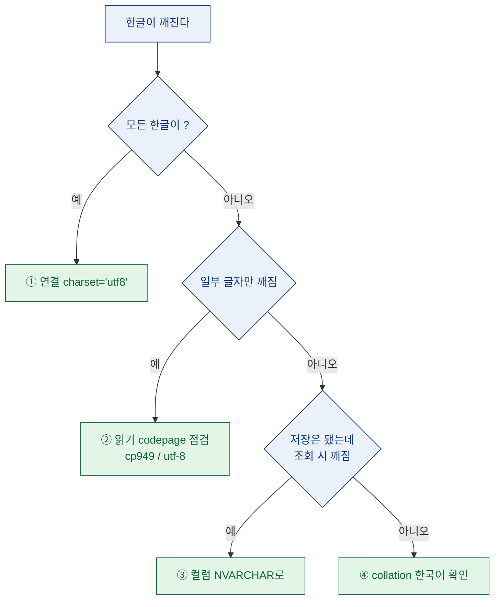

> 크롤러는 멀쩡히 돌았다. 콘솔엔 한글이 예쁘게 찍혔다. 그런데 DB를 열어보니 전부 `???`였다.

## 왜 콘솔에선 멀쩡한데 DB에선 깨질까?

파이썬 콘솔에 `아이템 도수분포`라고 잘 찍히는 문자열을, 그대로 `INSERT`했는데 테이블엔 `??? ????`만 남아 있다. 이럴 때 제일 먼저 드는 생각은 "파이썬이 데이터를 잘못 들고 있나?"인데, 사실 대부분 아니다. 파이썬 문자열(`str`)은 이미 유니코드라서 메모리 안에선 멀쩡하다.

문제는 그 유니코드 문자열이 **파이썬 → 드라이버 → 네트워크 → SQL Server → 컬럼**으로 흘러가는 동안, 중간 어딘가에서 "이 글자를 무슨 바이트로 볼까?"를 다르게 해석하는 지점이 있다는 거다. 한글은 그 여정을 통과하며 최소 네 번 검문을 받는다. 검문소 하나라도 규칙이 어긋나면 그 자리에서 `?`로 치환된다.


핵심은 "파이썬이 잘못했다"가 아니라 **"어느 검문소가 규칙이 다른가"**를 좁히는 일이다. 나는 이걸 하나씩 격리해서 잡았다.

## 어디서 깨졌는지 어떻게 좁혔나?

무작정 옵션을 바꿔가며 재삽입하면 뭐가 효과였는지 영영 모른다. 그래서 검문소 네 곳을 **저장 직전에서 저장 직후 방향**으로, 한 번에 하나씩만 건드리며 확인했다.

| 순서 | 검문소 | 확인 방법 | 흔한 증상 |
|------|--------|-----------|-----------|
| 1 | 연결 `charset` | 연결 시 인코딩 명시 여부 | 모든 한글이 `?` |
| 2 | 읽기 소스 codepage | CSV 등 원본 파일 인코딩 | 특정 글자만 깨짐 |
| 3 | 컬럼 타입 | `VARCHAR` / `NVARCHAR` | 저장은 됐는데 조회 시 깨짐 |
| 4 | 테이블 collation | 컬럼 정렬 규칙 | 정렬·`LIKE`가 이상 |

각 줄은 아래에서 하나씩 뜯어본다.

## 범인 ①: 연결 charset이 기본값에 기대고 있진 않나?

가장 흔한 원인이자, 내 경우의 진짜 범인이었다. `pymssql`은 연결할 때 `charset`을 지정하지 않으면 환경 기본값에 의존한다. 서버·클라이언트·OS 로캘이 조금이라도 어긋나면 한글은 그 순간 `?`로 뭉개진다.

```python
# 깨지기 쉬운 연결 (charset 미지정 → 환경 기본값에 의존)
import pymssql
conn = pymssql.connect(
    server="127.0.0.1",
    user="app_reader",
    password="<dummy>",
    database="analytics_dummy",
)
```

여기에 `charset="utf8"` 한 줄을 넣는 것만으로 내 문제의 8할이 해결됐다.

```python
# UTF-8로 명시 (권장)
conn = pymssql.connect(
    server="127.0.0.1",
    user="app_reader",
    password="<dummy>",
    database="analytics_dummy",
    charset="utf8",   # 이 한 줄
)
```

`charset="utf8"`은 "파이썬 문자열을 서버로 보낼 때 UTF-8 바이트로 인코딩하라"는 지시다. 서버가 이걸 제대로 받으려면 뒤쪽 검문소(컬럼 타입·collation)도 유니코드를 받아줄 준비가 돼 있어야 한다. 그래서 이 한 줄만으로 다 안 풀리면 아래로 내려간다.

## 범인 ②: 읽어오는 원본 파일의 codepage는 맞나?

크롤링 결과를 곧장 넣지 않고 CSV로 한 번 떨궜다가 읽어 넣는 파이프라인이라면, 파일을 **읽는 순간의 인코딩**도 검문소다. 윈도우에서 한글 CSV는 `cp949`(euc-kr 계열)인 경우가 많고, 다른 도구가 만든 파일은 `utf-8`이다. 여기서 잘못 읽으면 DB에 넣기도 전에 파이썬 안에서 이미 깨진 문자열이 만들어진다.

```python
# 원본이 cp949인 경우
with open("dump_dummy.csv", "r", encoding="cp949") as f:
    ...

# 원본이 utf-8인 경우 (BOM 있으면 utf-8-sig)
with open("dump_dummy.csv", "r", encoding="utf-8") as f:
    ...
```

증상으로 구분하면 편하다. **모든** 한글이 통째로 `?`면 대개 ①번(연결) 문제고, **일부 특정 글자만** `?`나 이상한 기호로 바뀌면 ②번(읽기 codepage)을 의심한다. 어떤 환경에선 콘솔 출력 코드페이지까지 `65001`(UTF-8)로 맞춰야 재현/디버깅이 깔끔해진다.

## 범인 ③: 컬럼이 VARCHAR라서 유니코드를 못 담는 건 아닐까?

연결도 UTF-8, 읽기도 정상인데 여전히 깨진다면 이제 **저장 그릇**을 본다. `VARCHAR`는 코드페이지에 묶인 1바이트 계열 문자열이라, collation이 한국어가 아니면 한글을 온전히 못 담는다. 반면 `NVARCHAR`는 유니코드(UTF-16) 전용이라 언어에 관계없이 한글을 담는다.

```sql
-- 깨지기 쉬움: VARCHAR (코드페이지 의존)
CREATE TABLE keyword_stat_dummy (
    keyword   VARCHAR(100),
    hit_count INT
);

-- 안전: NVARCHAR (유니코드)
CREATE TABLE keyword_stat_dummy (
    keyword   NVARCHAR(100),
    hit_count INT
);
```

여기서 자주 하는 실수 하나. `NVARCHAR`에 리터럴 문자열을 넣을 땐 앞에 `N`을 붙여야 유니코드로 해석된다. 파라미터 바인딩(`%s`)을 쓰면 드라이버가 알아서 처리해 주지만, 쿼리를 문자열로 조립하는 습관이 있다면 이 지점에서 또 깨진다.

```sql
INSERT INTO keyword_stat_dummy (keyword, hit_count)
VALUES (N'도수분포', 128);   -- N 접두사
```

파이썬에서 대량 적재할 땐 문자열 조립을 피하고 `executemany`로 파라미터 바인딩을 쓰는 게 안전하고 빠르다.

```python
rows = [("도수분포", 128), ("재구매율", 47), ("픽률", 993)]  # 전부 더미
with conn.cursor() as cur:
    cur.executemany(
        "INSERT INTO keyword_stat_dummy (keyword, hit_count) VALUES (%s, %s)",
        rows,
    )
conn.commit()
```

## 범인 ④: 테이블 collation이 한국어가 아니라면?

마지막 검문소는 collation(정렬·비교 규칙)이다. `NVARCHAR`로 저장이 됐는데도 정렬 순서가 이상하거나 `LIKE '%가%'` 같은 검색이 헛나온다면 collation을 확인한다. 한글 데이터를 다룬다면 컬럼(또는 DB)의 collation이 한국어 계열(예: `Korean_Wansung_CI_AS`)인지 보는 게 좋다.

```sql
-- 현재 컬럼 collation 확인
SELECT name, collation_name
FROM sys.columns
WHERE object_id = OBJECT_ID('keyword_stat_dummy');
```

`NVARCHAR`를 쓰면 **저장**은 collation과 무관하게 잘 되지만, **비교·정렬**은 collation을 따른다. 저장은 되는데 조회·검색만 이상하다면 십중팔구 이쪽이다.



## 다시 겪지 않으려면 뭘 기억해야 할까?

트러블슈팅이 끝나고 나서 나한테 남긴 메모는 이렇게 짧아졌다.

- **한글이 깨지면 파이썬을 의심하기 전에 "검문소 네 곳"을 순서대로 본다.** 연결 → 읽기 → 컬럼 → collation.
- **한 번에 하나만 바꾼다.** 옵션 두 개를 동시에 건드리면 뭐가 효과였는지 모른 채 "그냥 됐다"로 끝나고, 다음에 또 겪는다.
- **증상으로 구간을 좁힌다.** 전부 `?`면 연결, 일부만 깨지면 읽기, 저장 후 조회만 이상하면 컬럼/collation.
- **기본은 `NVARCHAR` + 연결 `charset='utf8'` + 파라미터 바인딩.** 이 조합이면 애초에 대부분 안 겪는다.

인코딩 문제는 무섭게 느껴지지만, 사실 "글자를 무슨 바이트로 볼까"라는 약속이 구간마다 어긋난 것뿐이다. 구간을 그림으로 그려두면 다음번엔 5분 만에 잡는다.

## 마무리

한글 깨짐은 매번 "또 이거야?" 싶다가도, 파이프라인을 검문소 네 곳으로 쪼개 놓으면 늘 같은 순서로 풀린다. 이번에 내 발목을 잡은 건 결국 연결 `charset` 한 줄이었지만, 그걸 확신하려면 나머지 세 곳을 하나씩 배제하는 과정이 필요했다. 크롤링·적재 자동화를 반복해서 돌리는 입장에선, 이 체크리스트를 스크립트 주석에 박아두는 게 미래의 나를 구한다.

## 참고자료

- [[game-data-sql-recipes-retention-ltv]] — 적재 이후 단계, SQL로 지표 뽑는 레시피 모음
- [[game-metrics-7-definitions]] — 넣은 데이터로 계산하는 핵심 지표 정의
- 관련 코드/예제 저장소: https://github.com/DBhyeong/game-data-recipes

<!-- 안전: 합성/더미 데이터, 회사·실데이터·PII 없음. -->
