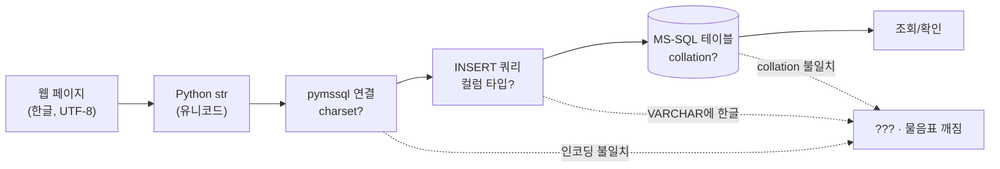
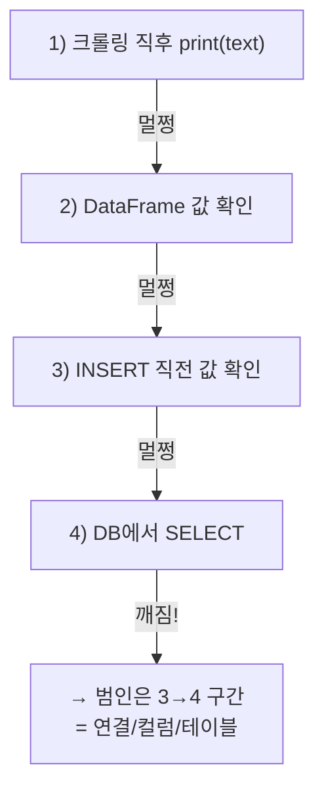
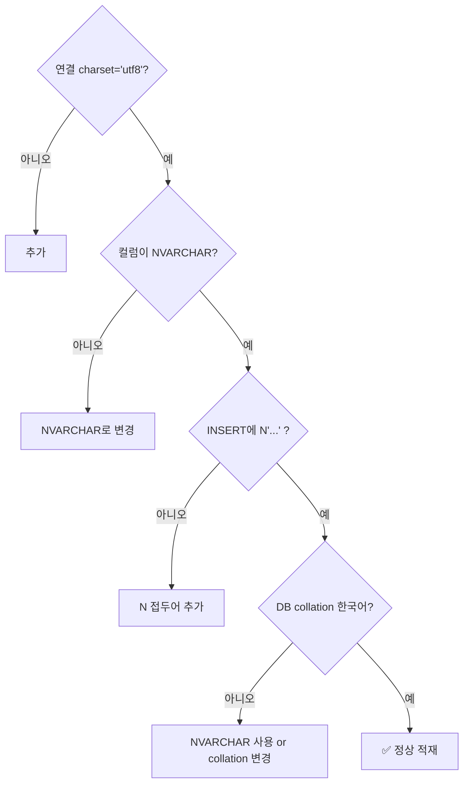

크롤러는 잘 돌았다. 콘솔에도 한글이 멀쩡히 찍혔다. 그런데 DB에 넣고 조회하니 전부 `???` 였다.

처음엔 "크롤링이 깨졌나?" 싶어 수집 코드를 한참 들여다봤다. 멀쩡했다. 그제서야 깨달았다 — **데이터가 깨진 게 아니라, 데이터가 *지나가는 길* 어딘가에서 깨진 것**이었다. 인코딩 문제는 늘 그렇다. *무엇이* 아니라 *어디서* 의 문제다.

그래서 이 글은 "고치는 법"보다 **"한글이 어디서 깨지는지 흐름으로 추적하는 법"** 에 가깝다. 같은 `???`를 만난 사람이 길을 따라 짚어볼 수 있게 정리했다. (예시 데이터는 전부 합성이다.)

## 전체 그림 — 한글은 이 길을 지난다

먼저 데이터가 지나가는 길 전체를 보자. **깨짐은 거의 항상 이 화살표 중 하나에서 일어난다.**



> **인코딩(encoding)**이란? 사람이 읽는 글자 '한'을 컴퓨터가 저장하는 **숫자(바이트)로 바꾸는 규칙**이다. UTF-8, CP949(한글 윈도우 기본) 같은 규칙들이 있는데, **저장할 때 쓴 규칙과 읽을 때 쓴 규칙이 다르면** 글자가 깨진다. 한국어로 된 표지판을 영어 규칙으로 읽으면 뜻이 안 통하는 것과 같다.

위 그림에서 깨짐 후보는 세 군데다 — **① 연결(connection)의 charset, ② 컬럼 타입, ③ 테이블 collation.** 하나씩 짚어보자.

## 어디서 깨졌는지 어떻게 좁혔나?

범인을 찾는 건 단순하다. **각 단계에서 값을 찍어보며, 어디까지 멀쩡한지** 본다.



내 경우 1·2·3까지는 한글이 멀쩡했다. **DB에 들어갔다 나오는 순간(3→4)** 부터 깨졌다. 즉 파이썬은 무죄, **DB로 넘기는 통로와 그릇**이 문제였다.

## 범인 ①: 연결(charset)이 안 맞은 건 아닐까?

pymssql은 연결할 때 **어떤 인코딩으로 서버와 대화할지**를 `charset`으로 정한다. 이걸 안 맞추면, 파이썬이 보낸 UTF-8 한글을 서버가 엉뚱하게 해석한다.

```python
import pymssql

# ❌ 깨지기 쉬운 연결 (charset 미지정 → 기본값에 의존)
conn = pymssql.connect(server="HOST", user="U", password="P", database="DB")

# ✅ UTF-8로 명시
conn = pymssql.connect(
    server="HOST", user="U", password="P", database="DB",
    charset="utf8",            # 서버와 UTF-8로 대화
)
```

대부분은 `charset="utf8"` 한 줄로 해결된다. 그런데도 안 되면, **읽어 들일 때**의 코드페이지가 문제일 수 있다.

> **코드페이지(codepage)**란? 윈도우가 인코딩에 붙인 번호표다. UTF-8 = **65001**, 한글 CP949 = **949**. 일부 드라이버·환경에선 이 번호로 인코딩을 지정한다.

```python
# 환경에 따라 읽기 쪽 코드페이지까지 UTF-8(65001)로 맞춰야 할 때
import os
os.environ["PYMSSQL_CHARSET"] = "UTF-8"   # 드라이버 레벨 힌트
# 또는 연결 후 커서에서 디코딩을 직접 관리
```

## 범인 ②: 컬럼 타입이 VARCHAR라서 아닐까?

연결을 고쳐도 여전히 깨진다면, **그릇(컬럼 타입)** 을 봐야 한다. 이게 의외로 진짜 원인인 경우가 많다.

| 타입 | 저장 | 한글 |
|---|---|---|
| `VARCHAR(n)` | 1바이트 문자(코드페이지 의존) | ⚠️ collation 안 맞으면 깨짐 |
| **`NVARCHAR(n)`** | **유니코드(2바이트)** | ✅ 안전 |

```sql
-- ❌ 한글이 위태로운 컬럼
CREATE TABLE listings (id INT, title VARCHAR(200));

-- ✅ 유니코드 컬럼 + 넣을 때 N 접두어
CREATE TABLE listings (id INT, title NVARCHAR(200));
INSERT INTO listings (id, title) VALUES (1, N'합성 매물 제목');  -- N'' 중요
```

핵심은 두 가지다. **컬럼을 `NVARCHAR`로**, 그리고 **문자열 리터럴 앞에 `N`** 을 붙이는 것. `N` 없이 넣으면 SQL Server가 그 문자열을 먼저 VARCHAR로 해석해버려서, 컬럼이 NVARCHAR라도 그 전에 한 번 깨진다.

## 범인 ③: 테이블 collation이 한국어가 아니라서?

`VARCHAR`를 꼭 써야 하는 상황이라면, 마지막 변수는 **collation(정렬·문자 규칙)** 이다. DB가 `SQL_Latin1_General` 계열이면 한글 VARCHAR가 깨진다. 한국어는 **`Korean_Wansung_CI_AS`** 같은 collation이 필요하다. (단, 가능하면 ②의 `NVARCHAR`로 가는 게 속 편하다.)

## 한글 깨지면 순서대로 — 체크리스트

매번 처음부터 헤매지 않으려고 순서를 고정해 뒀다.



1. 연결에 `charset="utf8"`
2. 컬럼을 `NVARCHAR`로
3. INSERT 값에 `N'...'`
4. 그래도면 collation 점검

대량 적재(bulk insert) 때도 같다. `executemany`로 한 번에 넣든 한 줄씩 넣든, **깨짐의 원인은 위 4개를 벗어나지 않는다.**

## 배운 점

인코딩 버그를 만나면 코드를 의심하게 되는데, 정작 답은 **"데이터가 지나가는 길을 그려놓고 단계마다 값을 찍어보는 것"** 에 있었다. 한 번 흐름도로 정리해두니, 다음에 또 `???`를 만나도 5분이면 어느 화살표에서 깨졌는지 짚을 수 있게 됐다.

문제를 **프로세스로 그리면, 디버깅이 추측에서 추적으로 바뀐다.** 이게 내가 데이터 일을 하며 가장 많이 써먹는 습관이다.

---

*예시 데이터·테이블은 모두 합성이며, 특정 서비스의 실제 데이터와 무관합니다. 환경(드라이버 버전·OS 로캘)에 따라 세부는 다를 수 있어요.*
