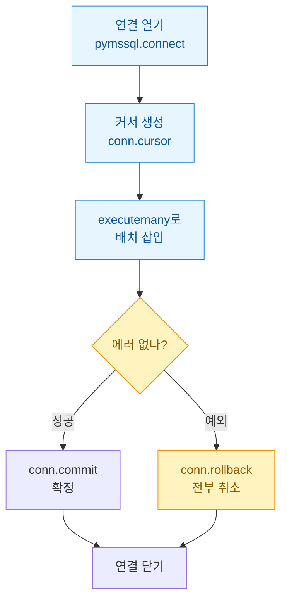
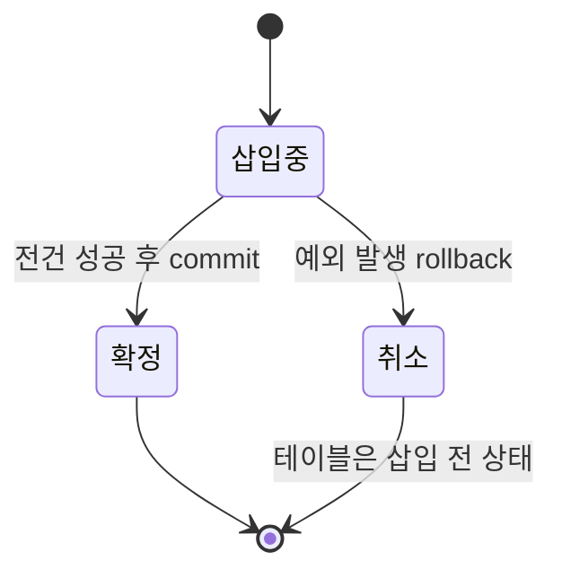

게임 지표 파이프라인을 만들면서 가장 처음 부딪힌 벽은 의외로 "파이썬에서 MS-SQL에 어떻게 넣지?"였다. 로그를 파싱하는 건 익숙했다. 그런데 파싱한 결과를 데이터베이스(DB)에 안전하게 밀어넣는 코드는 매번 대충 짜다가 한글이 깨지거나, 반쯤 넣다가 죽어서 중복이 쌓이거나 하는 사고를 냈다.

그래서 이번엔 pymssql(파이썬에서 MS-SQL에 붙는 드라이버)로 연결부터 삽입, 트랜잭션(여러 작업을 "전부 성공 아니면 전부 취소"로 묶는 단위)까지 골격을 제대로 잡아봤다. 오늘 글은 그 기본기 기록이다.

## 적재 코드의 전체 흐름은 어떻게 생겼나?

먼저 큰 그림부터. 코드가 실제로 밟는 순서는 이렇다.



핵심은 **삽입만 한다고 DB에 저장되는 게 아니라는 것**이다. `commit`을 불러야 비로소 확정된다. 이걸 몰라서 "분명 insert 했는데 테이블이 비어 있다"로 한참 헤맸다.

## 연결 문자열은 어떻게 쓰나?

pymssql 연결은 `connect()` 한 줄이다. 다만 인자를 위치로 넘기면 헷갈리니 나는 키워드로 명시한다.

```python
import pymssql

conn = pymssql.connect(
    server="127.0.0.1",      # 인스턴스명은 "호스트\\SQLEXPRESS" 형태
    port=1433,
    user="loguser",
    password="YOUR_PASSWORD",  # 실제 값은 환경변수로
    database="game_log",
    charset="UTF-8",         # 한글 깨짐 방지 (뒤에서 자세히)
    autocommit=False,        # 트랜잭션을 내가 직접 관리
)
```

`autocommit=False`가 중요하다. 이걸 켜두면 매 문장이 즉시 확정돼서 트랜잭션으로 묶을 수가 없다. 나는 배치로 넣고 한 번에 커밋하려고 일부러 꺼둔다.

비밀번호는 절대 코드에 박지 않는다. `os.environ["DB_PW"]`로 환경변수에서 읽는다.

## executemany로 한 번에 넣는 게 왜 나은가?

로그는 한 줄씩이 아니라 수천 줄씩 들어온다. `execute`를 반복문으로 돌리면 왕복(네트워크 라운드트립)이 행 수만큼 생겨서 느리다. `executemany`는 여러 행을 묶어 보낸다.

```python
rows = [
    ("u1001", "login",  "2026-07-17 09:00:12"),
    ("u1002", "payment","2026-07-17 09:01:44"),
    ("u1003", "logout", "2026-07-17 09:02:03"),
]

sql = """
INSERT INTO player_event (user_id, event_type, event_at)
VALUES (%s, %s, %s)
"""

cursor = conn.cursor()
cursor.executemany(sql, rows)   # 아직 DB에 확정 안 됨
```

여기서 두 가지를 강조하고 싶다.

첫째, **플레이스홀더는 `%s`다.** pymssql은 물음표(`?`)가 아니라 `%s`를 쓴다. 다른 드라이버(pyodbc)와 헷갈려서 처음에 계속 에러가 났다. 그리고 이 자리표시자를 쓰는 이유는 값을 문자열로 직접 이어붙이면 SQL 인젝션(악의적 입력으로 쿼리를 조작하는 공격)에 뚫리기 때문이다. 값은 항상 파라미터로 넘긴다.

둘째, 위 코드까지는 **아직 저장이 안 된 상태**다.

## 커밋과 롤백은 언제 부르나?

여기가 트랜잭션의 핵심이다. 삽입 도중 한 줄이라도 실패하면 이미 들어간 절반만 남아버린다. 그럼 지표가 어긋난다. 그래서 `try/except`로 감싸서 **전부 성공하면 커밋, 하나라도 실패하면 롤백**한다.

```python
try:
    cursor.executemany(sql, rows)
    conn.commit()          # 여기서 확정
    print(f"{cursor.rowcount}건 적재 완료")
except Exception as e:
    conn.rollback()        # 하나라도 실패 → 전부 취소
    print(f"롤백함: {e}")
    raise
finally:
    conn.close()
```

이 구조를 상태로 그리면 이렇다.



**롤백의 매력은 "없던 일"로 만들어준다는 점**이다. 3000건 중 2999번째에서 죽어도 앞의 2998건까지 싹 취소된다. 그래서 재실행하면 중복 없이 처음부터 다시 넣을 수 있다. 반쯤 넣긴 재적재의 지옥에서 벗어난 게 이 패턴 덕분이다.

## 한글이 깨지는 함정은 어디서 왔나?

가장 오래 붙잡은 문제가 인코딩이었다. 닉네임이나 아이템명 같은 한글이 `???`나 이상한 글자로 들어갔다. 원인은 대개 세 군데다.

| 지점 | 증상 | 해결 |
|---|---|---|
| 연결 설정 | 한글이 물음표로 | `charset="UTF-8"` 지정 |
| 컬럼 타입 | 저장은 됐는데 깨짐 | `VARCHAR` 대신 `NVARCHAR` 사용 |
| 소스 파일 | 파싱 단계부터 깨짐 | 파일을 `encoding="utf-8"`로 read |

특히 두 번째, **컬럼을 `NVARCHAR`로 잡는 것**이 결정적이었다. MS-SQL에서 `VARCHAR`는 코드페이지에 묶여서 한글을 온전히 못 담을 수 있다. 유니코드를 저장하는 `NVARCHAR`로 바꾸니 깨끗하게 들어갔다. 데이터 넣는 쪽만 보다가 정작 테이블 설계에 원인이 있었던 셈이다.

## 정리하면

기본 골격은 결국 **연결 → 커서 → executemany → 커밋/롤백 → 닫기** 다섯 단계다. 여기에 `autocommit=False`로 트랜잭션을 내 손에 쥐고, 플레이스홀더는 `%s`, 한글은 `NVARCHAR + UTF-8`. 이 세 개만 지켜도 적재 사고의 대부분은 사라졌다.

다음엔 이 위에 얹을 것들을 정리하려 한다. 중복 적재를 막는 `MERGE`(있으면 갱신, 없으면 삽입)와, 수만 건을 더 빠르게 밀어넣는 `BULK INSERT` 쪽이다. 로그 양이 커지면 executemany만으로는 슬슬 버거워지기 때문이다. 오늘 잡은 골격이 그 확장의 바닥이 된다.
