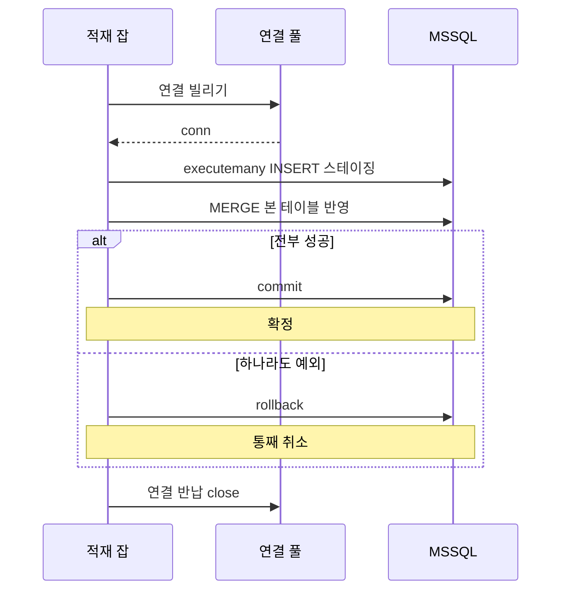
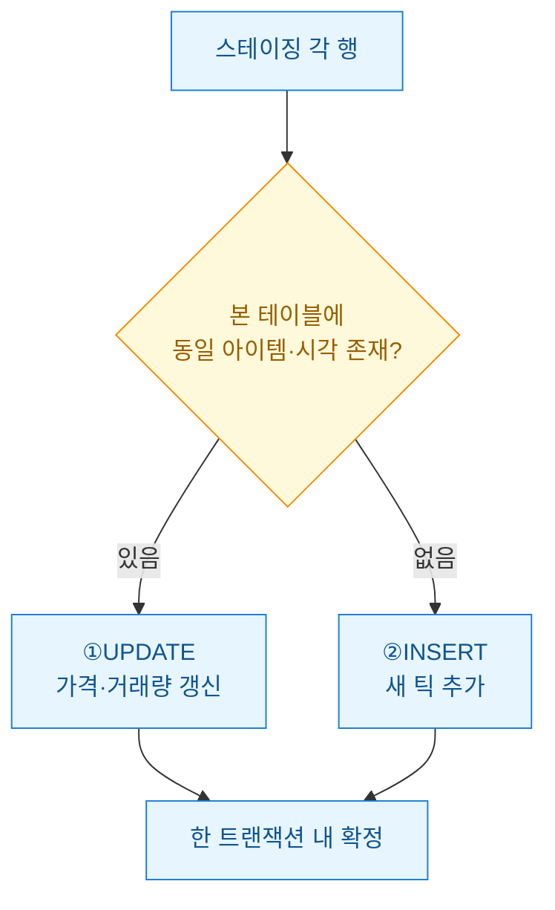

아이템 시세 모니터링을 붙이면서 제일 먼저 부딪힌 건 크롤링이 아니라 **적재**였다. 5분 간격으로 아이템 수백 종의 가격과 거래량을 긁어오는 것까진 금방 됐는데 이걸 어디에 어떻게 쌓느냐가 문제였다. 처음엔 그냥 날짜별 CSV로 떨궜다. 며칠은 멀쩡했다. 그러다 크롤러가 중간에 죽어서 같은 시각 데이터가 두 번 들어가고, 대시보드 쿼리가 파일 수백 개를 훑느라 느려지고, "어제 그 아이템 시세 얼마였지"를 조인 한 번으로 못 뽑는 순간 CSV를 접었다.

회사에서 이미 쓰던 MSSQL이 있어서 파이썬 드라이버 `pymssql`(파이썬에서 MSSQL에 붙는 라이브러리)로 갈아탔다. 그런데 "연결해서 INSERT" 수준으로 만들면 일일 배치가 자꾸 깨진다. 안정적인 적재 잡이 되려면 연결 재사용, 대량 삽입, 트랜잭션, 그리고 중복 방지(upsert)가 다 필요했다. 이번 글은 그 네 조각을 실제로 돌아가는 합성 코드로 정리한 레시피다.


핵심은 **한 줄씩 INSERT 하지 않는다**는 것과 **스테이징 테이블에 한 번에 부어놓고 MERGE로 본 테이블에 반영**한다는 것이다. 아래에서 하나씩 푼다.

## 매 적재마다 새로 connect 하면 뭐가 문제였나?

처음 코드는 함수 안에서 `pymssql.connect()`를 부르고 끝나면 닫는 구조였다. 5분마다 도는 잡이라 티가 안 났는데 크롤러를 초 단위로 여러 개 돌리기 시작하니 연결 맺고 끊는 비용이 눈에 띄게 쌓였다. TCP 핸드셰이크에 로그인 인증까지 매번 왕복하는 게 낭비였다.

pymssql 자체엔 연결 풀(미리 만들어둔 연결 여러 개를 빌려 쓰고 반납하는 창고)이 없다. 그래서 `DBUtils`의 `PooledDB`를 씌웠다. 풀은 앱 시작 때 한 번만 만들어두고 이후엔 빌려 쓰기만 한다.

```python
from dbutils.pooled_db import PooledDB
import pymssql

# 앱 시작 시 딱 한 번 생성 (모듈 전역)
POOL = PooledDB(
    creator=pymssql,
    maxconnections=5,        # 동시 최대 연결 수
    blocking=True,           # 풀이 비면 대기(에러 대신)
    server="localhost",
    user="YOUR_USER",
    password="YOUR_PASSWORD",
    database="item_market",
    autocommit=False,        # 트랜잭션을 직접 제어하려고 끈다
    charset="utf8",
)

def get_conn():
    return POOL.connection()  # 풀에서 빌려옴, close() 하면 반납됨
```

`autocommit=False`가 중요하다. 자동 커밋을 켜두면 INSERT 한 줄마다 디스크에 확정돼서 대량 적재가 느리고, 중간에 실패해도 앞부분이 이미 들어가 버린다. 커밋 시점을 내가 쥐고 있어야 "전부 성공 아니면 전부 취소"를 만들 수 있다.

## 수백 행을 한 줄씩 넣으면 왜 그렇게 느렸나?

시세 한 틱에 아이템 수백 종이면 한 번에 수백 행이다. 이걸 for 루프로 `cursor.execute()` 반복하면 매 행마다 서버 왕복이 일어난다. 네트워크 왕복이 100번이면 그만큼 느리다.

`executemany`는 같은 SQL에 값 묶음을 넘겨 왕복을 줄여준다. 데이터는 **튜플 리스트**로 준비하면 된다.

```python
# 크롤러가 정규화해 만든 데이터 (합성 예시)
rows = [
    ("길드깃발", "2026-07-17T09:00:00", 120000, 42),
    ("생명물약", "2026-07-17T09:00:00", 880, 1730),
    ("강화주문서", "2026-07-17T09:00:00", 56000, 210),
    # ... 수백 종
]

conn = get_conn()
cur = conn.cursor()
cur.executemany(
    "INSERT INTO price_stage (item_name, ts, price, volume) "
    "VALUES (%s, %s, %s, %s)",
    rows,
)
```

pymssql 자리표시자는 `%s`다. 문자열이든 숫자든 `%s`로 두고 값 타입은 파이썬 쪽 튜플이 알아서 맞춰준다. **문자열을 f-string으로 직접 이어붙이지 말 것.** 그건 SQL 인젝션 구멍이고, 아이템명에 따옴표라도 섞이면 그날로 쿼리가 깨진다.

여기서 넣는 대상이 본 테이블 `price_tick`이 아니라 스테이징 `price_stage`인 게 포인트다. 일단 임시 창고에 통째로 부어놓고, 다음 단계에서 한 방에 본 테이블로 옮긴다.

## 중간에 죽으면 반쪽 데이터가 남지 않게 하려면?

CSV 시절 제일 아팠던 게 크롤러가 절반쯤 쓰다 죽어 반쪽짜리 파일이 남는 거였다. DB에선 트랜잭션으로 막는다. 트랜잭션은 "여러 작업을 하나의 덩어리로 묶어서 전부 되거나 전부 안 되게" 하는 장치다.



코드로는 `try / except / finally` 세트가 뼈대다. 성공하면 커밋, 예외가 나면 롤백, 무슨 일이 있어도 연결은 반납한다.

```python
def load_ticks(rows):
    conn = get_conn()
    cur = conn.cursor()
    try:
        # 이 세션 전용 임시 스테이징 (연결이 살아있는 동안만 존재)
        cur.execute("""
            CREATE TABLE #stage (
                item_name NVARCHAR(100),
                ts        DATETIME2,
                price     INT,
                volume    INT
            )
        """)
        cur.executemany(
            "INSERT INTO #stage (item_name, ts, price, volume) "
            "VALUES (%s, %s, %s, %s)",
            rows,
        )
        cur.execute(MERGE_SQL)   # 다음 절에서 정의
        conn.commit()            # 여기까지 다 되면 확정
    except Exception:
        conn.rollback()          # 하나라도 틀어지면 통째 취소
        raise                    # 로그·알림 위해 예외는 다시 던진다
    finally:
        conn.close()             # 풀로 반납 (진짜 닫히는 게 아님)
```

`#stage`처럼 `#`로 시작하는 이름은 MSSQL의 세션 임시 테이블이다. 연결이 살아있는 동안만 존재하고 끊기면 알아서 사라진다. 풀에서 같은 연결을 쓰는 이 흐름 안에서만 유효하니 스테이징 용도로 딱 맞는다.

## 크롤러가 두 번 돌아도 중복이 안 쌓이게 하려면?

가장 골치였던 중복. 크롤러 재시도나 스케줄 겹침으로 같은 `(아이템, 시각)`이 두 번 들어오면 시세 평균이 오염되고 이상탐지가 헛경보를 낸다. 그래서 (아이템명, 시각)에 유니크 제약을 걸고, 적재는 **INSERT가 아니라 upsert**로 한다. upsert는 "있으면 UPDATE, 없으면 INSERT"다.

MSSQL은 `MERGE` 한 문장으로 이걸 처리한다. 스테이징에 부어둔 전체를 소스로 삼아 본 테이블과 키를 맞춰본다.



```sql
MERGE INTO price_tick AS tgt
USING #stage AS src
   ON tgt.item_name = src.item_name
  AND tgt.ts        = src.ts
WHEN MATCHED THEN
    UPDATE SET price  = src.price,
               volume = src.volume
WHEN NOT MATCHED THEN
    INSERT (item_name, ts, price, volume)
    VALUES (src.item_name, src.ts, src.price, src.volume);
```

행마다 MERGE를 executemany로 반복하면 결국 왕복이 다시 늘어난다. **스테이징에 한 번 붓고 → MERGE 한 문장**이 대량 upsert의 핵심이다. 수백 행이 서버 안에서 집합 연산 한 방에 정리된다.

한 가지 덧붙이면, MERGE는 소스에 같은 키가 중복으로 있으면 에러(대상 행을 두 번 갱신 시도)를 낸다. 그래서 스테이징에 넣기 전에 파이썬 쪽에서 `(item_name, ts)` 기준으로 마지막 값만 남기고 dedup 해두면 마음이 편하다.

```python
seen = {}
for r in raw_rows:
    seen[(r[0], r[1])] = r   # 같은 키는 뒤엣것으로 덮어씀
rows = list(seen.values())
```

## 방식별로 뭘 언제 쓰나?

정리하면 상황에 따라 손이 달라진다.

| 상황 | 방식 | 이유 |
|---|---|---|
| 연결 자주 맺음 | PooledDB 풀 | 핸드셰이크·인증 왕복 절약 |
| 수백 행 한 번에 | executemany + 스테이징 | 행별 왕복 제거 |
| 실패 시 반쪽 방지 | try/except + commit/rollback | 전부 아니면 전무 |
| 재시도·중복 유입 | MERGE upsert (+ 사전 dedup) | 있으면 갱신 없으면 삽입 |

CSV로 시작했다가 여기까지 오면서 배운 건 결국 **"한 줄씩 하지 말고 묶어서, 임시 창고 거쳐, 한 트랜잭션으로"** 라는 세 마디였다. 지금 일일 적재 잡은 크롤러가 중간에 죽어도 다음 회차가 같은 구간을 다시 부으면 upsert가 알아서 정리해준다. 반쪽 데이터도, 중복 틱도 안 남는다.

다음 글에선 이렇게 쌓은 `price_tick`을 시계열로 굴려 이동평균 대비 급등락을 잡는 이상탐지 쿼리를 정리할 생각이다. 적재가 튼튼해야 그 위에 얹는 분석이 거짓말을 안 한다.

> 예시 스키마·값은 전부 합성 더미다. 실제 서비스에 붙일 땐 인덱스 설계와 계정 권한을 환경에 맞게 다시 잡아야 한다.
