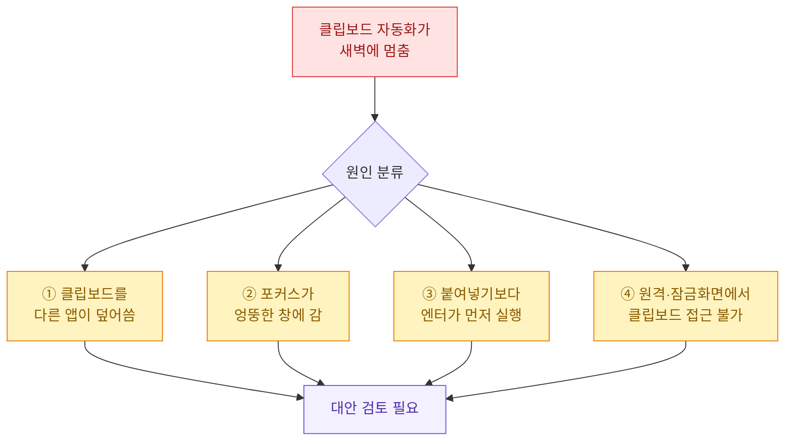
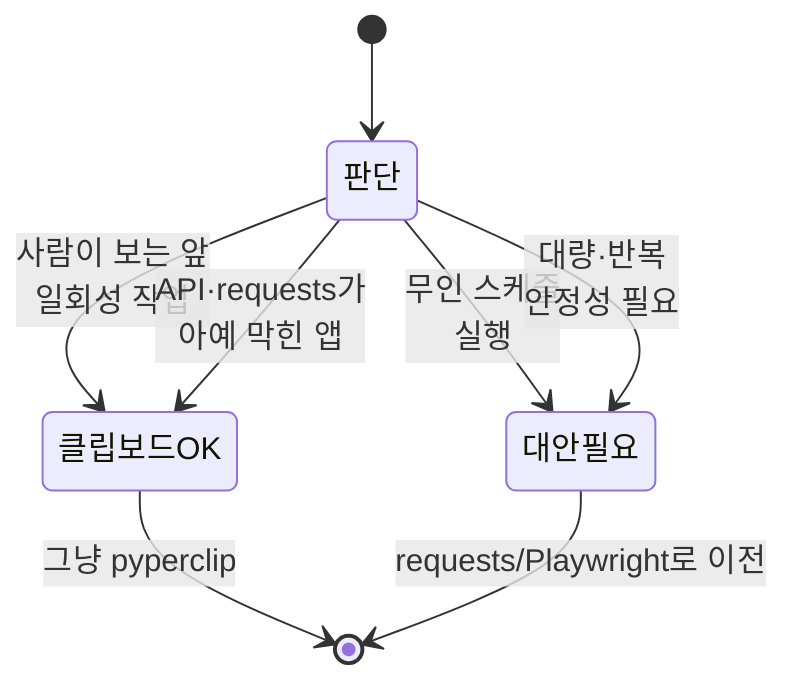

크롤링 자동화를 만들다 보면 꼭 한 번은 클립보드에 손을 댄다. 입력창에 값을 넣는 게 이상하게 안 될 때, "그냥 복사해서 붙여넣으면 되잖아?" 하고 `pyperclip`을 꺼내는 순간이다. 나도 그랬고, 잘 돌아가서 뿌듯했다가, 며칠 뒤 새벽에 조용히 멈춰 있는 걸 보고 후회했다. 오늘은 그 편함과 배신을 같이 적어둔다. (본문의 데이터·화면·값은 전부 **합성(더미) 데이터**다.)

## 클립보드 입력 자동화란 대체 뭘 하는 건가?

한 줄로 말하면 "키보드로 타이핑하는 대신, 운영체제의 복사 버퍼(클립보드)에 값을 넣어두고 Ctrl+V로 붙여넣는" 방식이다. 흐름을 먼저 그림으로 본다.


핵심은 가운데 노란 상자, **OS 클립보드**다. 이게 스크립트 소유가 아니라 컴퓨터 전체가 함께 쓰는 공용 자원이라는 점이 오늘 이야기의 전부다.

## 왜 처음엔 이게 그렇게 매력적일까?

키보드 타이핑 자동화(`pyautogui.typewrite` 같은 것)와 비교하면 장점이 확 드러난다.

| 항목 | 한 글자씩 타이핑 | 클립보드 붙여넣기 |
|---|---|---|
| 한글·이모지 입력 | 자주 깨짐(IME 문제) | 그대로 들어감 |
| 긴 문자열 속도 | 글자 수만큼 느림 | 길이 무관, 즉시 |
| 특수문자·줄바꿈 | 이스케이프 지옥 | 원본 그대로 |
| 구현 난이도 | 중간 | 매우 낮음 |

특히 한글이 문제다. 타이핑 자동화는 한글 입력기(IME)를 거치면서 "안녕"이 "dkssud"처럼 깨지거나 조합이 어긋나기 일쑤인데, 클립보드는 완성된 문자열을 통째로 넘기니 이 고민이 사라진다. 그래서 처음 30분은 천국이다.

## 가장 단순한 형태는 어떻게 생겼나?

합성 예시로, 가상의 검색창에 키워드를 하나 넣고 엔터를 치는 최소 코드다.

```python
import pyperclip
import pyautogui
import time

# 합성 더미 키워드 (실제 데이터 아님)
keyword = "겨울 캠핑 감성 조명"

# 1) 클립보드에 값을 올린다
pyperclip.copy(keyword)

# 2) 미리 클릭해 둔 입력창에 붙여넣기
time.sleep(0.3)
pyautogui.hotkey("ctrl", "v")
time.sleep(0.3)
pyautogui.press("enter")
```

돌려보면 정말 잘 된다. 그런데 이 열 몇 줄에 눈에 안 보이는 가정이 최소 네 개나 숨어 있다. 그걸 하나씩 뜯어보면 왜 깨지는지 보인다.

## 그래서 대체 어디서 깨지는가?

내가 실제로 밟은 지뢰들을 원인별로 정리하면 이렇다.



**① 클립보드는 공용이다.** 스크립트가 값을 복사한 직후, 백그라운드의 메신저 알림이나 다른 자동화가 자기 값을 복사하면 내 키워드는 흔적도 없이 사라진다. 그럼 엉뚱한 값이 붙거나 빈 값이 들어간다.

**② 포커스에 의존한다.** Ctrl+V는 "지금 커서가 있는 곳"에 붙는다. 화면 보호기가 뜨거나, 알림 팝업이 포커스를 가로채면 붙여넣기가 바탕화면이나 엉뚱한 창으로 날아간다.

**③ 타이밍이 곧 프로그램이다.** 위 코드의 `sleep(0.3)`은 순전히 기도다. 그 컴퓨터가 바쁘면 붙여넣기가 채 끝나기 전에 엔터가 눌려 빈 검색이 실행된다.

**④ 실행 환경을 탄다.** 원격 데스크톱 세션이 끊기거나 화면이 잠기면 클립보드 접근 자체가 막혀 `pyperclip`이 예외를 던지며 죽는다. 무인 스케줄러에서 특히 잘 터진다.

## 그럼에도 아직 쓸모가 있는 순간은 언제인가?

전부 버리라는 얘기는 아니다. 아래 상태 그림처럼, 조건이 맞으면 오히려 가장 빠른 해법이다.



정리하면 이렇다. 내가 화면을 보고 있는 반자동 작업, 그리고 정식 입력 경로가 막힌 데스크톱 앱에서 값 몇 개 넣는 일회성 작업이면 클립보드가 정답이다. 반대로 사람 없이 새벽에 도는 무인 작업이거나, 하루 수천 번 반복이거나, 실패하면 안 되는 파이프라인이면 손대지 말아야 한다.

## 조금이라도 덜 깨지게 쓰는 법은?

정 써야 한다면, 최소한 "복사한 값이 실제로 들어갔는지" 확인하는 방어 코드는 넣는다. 붙여넣기 후 클립보드를 되읽어 검증하고, 어긋나면 재시도하는 합성 예시다.

```python
import pyperclip
import pyautogui
import time

def safe_paste(value: str, retries: int = 3) -> bool:
    """클립보드에 올린 값이 유지되는지 확인하며 붙여넣기 시도."""
    for attempt in range(retries):
        pyperclip.copy(value)
        time.sleep(0.2)

        # 다른 앱이 클립보드를 덮어쓰지 않았는지 검증
        if pyperclip.paste() != value:
            print(f"[{attempt+1}] 클립보드 오염 감지, 재시도")
            continue

        pyautogui.hotkey("ctrl", "v")
        time.sleep(0.4)  # 엔터보다 붙여넣기가 먼저 끝나도록 여유
        return True

    print("클립보드 붙여넣기 실패: 값 유지 불가")
    return False

# 합성 더미 값
if safe_paste("가을 등산 방수 자켓"):
    pyautogui.press("enter")
```

`pyperclip.paste()`로 방금 복사한 값이 그대로 남아 있는지 되읽는 게 핵심이다. 오염을 100퍼센트 막진 못하지만, 조용히 틀린 값을 넣는 최악은 피한다. 그래도 이건 어디까지나 응급처치다.

## 더 견고한 대안은 어떻게 고르나?

깨지는 원인이 "공용 클립보드"와 "화면 포커스"라면, 그 둘을 아예 안 쓰는 방법으로 가면 된다. 목적별 비교표다.

| 상황 | 권장 방법 | 이유 |
|---|---|---|
| 웹사이트에 요청·검색 | requests / httpx | 화면·포커스 없이 HTTP로 직접 전송 |
| 로그인·JS 렌더링 필요 | Playwright | 입력창에 직접 `fill()`, 클립보드 불필요 |
| 데스크톱 앱만 존재 | UI 자동화(제한적) | 최후의 수단, 여전히 취약 |
| 값 몇 개, 사람 입회 | pyperclip | 빠르고 충분 |

특히 브라우저 작업이라면 Playwright의 `fill()` 한 줄이 클립보드+타이핑 조합의 모든 문제를 지운다. 아래는 같은 검색을 클립보드 없이 처리하는 합성 예시다.

```python
from playwright.sync_api import sync_playwright

# 합성 예시: 가상의 검색 페이지에 값을 직접 입력
with sync_playwright() as p:
    browser = p.chromium.launch(headless=True)
    page = browser.new_page()
    page.goto("https://example.test/search")   # 더미 URL

    # 클립보드·포커스·타이밍 걱정 없이 입력창에 직접 주입
    page.fill("input#q", "봄 피크닉 매트")
    page.press("input#q", "Enter")
    page.wait_for_load_state("networkidle")

    browser.close()
```

`fill()`은 그 입력 요소를 특정해 값을 직접 넣기 때문에, 공용 클립보드도 화면 포커스도 개입할 여지가 없다. 코드 양은 비슷한데 새벽에 안 깨진다. 이 차이가 운영에서는 전부다.

## 한 장으로 정리하면?

- **클립보드 자동화는 "공용 버퍼 + 화면 포커스 + 기도하는 sleep" 위에 서 있다.** 셋 다 내 통제 밖이라 무인·반복 환경에서 잘 무너진다.
- **써도 되는 순간:** 사람이 보는 앞, 일회성, 정식 입력 경로가 막힌 앱. 이때는 가장 빠른 해법이 맞다.
- **갈아탈 신호:** 무인 스케줄, 대량 반복, 실패 불허. 웹이면 requests/httpx, 렌더링 필요하면 Playwright `fill()`로 옮긴다.

편한 도구일수록 언제 손을 떼야 하는지를 아는 게 실력인 것 같다. 클립보드는 딱 그런 도구다.
