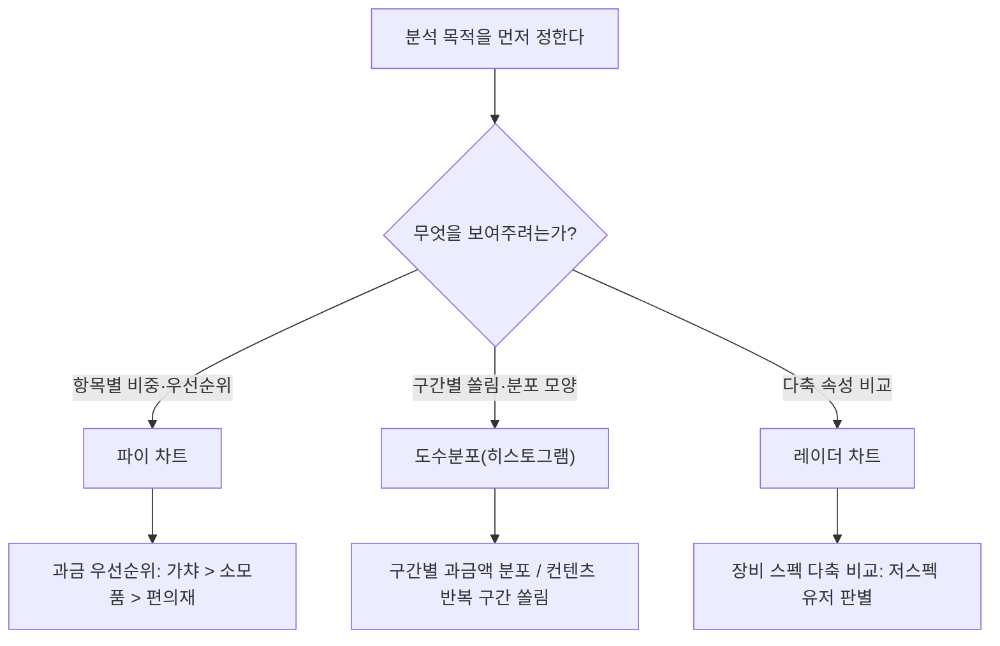
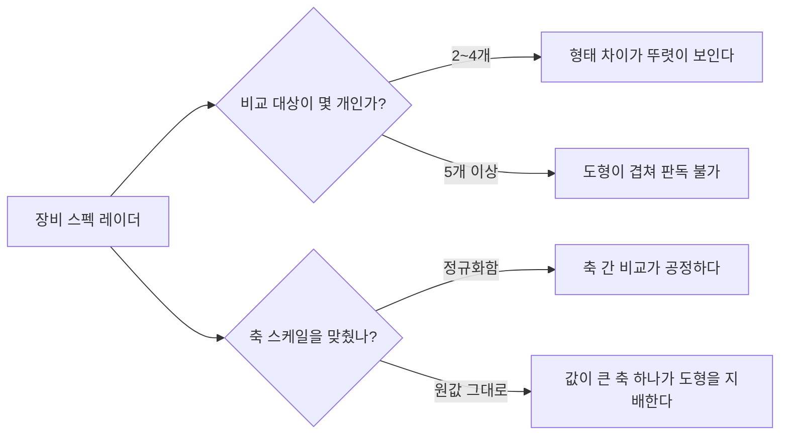

만렙(캐릭터가 오를 수 있는 최고 레벨) 개방 패치가 나가면 늘 같은 패턴이 반복됐다. 접속과 과금이 동시에 빠진다. 이 BM(비즈니스모델, 과금 설계) 이탈을 진단할 때 지표는 하나가 아니었다 — 구간별 과금분포, 컨텐츠별 매출분포, 유저 장비 스펙까지 같이 봐야 했다. 처음엔 이 셋을 전부 막대그래프 하나에 욱여넣으려 했다. 기획 회의에서 "이 그래프가 뭘 말하는 거냐"는 질문을 받고 나서야, 차트는 예쁘게 그리는 게 아니라 **분석 목적에 맞춰 고르는 도구**라는 걸 체감했다.

이 글은 그때 세운 기준 — 언제 파이를, 언제 도수분포를, 언제 레이더를 쓰는가 — 를 방법론으로 정리한 것이다. 게임명이나 실제 수치는 빼고 일반화한다.



## 과금 우선순위·매출 구성비는 왜 파이 차트인가?

과금 우선순위를 볼 때 던진 질문은 하나였다. "유저 지갑에서 어디가 제일 큰 몫을 가져가나?" 라이브 서비스에서는 가챠(확률형 아이템 뽑기) > 소모품 > 편의재 순으로 매출이 몰렸고, 가챠 하나가 전체 과금에서 큰 비중을 차지했다. 이건 전형적으로 **전체를 100%로 두고 항목별 몫을 비교**하는 질문이라 파이 차트(전체를 원형으로 나눠 비중을 보여주는 그래프)가 맞았다. 컨텐츠별 매출분포(어느 콘텐츠가 결제를 얼마나 끌어오는지)도 같은 이유로 파이로 그렸다.

파이가 통하는 조건은 두 가지다. **항목 수가 3\~5개 안팎**이고 **합쳐서 의미 있는 100%**를 이룰 때다. 가챠·소모품·편의재처럼 항목이 적고 서로 배타적이면 조각 크기 차이가 한눈에 들어온다. 반대로 항목이 7\~8개를 넘어가면 조각들이 다 비슷해 보여서 어느 게 큰지 눈으로 못 가른다. 이럴 땐 파이 대신 막대를 내림차순으로 세워야 우선순위가 보인다.

## 구간별 과금 쏠림은 왜 파이가 아니라 도수분포로 봐야 하나?

과금액 자체는 파이로 그릴 수 없는 값이었다. 유저마다 결제액이 제각각인 **연속형 데이터**였기 때문이다. 이럴 땐 결제액을 구간(예: 1만원 미만 / 1\~5만원 / 5\~30만원 / 30만원 이상)으로 나눠 구간별 유저 수를 세는 **도수분포(히스토그램, 값을 구간으로 나눠 구간마다 개수를 세는 그래프)**를 썼다. 목적은 비중이 아니라 "어디에 유저가 몰려 있나"라는 쏠림이었다.

```sql
-- 개념 예시(합성). 실제 스키마 아님.
SELECT pay_bucket, COUNT(DISTINCT user_id) AS user_cnt
FROM (
    SELECT
        user_id,
        CASE
            WHEN pay_amt_total < 10000   THEN '1) ~1만원'
            WHEN pay_amt_total < 50000   THEN '2) 1~5만원'
            WHEN pay_amt_total < 300000  THEN '3) 5~30만원'
            ELSE                              '4) 30만원~'
        END AS pay_bucket
    FROM monthly_payment_summary
) t
GROUP BY pay_bucket;
```

같은 방식으로 다른 패치 분석에서는 던전 클리어 층수를 구간으로 나눠 특정 난이도·층수 구간에 반복 플레이가 몰리는 걸 잡아낸 적도 있다. 도수분포는 "평균"이라는 숫자 하나가 감춰버리는 쏠림과 이상치를 그대로 드러낸다.

흔한 실수는 구간(bin) 크기를 대충 등간격으로 정하는 것이다. 너무 넓게 잡으면 쏠림이 뭉개지고, 너무 잘게 쪼개면 구간마다 유저가 몇 명씩만 남아 노이즈가 신호처럼 보인다. 나는 구간 경계를 "실제 BM 가격 구간과 맞는가"로 정했다. 등간격보다 실제 결제 상품 구간에 맞춰야 도수분포가 진단 도구로 쓸모가 생긴다.

## 장비 스펙처럼 축이 여러 개면 왜 레이더가 유리한가?

저스펙(장비 능력치가 낮은) 유저가 레이드(고난도 협동 콘텐츠)에 참여하지 못한다는 가설이 있었다. 확인하려면 공격력·방어력·강화도 같은 **여러 축을 동시에** 봐야 했다. 축마다 따로 막대그래프를 그리면 유저 하나의 "전체 프로필"이 한눈에 안 들어온다. 레이더 차트(여러 축의 값을 하나의 도형으로 이어 붙여 비교하는 차트)를 쓰면 유저군별 스펙 모양을 겹쳐볼 수 있다. 저스펙 유저군은 도형 자체가 작고 찌그러져 있어서, 어느 축이 특히 부족한지(강화도만 낮은지, 전체적으로 낮은지)가 바로 보였다.

레이더가 힘을 발휘하는 조건은 **비교 대상이 2\~4개로 적고, 축들이 비슷한 스케일로 정규화(같은 척도로 맞춰 환산)돼 있을 때**다. 축이 5\~6개를 넘거나 비교 대상이 5개 이상이면 도형이 서로 겹쳐 실뭉치처럼 보인다.

## 세 차트를 같이 쓸 때 가장 많이 걸려 넘어진 지점은?

제일 자주 실수하는 건 역시 레이더였다. 축 스케일을 안 맞춘 채(공격력은 수천 단위, 크리티컬 확률은 0\~100% 단위) 그리면 값이 큰 축 하나가 도형 전체를 눌러버려 진짜 문제 축이 안 보인다. 축마다 정규화를 먼저 해야 한다. 두 번째는 비교 대상을 욕심껏 늘리는 것이다. 유저군을 5\~6개씩 겹쳐 그리면 도형끼리 뒤엉켜 오히려 아무것도 안 읽힌다.



파이도 실수 포인트가 있다. 항목이 늘어나면 조각 색이 비슷해 보여 우선순위를 잘못 읽기 쉽다. 세 차트가 공통으로 주는 교훈은 하나였다. **차트를 고르기 전에 "무엇을 비교하려는가"를 먼저 문장으로 써봐야 한다.** 그 문장이 안 나오면 차트도 산으로 간다.

## 그래서 실무에서는 어떤 기준으로 골랐나?

결국 세 차트는 경쟁하는 관계가 아니라, 같은 BM 진단 안에서 역할이 다른 도구였다. 정리하면 이렇다.

| 분석 목적 | 데이터 형태 | 차트 | 예시(라이브 게임 BM) |
|---|---|---|---|
| 항목별 비중·우선순위 | 범주형, 합이 100% | 파이 | 과금 우선순위(가챠>소모품>편의재), 컨텐츠별 매출 구성비 |
| 구간별 쏠림 | 연속형을 구간화 | 도수분포(히스토그램) | 구간별 과금액 분포, 컨텐츠 반복 구간 쏠림 |
| 다축 속성 비교 | 여러 축 × 소수 대상 | 레이더 | 유저군별 장비 스펙 프로필 |

이 BM 진단 위에 이벤트 전략을 얹어 실행한 결과, 동남아 지역 상반기 목표 KPI 매출을 약 113% 초과 달성했다. 차트 하나가 성과를 만든 건 아니다. 다만 우선순위·쏠림·다축 비교를 각각 맞는 도구로 봤기 때문에, "가챠 매출 비중이 크니 이벤트를 그쪽에 집중한다"거나 "저스펙 구간이 콘텐츠를 못 따라오니 진입장벽을 낮춘다" 같은 처방이 회의 자리에서 바로 나올 수 있었다.

## 정리 — 차트는 취향이 아니라 목적의 번역이다

- **파이**: 항목이 적고(3\~5개) 합이 100%가 되는 비중·우선순위 질문에 쓴다.
- **도수분포**: 연속값을 구간으로 나눠 쏠림을 볼 때 쓴다. 구간 경계는 등간격이 아니라 실제 BM 가격 구간에 맞춘다.
- **레이더**: 비교 대상이 적고(2\~4개) 축을 정규화할 수 있을 때, 다축 프로필을 겹쳐볼 용도로 쓴다.
- 세 차트 모두 "무엇을 비교하려는가"를 문장으로 정하고 나서 골라야 한다. 순서가 바뀌면 그래프부터 그리고 질문을 끼워 맞추게 된다.

AI가 차트 코드를 순식간에 그려주는 시대에도, "이 질문엔 어떤 차트가 맞는가"라는 판단은 데이터 형태와 분석 목적을 함께 읽어본 사람 몫으로 남는다. 다음 글에서는 이 BM 진단에서 나온 저스펙 이탈 가설을 코호트로 추적하는 방법을 정리한다.

- 방법론·합성 스키마 레시피: [github.com/DBhyeong/game-data-recipes](https://github.com/DBhyeong/game-data-recipes)
