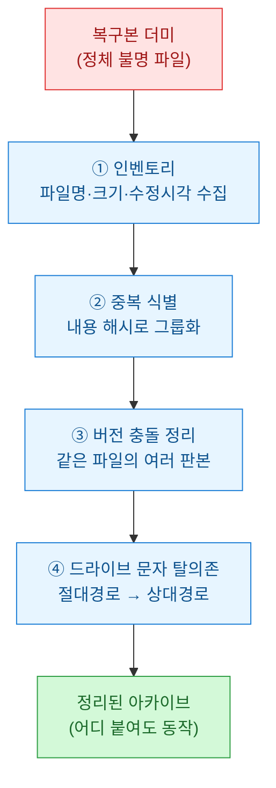
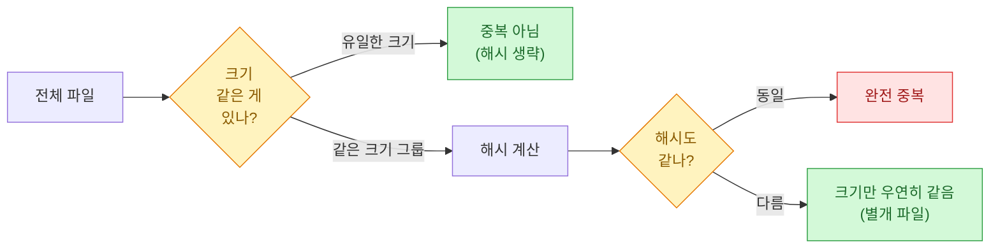
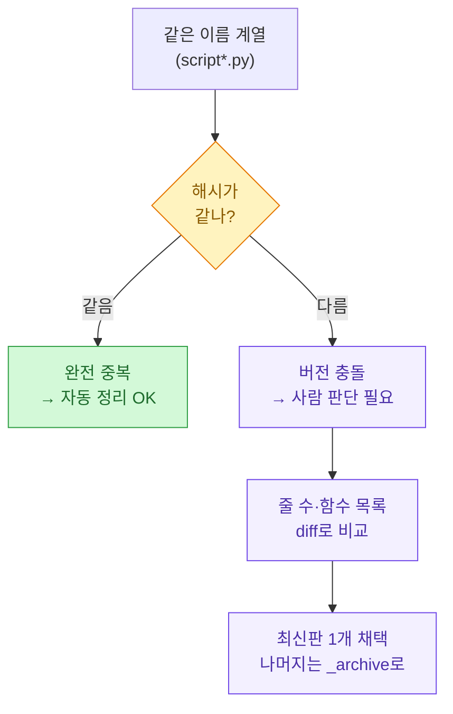
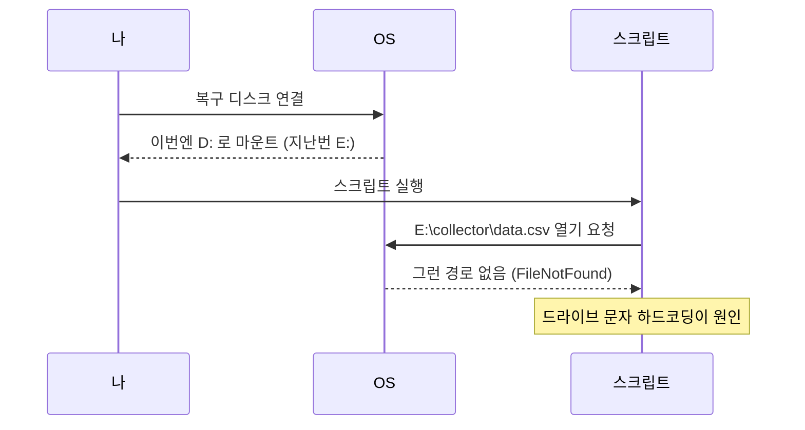
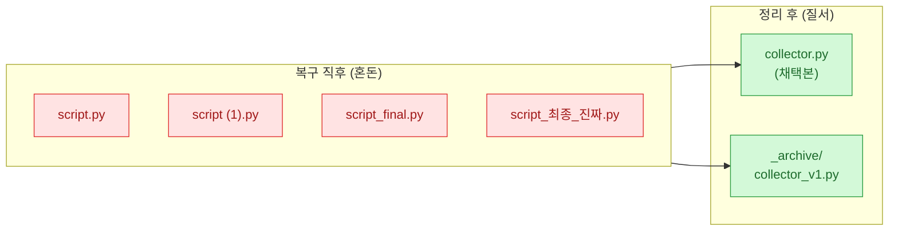

몇 년 전 쓰던 외장 디스크가 갑자기 안 열렸다. 복구 툴을 돌려서 파일은 대부분 살렸는데, 문제는 그다음이었다. 복구본 폴더를 열어보니 `script.py`, `script (1).py`, `script_final.py`, `script_최종_진짜.py`가 한 폴더에 사이좋게 누워 있었다. 어느 게 진짜 마지막 버전인지, 뭐가 중복이고 뭐가 별개 파일인지 도무지 알 수가 없었다.

이 글은 그 "코드 발굴(archaeology)" 작업을 어떻게 체계적으로 정리했는지에 대한 회고다. 아래 등장하는 파일명·해시·크기는 전부 **합성 데이터(dummy)**로 만든 예시다.

## 전체 그림은 어떻게 되나?

먼저 작업 전체를 한 장으로 그려봤다. 복구본은 "믿을 수 없는 원본"이라는 전제에서 출발한다.



네 단계다. 정체 파악 → 중복 제거 → 버전 정리 → 경로 탈의존. 하나씩 풀어본다.

## 왜 파일명만으로는 정체를 알 수 없나?

복구 툴은 파일 내용은 잘 살려도 메타데이터는 잘 잃는다. 수정 시각이 복구한 날짜로 죄다 덮이거나, 아예 파일명이 `f0032918.py` 같은 난수로 바뀌기도 한다. 그래서 파일명이라는 "겉표지"는 못 믿는다. 대신 **크기(size)**와 **내용 해시(content hash)** 같은 "속 내용"으로 판단해야 한다.

| 판단 근거 | 신뢰도 | 이유 |
|---|---|---|
| 파일명 | 낮음 | 복구 시 난수화·`(1)` 접미사로 오염 |
| 수정 시각 | 낮음 | 복구 날짜로 덮이는 경우 많음 |
| 파일 크기 | 중간 | 빠르게 그룹핑, 단 우연히 같을 수 있음 |
| 내용 해시 | 높음 | 바이트가 같으면 확실히 동일 |

전략은 이렇다. 크기로 먼저 후보를 좁히고(빠름), 크기가 같은 것들만 해시로 최종 확인(정확). 전부 다 해시 뜨면 느리니까 2단계로 나눈다.



## 어떻게 인벤토리를 만드나?

발굴의 첫 삽은 "지금 여기 뭐가 있는지" 목록화하는 것이다. 복구본 폴더를 통째로 훑어 파일마다 경로·크기·해시를 한 줄로 뽑는다. 아래는 합성 데이터로 돌려본 예시다.

```python
import hashlib
from pathlib import Path

def file_hash(path, chunk=1 << 16):
    """파일 내용을 SHA-256으로 요약. 대용량 대비 청크 단위로 읽음."""
    h = hashlib.sha256()
    with open(path, "rb") as f:
        for block in iter(lambda: f.read(chunk), b""):
            h.update(block)
    return h.hexdigest()

def build_inventory(root):
    rows = []
    for p in Path(root).rglob("*.py"):
        if not p.is_file():
            continue
        size = p.stat().st_size
        rows.append({
            "name": p.name,
            "rel_path": str(p.relative_to(root)),  # 절대경로 대신 상대경로
            "size": size,
            "hash": file_hash(p) if size > 0 else "EMPTY",
        })
    return rows

# 합성 데이터로 시연
inventory = build_inventory(r".\recovered_dummy")
for r in inventory:
    print(r["size"], r["hash"][:8], r["rel_path"])
```

출력은 이런 모양이 된다(합성 데이터).

```text
2048 a1b2c3d4 collector/script.py
2048 a1b2c3d4 collector/script (1).py
2311 9f8e7d6c collector/script_final.py
2311 9f8e7d6c backup/script_최종_진짜.py
0    EMPTY    collector/empty.py
```

여기서 벌써 답이 보인다. `script.py`와 `script (1).py`는 해시가 같으니 완전 중복. `script_final.py`와 `script_최종_진짜.py`도 해시가 같으니 이름만 다른 같은 파일이다.

## 어떻게 중복을 그룹으로 묶나?

해시를 키로 삼아 사전(dict)에 모으면 중복 그룹이 자연스럽게 만들어진다. 같은 해시에 여러 경로가 매달리면 그게 중복 세트다.

```python
from collections import defaultdict

def group_duplicates(inventory):
    groups = defaultdict(list)
    for r in inventory:
        groups[r["hash"]].append(r["rel_path"])
    # 2개 이상 매달린 것만 = 중복
    return {h: paths for h, paths in groups.items() if len(paths) > 1}

dups = group_duplicates(inventory)
for h, paths in dups.items():
    print(f"[중복 {len(paths)}개] {h[:8]}")
    for p in paths:
        print("   ", p)
```

```text
[중복 2개] a1b2c3d4
    collector/script.py
    collector/script (1).py
[중복 2개] 9f8e7d6c
    collector/script_final.py
    backup/script_최종_진짜.py
```

이제 각 그룹에서 대표 하나만 남기면 된다. 대표를 고르는 기준은 "가장 깔끔한 이름 + 가장 그럴듯한 위치"다. 나는 `(1)` 같은 접미사가 없고 경로가 짧은 쪽을 남기는 규칙을 썼다.

## 중복이 아니라 "버전 충돌"이면 어떻게 하나?

여기가 진짜 어려운 지점이다. 완전 중복(해시 동일)은 기계가 지워도 되지만, `script_final.py`와 `script_v2.py`처럼 **내용이 조금씩 다른 여러 판본**은 함부로 못 지운다. 어느 게 나중 버전인지 사람이 판단해야 한다.



버전 충돌은 지우지 않고 `_archive/` 폴더로 몰아넣는 걸 원칙으로 삼았다. 발굴 작업에서 성급한 삭제는 되돌릴 수 없으니까. 판본끼리 뭐가 다른지 빠르게 보려고 함수 목록과 줄 수를 뽑아 나란히 봤다.

```python
import ast

def summarize(path):
    src = Path(path).read_text(encoding="utf-8", errors="replace")
    lines = src.count("\n") + 1
    try:
        tree = ast.parse(src)
        funcs = [n.name for n in ast.walk(tree)
                 if isinstance(n, ast.FunctionDef)]
    except SyntaxError:
        funcs = ["(파싱 실패)"]
    return {"lines": lines, "funcs": sorted(funcs)}

# 합성 데이터 비교
for f in ["script_final.py", "script_v2.py"]:
    s = summarize(rf".\recovered_dummy\collector\{f}")
    print(f, "→", s["lines"], "줄", s["funcs"])
```

```text
script_final.py → 42 줄 ['fetch', 'parse', 'save']
script_v2.py    → 58 줄 ['fetch', 'parse', 'retry', 'save']  ← retry 추가됨
```

`retry` 함수가 추가된 `script_v2.py`가 나중 버전이라고 판단할 근거가 생긴다. 이렇게 "기능이 더 많은 쪽"이나 "줄 수가 늘어난 쪽"을 최신으로 보되, 최종 판단은 실제로 열어 확인했다.

## 드라이브 문자 함정은 왜 생기고 어떻게 피하나?

정리를 끝내고 새 위치에 옮겼더니 스크립트가 죄다 터졌다. 원인은 코드 곳곳에 `E:\collector\data.csv` 같은 **절대경로에 박힌 드라이브 문자**였다. 복구본을 `D:`에 붙였는데 코드는 `E:`를 찾으니 당연히 실패한다. 외장/복구 디스크는 꽂을 때마다 드라이브 문자가 바뀌는 게 함정이다.



해법은 절대경로를 걷어내고 **스크립트 자기 위치 기준의 상대경로**로 바꾸는 것이다. `Path(__file__).parent`를 기준점으로 삼으면 폴더째 어디로 옮기든, 어느 드라이브에 붙든 동작한다.

```python
from pathlib import Path

# 나쁨: 드라이브 문자가 박혀 있어 옮기면 깨짐
# data = open(r"E:\collector\data.csv")

# 좋음: 스크립트 위치 기준 상대경로
BASE = Path(__file__).resolve().parent
data_path = BASE / "data" / "data.csv"
print(data_path)  # 어느 드라이브에 있든 자기 옆의 data 폴더를 가리킴
```

코드에 흩어진 드라이브 문자 경로를 한 번에 찾아내려고 간단한 스캐너도 돌렸다.

```python
import re
from pathlib import Path

# C:\ ~ Z:\ 형태의 절대경로 탐지 (합성 데이터 대상)
drive_pat = re.compile(r"[A-Za-z]:[\\/]")

def scan_hardcoded_paths(root):
    hits = []
    for p in Path(root).rglob("*.py"):
        for i, line in enumerate(p.read_text(encoding="utf-8",
                                             errors="replace").splitlines(), 1):
            if drive_pat.search(line):
                hits.append((str(p.relative_to(root)), i, line.strip()))
    return hits

for path, ln, text in scan_hardcoded_paths(r".\recovered_dummy"):
    print(f"{path}:{ln}  {text}")
```

```text
collector/script_v2.py:12  DATA = r"E:\collector\data.csv"
collector/script_v2.py:31  LOG = "F:/logs/run.log"
```

이렇게 뽑힌 줄만 상대경로로 고치면 드라이브 문자 의존이 사라진다.

## 정리한 결과는 어떻게 배치했나?

발굴이 끝난 뒤의 폴더 구조는 단순하게 가져갔다. 채택본은 깔끔한 이름으로 루트에, 버려지지 않은 옛 판본은 `_archive`에, 완전 중복은 삭제. 이렇게 하니 나중에 "그때 그 옛날 버전 뭐였지" 싶을 때도 아카이브만 뒤지면 됐다.



## 한 장 요약

발굴 작업에서 붙든 원칙 세 가지로 마무리한다.

- **이름 말고 내용을 믿어라** — 복구본은 파일명·시각이 오염되니 크기+해시로 정체를 확인한다.
- **완전 중복만 지우고, 버전 충돌은 아카이브로** — 성급한 삭제는 발굴에서 최악의 실수다.
- **드라이브 문자를 코드에서 걷어내라** — `Path(__file__).parent` 기준 상대경로면 어디 붙여도 산다.

죽은 디스크에서 살려낸 코드는 "일단 다 복구"까지가 절반이고, "이게 뭔지 알아보게 정리"까지가 나머지 절반이었다. 이 글의 파일명·해시·경로는 모두 합성 데이터다.
