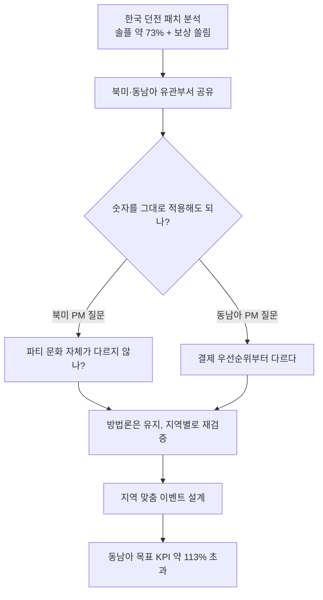
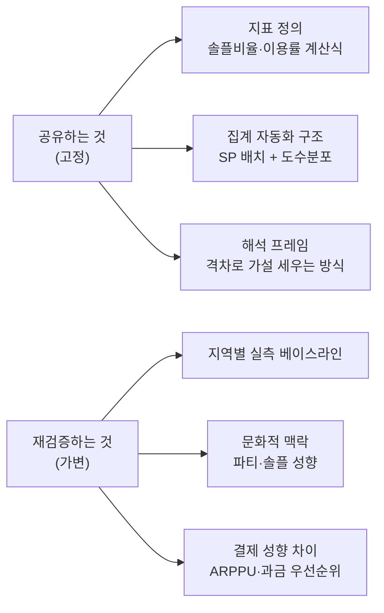
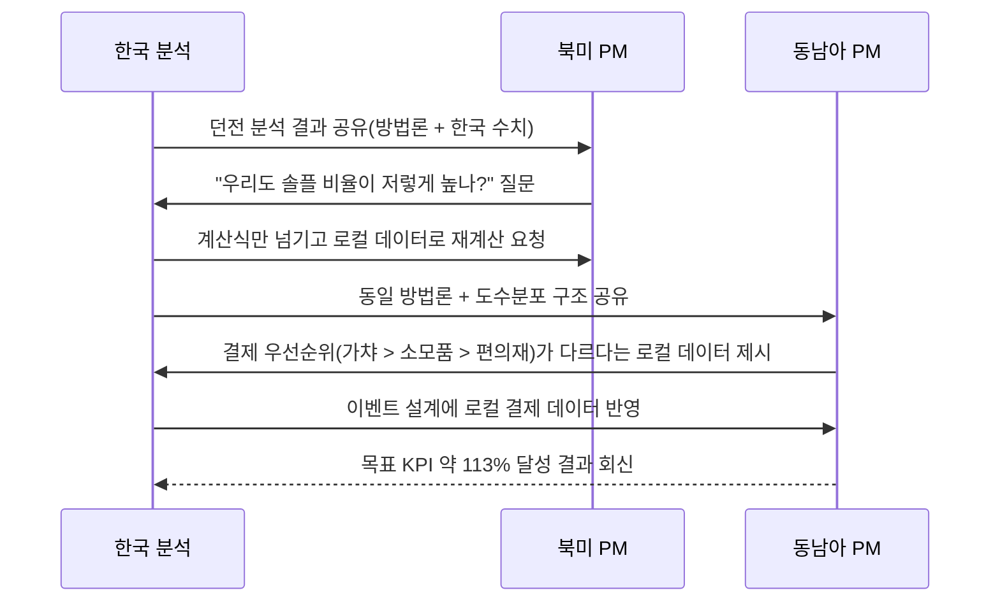

드래곤네스트 시절, 나는 한국뿐 아니라 북미·동남아 글로벌 BM(수익 모델)·이벤트 분석을 함께 맡았다. 처음엔 순진했다. 한국에서 뽑은 분석 결과를 잘 정리해서 넘기면 그걸로 끝나는 줄 알았다. 숫자는 숫자니까 어디서든 같은 의미일 거라 생각했다. 착각이었다. 첫 공유 자리에서 북미 담당 PM이 던진 질문 하나에 그 착각이 깨졌다. "이 73%, 우리 유저한테도 그대로 적용되는 숫자냐?"

거기서부터 나는 분석 결과를 넘기는 방식 자체를 바꿨다. 전체 흐름을 먼저 그려본다.

## 왜 같은 분석인데 지역마다 질문이 달랐나?

한국 데이터로 던전 패치를 분석한 결과는 명확했다. **솔플(혼자 플레이) 선호가 약 73%**였고, 쉬움\~보통 난이도 20\~25층을 반복 파밍하는 패턴 때문에 **보상이 특정 구간에 쏠려 있다**는 걸 도수분포(값이 어느 구간에 몰려 있는지 세는 방법)로 규명했다. 이 결과를 정리해 넘겼을 때, 지역별 반응은 결이 완전히 달랐다.

- **북미 PM**: "우리 쪽은 애초에 파티 매칭 자체가 약한 편인데, 73%가 문제 신호가 맞냐?"
- **동남아 PM**: "던전 얘기보다, 우리는 결제 우선순위가 한국이랑 다르다. 이 분석이 이벤트 설계에 그대로 쓰일 수 있는지 모르겠다."

같은 숫자를 보고도 두 지역은 전혀 다른 지점을 물었다. 북미는 **행동 패턴(파티 문화)** 이 애초에 다르다고 의심했고, 동남아는 **소비 구조(결제 우선순위)** 가 다르다는 걸 먼저 짚었다. 하나의 분석이 두 개의 서로 다른 재검증 요청을 받은 셈이다.

## 숫자를 그대로 복사해서 공유하면 왜 위험한가?

여기서 내가 처음 저질렀던 실수를 인정해야 한다. 73%, 20% 같은 숫자는 **한국 유저 표본에서 나온 결과**다. 그 결과값 자체를 "글로벌 공통 사실"처럼 넘기면 무슨 일이 생기냐면, 각 지역 PM은 자기 시장 감각과 안 맞는 숫자를 억지로 끼워 맞추거나, 반대로 "우리랑은 상관없다"며 통째로 무시해버린다. 둘 다 협업이 아니다.

진짜 공유해야 하는 건 **결과값이 아니라, 그 결과를 만들어낸 계산 방식과 해석 프레임**이었다. 그래서 나는 공유 자료를 두 층으로 나눠 다시 만들었다.

지표 정의(픽률·이용률을 어떻게 계산하는지)와 집계 자동화 구조(Stored Procedure 배치로 매일 도는 던전 로그 집계)는 지역이 바뀌어도 동일하게 유지했다. 반면 **실제 수치와 문화적 해석**은 지역마다 다시 뽑아야 하는 가변값으로 못 박았다. 이 구분을 명시하고 나서야 회의가 "이 숫자가 맞냐 틀리냐" 논쟁에서 "우리 지역 로그로 다시 돌리면 이 정도 나올 것 같다"는 생산적인 대화로 바뀌었다.

## 그래서 실제로 무엇을 주고받았나?

공유 문서 한 장에 계산식만 박아 넘긴다고 협업이 끝나지 않는다. 실제로는 지역 PM과 몇 차례 왕복이 필요했다.

동남아 쪽은 로컬 데이터를 보니 저스펙 유저가 고난도 콘텐츠(레이드)에 아예 참여하지 못해 이탈하는 문제가 한국보다 두드러졌다. 이 데이터를 받은 뒤 이벤트 설계를 지역 맞춤으로 다시 짰다 — 결제 우선순위 1위인 가챠 중심 보상을 저스펙 유저도 닿을 수 있는 진입장벽으로 낮추는 방향이었다. 그 결과 **동남아 목표 KPI 매출이 약 113%를 초과**했고, 상반기 KPI도 달성했다. 북미는 반대로 파티 매칭 문제가 한국만큼 두드러지지 않는다는 로컬 데이터가 나와, 던전 난이도 조정 대신 다른 우선순위로 리소스를 돌렸다.

## 이 경험에서 협업에 대해 뭘 배웠나?

가장 크게 바뀐 건 내가 스스로를 정의하는 방식이다. 이전엔 "분석 결과를 만드는 사람"이라고 생각했는데, 지금은 **"결과가 아니라 결과를 재현하는 논리를 넘기는 사람"** 이라고 생각한다. 숫자 하나를 국경 너머로 던지면 반드시 다르게 읽힌다. 그걸 막을 방법은 숫자를 더 정교하게 다듬는 게 아니라, 애초에 "이건 고정값이고 이건 지역마다 다시 재보라"는 경계선을 먼저 긋는 것이었다.

- 같은 패치·이벤트라도 **행동 문화(파티 vs 솔플)** 와 **소비 구조(결제 우선순위)** 가 다르면 효과가 다르게 나타난다.
- 공유해야 할 건 **결과값이 아니라 계산 방식·해석 프레임**이다.
- 지역 PM과의 왕복 질의는 소음이 아니라, 로컬 베이스라인을 채우는 필수 단계다.
- 그 위에서 지역 맞춤 실행이 붙어야 동남아 KPI 113% 같은 결과가 나온다.

다음 글에서는 이렇게 지역별로 다시 뽑은 로컬 베이스라인을 실제 이벤트 KPI 설계에 어떻게 반영했는지, BM 우선순위 관점에서 더 들여다본다.

- 방법론·합성 스키마 레시피: [github.com/DBhyeong/game-data-recipes](https://github.com/DBhyeong/game-data-recipes)
