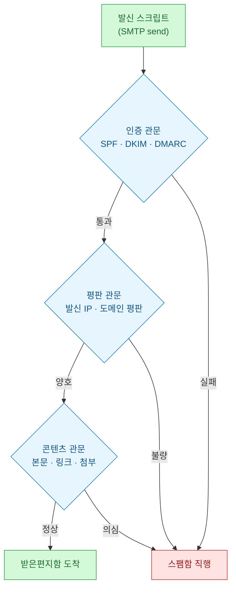
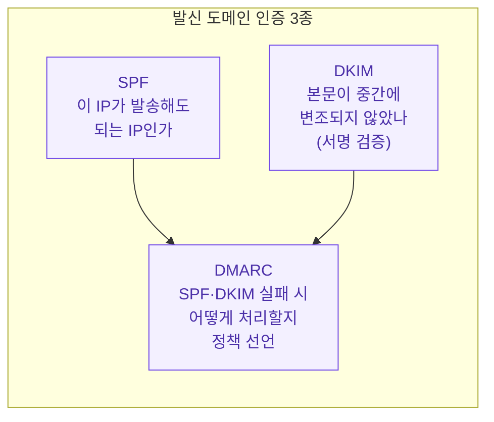
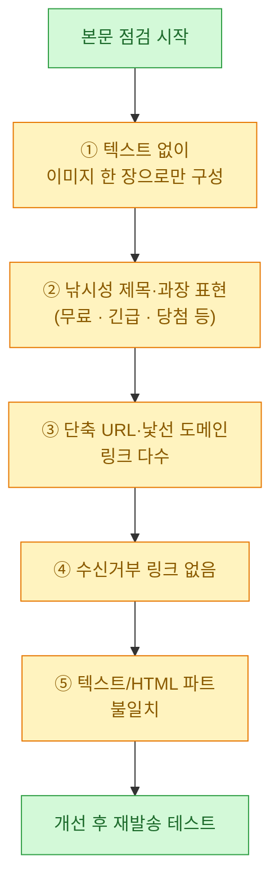
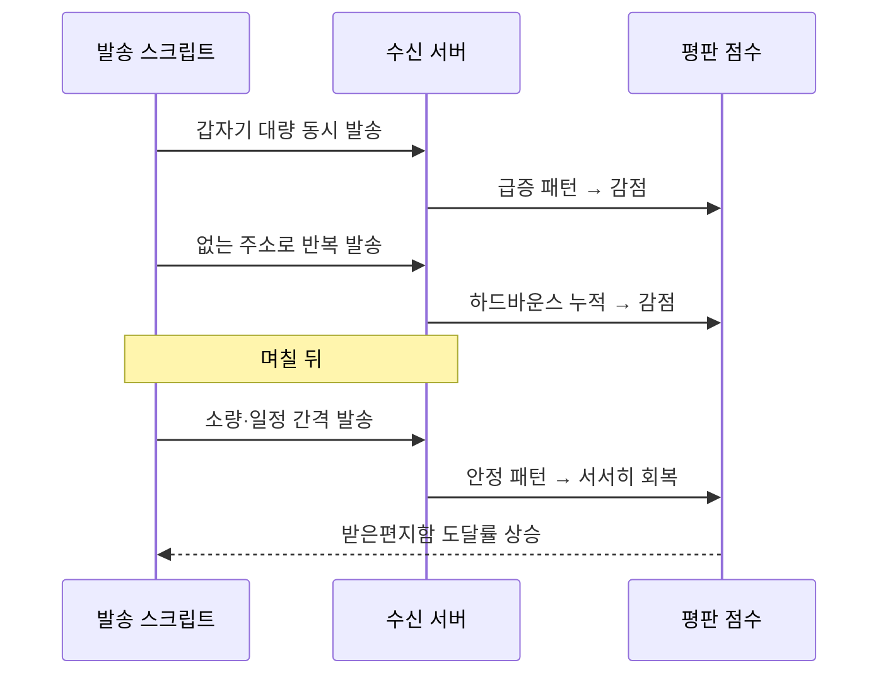
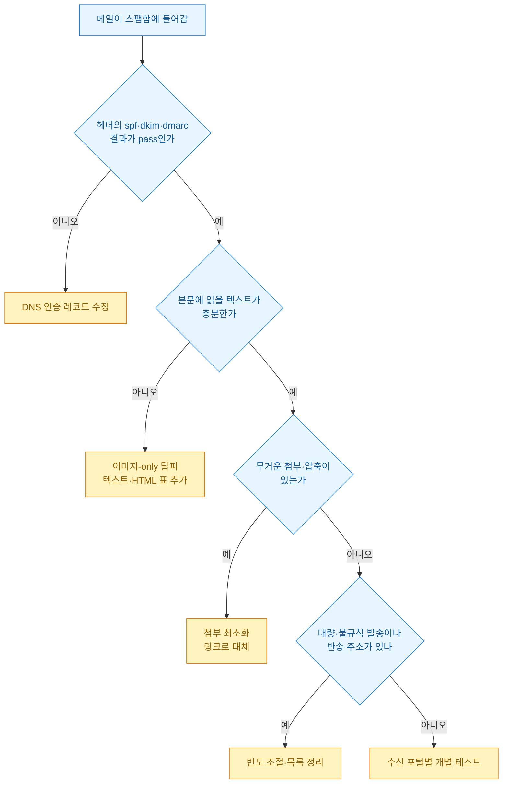

---
title: "자동 리포트 메일이 자꾸 스팸함으로 갈 때, 내가 실제로 점검한 것들"
date: 2026-07-14
tags:
  - automation
  - python
  - marketing
  - data-analysis
description: "매일 아침 자동으로 보내는 리포트 메일이 상대방 스팸함으로 직행하는 문제를, SPF/DKIM/DMARC 인증·본문 구성·첨부 형식·발신 빈도 관점에서 단계별로 진단한 트러블슈팅 기록. 예시는 모두 합성 데이터."
---

매일 아침 자동으로 나가는 리포트 메일을 하나 만들어 돌린 적이 있다. 스크립트로 데이터를 뽑아 표로 정리하고, SMTP로 관련자들에게 발송하는 흔한 구성이었다. 그런데 며칠 지나서 "메일이 안 왔는데요?"라는 말을 듣기 시작했다. 서버 로그를 보면 분명히 "발송 성공"인데, 받는 쪽 스팸함에 조용히 쌓이고 있었다.

이 글은 그때 내가 **도달률(deliverability)**, 즉 "보낸 메일이 정상적으로 받은편지함에 들어가는 비율" 문제를 어떤 순서로 파고들었는지 정리한 기록이다. 아래 나오는 도메인·수치·로그는 전부 **합성(더미) 데이터**이며, 실제 회사 계정이나 거래처 정보는 전혀 담겨 있지 않다.

## 한눈에: 스팸 판정은 어디서 갈리나?

먼저 메일 한 통이 발송돼서 받은편지함까지 가는 길에 어떤 관문을 거치는지 그림으로 정리했다. 문제를 "본문 탓"이라고 지레짐작하기 전에, 이 흐름 전체를 봐야 원인을 좁힐 수 있었다.



핵심은 관문이 하나가 아니라는 것이다. 인증에서 걸리는지, 평판에서 걸리는지, 콘텐츠에서 걸리는지에 따라 손봐야 할 곳이 완전히 다르다. 나는 이 순서대로 위에서 아래로 점검해 내려갔다.

## 왜 "발송 성공"인데 도착을 안 하나?

가장 먼저 헷갈렸던 지점이다. SMTP 응답 코드 `250 OK`는 "내 메일 서버가 상대 서버에 넘기는 데 성공했다"는 뜻이지, "상대방 받은편지함에 들어갔다"는 뜻이 아니었다. 그 뒤에 받는 쪽에서 벌어지는 필터링은 발신 로그에 안 남는다.

| 신호 | 실제 의미 | 도달 보장? |
| --- | --- | --- |
| SMTP 250 OK | 수신 서버가 메일을 접수함 | 아니오 |
| 반송(bounce) 없음 | 주소가 존재하고 거부는 안 됨 | 아니오 |
| 스팸함에 있음 | 접수는 됐으나 필터가 격리함 | — |
| 받은편지함에 있음 | 최종 도달 성공 | 예 |

그래서 "로그가 성공이니 코드는 멀쩡하다"는 생각을 버리고, 받는 쪽 관점에서 다시 봐야 했다. 나는 개인 메일 계정 몇 개(포털별로 하나씩)를 테스트 수신처로 두고, 각 계정에서 실제로 스팸함/받은편지함 중 어디에 떨어지는지를 매번 확인하는 방식으로 바꿨다.

## 인증 3종(SPF·DKIM·DMARC)이 뭐고 왜 제일 먼저 보나?

도달률에서 가장 배점이 큰 게 발신 인증이었다. 이 세 가지는 "이 메일이 정말 그 도메인이 보낸 게 맞나"를 받는 서버가 검증하는 장치다. 어렵게 들리지만 역할만 나눠 보면 단순하다.



- **SPF(에스피에프)**: 발신 도메인의 DNS에 "이 IP들만 우리 메일을 보낼 수 있다"고 등록해 두는 것. 등록 안 된 IP에서 나가면 위조로 의심받는다.
- **DKIM(디킴)**: 메일에 전자서명을 붙여, 받는 쪽이 공개키로 "본문이 발송 이후 안 바뀌었다"를 검증하게 하는 것.
- **DMARC(디마크)**: 위 둘이 실패했을 때 "격리해라 / 거부해라 / 그냥 통과시켜라" 중 무엇을 할지 도메인 주인이 미리 선언하는 정책.

내 경우 문제는 SPF였다. 자동화 스크립트가 발송에 쓰는 릴레이 서버 IP가 SPF 레코드에 빠져 있었다. 그러니 받는 서버 입장에선 "등록 안 된 곳에서 이 도메인을 사칭해 보낸 메일"로 보였던 것이다.

받은 메일의 원문 헤더를 열면 인증 결과를 직접 확인할 수 있다. 파이썬으로 헤더를 파싱해 결과만 추려 봤다(아래는 합성 데이터로 만든 예시다).

```python
import email

# 합성 데이터: 받은 메일을 저장한 .eml 파일을 파싱한다고 가정
raw = """Authentication-Results: mx.example-mail.test;
 spf=fail smtp.mailfrom=report-bot@myreports.test;
 dkim=pass header.d=myreports.test;
 dmarc=fail (p=none) header.from=myreports.test
Subject: 일일 지표 리포트 (더미)
"""

msg = email.message_from_string(raw)
auth = msg.get("Authentication-Results", "")

for token in ("spf", "dkim", "dmarc"):
    # "spf=fail" 같은 조각에서 결과만 뽑아본다
    for part in auth.replace("\n", " ").split():
        if part.startswith(f"{token}="):
            print(token.upper(), "->", part.split("=", 1)[1])
```

```text
SPF -> fail
DKIM -> pass
DMARC -> fail
```

`spf=fail`을 눈으로 확인하고 나서야 방향이 잡혔다. 해결은 코드가 아니라 DNS 쪽이었다. 발송에 쓰는 릴레이의 IP(또는 메일 서비스가 안내하는 include 값)를 SPF 레코드에 추가하니, 다음 날 테스트 메일의 `spf`가 `pass`로 바뀌었다.

## 인증은 통과인데 여전히 스팸이면, 본문을 어떻게 손보나?

인증을 고치고도 일부 포털에서는 여전히 스팸으로 갔다. 이번엔 콘텐츠 관문이었다. 자동 발송 메일은 사람이 쓴 메일과 결이 다르다 보니, 몇 가지 흔한 패턴에서 점수가 깎였다.

내가 실제로 손본 항목을 스팸 필터가 싫어하는 순서대로 정리하면 이렇다.



특히 첫 번째, "표를 이미지로 만들어 붙이던 습관"이 컸다. 보기엔 깔끔하지만 필터 입장에선 읽을 텍스트가 거의 없는 메일이라 의심 대상이 된다. 그래서 표는 **본문 HTML 표**로 넣고, 이미지는 보조로만 쓰도록 바꿨다.

또 하나, 메일을 HTML로 보낼 때는 순수 텍스트 버전을 같이 담는 게 안전했다. 파이썬 표준 라이브러리로 텍스트/HTML 두 파트를 함께 넣는 구성은 이렇게 만들었다(합성 데이터 기준).

```python
from email.mime.multipart import MIMEMultipart
from email.mime.text import MIMEText

msg = MIMEMultipart("alternative")
msg["Subject"] = "일일 지표 리포트 - 2026-07-14"   # 담백한 제목
msg["From"] = "report-bot@myreports.test"
msg["To"] = "team@example.test"

# 합성 더미 지표
rows = [("방문", 1240), ("가입", 86), ("전환", 21)]

text_lines = ["일일 지표 요약", ""] + [f"- {k}: {v}" for k, v in rows]
text_body = "\n".join(text_lines)

html_rows = "".join(f"<tr><td>{k}</td><td>{v}</td></tr>" for k, v in rows)
html_body = f"""
<p>일일 지표 요약입니다.</p>
<table border="1" cellpadding="6">
  <tr><th>지표</th><th>값</th></tr>
  {html_rows}
</table>
<p style="font-size:12px;color:#888">
  수신을 원치 않으시면 회신으로 알려주세요.
</p>
"""

# 순서가 중요: text를 먼저, html을 나중에 붙인다
msg.attach(MIMEText(text_body, "plain", "utf-8"))
msg.attach(MIMEText(html_body, "html", "utf-8"))
```

`multipart/alternative`에서는 **뒤에 붙인 파트가 우선 표시**된다. 그래서 텍스트를 먼저, HTML을 나중에 넣는다. 텍스트 파트가 있으면 이미지만 있는 메일이라는 의심이 줄고, 사람 기준으로도 미리보기가 깨끗하게 뜬다.

## 첨부파일 때문에도 걸리나?

그렇다. 리포트를 통째로 첨부하던 방식이 도달률을 떨어뜨리는 또 다른 원인이었다. 첨부는 형식과 크기에 따라 필터 반응이 꽤 다르다.

| 첨부 형태 | 필터 반응 | 대안 |
| --- | --- | --- |
| 실행 파일·매크로 문서 | 매우 나쁨(즉시 격리 흔함) | 절대 첨부 안 함 |
| 압축(zip) 안의 문서 | 나쁨(내부를 못 봐 의심) | 압축 대신 원본 |
| 대용량 첨부(수 MB↑) | 나쁨 | 링크로 대체 |
| 가벼운 CSV·PDF | 보통 | 필요 시만 |
| 첨부 없음 + 본문 요약 | 좋음 | 상세는 링크 |

결론적으로 나는 **본문에 핵심 요약을 표로 넣고, 상세 데이터는 사내 위치 링크로 대체**하는 쪽으로 정리했다. 첨부가 꼭 필요할 때만 가벼운 형식으로 한 개만 붙였다. 이렇게 하니 메일 자체가 가벼워지고, "무거운 첨부 + 이미지 한 장" 조합에서 오던 감점이 사라졌다.

## 발송 빈도와 목록 관리는 왜 중요한가?

콘텐츠를 다 고쳐도, 발신 도메인·IP의 **평판(reputation)**이 나쁘면 계속 스팸으로 간다. 평판은 하루아침에 안 바뀌고, 주로 이런 행동으로 서서히 깎인다.



내가 지킨 원칙은 단순했다.

- **한 번에 몰아 쏘지 않기**: 수신자가 많으면 잘게 나눠 간격을 두고 보낸다.
- **죽은 주소 걸러내기**: 반송(bounce)이 반복되는 주소는 목록에서 뺀다. 없는 주소로 계속 쏘면 "목록 관리를 안 하는 발신자"로 찍힌다.
- **받고 싶어 하는 사람에게만**: 수신거부 의사를 밝힌 대상은 즉시 제외한다.

반송 주소를 걸러내는 로직은 이렇게 간단히 시작했다(합성 데이터).

```python
# 합성 데이터: 발송 결과 로그
send_log = [
    {"to": "a@example.test", "status": "delivered"},
    {"to": "b@example.test", "status": "hard_bounce"},
    {"to": "c@example.test", "status": "hard_bounce"},
    {"to": "d@example.test", "status": "delivered"},
]

# 하드바운스는 다음 발송 목록에서 제외
blocklist = {r["to"] for r in send_log if r["status"] == "hard_bounce"}
next_recipients = [r["to"] for r in send_log if r["to"] not in blocklist]

print("제외:", blocklist)
print("다음 발송 대상:", next_recipients)
```

```text
제외: {'b@example.test', 'c@example.test'}
다음 발송 대상: ['a@example.test', 'd@example.test']
```

## 다시 문제가 생기면 어떤 순서로 진단하나?

한 번 정리하고 나니, 이후에 비슷한 증상이 나와도 처음처럼 헤매지 않게 됐다. 아래 순서표대로 위에서부터 내려가며 체크하면 대부분 원인이 좁혀졌다.



## 정리

이 문제를 겪으며 배운 걸 세 줄로 남긴다.

- "발송 성공 로그"는 도달의 증거가 아니다. 받는 쪽 관점에서 스팸함/받은편지함을 실제로 확인하자.
- 손대는 순서는 **인증(SPF/DKIM/DMARC) → 본문(텍스트·표) → 첨부 → 발송 빈도·목록**. 배점 큰 것부터 위에서 내려간다.
- 도달률은 코드 문제라기보다 DNS 설정·발신 습관·평판의 문제인 경우가 많았다. 한 방이 아니라 관문마다 조금씩 점수를 회복하는 일이다.

위 예시의 도메인·수치·로그는 모두 설명을 위한 합성 데이터이며, 실제 계정이나 수신자 정보와는 무관하다.
