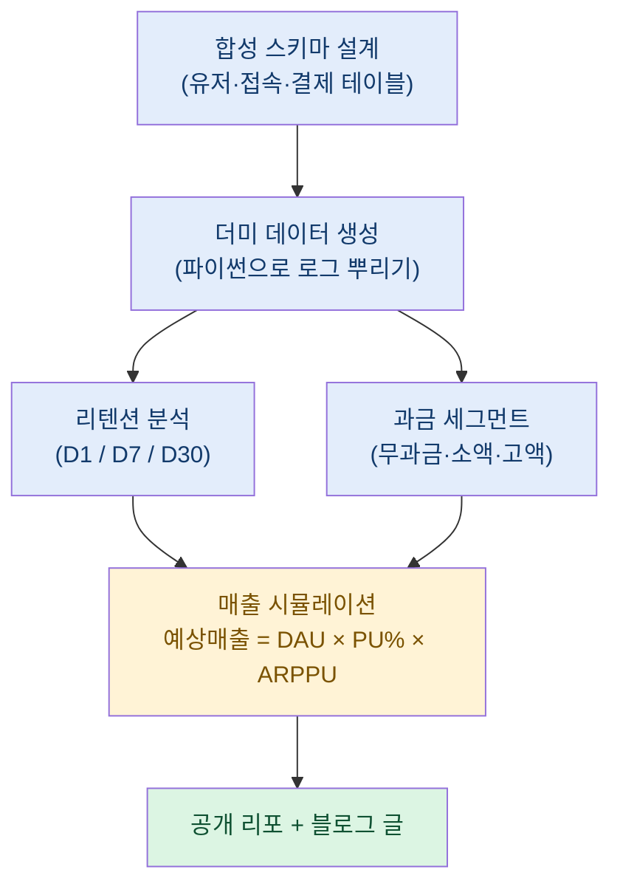
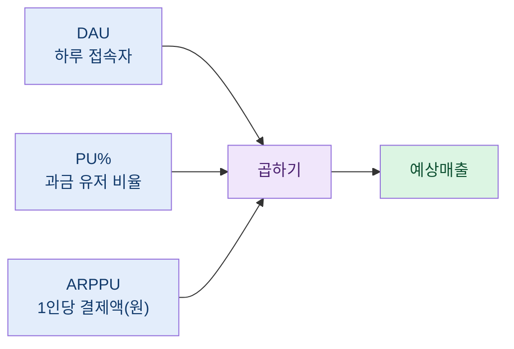

> "내가 한 분석은 자신 있는데, 그 분석을 남한테 보여줄 수가 없다." — 이게 게임 데이터 분석가의 가장 큰 딜레마다.

## 왜 나는 내 분석을 자랑하지 못했을까?

솔직히 고백하자면, 나는 오랫동안 내 포트폴리오가 부끄러웠다. 회사에서 매출 시뮬레이션도 짜고, 리텐션 코호트도 뽑고, 과금 유저 세그먼트도 나눠봤는데, 정작 그걸 밖에 내놓을 수가 없었다. 이유는 단순하다. 게임 데이터는 전부 회사 자산이니까.

실제 유저 로그, 진짜 매출 수치, 내부 테이블 이름 하나까지도 밖으로 나가면 안 된다. 그러니 이력서에는 "매출 시뮬레이션 모델을 만들었습니다"라는 한 줄만 남고, 정작 그 과정을 보여줄 코드는 어디에도 없다. 면접관 입장에서는 이게 진짜인지 허풍인지 알 길이 없는 셈이다.

그래서 나는 방향을 완전히 바꿨다. 실데이터를 보여줄 수 없다면, 실데이터 없이도 "분석하는 과정"만 통째로 재현해서 공개하자고. 여기서 핵심 개념이 바로 합성 데이터(synthetic data), 흔히 더미 데이터라고 부르는 그것이다.

여기서 지키는 원칙은 딱 하나다. **실데이터에서 가져오는 건 "방법과 구조"뿐이고, 회사·게임·유저에 관한 실제 정보는 단 한 글자도 옮기지 않는다.** 이 선만 확실히 지키면, 오히려 실무보다 더 깔끔하게 내 실력을 증명할 수 있다.

## 합성 데이터가 대체 뭐길래?

합성 데이터라는 말이 거창하게 들리지만, 쉽게 말하면 "진짜처럼 생겼지만 전부 지어낸 가짜 데이터"다. 유저 아이디도, 결제 금액도, 접속 로그도 전부 코드로 만들어낸 허구다. 다만 그냥 아무 숫자나 뿌리는 게 아니라, 실제 게임 데이터가 가진 "모양(분포)"을 흉내 낸다는 점이 중요하다.

예를 들어 게임 매출은 소수의 큰손이 대부분을 책임지는, 극단적으로 한쪽으로 쏠린 분포를 가진다. 상위 몇 퍼센트 유저가 전체 매출의 절반 이상을 내는 식이다. 이런 "쏠림"을 재현하지 못하면 아무리 데이터를 만들어도 분석 연습이 되지 않는다. 그래서 합성 데이터를 설계할 때는 아래 세 가지를 반드시 챙긴다.

| 챙겨야 할 특성 | 실데이터에서의 모습 | 합성으로 재현하는 법 |
| --- | --- | --- |
| 매출 쏠림 | 극소수 큰손이 매출 대부분 차지 | 로그정규분포 등 꼬리가 긴 분포로 결제액 생성 |
| 시간에 따른 이탈 | 신규 유저가 날이 갈수록 빠져나감 | 접속 확률을 날짜별로 점점 낮춰 로그 생성 |
| 유저 이질성 | 무과금·소액·고액이 섞여 있음 | 유저별 성향 파라미터를 다르게 부여 |

이렇게 만든 데이터는 진짜가 아니지만, 분석 코드 입장에서는 진짜와 똑같이 동작한다. 리텐션 곡선도 자연스럽게 우하향하고, 매출 히스토그램도 실제처럼 오른쪽으로 긴 꼬리를 그린다. 그래서 내가 실무에서 쓰던 SQL과 파이썬 코드를 거의 그대로 얹어도 결과가 말이 되게 나온다.

## 어떤 순서로 재현 리포를 짰나?

내가 게임사에서 실제로 반복했던 분석 흐름은 크게 네 덩어리였다. 유저 로그를 모으고, 리텐션을 보고, 과금을 쪼개고, 매출을 예측하는 것. 이 흐름 자체는 회사 비밀이 아니라 업계 상식에 가깝기 때문에, 흐름만 가져와 합성 데이터 위에서 재연했다.

첫 단계인 합성 스키마 설계가 사실 가장 중요하다. 여기서 실무 테이블 이름을 그대로 쓰면 안 되니까, 완전히 새로 지은 일반적인 이름(예: `users`, `logins`, `payments`)만 쓴다. 컬럼도 업계 어디서나 통할 법한 표준적인 것들만 남긴다. 이렇게 하면 스키마 자체가 "이 사람은 게임 로그 구조를 이해하고 있다"는 증거가 되면서도, 특정 회사를 전혀 노출하지 않는다.

## 리텐션과 매출은 어떻게 계산했나?

리텐션(retention)은 쉽게 말해 "붙잡아 두기"다. 오늘 새로 들어온 유저 중 며칠 뒤에도 돌아오는 사람이 몇 퍼센트인지를 본다. 보통 다음 날(D1), 일주일 뒤(D7), 한 달 뒤(D30)를 많이 본다. 이걸 구하려면 각 유저의 가입일과 이후 접속일의 "차이"를 세어서, 그 차이가 1일·7일·30일인 사람의 비율을 구하면 된다.

매출 쪽에서 내가 가장 아끼는 도구는 매출 시뮬레이션이다. 공식은 의외로 단순하다.

> 예상매출 = DAU × PU% × ARPPU

풀어 쓰면 이렇다. DAU는 하루 접속자 수, PU%는 그중 돈을 쓰는 유저의 비율(구매전환율), ARPPU는 결제 유저 한 명당 평균 결제액(원 단위)이다. 이 세 숫자만 있으면 "이번 달 대략 얼마 벌겠다"를 그릴 수 있다.

내가 실무에서 유용하다고 느꼈던 트릭은, 월초에 이 예측선을 하나 고정해 두고 매일 실제 누적 매출을 그 위에 덧그리는 것이다. 예측선과 실선 사이가 벌어지기 시작하면, DAU가 빠졌는지·구매전환이 떨어졌는지·객단가가 낮아졌는지 세 조각 중 어디가 원인인지 바로 짚어낼 수 있다. 이 "분해해서 원인 찾기" 감각을, 나는 합성 데이터 위에서 똑같이 재현해 리포에 담았다. 물론 여기 들어간 모든 숫자는 예시용 더미다.

## 과금 유저는 어떻게 나눴나?

매출 분석에서 빼놓을 수 없는 게 과금 세그먼트다. 유저를 무과금·소액과금·고액과금으로 나누는 건데, 여기서 재밌는 건 이 "과금 여부" 하나만 붙여놓으면 던질 수 있는 질문이 폭발적으로 늘어난다는 점이다.

이를테면 "처음 들어와서 아직 돈을 안 쓴 유저의 리텐션은 어떤가", "이미 고액을 쓴 유저의 재구매율(다시 결제할 확률)은 얼마나 되나" 같은 질문이 전부 간단한 조건 하나로 풀린다. 유저에게 과금 등급이라는 꼬리표(flag)를 달아두는 것만으로 분석의 축이 하나 더 생기는 셈이다.

| 세그먼트 | 정의(예시) | 주로 던지는 질문 |
| --- | --- | --- |
| 무과금 | 결제액 0원 | 언제 첫 결제로 넘어오나, 이탈은 언제 |
| 소액과금 | 소액 결제 이력 | 소액에서 고액으로 올라오나 |
| 고액과금 | 누적 결제 상위권 | 재구매율·잔존율이 유지되나 |

이런 세그먼트 나누기도 로직 자체는 공개해도 아무 문제가 없다. 어차피 "결제액을 기준으로 등급을 나눈다"는 발상은 업계 공통이니까. 문제가 되는 건 실제 유저의 진짜 결제 데이터인데, 그건 합성으로 대체했으니 안전하다.

## 이렇게 공개하니 뭐가 좋았나?

가장 큰 변화는, 내 포트폴리오가 "말"에서 "돌아가는 코드"로 바뀌었다는 점이다. 이제는 누구든 내 공개 리포를 클론해서 더미 데이터를 생성하고, 내 SQL과 파이썬을 직접 돌려볼 수 있다. 결과가 눈앞에서 재현되니 "이 사람 진짜 할 줄 아는구나"가 증명된다.

부수 효과도 있었다. 회사 데이터를 다루면서 늘 조심하던 습관 — 실데이터와 공개물 사이에 두꺼운 벽을 세우는 감각 — 이 오히려 더 단단해졌다. 데이터를 다루는 사람에게 이 경계 감각은 실력만큼이나 중요한 자질이다. 합성 데이터로 포트폴리오를 만드는 과정 자체가, 내가 그 경계를 얼마나 잘 지키는 사람인지를 보여주는 증거가 된 셈이다.

## 마무리

정리하면 이렇다. 실데이터를 못 쓴다고 해서 분석 실력을 못 보여주는 건 아니다. "방법과 구조"만 일반화해서 가져오고, 데이터는 합성으로 새로 지으면, 누구나 돌려볼 수 있는 재현 가능한 포트폴리오가 완성된다.

핵심은 세 가지다. 첫째, 합성 데이터는 진짜의 "모양"을 흉내 내야 분석 연습이 된다. 둘째, 스키마·지표·세그먼트 로직은 공개해도 되지만 실제 회사·게임·유저 정보는 절대 옮기지 않는다. 셋째, 결과가 실제로 재현되어야 "말"이 "증거"가 된다.

나처럼 실데이터에 손발이 묶인 분석가라면, 오늘 당장 더미 데이터 생성 스크립트 한 줄부터 시작해 보길 권한다. 자랑하지 못했던 내 분석을, 이제는 링크 하나로 보여줄 수 있게 된다.

## 참고자료

- [[game-metrics-7-definitions]] — 게임 지표 7개 기본 정의
- [[revenue-simulation-dau-pu-arppu]] — 예상매출 = DAU × PU% × ARPPU 시뮬레이션
- [[cohort-m1-retention-sql]] — 코호트 M+1 리텐션 SQL
- [[arpu-vs-arppu]] — ARPU와 ARPPU의 차이
- [[game-data-sql-recipes-retention-ltv]] — 리텐션·LTV SQL 레시피 모음
- 공개 리포: https://github.com/DBhyeong/game-data-recipes

<!-- 안전: 합성/더미 데이터, 회사·실데이터·PII 없음. -->
