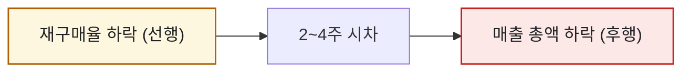
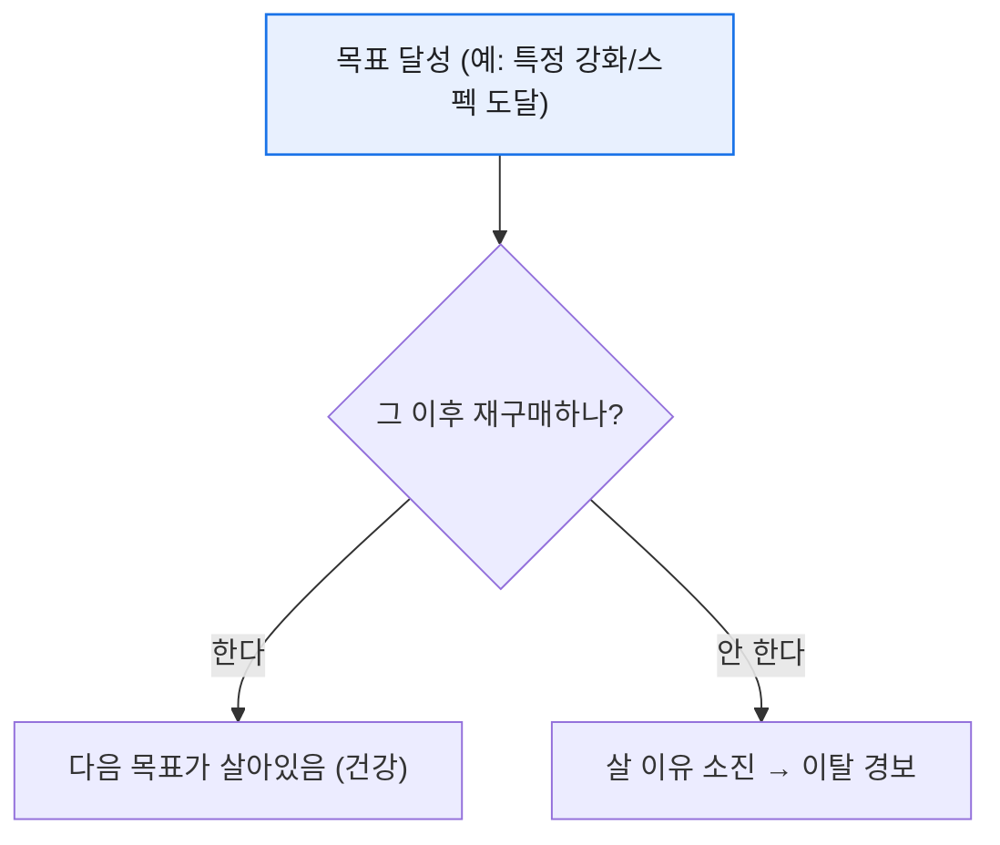

# 재구매율로 과금 이탈 조기경보 만들기

> 매출이 빠진 걸 매출 지표로 알아차리면 이미 늦었다. 그건 '사고 난 뒤에 사이렌'이다. 나는 매출보다 **먼저 흔들리는 선행 지표**가 필요했고, 그게 재구매율이었다. 결제한 유저가 '다음번에도' 결제하는가 — 이 비율이 꺾이는 순간이, 매출이 무너지기 전의 첫 경보였다.

## 왜 재구매율이 '선행' 지표인가?

매출은 결과다. 유저가 지갑을 닫기 시작하면, 그 신호는 매출 총액이 눈에 띄게 빠지기 **몇 주 전에** 재구매율에서 먼저 나타난다.



핵심 과금 유저가 "이제 살 게 없네" 하고 지갑을 닫아도, 이미 결제한 매출은 한동안 총액을 떠받친다. 그래서 총액만 보면 문제를 늦게 안다. 재구매율은 그 침묵의 구간을 앞당겨 보여준다.

## '도달 조건'을 왜 기준으로 삼나?

내가 특히 조심한 건 **특정 목표를 달성한 뒤의 재구매**였다. 예를 들어 어떤 강화 단계나 콘텐츠 클리어처럼, '더 살 이유가 사라지는 지점'이 있다.



목표 달성 이후 재구매율이 뚝 떨어진다면, 그건 유저가 '엔드'에 도달해 더 쓸 이유를 못 찾는다는 뜻이다. 즉 다음 목표(콘텐츠·상품)를 붙여줄 타이밍이라는 신호다.

## SQL로는 어떻게 재나?

'첫 결제 코호트'가 이후 기간에 다시 결제했는지를 세면 된다. (합성 스키마)

```sql
SELECT
    reach_stage,                                        -- 도달 단계
    COUNT(DISTINCT first_buyers.user_id)         AS buyers,
    COUNT(DISTINCT repurchase.user_id)           AS repurchased,
    1.0 * COUNT(DISTINCT repurchase.user_id)
        / COUNT(DISTINCT first_buyers.user_id)   AS repurchase_rate
FROM first_buyers
LEFT JOIN purchase_log AS repurchase
       ON repurchase.user_id = first_buyers.user_id
      AND repurchase.buy_date > first_buyers.reach_date
GROUP BY reach_stage
ORDER BY reach_stage;
```

이 값을 주간으로 쌓아 꺾은선으로 보면, 특정 단계에서 재구매율이 무너지는 변곡점이 드러난다. 나는 여기에 **임계선(예: 전주 대비 -10%p)** 을 걸어 자동 알림을 붙였다.

## 오늘의 기록

재구매율을 경보로 쓰기 시작한 뒤, 매출 회의의 성격이 '사후 반성'에서 '사전 대응'으로 바뀌었다. "이번 주 상위 과금층 재구매율이 임계선을 건드렸다"는 알림이 오면, 매출이 빠지기 전에 다음 목표를 붙일 논의를 시작할 수 있었으니까. 좋은 지표는 결과를 보고하는 게 아니라, 결과가 오기 전에 손을 쓰게 만든다.

*합성 데이터·스키마 기준입니다. 실제 게임·회사 데이터와 무관합니다.*
