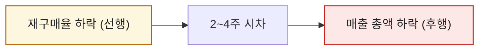
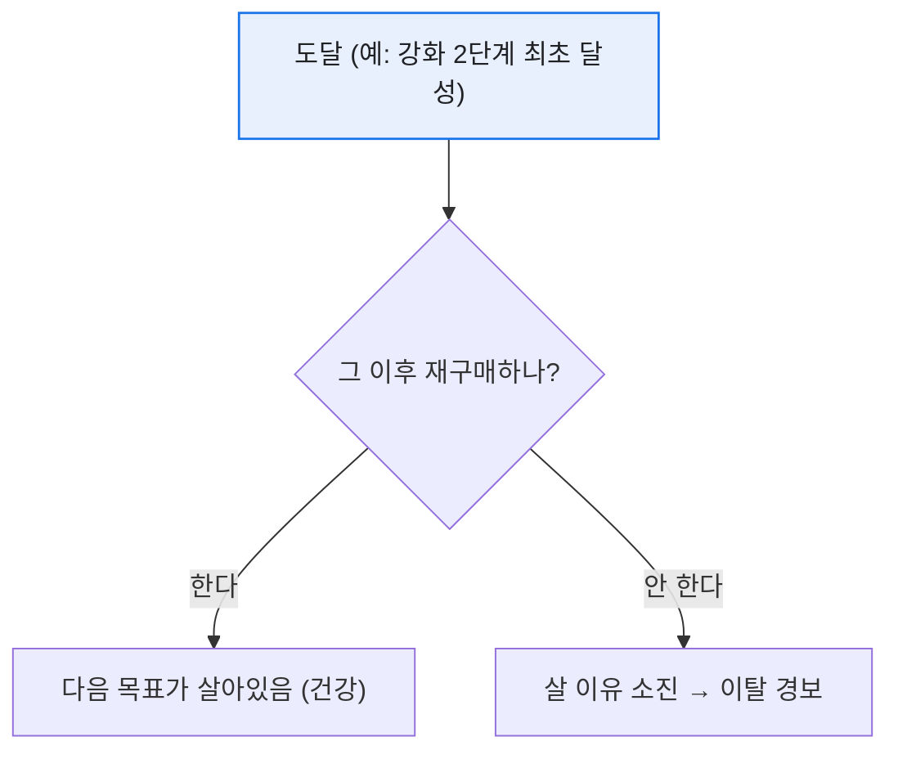
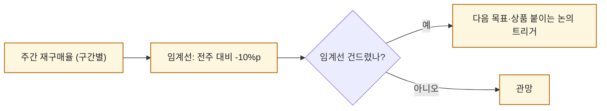

# 재구매율로 과금 이탈 조기경보 만들기

> 매출이 빠진 걸 매출 지표로 알아차리면 이미 늦다. 그건 '사고 난 뒤에 사이렌'이다. 나는 매출보다 **먼저 흔들리는 선행 지표**가 필요했고, 그게 재구매율이었다. 결제한 유저가 '다음번에도' 결제하는가 — 이 비율이 꺾이는 순간이, 매출이 무너지기 전의 첫 경보였다. (수치·구조는 일반화한 합성 기준이다.)

## 왜 재구매율이 '선행' 지표인가?

매출은 결과다. 유저가 지갑을 닫기 시작하면, 그 신호는 매출 총액이 눈에 띄게 빠지기 **몇 주 전에** 재구매율에서 먼저 나타난다.



핵심 과금 유저가 "이제 살 게 없네" 하고 지갑을 닫아도, 이미 결제한 매출은 한동안 총액을 떠받친다. 그래서 총액만 보면 문제를 늦게 안다.

## '도달 조건'을 왜 기준으로 삼나?

내가 특히 조심한 건 **특정 성장 목표를 달성한 뒤의 재구매**였다. 예를 들어 어떤 성장 아이템을 **최초로 2단계까지 강화**하고 나면, '더 살 이유가 사라지는 지점'이 온다.



목표 달성 이후 재구매율이 뚝 떨어진다면, 유저가 '엔드'에 도달해 더 쓸 이유를 못 찾는다는 뜻이다. 다음 목표(콘텐츠·상품)를 붙여줄 타이밍이라는 신호다.

## 실제로는 어떻게 뽑았나?

방법을 남겨둔다. 조각을 조심스럽게 맞춰야 정확했다.

- **최초 2단계 달성 시기**는 각 계정의 `MIN(달성일)`로 잡았고(min값 추출),
- 신규 콘텐츠 출시 **30일 후 소유 계정의 중복을 정리**했고,
- 강화 수치는 **max로 처리**해 같은 계정의 중복값을 눌렀고,
- **구매 테이블을 Join한 뒤 pu / non-pu flag**로 결제 여부를 갈랐다.

그 위에서 '도달 계정'이 이후 기간에 다시 결제했는지를 **금액 구간별로** 셌다.

```sql
SELECT
    reach_stage,                                        -- 도달 단계
    pay_tier,                                           -- 금액 구간
    COUNT(DISTINCT r.user_id)                    AS reached,
    COUNT(DISTINCT rb.user_id)                   AS repurchased,
    1.0 * COUNT(DISTINCT rb.user_id)
        / COUNT(DISTINCT r.user_id)              AS repurchase_rate
FROM reached_accounts AS r
LEFT JOIN purchase_log AS rb
       ON rb.user_id = r.user_id
      AND rb.buy_date > r.reach_date
GROUP BY reach_stage, pay_tier;
```

이 값을 주간으로 쌓아 꺾은선으로 보면, 특정 단계에서 재구매율이 무너지는 변곡점이 드러난다. 나는 여기에 **임계선(예: 전주 대비 -10%p)** 을 걸어 알림을 붙였고, 특히 중간 과금대 구간을 예의주시했다.

## 임계선 알림을 어떻게 운영했나?

지표를 뽑는 것과 경보로 쓰는 것은 다른 문제였다. 나는 재구매율을 주간으로 쌓고, 그 위에 **임계선**을 걸어 자동 알림으로 만들었다.



특히 **금액 구간별로** 임계선을 따로 걸었다. 경험상 최상위 고래보다 **중간 과금대가 먼저** 흔들렸기 때문이다. 이 층의 재구매율이 임계선을 건드리면, 그건 '엔드에 도달해 살 이유가 사라진' 신호였고, 다음 목표(콘텐츠·상품)를 붙일 타이밍이라는 뜻이었다.

이렇게 만들어 두니 회의의 성격이 바뀌었다. "이번 달 매출이 왜 빠졌지?"를 사후에 따지는 대신, "중액 구간 재구매율이 임계선을 건드렸으니 다음 목표를 준비하자"를 사전에 논의하게 됐다. 경보는 결과를 설명하는 게 아니라, 결과가 오기 전에 손을 쓰게 만드는 장치였다.

## 오늘의 기록

재구매율을 경보로 쓰기 시작한 뒤, 매출 회의의 성격이 '사후 반성'에서 '사전 대응'으로 바뀌었다. "상위 과금층 재구매율이 임계선을 건드렸다"는 알림이 오면, 매출이 빠지기 전에 다음 목표를 붙이는 논의를 시작할 수 있었다. 좋은 지표는 결과를 보고하는 게 아니라, 결과가 오기 전에 손을 쓰게 만든다.

*실제 과금 이탈 분석 경험을 바탕으로 하되, 스키마·수치는 일반화한 합성 기준입니다.*
