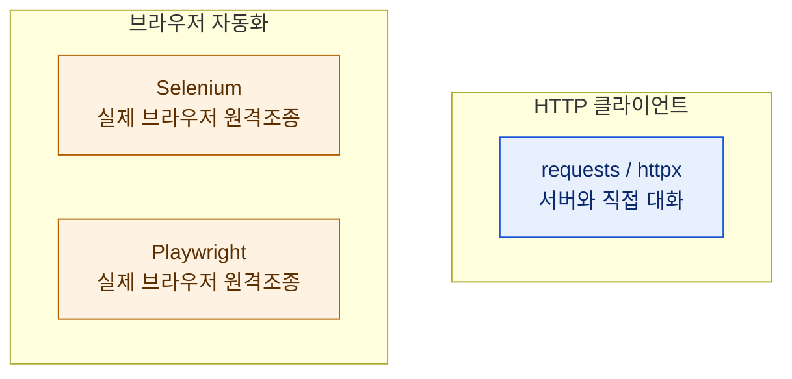
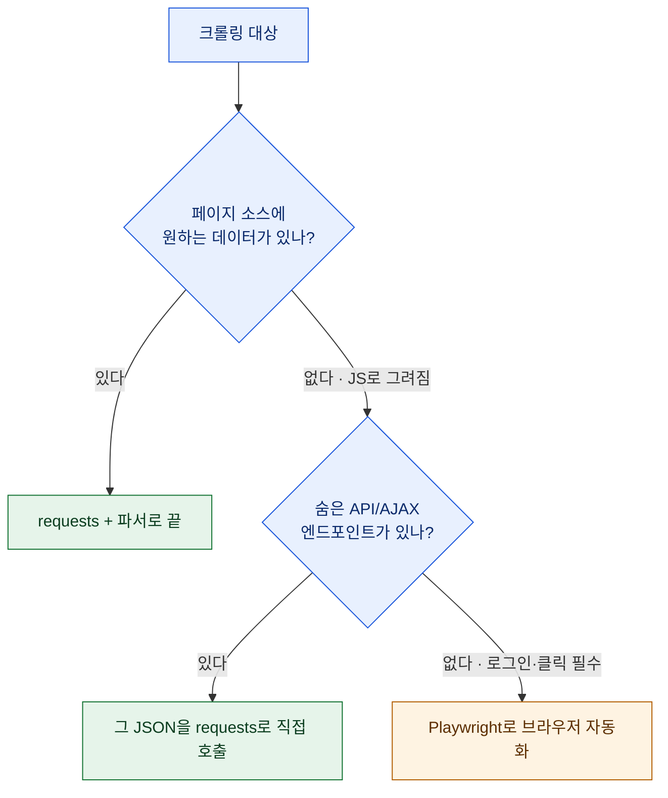
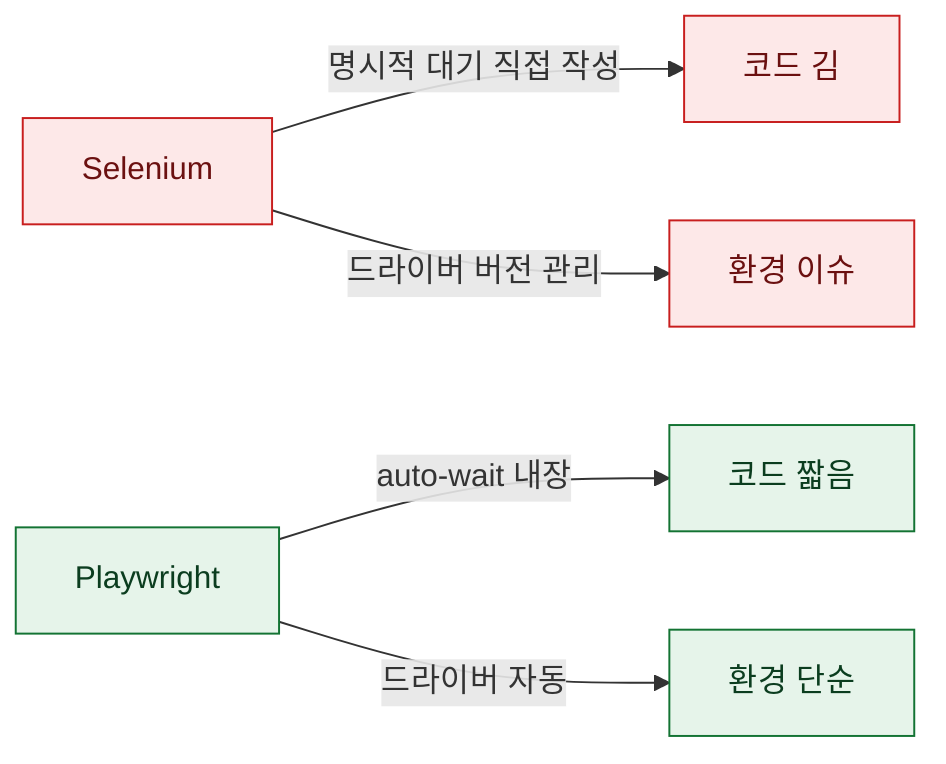

# requests vs Selenium vs Playwright, 언제 뭘 쓰나

> 크롤링 좀 한다고 하면 꼭 받는 질문이 "그거 셀레니움으로 하세요?"다. 답은 늘 "상황 따라"인데, 그 '상황'을 매번 말로 풀기가 귀찮아서 기준으로 정리했다. 결론부터 말하면 **대부분은 브라우저가 필요 없다.** 브라우저를 띄우는 건 최후의 수단이고, 그 최후에도 요즘은 Selenium보다 Playwright다. 왜 그런지 하나씩.

## 세 도구는 애초에 다른 종류다

먼저 오해를 풀어야 한다. 이 셋은 "비슷한 크롤링 라이브러리 세 개"가 아니다. 종류가 다르다.



`requests`는 브라우저 없이 **서버에 HTTP 요청을 직접 던지고 응답을 받는다.** 빠르고 가볍다. 대신 자바스크립트를 실행하지 않는다. Selenium과 Playwright는 **진짜 브라우저를 띄워 사람처럼 조종한다.** JS를 다 돌리고 화면을 렌더하니 못 여는 페이지가 거의 없지만, 무겁고 느리다. 이 차이가 선택의 전부다.

## 그래서 무엇으로 시작해야 하나?

의사결정은 단순하다. **항상 requests부터 시도하고, 안 될 때만 브라우저로 올라간다.**



핵심은 가운데 분기다. 화면이 JS로 그려진다고 곧장 브라우저를 띄우지 마라. 그 데이터는 대개 **뒤에서 API를 호출해 받아온 것**이라, 그 API를 직접 두드리면 requests로 끝난다.

## 숨은 AJAX를 찾으면 비용이 10배 줄어든다

브라우저 개발자도구의 Network 탭을 열고 페이지를 새로고침하면, 화면을 채우는 XHR/fetch 요청들이 보인다. 그중 원하는 데이터를 담아오는 JSON 응답을 찾으면, 그 URL과 파라미터를 그대로 requests로 재현할 수 있다.

```python
import httpx

# 브라우저를 띄우는 대신, 화면 뒤 API를 직접 호출
params = {"page": 1, "size": 50, "sort": "recent"}
r = httpx.get("https://example.com/api/list", params=params, timeout=10)
data = r.json()            # 이미 구조화된 데이터
items = data["items"]
```

브라우저를 띄워 DOM을 긁는 것보다 **수십 배 빠르고, 안정적이고, 데이터도 이미 구조화**돼 있다. 페이지 레이아웃이 바뀌어도 API는 잘 안 바뀌어서 유지보수도 편하다. 나는 크롤링의 절반 이상을 이 방식으로 브라우저 없이 끝낸다. `requests`로 HTTP/2나 최신 TLS가 필요해 막히면 `httpx`로 바꾸면 풀리는 경우도 많다.

## 그럼 브라우저는 언제 꼭 필요한가?

세 경우엔 브라우저가 답이다. **로그인·세션이 복잡하게 얽혀** 토큰을 재현하기 어려울 때, **클릭·스크롤·입력 같은 상호작용**을 거쳐야 데이터가 나올 때, 그리고 **강한 안티봇**이 순수 HTTP 요청을 걸러낼 때. 이럴 땐 실제 브라우저의 행동이 필요하다. 다만 이건 비용이 크니, 정말 그런지부터 확인하고 올라가야 한다.

| 기준 | requests/httpx | Selenium/Playwright |
|---|---|---|
| 속도 | 빠름(수십 ms) | 느림(초 단위) |
| 리소스 | 가벼움 | 무거움(브라우저 프로세스) |
| JS 렌더 | 못 함 | 함 |
| 유지보수 | API 안정적 | DOM 변화에 취약 |
| 적합 | 정적·API·숨은 AJAX | 로그인·인터랙션·안티봇 |

## 브라우저를 써야 한다면 — 왜 Playwright인가?

오래 Selenium을 썼지만 지금은 Playwright로 기울었다. 이유가 몇 있다. **자동 대기(auto-wait)** — 요소가 나타날 때까지 알아서 기다려줘서, Selenium에서 늘 짜던 명시적 `WebDriverWait` 보일러플레이트가 확 줄었다. **드라이버 관리가 없다** — Selenium의 브라우저·드라이버 버전 지옥에서 벗어난다. **셀렉터가 강력**하고 네트워크 가로채기·대기 조건이 내장이라, 같은 일을 하는 코드가 눈에 띄게 짧아진다.



물론 레거시 코드가 이미 Selenium 위에 크게 쌓여 있다면 굳이 갈아탈 이유는 없다. 새로 시작하는 브라우저 자동화라면 Playwright가 기본값이라는 얘기다.

## 정리 — 위로 올라갈수록 비싸다

| 단계 | 도구 | 언제 |
|---|---|---|
| 1순위 | requests/httpx | 소스에 데이터가 있거나 API가 열려 있을 때 |
| 2순위 | 숨은 AJAX 직접 호출 | JS 렌더지만 뒤에 API가 있을 때 |
| 3순위 | Playwright | 로그인·인터랙션·안티봇이 필수일 때 |

> 크롤링 도구 선택의 원칙은 하나다. **가장 가벼운 것부터 시도하고, 막힐 때만 한 칸 올라간다.** 브라우저를 먼저 띄우는 습관은 편해 보이지만, 느리고 잘 깨지는 파이프라인으로 가는 지름길이다. 그리고 대부분의 벽은, 개발자도구 Network 탭 한 번 여는 걸로 넘어간다.

*수집은 언제나 대상 사이트의 robots·이용약관·호출 한도를 준수하는 범위에서 이뤄져야 합니다.*
