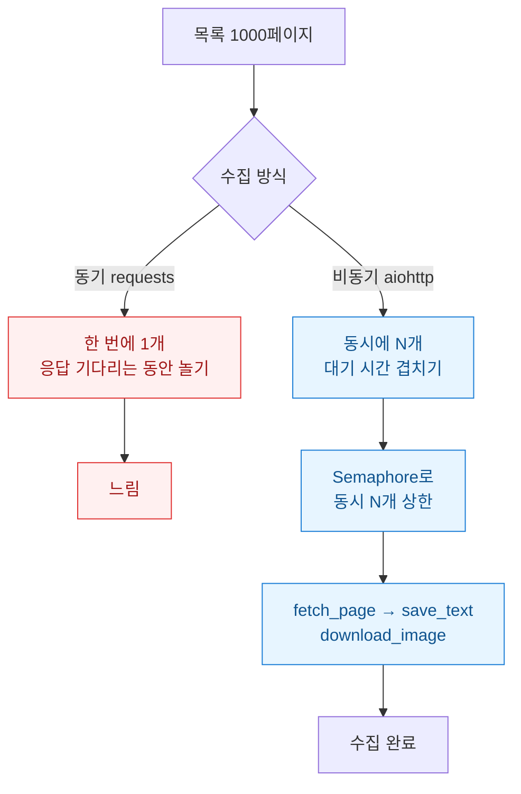
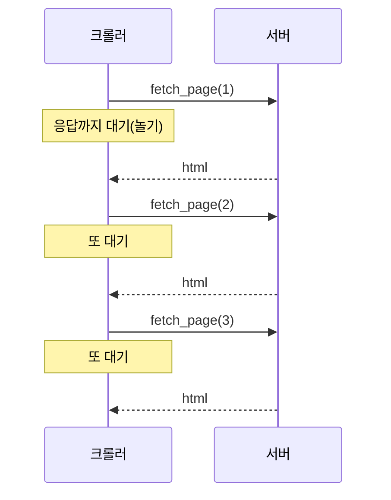

게시판 하나를 통째로 긁어야 했다. 목록 1000페이지를 돌면서 각 글의 본문 텍스트를 저장하고 첨부 이미지도 받아오는 흔한 수집 작업이다. 처음엔 `requests`로 짠 동기 코드를 그냥 돌렸다. 잘 돌긴 하는데 느렸다. 한 페이지 요청하고 응답 올 때까지 CPU가 멍하니 노는 시간, 그 대기 시간이 페이지마다 쌓이니까 전체가 하염없이 길어졌다.

문제의 본질은 계산이 무거운 게 아니라 **기다림이 대부분**이라는 데 있었다. 네트워크 요청은 보내고 나서 응답이 돌아올 때까지 하는 일이 없다. 이런 I/O 대기(입출력을 기다리며 노는 시간)는 비동기(async, 한 작업이 대기하는 동안 다른 작업을 진행하는 방식)로 겹쳐주면 통째로 회수된다. 그래서 `aiohttp`(비동기 HTTP 클라이언트 라이브러리)로 갈아엎기로 했다. 아래가 전체 그림이다.



## 동기 코드는 왜 느렸나?

원래 코드는 이렇게 순차적이었다. 페이지를 하나 받고, 파싱하고, 이미지를 받고, 텍스트를 저장한다. 그 다음 페이지로 넘어간다. 각 `requests.get`은 응답이 올 때까지 스레드를 붙잡고 논다.

```python
import requests

def fetch_page(url):
    return requests.get(url, timeout=10).text  # 응답 올 때까지 정지

def download_image(url, path):
    r = requests.get(url, timeout=10)
    with open(path, "wb") as f:
        f.write(r.content)

def save_text(text, path):
    with open(path, "w", encoding="utf-8") as f:
        f.write(text)

for page in range(1, 1001):
    html = fetch_page(f"https://example.com/board?page={page}")
    # ... 파싱 후 이미지 URL, 본문 추출 ...
    save_text(body, f"out/{page}.txt")
```

시간을 그림으로 그려보면 대기가 얼마나 낭비인지 바로 보인다. 요청 3개가 서로 겹치지 못하고 일렬로 늘어선다.



## async로 바꾸면 뭐가 달라지나?

핵심은 세 함수를 전부 `async def`로 바꾸고, 세션 하나를 공유하며, 네트워크 호출 앞에 `await`를 붙이는 것이다. `await`는 "여기서 응답을 기다리는 동안 다른 코루틴(async 함수의 실행 단위)을 돌려도 좋다"는 표시다.

```python
import aiohttp, asyncio, aiofiles

async def fetch_page(session, url):
    async with session.get(url, timeout=10) as r:
        return await r.text()

async def download_image(session, url, path):
    async with session.get(url, timeout=10) as r:
        data = await r.read()
    async with aiofiles.open(path, "wb") as f:
        await f.write(data)

async def save_text(text, path):
    async with aiofiles.open(path, "w", encoding="utf-8") as f:
        await f.write(text)
```

주의할 점 하나. 파일 저장도 `aiofiles`로 비동기화해야 한다. 여기서 그냥 동기 `open`을 쓰면 파일 쓰는 순간 이벤트 루프(코루틴을 번갈아 실행하는 스케줄러) 전체가 멈춰서 애써 겹친 이득이 새어 나간다.

## 동시성은 왜 무한대로 풀면 안 되나?

이론상 1000개를 한꺼번에 `await`로 던질 수 있다. 그런데 그러면 서버가 순식간에 1000개 연결을 맞고 나를 차단하거나, 내 쪽 소켓이 터진다. 상대 서버 입장에선 이게 사실상 소규모 공격이다. 그래서 **동시에 도는 요청 수에 상한**을 둬야 한다. `asyncio.Semaphore`(동시 입장 인원을 제한하는 문지기)가 그 역할을 한다.

```python
async def worker(sem, session, page):
    async with sem:  # 자리 하나 차지, 초과분은 대기
        url = f"https://example.com/board?page={page}"
        html = await fetch_page(session, url)
        # ... 파싱 ...
        await save_text(body, f"out/{page}.txt")

async def main():
    sem = asyncio.Semaphore(10)  # 동시 10개까지만
    async with aiohttp.ClientSession() as session:
        tasks = [worker(sem, session, p) for p in range(1, 1001)]
        await asyncio.gather(*tasks)

asyncio.run(main())
```

한도(Semaphore 값)는 무작정 크게 잡는다고 빨라지지 않는다. 내 경우엔 5에서 10으로 올릴 때는 체감이 확 좋아졌는데, 20을 넘기니 오히려 서버가 간헐적으로 느려진 응답을 주면서 재시도가 늘어 실익이 사라졌다. 그래서 낮은 값부터 조금씩 올리며 응답 시간과 실패율을 같이 봤다.


## 매너와 안전은 어떻게 챙겼나?

빨라졌다고 끝이 아니다. 비동기는 상대 서버를 훨씬 세게 때릴 수 있는 도구라서 오히려 예의가 더 중요해진다. 나는 세 가지를 지켰다. 첫째, `robots.txt`와 사이트 약관을 먼저 확인해 수집이 허용된 범위인지 봤다. 둘째, Semaphore로 동시 요청을 묶고 필요하면 `await asyncio.sleep`으로 간격을 뒀다. 셋째, 타임아웃과 재시도를 넣어 한 요청이 죽어도 전체가 무너지지 않게 했다.

정리하면 이 리팩터링의 본질은 "코드를 빠르게" 만든 게 아니라 **놀고 있던 대기 시간을 회수**한 것이다. 계산이 무거운 작업이면 async는 답이 아니다(그건 멀티프로세싱 영역이다). 하지만 수집처럼 기다림이 대부분인 일에선 세 함수를 `async`로 바꾸고 Semaphore 하나 얹는 것만으로 대기가 서로 겹친다. 다음엔 실패한 페이지만 골라 재수집하는 큐를 붙여서, 대량 수집의 신뢰성까지 챙겨볼 생각이다.
