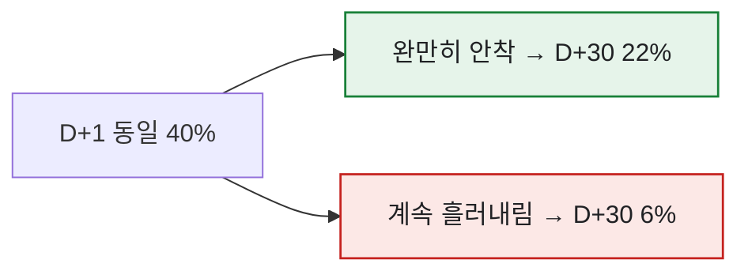
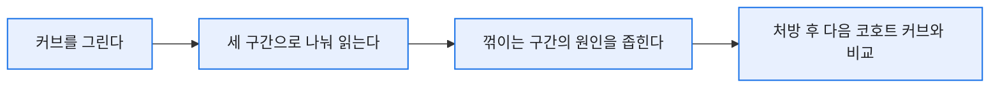

# M+1 리텐션만으로는 부족하다 — 리텐션 커브 읽는 법

> 한동안 나는 리텐션을 'M+1 한 숫자'로만 관리했다. 그런데 어느 날 M+1이 똑같은 두 업데이트가 한 달 뒤엔 완전히 다른 매출로 벌어지는 걸 보고 정신이 들었다. 잔존은 점이 아니라 **곡선**이었다. 한 점만 찍어보고 게임의 수명을 판단하고 있었던 거다.

## 리텐션은 왜 '곡선'이어야 하나?

M+1(또는 D+1)은 커브의 딱 한 점이다. 같은 시작점이어도 이후 기울기가 다르면 남는 유저 수는 크게 갈린다.



D+1이 똑같이 40%여도, 하나는 '바닥을 다지며 안착'하고 다른 하나는 '멈추지 않고 흘러내린다'. 이 차이는 한 점으로는 절대 안 보인다.

## 커브의 세 구간은 각각 뭘 말하나?

나는 리텐션 커브를 늘 세 구간으로 나눠 읽었다.

| 구간 | 무엇을 보나 | 낮/이상하면 의심할 것 |
|---|---|---|
| **초반 급락** (D+1~D+3) | 첫인상·튜토리얼·초반 재미 | 온보딩 이탈, 진입장벽 |
| **중반 기울기** (D+7~D+14) | 습관 형성·콘텐츠 소진 속도 | 할 게 금방 떨어짐 |
| **후반 바닥** (D+30~) | 코어 유저의 충성도 | 장기 목표·엔드 콘텐츠 부재 |

예를 들어 초반은 멀쩡한데 중반부터 뚝 꺾이면, 재미없어서 나가는 게 아니라 **'할 게 떨어져서'** 나가는 거다. 처방이 완전히 다르다.

## 커브를 데이터로는 어떻게 그리나?

코호트별로 '가입 후 경과일(day_n)'을 축으로 접속 여부를 집계하면 된다. 개념 쿼리는 이렇다. (합성 스키마)

```sql
SELECT
    DATEDIFF(DAY, u.join_date, l.login_date) AS day_n,
    1.0 * COUNT(DISTINCT l.user_id)
        / COUNT(DISTINCT u.user_id)          AS retention
FROM user_cohort AS u
LEFT JOIN login_log AS l
       ON l.user_id = u.user_id
WHERE u.join_week = '2026-06-01'
GROUP BY DATEDIFF(DAY, u.join_date, l.login_date)
ORDER BY day_n;
```

이 결과를 꺾은선으로 그리면 위에서 말한 세 구간이 눈에 들어온다. 나는 여기에 **업데이트 시점을 세로선으로** 얹어, 패치가 커브 기울기를 실제로 완만하게 만들었는지까지 봤다.



## 오늘의 기록

M+1 한 점만 보던 시절엔 "리텐션 유지 중"이라는 안심에 자주 속았다. 커브로 보기 시작하자 '언제, 왜' 빠지는지가 드러났고, 그때부터 처방이 구체적이 됐다. 잔존은 게임의 심전도 같은 거더라 — 평균 심박수 한 숫자가 아니라, 파형을 봐야 상태를 안다.

*합성 데이터·스키마 기준입니다. 실제 게임·회사 데이터와 무관합니다.*
