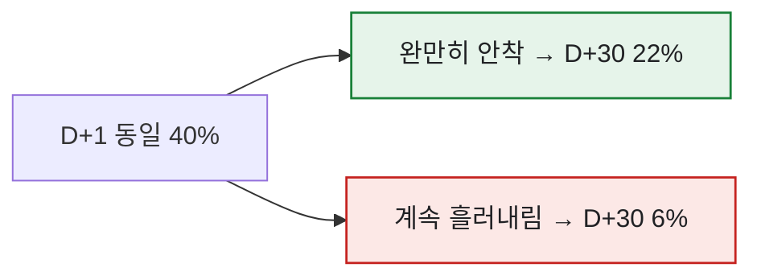
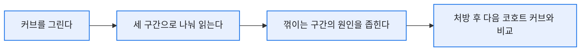

# M+1 리텐션만으로는 부족하다 — 리텐션 커브 읽는 법

> 매출 시뮬레이션을 만들 땐 M+1 리텐션(가입 다음 달 접속률)을 최근 3개월 평균으로 썼다. 예측용으론 그 한 점이면 충분했다. 그런데 어느 날, M+1이 똑같은 두 업데이트가 한 달 뒤엔 완전히 다른 매출로 벌어지는 걸 보고 정신이 들었다. 잔존은 점이 아니라 **곡선**이었다. 한 점만 찍어보고 게임의 상태를 판단하고 있었던 거다. (수치·구조는 일반화한 합성 기준이다.)

## 리텐션은 왜 '곡선'이어야 하나?

M+1(또는 D+1)은 커브의 딱 한 점이다. 같은 시작점이어도 이후 기울기가 다르면 남는 유저 수는 크게 갈린다.



D+1이 똑같이 40%여도, 하나는 '바닥을 다지며 안착'하고 다른 하나는 '멈추지 않고 흘러내린다'. 이 차이는 한 점으로는 절대 안 보인다. 매출 시뮬레이션이 예측은 해줘도 '왜 빠지는지'는 말해주지 못한 이유가 여기 있었다.

## 커브의 세 구간은 각각 뭘 말하나?

나는 리텐션 커브를 늘 세 구간으로 나눠 읽었다.

| 구간 | 무엇을 보나 | 낮/이상하면 의심할 것 |
|---|---|---|
| **초반 급락** (D+1\~D+3) | 첫인상·튜토리얼·초반 재미 | 온보딩 이탈, 진입장벽 |
| **중반 기울기** (D+7\~D+14) | 습관 형성·콘텐츠 소진 속도 | 할 게 금방 떨어짐 |
| **후반 바닥** (D+30\~) | 코어 유저의 충성도 | 장기 목표·엔드 콘텐츠 부재 |

초반은 멀쩡한데 중반부터 뚝 꺾이면, 재미없어서가 아니라 **'할 게 떨어져서'** 나가는 거다. 처방이 완전히 다르다. VOC로 "요즘 접속해도 할 게 없다"는 말이 돌면, 나는 이 중반 기울기부터 확인했다.

## 커브를 데이터로는 어떻게 그리나?

코호트별로 '가입 후 경과일(day_n)'을 축으로 접속 여부를 집계하면 된다.

```sql
SELECT
    DATEDIFF(DAY, u.join_date, l.login_date) AS day_n,
    1.0 * COUNT(DISTINCT l.user_id)
        / COUNT(DISTINCT u.user_id)          AS retention
FROM user_cohort AS u
LEFT JOIN login_log AS l
       ON l.user_id = u.user_id
WHERE u.join_week = '2026-06-01'
GROUP BY DATEDIFF(DAY, u.join_date, l.login_date)
ORDER BY day_n;
```

이 결과를 꺾은선으로 그리면 세 구간이 눈에 들어온다. 나는 여기에 **업데이트·이벤트 시점을 세로선으로** 얹어, 패치가 커브 기울기를 실제로 완만하게 만들었는지까지 봤다. 예컨대 신규 콘텐츠를 낸 날에 세로선을 긋고, 그 직후 커브의 기울기가 이전 코호트보다 완만해졌다면 "이 업데이트가 잔존에 기여했다"는 근거가 된다. 반대로 세로선 이후에도 기울기가 그대로거나 더 가팔라지면, 그 콘텐츠는 잔존 관점에서 효과가 없었다는 뜻이다.

한 가지 실무 팁. 커브는 **여러 코호트를 겹쳐** 봐야 의미가 산다. 6월 첫째 주 가입자, 둘째 주 가입자… 이렇게 주간 코호트를 같은 축에 겹쳐 그리면, 커브가 점점 위로 올라오는지(개선) 아래로 처지는지(악화)가 한눈에 보인다. 한 코호트만 보면 '원래 이런 건지' 판단이 안 서지만, 겹쳐 보면 추세가 드러난다.



## 예측과 진단은 다른 도구다

이때 명확해진 게 있다. **M+1 한 점은 '예측'용, 커브는 '진단'용**이라는 것. 매출을 추정할 땐 안정적인 M+1 평균이 좋고, 왜 이탈하는지 파고들 땐 커브가 필요했다. 둘을 같은 자리에 놓고 다투게 하면 안 되고, 목적에 맞게 갈라 써야 했다.

## 커브 모양별로 무엇을 처방했나?

세 구간을 나눠 읽으면 처방이 자동으로 달라진다. 나는 커브가 꺾이는 위치에 따라 손대는 곳을 바꿨다.

| 꺾이는 구간 | 진단 | 처방 방향 |
|---|---|---|
| 초반 급락 | 첫인상·진입장벽 | 튜토리얼·온보딩 동선 손보기 |
| 중반 기울기 | 콘텐츠 소진 속도 | 즐길 거리 공급 주기 조정 |
| 후반 바닥 | 장기 목표 부재 | 엔드 콘텐츠·시즌 목표 |

그리고 처방한 뒤엔 반드시 **다음 코호트의 커브를 이전 코호트 위에 겹쳐** 효과를 재측정했다. 이게 폐루프의 핵심이다 — 처방이 실제로 커브 기울기를 완만하게 만들었는지 숫자로 확인해야, 다음 판단이 근거를 갖는다.

실제로 콘텐츠 밸런스나 난이도를 손본 뒤 해당 구간의 이용률·잔존이 올라가는 걸 확인하면, 그 개선안이 옳았다는 증거가 됐다. 분석가의 일은 '이탈했다'를 보고하는 게 아니라, **어느 구간에 손대면 커브가 어떻게 바뀌는지**를 팀에 쥐여주는 거였다.

## 오늘의 기록

M+1 한 점만 보던 시절엔 "리텐션 유지 중"이라는 안심에 자주 속았다. 커브로 보기 시작하자 '언제, 왜' 빠지는지가 드러났고, 그때부터 처방이 구체적이 됐다. 잔존은 게임의 심전도 같은 거더라 — 평균 심박수 한 숫자가 아니라, 파형을 봐야 상태를 안다.

*실제 리텐션 분석 경험을 바탕으로 하되, 스키마·수치는 일반화한 합성 기준입니다.*
