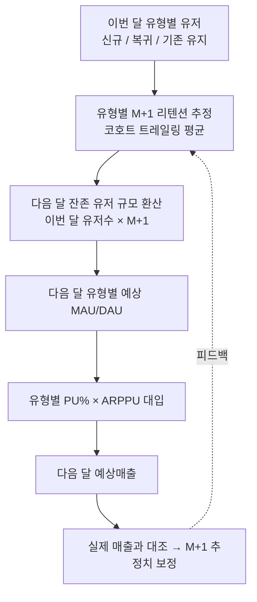
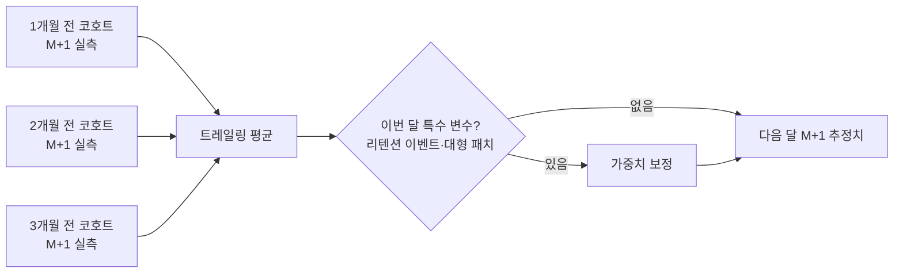
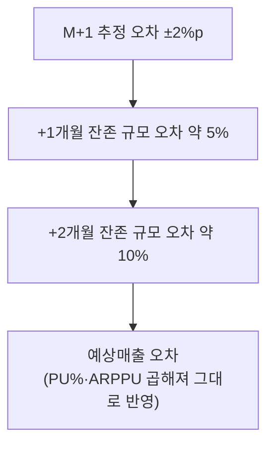

매출 시뮬레이션 모델(예상매출 = DAU(일일 활성 유저) × PU%(결제 유저 비율) × ARPPU(결제 유저 1인당 평균 결제액))을 다음 달 예측에 써보려던 때였다. DAU 자리에 뭘 넣어야 하나 막막했다. 처음엔 이번 달 DAU를 그대로 다음 달 칸에 옮겨 적었다. 당연히 틀렸다. 신규 유입이 많았던 달 다음엔 항상 과대예측이 났고, 이벤트가 끝난 달 다음엔 항상 과소예측이 났다. 한참 헤매다 깨달았다. 다음 달 DAU를 결정하는 건 이번 달 DAU 그 자체가 아니라 **이번 달 유저 중 몇 %가 다음 달까지 남는가**, 즉 Retention(M+1)이었다. 잔존율이 매출을 만든다는 말은 비유가 아니라 산식이었다.

이 글은 킹스레이드 시절 굴리던 매출 시뮬레이션 모델에서, M+1 리텐션을 어떻게 다음 달 유저 규모로 환산해 매출 예측 체인에 끼워 넣었는지 — 방법론만, 내부 스키마와 실제 금액은 빼고 — 정리한 것이다.



## 왜 이번 달 DAU를 다음 달 칸에 그대로 넣으면 틀리나?

DAU는 스냅샷이다. 오늘 접속한 사람 수일 뿐, 그 사람들이 내일도 있을지는 말해주지 않는다. 반면 매출 예측이 필요로 하는 건 스냅샷이 아니라 **미래 시점의 유저 규모**다. 이 둘 사이를 이어주는 다리가 M+1 리텐션(이번 달 유입·활동 유저가 다음 달까지 남는 비율)이다.

이번 달 DAU가 아무리 높아도, 그중 상당수가 신규 유입 스파이크나 이벤트 참여로 반짝 들어온 유저라면 다음 달엔 사라진다. 반대로 이번 달 DAU가 평범해도 M+1이 안정적으로 높은 달이라면, 다음 달 기반 유저 규모는 오히려 단단하다. **DAU는 결과고, M+1은 그 결과가 다음 달까지 이어지는 비율이다.** 이 비율을 빼고 DAU만 이어 붙이면, 예측은 이번 달의 우연을 다음 달에 그대로 복사하는 꼴이 된다.

## M+1 리텐션은 유형별로 어떻게 추정하나?

M+1을 예측에 쓰려면 먼저 다음 달 값을 **추정**해야 한다. 다음 달이 되기 전엔 실측치가 없으니, 과거 코호트(같은 시기에 유입된 유저 묶음)의 M+1 실측값을 근거로 삼는다. 나는 직전 3개 코호트의 M+1 실측치를 트레일링 평균(최근 몇 개를 이동평균 내는 방식)으로 잡고, 그달에 리텐션 이벤트나 대규모 패치처럼 예년과 다른 변수가 있으면 가중치를 보정했다.



유형별로 이 값이 완전히 다르게 움직인다는 점도 중요하다. 신규(NRU)는 온보딩 품질에 따라 M+1이 크게 출렁이고, 기존 유지 유저는 M+1이 원래 안정적으로 높으며, 복귀(RAU)는 리텐션 이벤트 설계에 따라 코호트마다 편차가 가장 크다. 그래서 트레일링 평균도 전체 유저 하나로 뭉뚱그리지 않고 유형별로 따로 돌렸다.

```sql
-- 개념 예시(합성 스키마). 실제 테이블·SP명 아님.
-- 최근 3개 코호트의 M+1 실측 리텐션을 유형별 트레일링 평균으로 추정
WITH recent_cohorts AS (
    SELECT cohort_month, user_type, retention_m1_rate
    FROM   monthly_retention_m1
    WHERE  cohort_month >= DATEADD(MONTH, -3, @target_month)
),
est AS (
    SELECT user_type, AVG(retention_m1_rate) AS m1_trailing_avg
    FROM   recent_cohorts
    GROUP  BY user_type
)
SELECT
    c.user_type,
    c.this_month_users,
    e.m1_trailing_avg,
    CAST(c.this_month_users * e.m1_trailing_avg AS INT)
        AS projected_retained_next_month
FROM   this_month_cohort c
JOIN   est e ON e.user_type = c.user_type;
```

## 리텐션 추정치를 다음 달 유저 규모·매출로 어떻게 환산하나?

이 SQL 마지막 컬럼(`projected_retained_next_month`)이 체인의 핵심 연결고리다. **이번 달 유형별 유저수 × 유형별 M+1 추정치 = 다음 달 그 유형에서 남을 유저 규모.** 이 값이 다음 달 예상 MAU(월간 활성 유저)·DAU의 기초가 되고, 여기에 각 유형의 PU%·ARPPU를 곱하면 다음 달 예상매출로 이어진다.

```
다음 달 예상매출(유형별)
  = (이번 달 유형별 유저수 × M+1 추정치)   ← 리텐션이 만드는 다음 달 규모
    × PU%(유형별)                          ← 그중 결제 전환
    × ARPPU(유형별)                        ← 결제자 1인당 객단가
```

이렇게 보면 M+1은 매출 시뮬레이션 모델의 세 변수(DAU·PU%·ARPPU) 중 하나가 아니라, **DAU 칸을 다음 달 시점으로 채워 넣는 입력값**이다. 지난 글에서 다룬 "왜 유형별로 쪼개야 하는가"가 이번 달 스냅샷의 구성비 문제였다면, 이 글의 초점은 그 스냅샷이 **다음 달로 넘어갈 때 무엇이 규모를 결정하는가**다. 신규 코호트가 아무리 커도 M+1이 낮으면 다음 달 기존 유지 풀은 작아지고, 그만큼 다음 달 매출 기반도 얇아진다.

## 리텐션 추정 오차는 왜 한 달로 끝나지 않나?

여기서 실무를 하며 가장 뒤늦게 깨달은 부분이다. M+1 추정치가 몇 %p만 틀려도, 그 오차는 다음 달 한 번으로 끝나지 않고 이후 예측에 **누적**된다. 다음 달 잔존 유저 규모 자체가 그다음 달 예측의 출발점(기존 유지 풀)이 되기 때문이다.

아래는 이 누적 효과를 보여주기 위한 가상의 숫자다(전부 가데이터, 실제 재직 시 수치와 무관 — 설명을 위해 M+2에도 동일한 리텐션율이 적용된다고 단순화했다. 실제로는 M+1과 M+2 리텐션이 같지 않지만, 오차가 누적되는 방향성 자체는 동일하다).

| 시나리오 | M+1 추정치 | +1개월 후 잔존(가데이터) | +2개월 후 잔존(가데이터) | +2개월 시점 오차율 |
|---|---|---|---|---|
| 실측치 기준 | 40% | 4,000명 | 1,600명 | — |
| 2%p 낮게 추정 | 38% | 3,800명(−5%) | 1,444명 | 약 −9.8% |
| 2%p 높게 추정 | 42% | 4,200명(+5%) | 1,764명 | 약 +10.3% |

이번 달 신규 1만 명을 기준으로, M+1 추정을 실측 대비 2%p만 틀려도 다음 달 잔존 규모는 5% 어긋난다. 그런데 이 잔존 유저 규모가 그다음 달 예측의 기초 모수가 되면서, 두 달 뒤 시점의 오차는 약 10%로 거의 두 배가 된다. 여기에 PU%·ARPPU까지 곱해지는 매출 예측 단계에서는 이 규모 오차가 그대로 매출 오차의 몸통이 된다.



그래서 나는 M+1 추정치를 "한 번 잡고 끝"이 아니라, 매달 실측치가 나오는 대로 트레일링 평균을 다시 굴리고 예측을 갱신하는 루틴으로 운영했다. 예측 지평(몇 달 앞을 볼 것인가)이 길어질수록 이 갱신 주기를 짧게 가져가야 오차가 눈덩이처럼 불지 않는다.

## 정리 — 리텐션은 성적표가 아니라 다음 달 매출의 원재료다

- M+1 리텐션은 이번 달을 평가하는 사후 지표가 아니라, **다음 달 유저 규모를 만드는 입력값**이다.
- 유형별(신규/복귀/기존)로 코호트 트레일링 평균을 잡고, 특수 변수(이벤트·패치)가 있으면 가중치를 보정한다.
- `이번 달 유형별 유저수 × M+1 추정치`가 다음 달 예상 DAU/MAU의 기초가 되고, 여기에 PU%·ARPPU를 곱하면 다음 달 예상매출로 이어진다.
- M+1 추정 오차는 한 달로 끝나지 않는다. 다음 달 잔존 규모가 그다음 달 예측의 출발점이 되면서 **오차가 누적**된다. 그래서 실측치가 나올 때마다 추정치를 다시 갱신해야 한다.

곱셈 하나로 시작한 매출 모델이 결국 "잔존율이 시간을 타고 매출로 흘러가는 체인"이라는 걸 이해하는 데까지 갔다. 다음 글에서는 이 체인에서 나온 예측치를 실측 매출과 대조해 어떤 유형·어떤 구간에서 가정이 자주 빗나갔는지, 그 오차를 다음 추정에 반영하는 보정 루프를 정리한다.

- 방법론·합성 스키마 레시피: [github.com/DBhyeong/game-data-recipes](https://github.com/DBhyeong/game-data-recipes)
