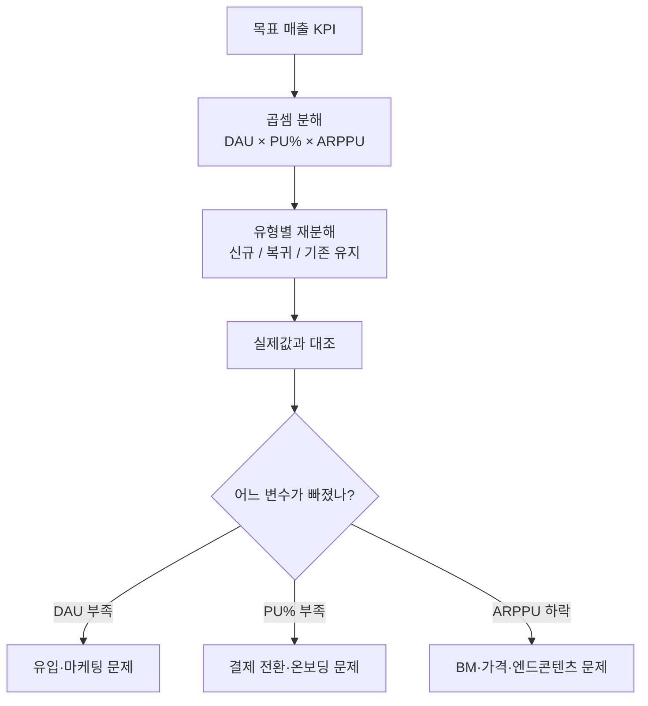
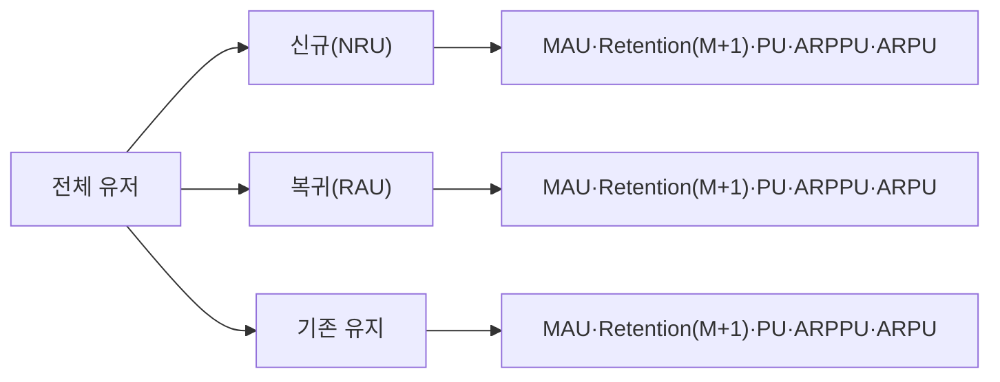

게임 매출 목표가 미달했다는 얘기를 들으면, 예전의 나는 일단 쿼리부터 열었다. DAU도 뽑아보고, 결제 로그도 훑고, 패치 노트도 다시 읽고. 그러다 반나절이 갔다. 지금은 순서가 반대다. **매출을 곱셈 구조로 먼저 분해**해두면, 어디서 빠졌는지가 30분 안에 후보 두세 개로 좁혀진다.

이 글은 드래곤네스트·킹스레이드에서 라이브 운영 지표를 만지던 시절 실제로 쓰던 매출 시뮬레이션 모델을 — 내부 스키마나 실제 금액은 빼고 — 방법론만 정리한 것이다. (포트폴리오에 들어가는 매출 표는 전부 가데이터다. 특정 금액 자체는 의미가 없다.)

먼저 전체 흐름부터 한눈에 본다.



## 매출을 왜 하나의 숫자가 아니라 곱셈으로 보나?

라이브 게임 매출은 의외로 단순한 곱셈에서 출발한다.

```
예상매출 = 예상 DAU × PU(%) × ARPPU
```

- **DAU**: 일일 활성 유저(하루에 접속한 사람 수)
- **PU(%)**: 결제 유저 비율(Paying User rate — 접속자 중 돈을 쓴 사람의 비중)
- **ARPPU**: 결제 유저 1인당 평균 결제액(Average Revenue Per Paying User)

매출을 그냥 "이번 달 얼마"라는 한 덩어리로 보면, 목표에 미달했을 때 할 수 있는 말이 "매출이 빠졌다"밖에 없다. 곱셈으로 쪼개두면 얘기가 달라진다. **세 변수 중 어느 것이 빠졌는지**를 따로 볼 수 있기 때문이다.

- DAU는 채웠는데 매출 미달 → 트래픽은 왔지만 **결제 전환(PU)** 또는 **객단가(ARPPU)** 가 문제
- PU·ARPPU는 정상인데 매출 미달 → 애초에 **유입(DAU)** 이 부족 → 마케팅·획득 문제
- DAU·PU 정상, ARPPU만 하락 → **BM·가격·패키지 구성** 문제

그래서 나는 이 모델을 예측 도구가 아니라 **진단 도구**라고 부른다. 미래 매출을 맞히는 점쟁이질이 아니라, KPI 미달이라는 증상에서 원인 장기로 들어가는 청진기에 가깝다.

## 곱셈만으로 부족할 때 — 유저 유형으로 한 번 더 쪼갠다

세 변수만 봐도 절반은 온다. 하지만 "PU가 빠졌다"까지 왔는데도 **어느 유저층에서** 빠졌는지 모르면 처방을 못 내린다. 그래서 유저를 세 유형으로 나눠 각각을 따로 집계한다.



- **신규(NRU)** 는 잘 들어오는데 **M+1 리텐션**(다음 달까지 남는 비율)이 무너진다 → 온보딩 문제
- **기존 유지층 ARPPU**가 빠진다 → 엔드콘텐츠·BM 노후화 문제
- **복귀(RAU)** 는 이벤트에 반응해 잠깐 튀었다가 다시 빠진다 → 복귀 유저를 잡아둘 콘텐츠 부재

같은 "매출 하락"이라도 신규에서 새는 것과 기존 유지층에서 새는 건 완전히 다른 문제고, 대응 부서도 다르다(획득 마케팅 vs 콘텐츠·BM 기획). 유형 분해는 그 갈림길을 만들어준다.

## 이 집계를 매일 손으로 돌려야 하나?

아니다. 이게 반복되는 일이라면 사람이 매번 쿼리를 짜는 건 낭비다. 나는 주력이 MS-SQL이었고, 이런 일간 집계는 **Stored Procedure(SP)로 묶어서 자동화**했다. 매일 아침 배치가 SP를 돌려 유형별 지표 테이블을 채워두면, 나는 "쿼리를 다시 짜는" 대신 "무엇을 볼지"에 집중할 수 있다.

```sql
-- 개념 예시(합성). 실제 스키마 아님.
-- 유형(신규/복귀/기존) 플래그별로 당일 지표를 한 번에 집계
SELECT
    user_type,                                  -- 'new' / 'return' / 'retained'
    COUNT(DISTINCT user_id)                        AS dau,
    CAST(COUNT(DISTINCT CASE WHEN pay_amt > 0 THEN user_id END) AS FLOAT)
        / NULLIF(COUNT(DISTINCT user_id), 0)       AS pu_rate,     -- PU(%)
    SUM(pay_amt)
        / NULLIF(COUNT(DISTINCT CASE WHEN pay_amt > 0 THEN user_id END), 0)
                                                   AS arppu         -- ARPPU
FROM   daily_activity
WHERE  play_date = @target_date
GROUP  BY user_type;
```

포인트는 쿼리 그 자체가 아니라 **반복은 DB에, 판단은 사람에게** 넘긴다는 원칙이다. 유형 플래그(신규/복귀/기존)와 결제 플래그만 로그에 잘 심어두면, 위 집계는 매일 자동으로 나온다.

## 그래서 산출물은 뭐가 나오나?

의사결정에 실제로 쓰이는 형태는 두 가지였다.

1. **월간 예상매출 vs 실제 누적매출 그래프** — 목표선과 실제선의 벌어지는 지점을 보면 "언제부터 새기 시작했나"가 보인다.
2. **BM 플랜별 예상매출 집계표** — "이 패키지를 이 가격에 이 유형에 붙이면 예상매출이 이렇게 바뀐다"를 시나리오로 비교. 기획이 BM을 결정할 때 근거가 된다.

여기서 강조하고 싶은 건, 표에 찍힌 **금액이 목적이 아니라는 점**이다. 금액은 가데이터여도 상관없다. 이 모델의 값어치는 "목표에서 벗어났을 때 세 변수 × 세 유형 = 아홉 칸 중 어디가 빨간불인지"를 즉시 가리키는 데 있다.

## 정리 — 매출은 곱셈으로 보면 진단이 된다

- 매출을 `DAU × PU% × ARPPU`로 분해하면, "매출이 빠졌다"가 "PU가 빠졌다"로 구체화된다.
- 거기에 **신규/복귀/기존** 유형 분해를 얹으면 "어느 층에서 빠졌나"까지 좁혀진다.
- 반복 집계는 **Stored Procedure로 자동화** — 사람은 판단에만 집중.
- 이 모델은 예측기가 아니라 **진단기**다. KPI 미달의 출처를 찾는 청진기.

AI가 쿼리도 짜주는 시대에도, "매출을 어떤 구조로 쪼개서 봐야 원인이 보이는가"라는 판단은 도메인 안에 있어 본 사람 몫이다. 다음 글에서는 이 진단에서 나온 가설(예: 신규 콘텐츠가 정말 먹혔나)을 **픽률**로 검증하는 방법을 정리한다.

- 방법론·합성 스키마 레시피: [github.com/DBhyeong/game-data-recipes](https://github.com/DBhyeong/game-data-recipes)
