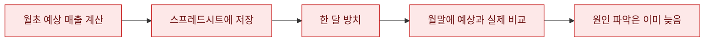
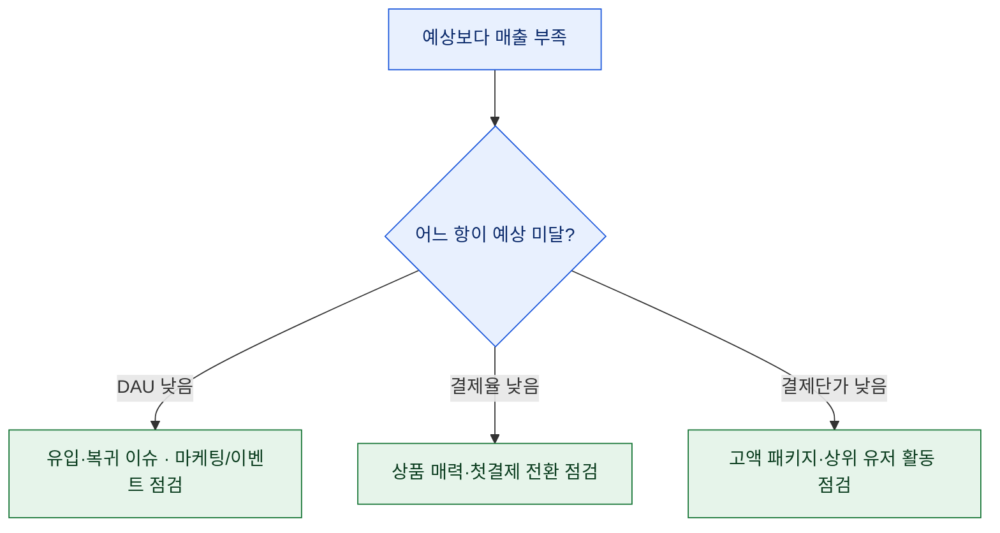
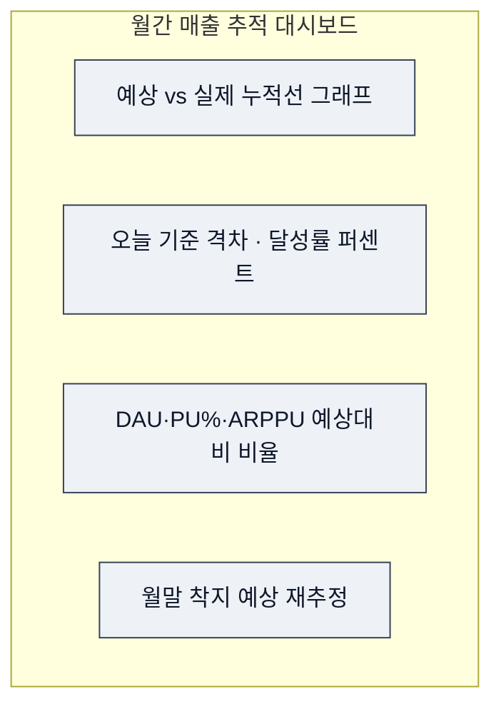

# 월간 예상 vs 실제 누적 매출 그래프

> 전에 [예상매출 = DAU × PU% × ARPPU](/blog/revenue-simulation-dau-pu-arppu) 시뮬레이션 글을 썼다. 그런데 시뮬레이션을 월초에 한 번 돌리고 덮어두면, 월말에 "예상 10억인데 8억 나왔네, 왜지?"만 남는다. 이미 늦었다. 그래서 이 예측을 **매일 갱신되는 그래프**로 바꿨다. 예상선은 고정, 실제선은 매일 자란다. 벌어지는 간격을 그날그날 원인까지 쪼갠다. 이 글은 그 대시보드를 만드는 방법이다. (숫자는 전부 합성이다.)

## 한 번 돌린 시뮬레이션은 왜 무력한가?

시뮬레이션의 값어치는 예측 자체가 아니라 **예측과 현실의 차이를 조기에 잡는 것**이다. 그런데 월초에 한 번 계산하고 스프레드시트에 박아두면, 그 차이를 월말에야 본다. 월말에 "8억"을 확인하는 건 분석이 아니라 부고장이다. 손쓸 수 있는 게 아무것도 안 남는다.



필요한 건 **누적 그래프 두 줄**이다. 월초에 그은 예상 누적선, 그리고 매일 자라는 실제 누적선. 둘 사이가 벌어지기 시작하는 날, 바로 파고든다. 일별 매출은 들쭉날쭉해서 추세가 안 보이지만, 누적으로 그으면 두 선의 간격이 매끄럽게 벌어지거나 좁아지며 방향을 또렷이 보여준다.

## 예상선은 어떻게 '고정'하나?

월초에 예측한 일별 매출을 **누적합**으로 만들어 한 번 그어두고 월중에는 건드리지 않는다. 이게 기준선(baseline)이다. 여기서 규칙 하나가 중요하다. **예상선은 절대 사후에 고치지 않는다.** "이번 달은 이벤트가 세니까 예상을 올려두자"며 월중에 기준선을 만지면, 나중에 뭘 기준으로 잘잘못을 따질지가 사라진다. 예측은 월초의 나와 월말의 현실이 벌이는 내기다. 판돈을 중간에 바꾸면 안 된다.

```python
import pandas as pd

# 합성: 월초에 예측한 일별 매출 (DAU x PU% x ARPPU 로 산출했다고 가정)
days = pd.date_range("2024-09-01", "2024-09-30", freq="D")
forecast_daily = pd.Series(3_300_000, index=days)   # 하루 예상 330만 (평탄 가정)

forecast_cum = forecast_daily.cumsum()              # 예상 누적선 = 고정 기준
```

실제선은 매일 결제 로그에서 그날 매출을 가져와 누적으로 잇는다. 여기서 실무 포인트는 **멱등성(idempotency)** 이다. 배치가 하루에 두 번 돌든, 어제 데이터를 다시 적재하든, 같은 날짜는 덮어쓰기(upsert)로 처리해야 중복 합산이 안 난다.

```python
# 합성: 매일 적재되는 실제 일별 매출 (오늘까지만 존재)
actual_daily = pd.Series(
    [3.4, 3.5, 3.1, 2.9, 2.7, 2.8, 2.6],            # 백만 원 단위, 7일치
    index=days[:7]
) * 1_000_000

actual_cum = actual_daily.cumsum()                  # 실제 누적선 = 매일 자람
gap = actual_cum - forecast_cum.loc[actual_cum.index]   # 벌어진 간격(음수면 미달)
```

## 간격이 벌어지면, 누구 탓인지 어떻게 아나?

여기가 핵심이다. 매출은 세 변수의 곱이니까, **간격도 세 변수로 분해**된다. 실제 DAU·PU%·ARPPU를 각각 예상값과 나눠 보면, 어느 항이 예상을 밑도는지 바로 드러난다. 매출이 곱셈 구조라 비율로 보는 게 편하다. 예를 들어 실제 DAU가 예상의 0.9배, 결제율이 0.95배, 단가가 1.0배라면, 매출은 대략 0.9 × 0.95 = 0.86배 — 격차의 대부분이 DAU에서 왔다는 뜻이다.



이 분해는 전에 쓴 [KPI 미달 원인 분해 트리](/blog/kpi-miss-revenue-decomposition-tree)와 같은 뼈대다. 다른 점은 **월말이 아니라 D+7에 이걸 돌린다**는 것. 아직 22일이 남았을 때 원인을 잡으면 대응할 시간이 있다. DAU가 문제면 복귀 이벤트를, 단가가 문제면 고액 패키지 노출을 그 달 안에 손볼 수 있다.

## 월말 착지는 어떻게 다시 추정하나?

간격만 보는 게 아니라 **"지금 추세면 월말에 얼마로 끝나나"**를 매일 다시 계산하면 대시보드가 완성된다. 가장 단순한 건 런레이트(run-rate) 방식 — 지금까지의 하루 평균 실제 매출을 남은 날에 그대로 곱한다.

```python
elapsed = len(actual_cum)                         # 지난 일수
run_rate = actual_cum.iloc[-1] / elapsed          # 하루 평균 실제
landing_est = actual_cum.iloc[-1] + run_rate * (len(days) - elapsed)
achieve = actual_cum.iloc[-1] / forecast_cum.loc[actual_cum.index[-1]]
print(f"오늘까지 달성률 {achieve:.0%}, 월말 착지 예상 {landing_est/1e8:.2f}억")
```

단, 런레이트는 **시즌성을 무시**한다. 주말에 매출이 뛰는 게임이라면 평일 기준 평균을 남은 주말에 곱해 과소추정하거나 그 반대가 된다. 그래서 요일 가중을 주거나, 지난달 같은 구간의 요일 패턴을 곱하는 보정을 얹으면 착지 추정이 훨씬 안정적이다.

## 대시보드는 어떤 카드로 구성했나?

거창한 BI 툴이 아니어도 된다. 네 조각이면 운영 회의에서 바로 쓴다.



- **누적선 그래프**: 두 줄이 벌어지는 순간이 알람이다.
- **달성률**: "오늘까지 예상의 몇 %"를 한 숫자로.
- **세 변수 비율**: 격차의 범인을 지목.
- **착지 재추정**: 지금 추세면 월말에 얼마로 끝날지 다시 계산.

## 그래도 조심할 것 — 대시보드가 거짓말하는 순간

몇 가지 함정이 있다. **환불 지연 반영** — 오늘 매출로 잡힌 결제가 며칠 뒤 취소되면, 과거 누적선이 소급해서 내려간다. 그래서 "확정 매출"과 "가집계 매출"을 구분해 두는 게 안전하다. **이벤트 스파이크** — 대형 업데이트 당일 매출이 튀면 런레이트가 붕 떠서 착지가 뻥튀기된다. 특이일은 표시해두고 추정에서 가중을 낮춘다. **월초 며칠의 착시** — 데이터가 3\~4일치뿐일 때 런레이트는 노이즈에 심하게 흔들린다. 그래서 나는 착지 재추정을 D+7부터 신뢰하고, 그 전엔 참고용으로만 본다.

## 정리 — 예측의 값어치는 '매일 틀리는 걸 보는 것'

| 한 번 돌린 시뮬 | 살아있는 대시보드 |
|---|---|
| 월초 예측 → 월말 비교 | 예측 고정 + 매일 실제 갱신 |
| "왜 틀렸지"를 사후에 | 격차를 D+7에 원인까지 |
| 대응할 시간 없음 | 22일 남았을 때 손씀 |
| 착지 = 월말에 확인 | 착지 = 매일 재추정 |

> 좋은 예측은 맞히는 예측이 아니라, **틀리는 순간을 가장 먼저 보여주는 예측**이더라. 예상선 한 줄을 고정해두는 것만으로 시뮬레이션이 살아난다. 대시보드는 미래를 맞히는 도구가 아니라, 어긋나는 현재를 들키게 하는 도구다.

*합성 데이터로 재현한 방법론 글입니다. 특정 게임의 실제 수치와 무관합니다.*
