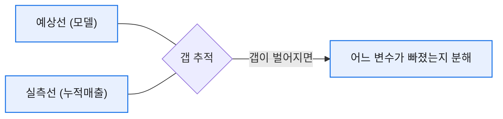

# 예상매출 = DAU × PU% × ARPPU: 매출 시뮬레이션 만들기

> 목표 KPI가 코앞인데 "이대로면 얼마 나올까요?"라는 질문을 받으면, 예전의 나는 스프레드시트를 붙잡고 한참을 헤맸다. 그러다 매출을 딱 세 변수로 쪼개 놓으니 그 질문에 **5분 안에** 답할 수 있게 됐다. 이 글은 그 세 칸짜리 모델을 합성 데이터로 복원한 기록이다.

## 매출은 왜 세 조각으로 쪼개지나?

라이브 게임 매출의 뼈대는 놀랍도록 단순하다.


```
예상매출 = 예상DAU × PU%(결제 유저 비율) × ARPPU(결제자 1인 평균매출)
```

이렇게 두면 좋은 점은, 결과가 빗나갔을 때 **어느 조각이 빗나갔는지** 바로 짚을 수 있다는 거다. 매출은 결과일 뿐이고, 손댈 수 있는 건 이 세 개의 변수다.

## 유저 유형을 왜 나눠서 예측하나?

처음엔 전체를 한 덩어리로 곱했다. 그런데 신규·복귀·기존 유저는 **결제 성향이 완전히 다르다.** 뭉뚱그리면 평균의 함정에 빠진다. 그래서 세 유형으로 나눠 각각 곱하고 합산했다.

| 유형 | 예상 DAU | PU% | ARPPU(원) | 예상매출(원) |
|---|--:|--:|--:|--:|
| 신규 | 3,000 | 2% | 15,000 | 900,000 |
| 복귀 | 1,000 | 4% | 25,000 | 1,000,000 |
| 기존 | 6,000 | 6% | 30,000 | 10,800,000 |
| **합계** | 10,000 | — | — | **12,700,000** |

같은 DAU 1만 명이어도 유형 구성에 따라 매출이 크게 달라진다는 게 표에서 바로 보인다. 기존 유저가 매출의 대부분을 짊어지고 있다는 것도.

## 파이썬으로는 어떻게 짰나?

거창할 게 없다. 유형별 가정을 딕셔너리로 두고 곱해서 더하는 게 전부였다. (전부 합성 가정값이다.)

```python
segments = {
    "신규": {"dau": 3000, "pu": 0.02, "arppu": 15000},
    "복귀": {"dau": 1000, "pu": 0.04, "arppu": 25000},
    "기존": {"dau": 6000, "pu": 0.06, "arppu": 30000},
}

def expected_revenue(segs):
    total = 0
    for name, s in segs.items():
        rev = s["dau"] * s["pu"] * s["arppu"]
        print(f"{name}: {rev:,.0f}원")
        total += rev
    return total

print(f"합계: {expected_revenue(segments):,.0f}원")
```

여기에 실제 누적 매출을 겹쳐 그리면, 월 중반에 "지금 페이스면 목표 대비 어디쯤"인지 한눈에 들어온다.



## 오늘의 기록

이 세 칸 모델의 진짜 힘은 정확한 예측이 아니라 **대화의 속도**였다. "왜 미달할 것 같냐"는 질문에 "복귀 유저 PU%가 가정보다 낮게 나오고 있어서요"라고 즉답할 수 있으면, 회의는 추궁이 아니라 대응 논의가 된다. 다음 글에선 그 갭을 어떻게 분해 트리로 5분 만에 파고드는지 적어보려 한다.

*모든 수치는 합성 가정값입니다. 실제 게임·회사 데이터와 무관합니다.*
