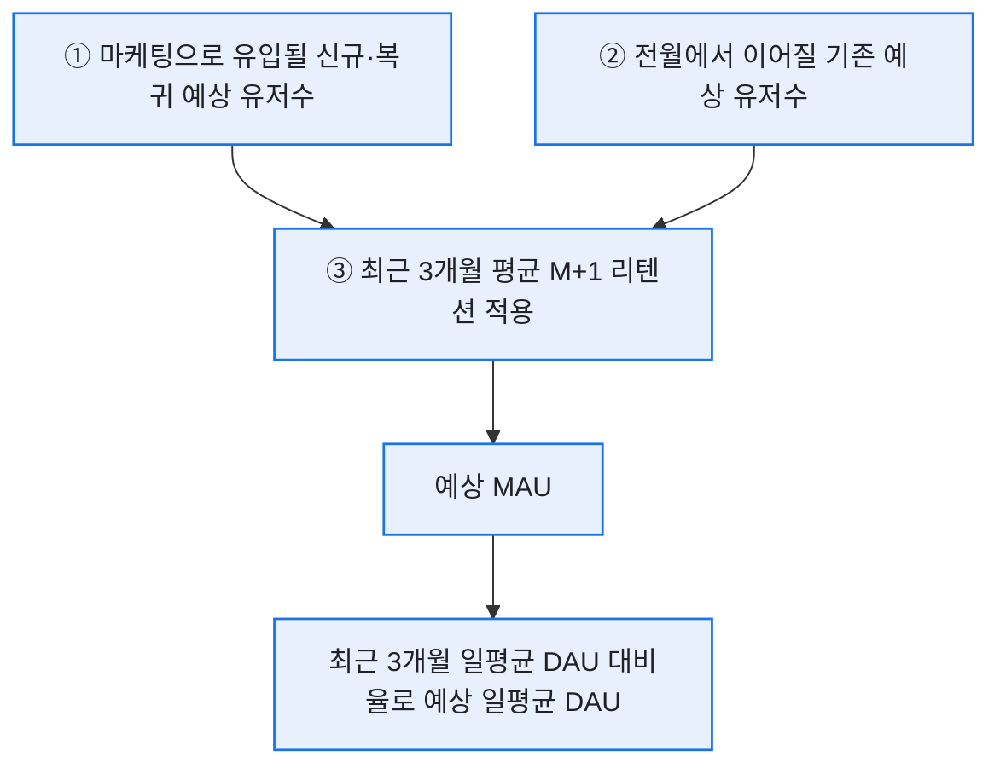
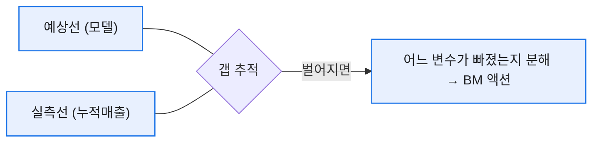
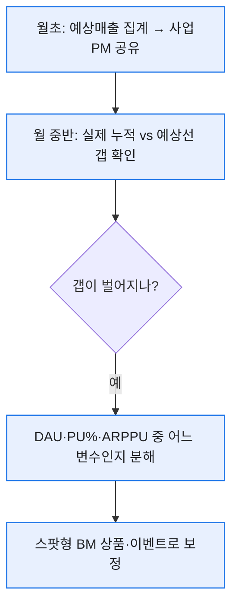

# 예상매출 = DAU × PU% × ARPPU: 매출 시뮬레이션 만들기

> 목표 KPI가 코앞인데 "이대로면 얼마 나올까요?"라는 질문을 받으면, 예전의 나는 한참을 헤맸다. 문제는 그거였다 — **미달이 확인될 때쯤엔 BM 대응 액션이 이미 늦는다.** 그래서 매출을 세 변수로 쪼갠 시뮬레이션을 만들어, 월 중반에 "지금 페이스면 미달"이라는 신호를 미리 받도록 했다. 이 글은 그 설계 과정을 일반화해 복원한 기록이다. (수치는 전부 가데이터다.)

## 매출은 왜 세 조각으로 쪼개지나?

라이브 게임 매출의 뼈대는 단순하다.


쪼개두면 결과가 빗나갔을 때 **어느 조각이 빗나갔는지** 바로 짚힌다. 매출은 결과일 뿐, 손댈 수 있는 건 이 세 변수다.

## DAU를 어떻게 '예측'했나?

여기가 이 시뮬레이션의 핵심이었다. DAU를 감으로 찍는 게 아니라, **유입과 리텐션에서 역산**했다. 실제 설계 순서는 이랬다.



- ① 마케팅 계획에서 **신규·복귀** 예상 유입을 받고,
- ② 전월에서 넘어올 **기존** 유저를 추정하고,
- ③ 거기에 **최근 3개월 평균 M+1 리텐션**을 곱해 예상 MAU를 만들고,
- 마지막에 **최근 3개월 '일평균 DAU / MAU' 비율**로 예상 일평균 DAU를 환산했다.

과거 데이터에서 뽑은 비율을 쓰니, 예측이 '희망'이 아니라 '근거'가 됐다.

## 유형을 왜 나눠서 예측하나?

처음엔 전체를 한 덩어리로 곱했다. 그런데 신규·복귀·기존은 **리텐션도 결제 성향도 완전히 다르다.** 뭉뚱그리면 평균의 함정에 빠진다. 그래서 셋을 나눠 각각 곱하고 합산했다.

| 유형 | 예상 DAU | PU% | ARPPU(원) | 예상매출(원) |
|---|--:|--:|--:|--:|
| 신규 | 3,000 | 2% | 15,000 | 900,000 |
| 복귀 | 1,000 | 4% | 25,000 | 1,000,000 |
| 기존 | 6,000 | 6% | 30,000 | 10,800,000 |
| **합계** | 10,000 | — | — | **12,700,000** |

기존 유저가 매출 대부분을 짊어진다는 게 표에서 바로 보인다.

## 파이썬으로는 어떻게 짰나?

유형별 가정을 딕셔너리로 두고 곱해 더하는 게 골격이었다.

```python
segments = {
    "신규": {"dau": 3000, "pu": 0.02, "arppu": 15000},
    "복귀": {"dau": 1000, "pu": 0.04, "arppu": 25000},
    "기존": {"dau": 6000, "pu": 0.06, "arppu": 30000},
}
def expected_revenue(segs):
    total = 0
    for name, s in segs.items():
        rev = s["dau"] * s["pu"] * s["arppu"]
        print(f"{name}: {rev:,.0f}원")
        total += rev
    return total
```

여기에 **당월 BM 플랜과 스팟형 BM 상품의 예상매출을 얹어** 사업PM에게 공유했고, 실제 누적 매출을 겹쳐 그려 월 중반에 갭을 추적했다.



## 예측이 빗나갈 때 어떻게 대응했나?

시뮬레이션은 맞히려고 만든 게 아니라, **빗나감을 빨리 알아채려고** 만든 거였다. 그래서 매달 같은 루틴을 돌렸다.



핵심은 **월말이 아니라 월 중반에** 갭을 본 것이다. 그래야 당월 안에 손을 쓸 수 있으니까. 갭이 벌어지면 세 변수 중 어디가 가정과 다른지 분해했고, 부족분은 목표 KPI 기반의 **당월 BM 플랜과 스팟형(단발) BM 상품의 예상매출**로 메꾸는 방안을 사업PM과 논의했다.

이게 원래 이 시뮬레이션을 만든 이유였다. 예전엔 목표 미달이 **확정된 뒤에야** BM 대응이 나가서 늘 한 박자 늦었다. 시뮬레이션은 그 대응을 월초·월중으로 당겨줬다. 예측의 가치는 정확도가 아니라 **의사결정을 앞당기는 시간**에 있었다.

## 오늘의 기록

이 세 칸 모델의 진짜 힘은 정확한 예측이 아니라 **대응의 속도**였다. "왜 미달할 것 같냐"에 "복귀 유저 PU%가 가정보다 낮게 나오고 있어서요"라고 즉답할 수 있으면, 회의는 추궁이 아니라 대응 논의가 된다. 다음 글에선 그 갭을 5분 만에 분해 트리로 파고드는 법을 적어보려 한다.

*실제 매출 시뮬레이션 설계 경험을 바탕으로 하되, 모든 수치는 가데이터이고 게임명·내부 구조는 일반화했습니다.*
