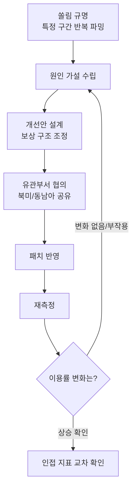
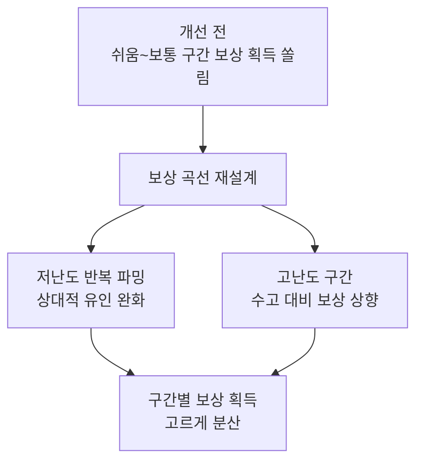
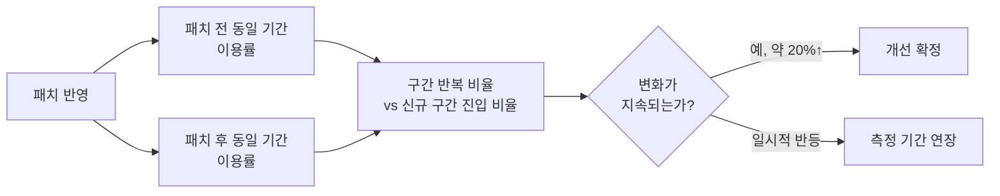

"쏠림을 규명했다"까지는 절반이었다. 예전엔 이걸 몰랐다. 한 라이브 프로젝트의 던전 콘텐츠에서 특정 난이도 구간(쉬움\~보통, 특정 층수 대역)에 보상 획득이 몰려 있다는 걸 도수분포로 잡아냈을 때, 나는 그 그래프를 보고서에 붙이고 나름 뿌듯해했다. 그런데 기획 회의에서 돌아온 질문은 하나였다. "그래서 뭘 바꾸면 되는데?" 그 순간 깨달았다. 분석가의 일은 쏠림을 **보여주는 것**에서 끝나지 않는다. 원인을 좁혀 개선안을 설계하고, 바꾼 다음 다시 숫자로 확인하는 루프까지 끝까지 따라가야 진짜 성과가 된다. 이 글은 그 뒷단 — 규명 이후의 개선과 재검증 — 을 정리한다. (쏠림을 어떻게 잡아냈는지 자체는 다른 글에서 다뤘다.)

전체 흐름부터 본다.

여기서 눈여겨볼 지점은 화살표 하나다. **재측정 결과가 기대와 다르면 다시 가설 수립으로 돌아간다.** 개선안이 한 번에 맞아떨어진다고 생각하면 오산이다.

## 쏠림이 보인다고 바로 보상을 바꿔도 될까?

바로 바꾸면 안 된다. 쏠림 자체는 "어디가 붐비는가"만 말해줄 뿐 "왜 붐비는가"는 말해주지 않는다. 쉬움\~보통 난이도 구간이 반복되고 있다는 사실 하나만 놓고 보면 가설이 두 갈래로 갈린다. 하나는 "이 구간 보상이 과하게 후하다"는 가설이고, 다른 하나는 "그 위 구간부터 보상이 노력 대비 너무 박하다"는 가설이다. 처방이 정반대라서, 이 둘을 구분하지 않고 움직이면 엉뚱한 곳을 손대게 된다.

가설을 좁힌 건 다른 지표 하나를 겹쳐 본 덕분이었다. 같은 던전에서 **솔플(혼자 플레이) 선호도가 약 73%**로 나왔다. 이 던전은 원래 파티 플레이를 전제로 설계돼 있었다. 그런데 유저 대다수가 파티를 짜지 않고 혼자 도는 낮은 구간에만 머물러 있다는 건, "저층 보상이 과하다"보다 "고층으로 올라가는 데 드는 추가 수고(파티 매칭·난이도 상승)를 보상이 상쇄하지 못한다"는 쪽에 무게가 실린다는 뜻이었다. 쏠림 하나만으로는 못 내리는 판단을, 쏠림과 플레이 형태를 겹쳐서야 내린 셈이다.

## 개선안은 뭘 기준으로 설계했나?

기준은 하나였다. **구간을 올라갈수록 늘어나는 수고(난이도·파티 구성 부담)에 보상이 비례해서 따라가게 만드는 것.** 저난도 반복 파밍의 상대적 매력은 낮추고, 고난도 구간의 보상은 수고 대비 매력이 분명히 느껴지도록 끌어올리는 방향으로 커브를 다시 짰다.

여기서 실무적으로 까다로웠던 건 설계 자체보다 **협의 범위**였다. 이 분석은 한국에서 시작했지만, 같은 던전이 북미·동남아 리전에도 동일하게 돌아가고 있었다. 그래서 개선안을 패치에 반영하기 전에 해외 유관부서와 데이터를 공유하고 방향에 합의하는 과정이 필요했다. 리전마다 유저 성향이 다를 수 있어서, "한국에서 쏠렸으니 전 리전이 다 그렇다"고 단정하지 않고 같은 기준으로 각 리전 데이터를 먼저 확인한 뒤 패치 반영에 들어갔다.

## 구조를 바꾼 다음엔 어떻게 검증했나?

패치가 나갔다고 끝난 게 아니다. 처음엔 패치 다음 날 반짝 오른 숫자만 보고 좋아했다가, 일주일 치 평균으로 다시 보니 그 반짝임이 이벤트 여파였다는 걸 깨닫고 다시 기간을 늘려 잡은 적이 있다. 그 뒤로는 항상 **패치 전후를 같은 길이의 기간으로 맞춰** 비교하는 걸 원칙으로 삼았다.

재측정에 쓴 건 진단 때와 같은 일간 자동 집계 배치였다. 매번 손으로 쿼리를 새로 짜지 않고 같은 파이프라인으로 전후를 같은 잣대로 비교할 수 있었던 게 컸다. 그렇게 지속된 변화로 확인된 수치가 **컨텐츠 이용률 약 20% 상승**이었다.

## 이용률이 올랐다고 끝인가?

아니다. 이용률 하나만 보고 성공을 선언하면 이전 글에서 지적한 "픽률만 보고 성공이라 말하는" 함정과 똑같은 실수를 반복하는 셈이다. 그래서 이용률이 오른 뒤에도 인접 지표를 같이 확인했다. 고난도 구간 보상을 올린 게 특정 유저층에만 과도하게 유리해지지 않았는지, 파티 구성 비율이 실제로 늘었는지(솔플 쏠림이 완화됐는지), 보상 곡선 변경이 다른 콘텐츠의 참여를 갉아먹지는 않았는지를 나란히 확인하고서야 "개선이 됐다"고 정리했다.

- 쏠림 **규명**과 쏠림 **개선**은 다른 작업이다. 규명은 "어디"를, 개선은 "왜"와 "어떻게"를 요구한다.
- 원인 가설은 쏠림 지표 **하나**가 아니라 플레이 형태 같은 **다른 지표와 겹쳐서** 좁힌다.
- 개선안은 "수고 대비 보상이 구간마다 비례하는가"를 기준으로 설계했다.
- 재측정은 **같은 길이의 전후 기간**으로 비교해야 반짝 상승과 실제 개선을 구분할 수 있다.
- 이용률 상승 확인 뒤에도 **인접 지표**를 같이 봐야 진짜 개선인지 알 수 있다.

규명에서 멈추지 않고 개선안 설계 → 협의 → 재측정까지 따라가야 "이용률 20%"라는 숫자가 나온다는 걸 이 케이스에서 배웠다. 다음 글에서는 이 재측정 루프를 한 번의 패치가 아니라 지속적인 조기경보 체계로 만드는 방법을 정리해본다.

- 방법론·합성 스키마 레시피: [github.com/DBhyeong/game-data-recipes](https://github.com/DBhyeong/game-data-recipes)
