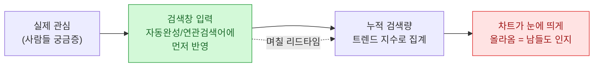
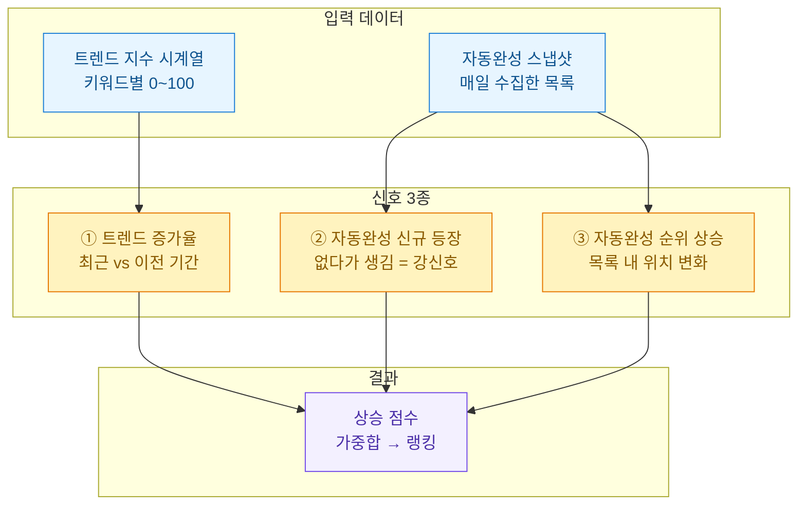
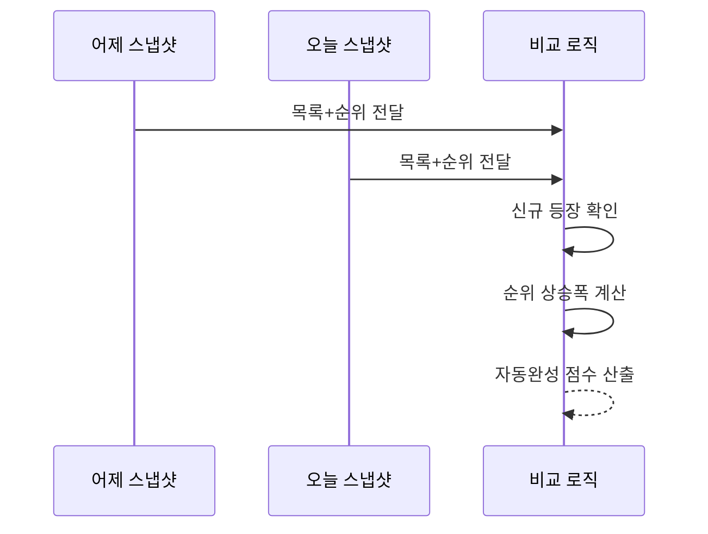
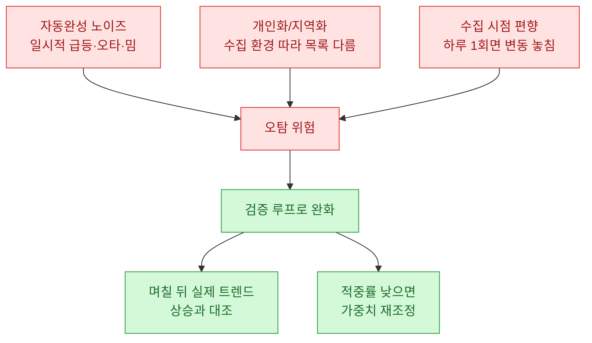
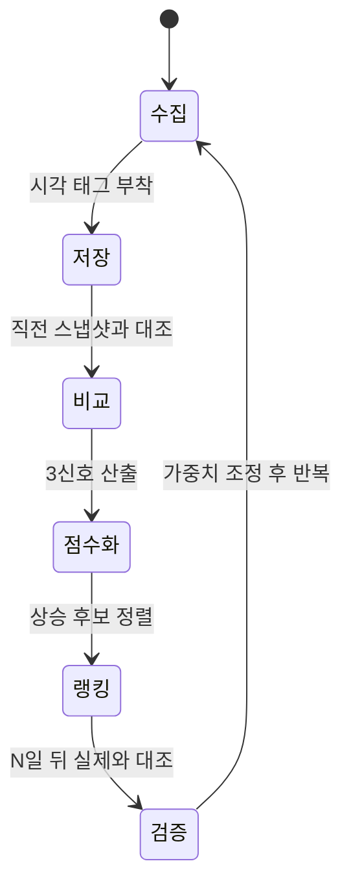

키워드 하나가 뜨고 나면, 그 키워드로 뭔가 하기엔 이미 늦은 경우가 많다. 검색량 그래프가 눈에 띄게 꺾여 올라올 즈음이면 남들도 다 보고 있다. 그래서 나는 늘 "이게 오르기 **전에** 알 수 없을까"를 궁금해했다. 이 글은 트렌드 지수 하나만 보던 습관을 버리고, 자동완성(연관검색어)의 움직임을 신호로 합쳐서 상승 키워드를 조금 더 일찍 잡아보려 한 기록이다.

> 참고: 이 글에 나오는 키워드·수치·표는 전부 **합성(더미) 데이터**다. 실제 서비스 데이터나 계정은 등장하지 않는다.

## 왜 트렌드 지수 하나만 보면 늦을까?

트렌드 지수는 "이미 검색이 일어난 결과"다. 사람들이 충분히 많이 검색해서 그래프가 올라온 뒤에야 숫자가 커진다. 즉 후행 지표다. 반면 자동완성 목록은 검색창이 "요즘 이 조합이 늘고 있어요"라고 먼저 보여주는 쪽에 가깝다. 어떤 단어가 자동완성에 **새로 등장**하거나 순위가 빠르게 올라오면, 트렌드 지수가 반응하기 며칠 전인 경우가 있다.



핵심은 저 점선, **리드타임**이다. 자동완성 변화와 트렌드 지수 상승 사이의 시차를 신호로 바꾸는 게 이 글의 목표다.

## 두 데이터를 어떻게 하나의 신호로 합치나?

가진 재료는 두 가지다. 하나는 시간에 따른 트렌드 지수(0\~100 정규화 값), 다른 하나는 매일 수집한 자동완성 목록이다. 이 둘을 각각 점수로 만든 뒤 가중합한다.



세 신호의 성격이 다르다는 점이 중요하다. ①은 "이미 오르는 중"을 확인하는 후행 신호, ②·③은 "곧 오를 것 같다"는 선행 신호에 가깝다. 그래서 선행 신호에 가중치를 더 준다.

## 트렌드 증가율은 어떻게 계산하나?

가장 단순한 방법은 최근 구간 평균을 이전 구간 평균으로 나누는 것이다. 절대값이 아니라 **비율**로 봐야 낮은 검색량에서 시작한 키워드도 잡힌다.

```python
# 합성(더미) 트렌드 지수 데이터 — 실제 데이터 아님
import pandas as pd

# 키워드별 최근 14일 트렌드 지수(0~100)
raw = {
    "키워드알파": [12, 11, 13, 12, 14, 13, 15,  18, 22, 27, 31, 40, 46, 55],
    "키워드베타": [70, 72, 69, 71, 70, 73, 71,  72, 70, 71, 69, 72, 70, 71],
    "키워드감마": [ 3,  2,  4,  3,  5,  4,  6,   5,  7,  6,  9, 11, 14, 20],
}
df = pd.DataFrame(raw)

def growth_ratio(series, window=7):
    recent = series[-window:].mean()
    prev = series[-2*window:-window].mean()
    return recent / prev if prev else float("inf")

for k in df.columns:
    print(f"{k}: 증가율 {growth_ratio(df[k]):.2f}배")
```

출력(합성):

```
키워드알파: 증가율 2.72배
키워드베타: 증가율 1.00배
키워드감마: 증가율 2.35배
```

베타는 검색량 자체는 크지만 평평하다. 알파·감마는 절대값이 작아도 가파르게 오른다. 절대값만 봤다면 베타를 골랐겠지만, 우리가 원하는 건 "지금 뜨는 중"이라서 알파·감마가 후보가 된다.

## 자동완성의 '변화'는 어떻게 점수로 바꾸나?

자동완성은 목록 스냅샷을 매일 저장해두고 **어제와 오늘을 비교**하는 게 전부다. 새로 등장했는지, 순위가 올라왔는지 두 가지를 본다.



```python
# 합성(더미) 자동완성 스냅샷 — 순위 낮을수록 상위
yesterday = {"조합A": 1, "조합B": 2, "조합C": 3, "조합D": 4}
today     = {"조합A": 1, "조합E": 2, "조합B": 4, "조합C": 3}

def suggest_score(y, t):
    scores = {}
    for term, rank_t in t.items():
        if term not in y:
            scores[term] = 10.0            # 신규 등장 = 강한 신호
        else:
            rise = y[term] - rank_t         # 양수면 순위 상승
            scores[term] = max(rise, 0) * 2.0
    return scores

for term, sc in sorted(suggest_score(yesterday, today).items(),
                       key=lambda x: -x[1]):
    print(f"{term}: 자동완성 점수 {sc:.1f}")
```

출력(합성):

```
조합E: 자동완성 점수 10.0
조합A: 자동완성 점수 0.0
조합B: 자동완성 점수 0.0
조합C: 자동완성 점수 0.0
```

어제 없던 "조합E"가 오늘 2위로 등장했다. 이게 내가 가장 눈여겨보는 순간이다. 트렌드 지수엔 아직 티도 안 나지만, 검색창은 이미 알고 있다.

## 세 신호를 어떻게 하나의 랭킹으로 묶나?

각 신호를 0\~1 사이로 정규화한 뒤 가중합한다. 선행 신호(신규 등장·순위 상승)에 무게를 더 준다. 가중치는 정답이 없어서, 나중에 실제 상승과 얼마나 맞았는지 보고 조정한다.

| 신호 | 성격 | 예시 가중치 | 이유 |
|---|---|---|---|
| 트렌드 증가율 | 후행 | 0.3 | 확인용, 이미 오르는 중 |
| 자동완성 신규 등장 | 선행 | 0.4 | 가장 이른 신호 |
| 자동완성 순위 상승 | 선행 | 0.3 | 관심 가속 신호 |

```python
def minmax(d):
    vals = list(d.values())
    lo, hi = min(vals), max(vals)
    if hi == lo:
        return {k: 0.0 for k in d}
    return {k: (v - lo) / (hi - lo) for k, v in d.items()}

def rising_score(trend_growth, new_appear, rank_rise,
                 w=(0.3, 0.4, 0.3)):
    g, n, r = minmax(trend_growth), minmax(new_appear), minmax(rank_rise)
    keys = set(g) | set(n) | set(r)
    out = {}
    for k in keys:
        out[k] = (w[0]*g.get(k, 0) + w[1]*n.get(k, 0) + w[2]*r.get(k, 0))
    return dict(sorted(out.items(), key=lambda x: -x[1]))

# 합성(더미) 입력
trend_growth = {"키워드알파": 2.72, "키워드감마": 2.35, "키워드베타": 1.00}
new_appear   = {"키워드알파": 0.0,  "키워드감마": 1.0,  "키워드베타": 0.0}
rank_rise    = {"키워드알파": 3.0,  "키워드감마": 1.0,  "키워드베타": 0.0}

for k, sc in rising_score(trend_growth, new_appear, rank_rise).items():
    print(f"{k}: 상승점수 {sc:.3f}")
```

출력(합성):

```
키워드감마: 상승점수 0.700
키워드알파: 상승점수 0.600
키워드베타: 상승점수 0.000
```

흥미로운 지점. 트렌드 증가율만 보면 알파가 1등이지만, 자동완성에 새로 등장한 감마가 종합 1등으로 올라온다. 이게 바로 "지수만 봤다면 못 봤을 후보"를 끌어올리는 대목이다.

## 이 신호를 믿어도 될까 — 함정과 검증

선행 신호는 매력적인 만큼 오탐도 많다. 몇 가지 함정을 정리해둔다.



가장 현실적인 검증은 이렇게 한다. 오늘 상승 후보로 뽑은 키워드를 기록해두고, N일 뒤 실제 트렌드 지수가 정말 올랐는지 대조한다. "예측했는데 맞았다 / 예측했는데 안 올랐다 / 예측 못 했는데 올랐다"를 세어 적중률과 놓침율을 계산하면, 가중치를 감으로가 아니라 숫자로 조정할 수 있다.

```python
# 합성(더미) 검증 — 후보 vs 며칠 뒤 실제 상승 여부
predicted = {"키워드감마", "키워드알파"}          # 오늘 뽑은 후보
actually_rose = {"키워드감마", "키워드델타"}       # N일 뒤 실제 상승

hit = predicted & actually_rose
missed = actually_rose - predicted
false_alarm = predicted - actually_rose

precision = len(hit) / len(predicted) if predicted else 0
recall = len(hit) / len(actually_rose) if actually_rose else 0
print(f"적중(precision): {precision:.2f}, 포착(recall): {recall:.2f}")
print(f"놓친 상승: {missed}, 헛발질: {false_alarm}")
```

출력(합성):

```
적중(precision): 0.50, 포착(recall): 0.50
놓친 상승: {'키워드델타'}, 헛발질: {'키워드알파'}
```

숫자가 나오면 대화가 달라진다. "감으로 좋아 보여요"가 아니라 "이 설정에서 적중률 50퍼센트, 델타 같은 무자동완성 급등은 못 잡는다"처럼 한계를 명시할 수 있다.

## 수집은 어떤 주기로 돌리나?

신호가 시차 기반이라 **수집 주기**가 곧 해상도다. 하루 한 번이면 하루보다 짧은 급등은 통째로 놓친다. 반대로 너무 자주 긁으면 서버 부담·차단 위험이 커진다. 나는 자동완성은 하루 2\~3회, 트렌드 지수는 하루 1회 정도로 타협했다. 수집기는 어느 도구를 쓰든 원리는 같다. 매 스냅샷에 **수집 시각**을 반드시 함께 저장해두는 것, 그래야 나중에 시차를 계산할 수 있다.



## 정리

- 트렌드 지수는 후행 지표다. 그것만 보면 남들과 같은 타이밍에 움직인다.
- 자동완성의 **신규 등장·순위 상승**은 선행 신호라, 트렌드 지수가 반응하기 전 리드타임을 준다.
- 세 신호를 정규화·가중합해 상승 점수로 랭킹하고, 며칠 뒤 실제 상승과 대조하는 **검증 루프**로 가중치를 숫자 기반으로 조정한다.

신호는 마법이 아니라 시차를 돈으로 바꾸는 장치일 뿐이다. 오탐을 인정하고 검증 루프를 붙이는 순간부터 쓸 만해진다. (본문의 모든 데이터는 합성 더미다.)
