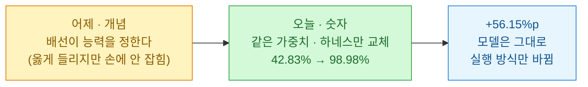
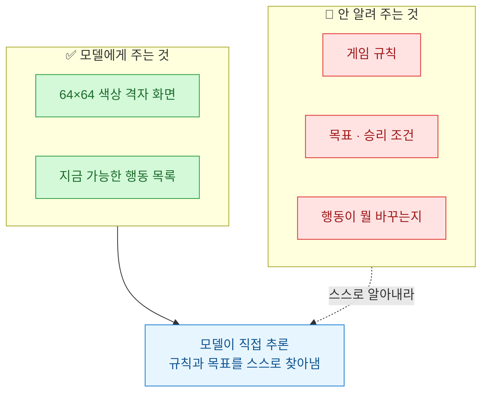
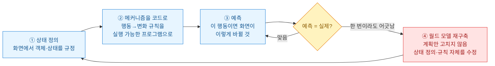
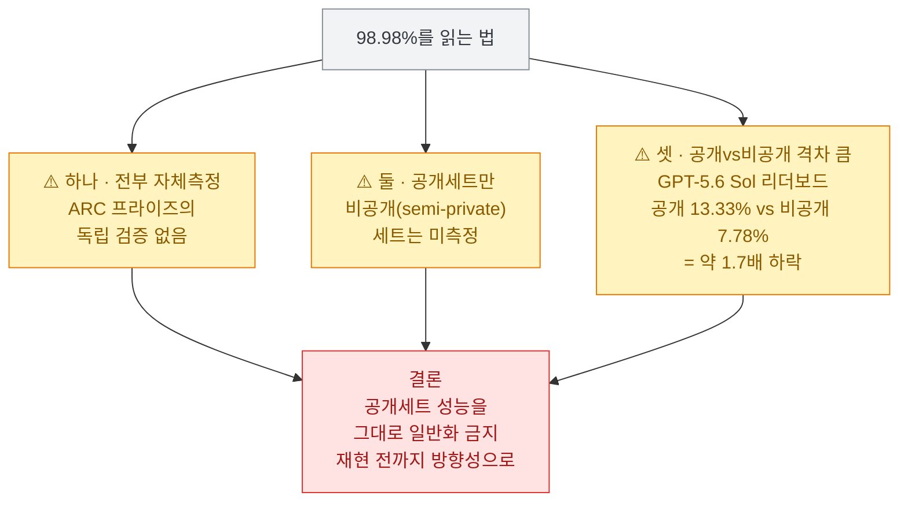

어제 나는 하네스(harness. 모델을 에이전트로 만드는 껍데기 전부)라는 단어를 두 번 썼다. [[anthropic-embody-benchmark-llm-robot-control|Embody 벤치마크 글]]에서는 "능력은 모델이 아니라 접근 수준의 함수"라고 정리했고, [[ai-coding-dictionary-matt-pocock|AI Coding Dictionary 글]]에서는 하네스를 "모델을 에이전트로 만드는 껍데기 전부"라는 정의로 배웠다. 둘 다 **개념**이었다. 배선이 능력을 정한다는 말은 옳게 들렸지만, 얼마나 정하는지는 손에 잡히지 않았다.

그런데 오늘(현지 기준 2026-07-16) 임파서블 리서치(Impossible Research)가 '스키마(Schema)'라는 에이전트 실행 프레임워크를 공개하면서 **그 개념에 숫자가 붙었다.** 같은 모델을, 가중치는 한 글자도 안 건드리고, 하네스만 바꿨더니 42.83%가 98.98%가 됐다는 것이다(전부 자체 측정, 뒤에서 단서를 단다).

## 스키마는 대체 뭘 측정한 건가?

무대는 **ARC-AGI-3**다. 이건 규칙을 안 알려 주는 추론 벤치마크다. 모델에게 64×64 색상 격자 화면과 "지금 누를 수 있는 행동 목록"만 준다. 목표가 뭔지, 규칙이 뭔지는 **한 글자도 안 알려 준다.** 사람으로 치면 설명서 없이 처음 보는 아케이드 게임 앞에 앉혀 놓고 "알아서 클리어해 봐"라고 하는 셈이다. 스스로 규칙을 추론(inference)해야 한다는 게 이 벤치마크의 전부다.

얼마나 어렵냐면, 2026년 3월 공개 당시 최고 기록이 **0.51%**였다. 사실상 아무도 못 풀던 판이다.

여기에 스키마 하네스로 **클로드 오퍼스 4.8 + 페이블 5(Fable 5)** 조합을 붙여 공개세트 25개 게임을 돌렸더니 **RHAE \~99%**가 나왔다고 한다. RHAE(Relative Human Action Efficiency, 인간 첫 풀이 대비 행동효율)는 "사람이 처음 이 게임을 풀 때 쓴 행동 수 대비, 에이전트가 얼마나 군더더기 없이 풀었나"를 재는 지표다. 기사 기준 정확히는 **98.98%**, GPT-5.6 Sol 조합은 **95.35%**였다.

## 같은 모델인데 왜 42.83%가 98.98%가 됐나?

이 글을 쓰게 만든 한 줄이 이거다. **모델 가중치는 동일했다.** 똑같은 오퍼스 4.8 + 페이블 5를 일반 '클로드 코드' 환경에서 그대로 돌리면 **42.83%**였는데, 스키마 하네스에 얹으니 **98.98%**가 됐다. 차이가 **+56.15%p**. 모델을 더 크게 만든 것도, 더 훈련시킨 것도 아니고, **실행 방식만** 바꾼 결과다.

| 조건 | 모델 | RHAE (공개세트, 자체측정) |
|---|---|---|
| 일반 클로드 코드 | Opus 4.8 + Fable 5 | **42.83%** |
| **스키마 하네스** | Opus 4.8 + Fable 5 (동일) | **98.98%** |
| 스키마 하네스 | GPT-5.6 Sol | 95.35% |
| (참고) 2026-03 공개 당시 최고 | — | 0.51% |

어제 Embody 글에서 내가 옮긴 문장이 다시 떠올랐다 — "모델을 홀로 떼어 놓고 측정한 능력 평가는, 그 모델이 스택에 심어졌을 때 무엇을 할 수 있는지를 과소평가한다." 로봇 팔에 사전 학습 제어기를 붙이자 무능이 유능으로 바뀌던 그 그림이, 여기선 추론 벤치마크에서 **56%p라는 숫자**로 반복됐다. 배선이 능력을 정한다는 말의 **크기**를 오늘 처음 봤다.

## '물리학자처럼 생각한다'는 게 무슨 뜻인가?

그럼 스키마가 배선으로 정확히 뭘 한 건가. 저자들이 든 비유가 '물리학자의 사고방식(physicist's mindset)'이다. 논문 제목부터 「실행 가능한 월드 모델(Executable World Models for ARC-AGI-3 in the Era of Coding Agents, arxiv:2605.05138)」이다.

핵심은 두 가지를 **동시에** 한다는 것이다. 하나는 상태 표현(state grounding) — 화면에서 객체와 상태를 정의한다("이 파란 칸이 플레이어, 저 회색 벽은 못 지나감"). 다른 하나는 메커니즘 발견(mechanism discovery) — 행동에 따라 그 상태가 어떻게 바뀌는지의 규칙을, 말이 아니라 **실행 가능한 프로그램**으로 적는다. 그리고 그 프로그램으로 다음 화면을 예측한다.

내가 오래 들여다본 건 ④번이다. 보통의 에이전트는 예측이 빗나가면 **계획**을 고친다("아 그럼 다른 길로 가 보자"). 스키마는 다르다. 예측이 실제와 **한 번이라도** 어긋나면, 계획이 아니라 **세계를 보는 방식 자체** — 상태 정의와 규칙 — 를 수정해 새 월드 모델을 세운다. 저자들이 아인슈타인 특수상대성을 끌어온 이유가 여기다. 관측이 안 맞으면 법칙 한 줄을 보완하는 게 아니라, **시공간이라는 상태 정의 자체를 바꾼** 것과 같은 태도다.

나는 이게 어제 사전에서 배운 '1차 자료로 돌아갈 경로'의 극단적 실천처럼 읽혔다. 요약(계획)이 틀리면 요약을 손보는 게 아니라 **원본(세계의 정의)으로 내려가 다시 짠다.** 하네스가 하는 일이 결국 이런 규율을 모델 바깥에서 강제하는 거였다.

## 이 숫자를 어디까지 믿어야 하나?

여기서 정신을 차려야 한다. 위 숫자들은 하나같이 **화려하지만**, 그대로 일반화하면 안 되는 단서가 셋이나 붙는다.

특히 셋째가 무겁다. 같은 리더보드에서 GPT-5.6 Sol이 **공개세트 13.33%인데 비공개(semi-private)세트는 7.78%**였다. 약 1.7배 떨어진다. 공개세트는 손볼 여지가 있는 판이라는 뜻이고, 그렇다면 스키마의 98.98%도 비공개에서 그대로 나오리라는 보장이 없다. 그런데 스키마는 애초에 **비공개세트를 측정하지 않았다.** 자체측정 + 공개세트만 + 공개/비공개 격차 큼 — 이 셋이 겹치면, 이 숫자는 '증명'이 아니라 '**주장**'으로 읽는 게 맞다.

출처도 밝혀 둔다. 발표는 schema-harness.github.io와 arxiv:2605.05138, 나발(Naval)과 헤이븐 펭(Haven Feng)이 X에 소개했고 해커뉴스에도 올라왔다. 나는 벤더(임파서블 리서치)의 자기 발표라는 점을 계속 염두에 뒀다. 어제 Embody가 앤스로픽의 자체 벤치마크였던 것과 같은 자세로 읽는다. (투자·재무 판단과 무관한 기술 메모다.)

## 어제는 개념, 오늘은 숫자 — 내가 챙긴 것

- **배선의 크기를 숫자로 봤다.** 어제까지 "하네스가 중요하다"는 내겐 정성적 믿음이었다. 오늘 +56.15%p를 보고 나니, 에이전트가 뭘 못할 때 모델부터 바꾸던 습관을 더 세게 의심하게 된다. 같은 모델도 하네스에 따라 42%와 99% 사이 어딘가다. **"이 모델은 X를 못한다"는 문장은 하네스를 명시하지 않으면 여전히 불완전하다.**
- **당장 내 작업에 옮길 것.** 스키마의 핵심 규율 — 예측이 어긋나면 계획이 아니라 상태 정의를 고친다 — 은 하네스 없이도 흉내 낼 수 있다. 내 크롤러·파이프라인이 자꾸 틀리면, 이번엔 재시도 로직(계획)을 붙이기 전에 **내가 세운 데이터 모델(상태 정의) 자체가 틀린 건 아닌지**부터 물어야겠다. [[youth-search-korean-youth-policy-crawler-skill|"파싱 0건이면 사이트가 아니라 내 파서를 의심하라"]]와 정확히 같은 교훈의 상위 버전이다.
- **숫자에 붙은 단서는 숫자만큼 중요하다.** 98.98%는 헤드라인이지만, 비공개세트 미측정과 1.7배 격차는 각주가 아니라 본문이다. 화려한 자체측정일수록 재현 전까지 방향성으로만 읽는다. 이게 오늘도 안 바뀐 원칙이다.

어제는 하네스가 개념이었는데 오늘은 숫자가 됐다. 다만 그 숫자에 붙은 단서까지 함께 적어 두는 게, 내가 이 스트림을 정리하는 방식이다.
