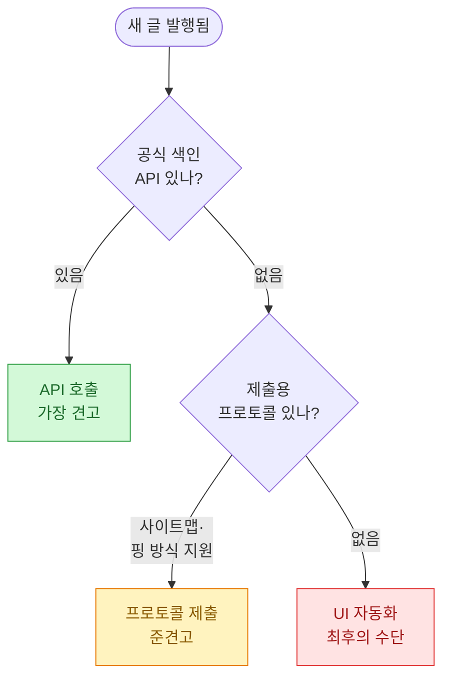
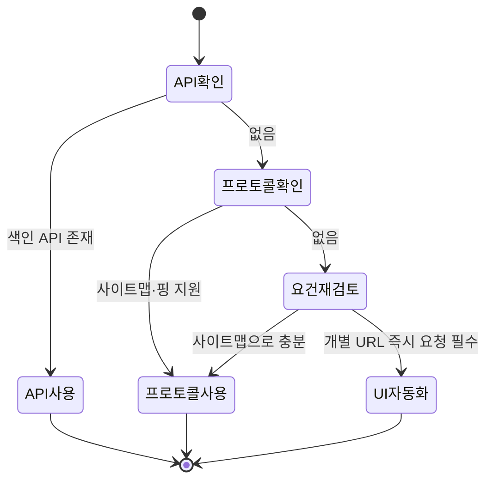
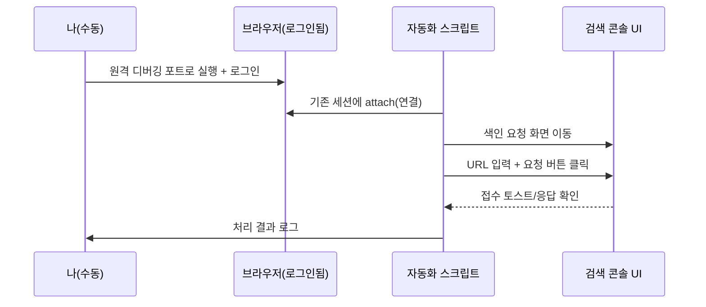
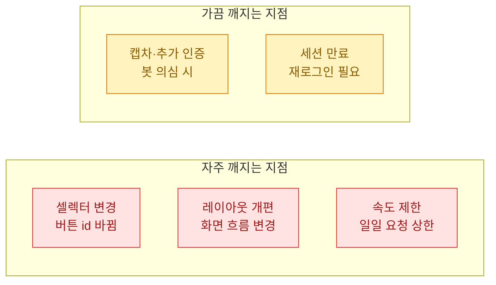
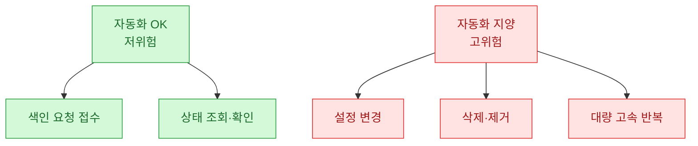

새 글을 발행하고 나면 늘 같은 초조함이 있다. "이거 언제 검색에 뜨지?" 사이트맵만 던져두고 기다리면 며칠이 걸리기도 한다. 그래서 색인 요청을 자동으로 넣고 싶었는데, 내가 쓰는 검색 콘솔에는 그 동작을 대신 호출할 **공식 API(official API)**가 없었다. 결국 사람이 버튼 누르듯 브라우저를 대신 조작하는 **UI 자동화(UI automation)**로 우회했고, 그 과정에서 얻은 판단 기준과 후회 포인트를 정리해둔다.

> 이 글의 모든 URL·수치·화면 요소는 **합성(더미) 데이터**다. 특정 서비스의 실제 화면 구조나 계정 정보는 담지 않았다. 도구와 판단 기준만 일반화해서 적는다.

## 색인 요청 자동화, 선택지가 어떻게 갈리나?

먼저 전체 그림부터. 색인 요청을 자동화하는 길은 크게 세 갈래로 나뉜다. 위에서 아래로 갈수록 "깨지기 쉬움"이 커지고, 그만큼 최후의 수단에 가깝다.



핵심은 이거다. UI 자동화는 "제일 편해 보여서" 고르는 게 아니라, **위 두 칸이 다 막혔을 때** 마지막으로 남는 선택지다. 나도 처음엔 곧장 브라우저 자동화부터 떠올렸는데, 그건 순서가 틀렸다.

## 왜 프로토콜 방식을 먼저 뒤져야 하나?

내가 급하게 UI 자동화로 직행했다가 배운 게 있다. 상당수 검색엔진은 색인용 **공식 API**는 없어도, 사이트맵을 제출하거나 변경을 알리는 **프로토콜(protocol) 방식**은 열어둔다. 사람이 화면을 안 거쳐도 되는 표준 창구다.

세 방식을 실무 관점에서 비교하면 이렇다.

| 방식 | 견고함 | 약관 리스크 | 유지보수 | 언제 쓰나 |
|---|---|---|---|---|
| 공식 API | 높음 | 낮음(허용된 창구) | 거의 없음 | 있으면 무조건 1순위 |
| 사이트맵·핑 프로토콜 | 중간 | 낮음 | 낮음 | API 없을 때 2순위 |
| UI 자동화 | 낮음 | 있음(자동조작 제약 소지) | 높음 | 위 둘 다 막힐 때만 |

프로토콜 방식은 화면 구조가 바뀌어도 안 깨진다. 요청 형식이 표준이라 문서만 보면 되고, 자동 접근을 대놓고 막지도 않는다. 그래서 "색인 API가 없다"는 말을 들었을 때 바로 포기하지 말고, **제출·핑 프로토콜이 있는지 한 번 더 확인**하는 게 순서다.

사이트맵 제출은 대개 이런 식의 단순 요청으로 끝난다. 아래는 가상의 엔드포인트를 가정한 합성 예시다.

```python
import requests

# 합성 데이터: 실제 엔드포인트 아님(예시용 가상 주소)
SUBMIT_URL = "https://search-console.example.com/ping"
SITEMAP = "https://myblog.example.com/sitemap.xml"

resp = requests.get(SUBMIT_URL, params={"sitemap": SITEMAP}, timeout=10)
print(resp.status_code)  # 200이면 제출 접수(예시 기준)
```

이 한 줄이 되면 UI 자동화는 아예 안 쓰는 게 맞다. 문제는 "개별 URL을 지금 당장 색인 큐에 넣어줘" 같은 세밀한 동작은 프로토콜로 안 열려 있는 경우가 있다는 것. 내 케이스가 딱 그랬다.

## 그래서 어떤 순서로 결정했나?

말로 풀면 장황하니 결정 흐름을 그대로 옮긴다. 나는 이 순서를 안 지켜서 한 번 되돌아왔다.



`요건재검토` 단계가 핵심이다. "개별 URL을 즉시 넣어야 한다"는 요구가 정말 사업적으로 필요한지 되물어야 한다. 사이트맵만 꾸준히 갱신해도 결국 색인은 된다. 급함을 자동화 복잡도로 갚는 거래이므로, 급하지 않다면 UI 자동화는 접는 게 이득이다. 나는 이 질문에 "그래도 발행 직후 확인 트래픽을 봐야 한다"는 답이 나와서 최후의 칸으로 갔다.

## UI 자동화, 로그인 세션은 어떻게 넘기나?

UI 자동화의 첫 벽은 로그인이다. 검색 콘솔은 대부분 로그인이 필요한데, 자동화 스크립트가 매번 아이디·비밀번호를 넣는 건 위험하고 잘 깨진다(2단계 인증, 캡차 등). 그래서 내가 택한 방식은 **이미 로그인해 둔 브라우저 세션을 재활용**하는 것이다.

원리는 이렇다. 평소 쓰는 브라우저를 원격 디버깅 포트를 열어 실행해두고, 자동화 코드는 새 창을 띄우는 대신 그 브라우저에 "붙는다".



이렇게 하면 인증은 사람이 한 번만 하고, 반복 클릭만 코드가 맡는다. 스크립트 골격은 이 정도다(가상 셀렉터 기준의 합성 예시).

```python
from playwright.sync_api import sync_playwright

# 합성 예시: 셀렉터·URL 모두 가상. 실제 화면 구조 아님.
TARGET_URLS = [
    "https://myblog.example.com/post-a",
    "https://myblog.example.com/post-b",
]

def request_indexing(page, url):
    page.goto("https://search-console.example.com/inspect")
    page.fill("#url-input", url)          # 가상 입력창
    page.click("#request-index")          # 가상 요청 버튼
    page.wait_for_selector(".toast-done", timeout=15000)
    return True

with sync_playwright() as p:
    # 이미 로그인된 브라우저(원격 디버깅 포트)에 붙기
    browser = p.chromium.connect_over_cdp("http://127.0.0.1:9222")
    page = browser.contexts[0].pages[0]
    for u in TARGET_URLS:
        ok = request_indexing(page, u)
        print(u, "요청됨" if ok else "실패")
```

`connect_over_cdp`가 핵심이다. 새 자동화 브라우저를 띄우면 로그인부터 다시 해야 하지만, 이미 사람이 로그인해 둔 브라우저에 붙으면 세션을 그대로 물려받는다.

## 이 방식은 어디서 깨지나?

UI 자동화의 본질적 약점은 "화면에 의존한다"는 것이다. 그래서 내가 겪었거나 예상한 파손 지점을 미리 분류해뒀다.



특히 `셀렉터 변경`은 예고 없이 온다. 어느 날 조용히 버튼 id가 바뀌면 스크립트는 말없이 실패한다. 그래서 나는 두 가지 방어를 넣었다.

첫째, **실패를 시끄럽게** 만들었다. 요소를 못 찾으면 조용히 넘기지 말고 로그와 알림을 남긴다. 둘째, **접수 확인을 명시적으로** 기다린다. 버튼만 누르고 끝내면 진짜 접수됐는지 알 수 없어서, 완료 표시가 뜨는지까지 확인한다.

```python
def request_indexing_safe(page, url):
    try:
        page.goto("https://search-console.example.com/inspect")
        page.fill("#url-input", url)
        page.click("#request-index")
        page.wait_for_selector(".toast-done", timeout=15000)
        return "ok"
    except Exception as e:
        # 조용한 실패 금지: 화면 구조가 바뀌었을 가능성
        print(f"[ALERT] 색인 요청 실패 - 화면 변경 의심: {url} / {e}")
        page.screenshot(path=f"fail_{url.split('/')[-1]}.png")
        return "fail"
```

스크린샷을 남기는 게 은근 유용했다. 나중에 실패 화면을 열어보면 셀렉터가 바뀐 건지, 추가 인증이 뜬 건지 바로 판별된다.

## 약관 리스크는 어떻게 봐야 하나?

기술적 파손보다 더 신경 써야 할 건 약관이다. 자동화된 접근을 제한하는 서비스가 있고, UI 자동화는 그 경계에 걸릴 소지가 있다. 그래서 나는 두 원칙을 지켰다.

하나, **사람이 할 법한 속도**를 넘지 않는다. 초당 수십 건씩 두드리는 건 도달률 문제가 아니라 계정 리스크다. 발행 직후 몇 건 정도, 사람 손과 비슷한 빈도로만 돌렸다.

둘, **되돌릴 수 없는 동작은 자동화하지 않는다**. 색인 "요청"은 접수 수준이라 부담이 덜하지만, 설정을 바꾸거나 삭제하는 동작까지 자동화하면 사고 시 복구가 어렵다. 자동화 범위를 읽기·요청 같은 저위험 동작으로 한정했다.



## 결국 이 방식을 계속 쓸 것인가?

솔직히 임시방편이라고 본다. UI 자동화는 잘 돌 때는 편하지만, 화면 한 번 바뀌면 유지보수 비용이 뭉텅이로 든다. 그래서 나는 이걸 "공식 창구가 생기면 즉시 버릴 코드"로 취급한다. 정기적으로 공식 API·프로토콜 지원 여부를 다시 확인하고, 열리는 순간 갈아탈 준비를 해둔다.

정리하면 이렇다.

- **1순위는 언제나 공식 API**, 없으면 사이트맵·핑 같은 프로토콜 제출을 먼저 뒤진다.
- UI 자동화는 위 둘이 다 막히고, 개별 URL 즉시 요청이 정말 필요할 때만 쓰는 최후의 수단이다.
- 쓰더라도 로그인 세션 재활용·명시적 접수 확인·시끄러운 실패·사람 수준 속도·저위험 동작 한정으로 리스크를 눌러야 한다.

편해 보이는 지름길일수록, 그게 왜 지름길이 아닌지를 먼저 따져보는 게 오래 가는 자동화의 조건이더라.
