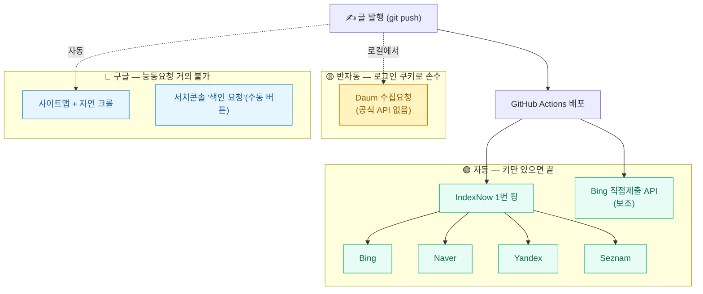
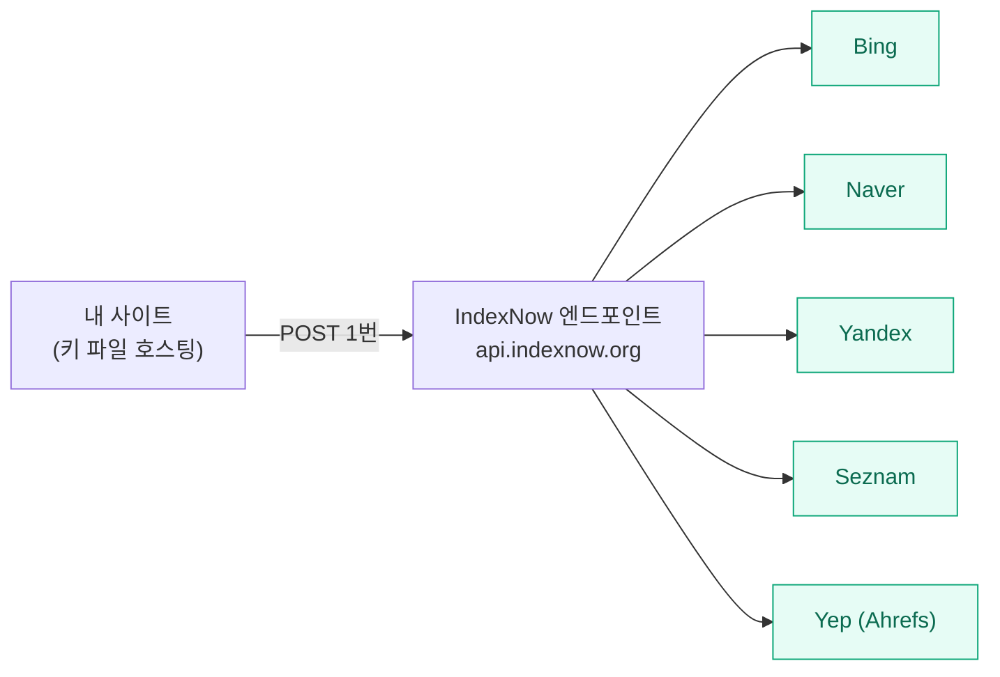
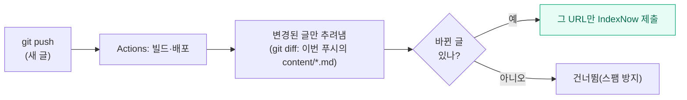
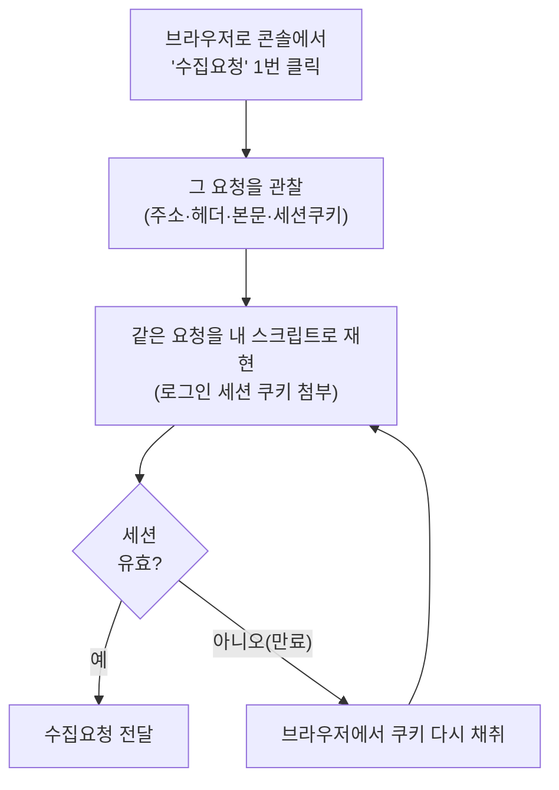
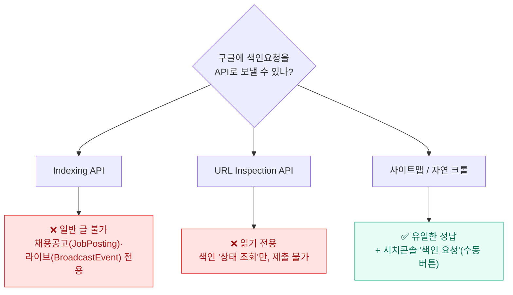
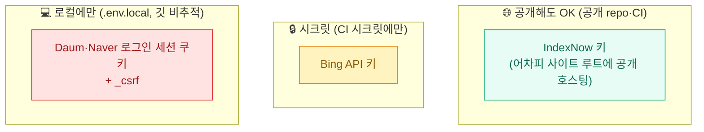
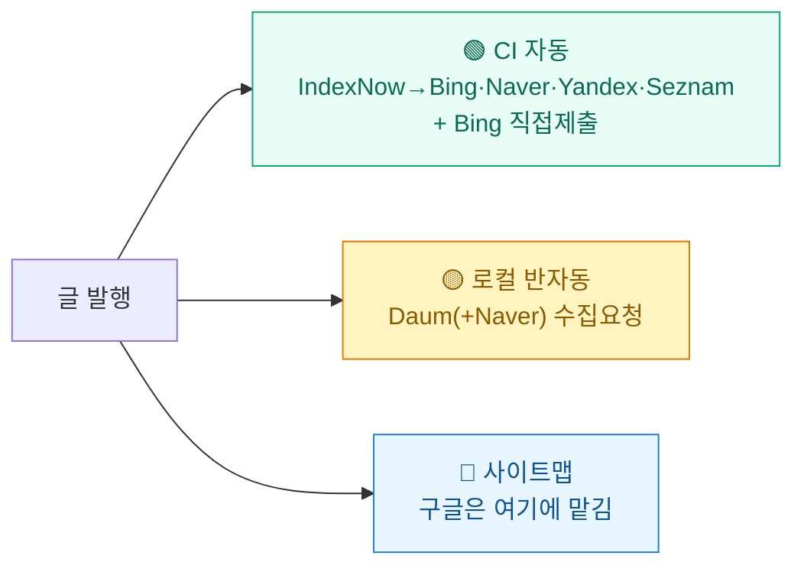

글을 열심히 써서 발행 버튼을 눌렀다. 그런데 며칠이 지나도 구글이나 네이버에서 검색하면 안 나온다. 처음엔 "원래 검색엔진이 알아서 주워 가겠지" 했다. 그게 아니었다.

검색엔진은 **크롤러가 내 사이트를 다시 방문할 때까지 기다려야** 새 글을 안다. 작은 개인 블로그는 그 주기가 길다. 그래서 **"여기 새 글 생겼어요, 와서 보세요"** 하고 **능동적으로 알려주는** 방법이 따로 있다. 이걸 색인요청(또는 핑)이라고 부른다.

이번에 내 블로그(GitHub Pages 정적 사이트)가 **발행하면 알아서 검색엔진에 색인요청을 쏘도록** 만들었다. 다섯 군데 — IndexNow·Bing·Daum·Naver·구글 — 를 다 건드려 봤는데, 결론부터 말하면 **셋은 자동, 하나는 손수, 하나는 아예 안 된다**. 그 삽질기를 적는다.

## 한눈에 — 색인요청은 결국 세 그룹이었다



가장 크게 깨달은 건 이거다. **IndexNow 한 방이면 네 개 엔진이 같이 받는다.** 그래서 일이 생각보다 단순해졌다. 진짜 손이 가는 건 Daum 하나였고, 구글은 손을 댈 수가 없었다.

## 그래서 IndexNow가 뭔데?

**IndexNow**는 2021년 마이크로소프트 Bing과 Yandex가 같이 만든 **개방형 색인요청 프로토콜**이다. 핵심은 *"한 곳에 핑을 쏘면 참여하는 모든 검색엔진이 그 URL을 공유받는다"* 는 것.



여기서 가장 반가웠던 사실 하나. **네이버가 2023년 7월부터 IndexNow에 공식 참여**한다. 그러니까 IndexNow 핑 한 번이면 **Bing·Naver·Yandex·Seznam·Yep**가 전부 내 새 글을 통보받는다. 한국 블로그 입장에서 네이버가 여기 들어 있는 게 제일 크다.

작동 원리는 의외로 허술할 만큼 간단하다.

1. **키 파일을 사이트 루트에 호스팅한다.** `https://내도메인/<키>.txt` 안에 키 문자열만 적어 두면, 그게 "이 사이트의 주인이 맞다"는 증명이 된다(별도 인증 없음).
2. **변경된 URL 목록을 POST로 보낸다.**

```json
POST https://api.indexnow.org/indexnow
Content-Type: application/json; charset=utf-8

{
  "host": "내도메인",
  "key": "<키>",
  "keyLocation": "https://내도메인/<키>.txt",
  "urlList": ["https://내도메인/blog/새글", "..."]
}
```

응답이 **200(받음)** 또는 **202(받음, 키 검증 대기)** 면 성공이다. 한 번에 최대 1만 개까지 보낼 수 있고, 모든 URL이 같은 도메인이어야 한다.

> 여기서 **키(key)** 는 비밀번호가 아니다. 어차피 사이트 루트에 공개로 호스팅하는 값이라, 공개돼도 문제없다. (이 점이 뒤에 나올 Bing API 키·로그인 쿠키와 결정적으로 다르다.)

## 발행하면 자동으로 — GitHub Actions에 끼워 넣기

내 사이트는 정적 사이트라 **글 추가 = git push → GitHub Actions가 빌드·배포**다. 그래서 **배포 워크플로 맨 끝에 IndexNow 핑 단계**를 붙였다. 한 번 붙여 두니 이제 발행할 때마다 알아서 나간다.



포인트는 **"이번에 바뀐 글만"** 골라 보내는 것이다. 매번 사이트맵 전체(80여 개)를 다시 쏘면 낭비고 스팸처럼 보인다. 그래서 푸시 전후 커밋을 `git diff`로 비교해 **새로 추가·수정된 글의 URL만** 추렸다. 워크플로 쪽은 이 한 토막이면 된다.

```yaml
# deploy.yml (배포 잡 뒤에 추가)
indexnow:
  needs: deploy
  steps:
    - uses: actions/checkout@v4
      with: { fetch-depth: 0 }   # git diff에 전체 히스토리 필요
    - uses: actions/setup-node@v4
      with: { node-version: 22 }
    - name: Ping IndexNow
      env:
        BEFORE: ${{ github.event.before }}
        AFTER: ${{ github.sha }}
      run: node scripts/indexnow-ping.mjs
```

스크립트는 의존성 0(Node 내장 fetch)으로 짰다. 키는 공개값이라 워크플로에 그냥 둬도 된다.

## Bing — IndexNow로도 가는데 왜 또 따로?

IndexNow에 이미 Bing이 들어 있다. 그런데 Bing은 **자기만의 직접 제출 API**(URL Submission API, `SubmitUrlBatch`)도 따로 갖고 있다. "이미 IndexNow로 가는데 굳이?" 싶었지만, 직접 통로를 하나 더 두면 더 확실할 것 같아 같이 붙였다.

| 항목 | 내용 |
|---|---|
| 엔드포인트 | `ssl.bing.com/webmaster/api.svc/json/SubmitUrlBatch?apikey=<키>` |
| 인증 | **BWT(빙 웹마스터도구) API 키** — IndexNow 키와 **다른** 비밀 키 |
| 성공 응답 | HTTP 200 + `{"d":null}` |
| 배치 한도 | 한 번에 최대 500개 |
| 일일 한도 | 도메인당 **최대** 1만 개 — 단 **적응형** |

⚠️ 여기서 두 가지를 정확히 짚자. (1) **Bing URL Submission API는 폐기되지 않았다.** Bing이 "IndexNow를 권장한다, 이건 나중에 폐기될 수 있다"고 안내할 뿐 현재는 멀쩡히 지원된다. (2) **"1만/일"은 천장값이자 적응형**이다. 사이트 인증 연차·노출수 등으로 정해지고, **새 사이트는 하루 5개**처럼 아주 낮게 시작할 수 있다(마이크로소프트 공식 샘플에 `DailyQuota=5`). 그러니 "누구나 1만"이 아니다. 실제 한도는 `GetUrlSubmissionQuota`로 확인하는 게 맞다.

이 키는 **진짜 비밀**이라, IndexNow 키처럼 코드에 둘 수 없다. 그래서 **GitHub Actions 시크릿**에 넣고, 워크플로에서 `${{ secrets.BING_API_KEY }}`로 주입했다. 시크릿이 있으면 Bing 직접제출도 같이 쏘고, 없으면 IndexNow만(어차피 Bing은 IndexNow가 커버) 나가게 했다.

> 참고로 이 시크릿을 API로 자동 등록하려다 막혔다. 갖고 있던 토큰에 **시크릿 쓰기 권한이 없어 403**이 떴다. 결국 저장소 설정 화면에서 손으로 추가했다. 자동화하려다 마지막 한 칸은 손으로 채운 셈이다.

## Daum — 공식 API가 없어서 손수 찔렀다

여기가 제일 손이 갔다. **Daum은 IndexNow에 참여하지 않고, 공식 색인요청 API도 없다.** 다음 웹마스터도구의 '수집요청'은 **로그인해서 콘솔 안에서 버튼으로** 하는 기능뿐이다.

그래서 택한 방법은, 내가 **브라우저로 콘솔에서 수집요청을 한 번 누를 때 실제로 오가는 요청을 그대로 재현**하는 것이었다(예전에 [[social-syndication-9-channels-api|SNS 신디케이션]]을 붙일 때 쓴 그 방식이다).



> ⚠️ **솔직한 주의.** 이건 **공식 지원 경로가 아니다.** 콘솔 내부 호출을 흉내 내는 거라 (1) 다음이 구조를 바꾸면 깨지고, (2) 약관의 회색지대이며, (3) 로그인 세션이 만료돼 완전 무인 자동화는 안 된다. 그래서 **내 계정·내 사이트에 한해, 발행할 때 로컬에서 반자동으로만** 쓴다. 키나 쿠키 같은 실제 비밀값은 이 글에 일절 싣지 않는다 — 원리만 적는다.

그리고 여기서 **제대로 한 방 먹은 함정**이 있었다.

### HTTP 200인데 실패였다

처음엔 응답이 **HTTP 200**이길래 "다 성공"이라고 로그를 찍게 짰다. 그런데 나중에 본문을 열어 보니 이랬다.

```json
{"result": false, "message": "요청을 처리할 수 없습니다.(중복 URL, 과도한 호출)"}
```

**HTTP는 200인데, 본문은 `result:false`(거부)** 였던 것이다. 한꺼번에 80개를 빠르게 쏘니 "과도한 호출"로 막혔고, 내 스크립트는 그걸 전부 "성공"으로 오해하고 있었다. 그래서 판정 기준을 **HTTP 코드가 아니라 응답 본문**(`result === true`)으로 바꾸고, 호출 사이에 간격(1.5초)을 넣었다.

교훈: **200은 "서버가 말을 들었다"일 뿐, "요청이 받아들여졌다"가 아니다.** 본문을 봐야 한다.

## Naver — IndexNow로 이미 가는데, 직접도 한 번 더

네이버는 앞서 말했듯 **IndexNow로 이미 자동 커버**된다. 그게 사실 **네이버의 공식 자동화 경로**다. 그래서 따로 안 해도 되지만, 서치어드바이저의 '웹페이지 수집요청'으로 **한 번 더 직접** 찔러도 봤다(Daum과 같은 콘솔-재현 방식).

네이버 쪽은 함정이 하나 더 있었다. 인증에 **로그인 쿠키 + `_csrf` 토큰**까지 필요했고, 이것도 **HTTP 200인데 본문이 실패**인 경우가 있었다.

```json
{"code": 110, "message": "FAIL_MAX_DOCUMENT_COUNT", "items": []}
```

`code:110` = **일일 수집요청 한도 초과**. 옛 글 수십 개를 한 번에 밀어 넣으려다 그날 한도를 넘긴 것이다.

> ⚠️ 흔히 "네이버 수집요청은 하루 50개"라고 하는데, 이건 **커뮤니티에서 도는 수치이지 네이버 공식 문서의 숫자가 아니다.** 공식 가이드는 그냥 "사이트별로 제한된 범위 내에서" 처리한다고만 한다. 그리고 다시 강조하면, **네이버에 프로그램으로 색인요청하는 공식 통로는 '수집요청 API'가 아니라 IndexNow**다. 수집요청은 콘솔 전용 기능이다.

## 그럼 구글은? — 여기가 제일 헷갈리는 지점

많은 사람이 "구글도 Indexing API로 색인요청하면 되지 않나?"라고 생각한다. **나도 그랬다. 그런데 아니었다.**



정리하면 이렇다.

| 구글 API | 무엇 | 일반 글에 색인요청? |
|---|---|---|
| **Indexing API** | 채용공고·라이브 영상 페이지 **전용** 알림(생성/삭제) | ❌ 공식 미지원 |
| **URL Inspection API** | URL의 **현재 색인 상태 조회** | ❌ 읽기 전용(제출 불가) |
| 사이트맵 | 다수 URL을 한꺼번에 알림 | ✅ (자동, 권장) |
| 서치콘솔 '색인 요청' | 개별 URL 즉시 요청 | ✅ 단 **수동 버튼만**, API 없음 |

핵심은 **구글 Indexing API가 "아무 페이지나 색인요청하는 도구"가 아니라는 것**이다. 공식 문서가 못 박는다 — *JobPosting 또는 (VideoObject 안의) BroadcastEvent 마크업이 있는 페이지만* 쓸 수 있다. 일반 블로그 글에 이 API를 쏘는 "instant indexing" 플러그인들이 많지만, 그건 **공식 지원 범위 밖**이고 구글도 권장하지 않는다(존 뮬러가 여러 번 언급).

게다가 구글은 **IndexNow도 받지 않는다**(2021년 "테스트" 언급 후 채택 안 함). 그러니 IndexNow를 아무리 쏴도 구글에는 안 간다.

**결론: 구글만큼은 능동 색인요청을 (일반 글에) 자동화할 깔끔한 길이 없다.** 답은 옛날부터 똑같다 — **사이트맵을 제출해 두고**, 급하면 **서치콘솔에서 수동으로 '색인 요청'** 버튼을 누르는 것. 그래서 내 파이프라인에서 구글은 "자동화 대상"이 아니라 "사이트맵에 맡기는 영역"으로 분리했다.

## 보안 — 공개 repo에 뭘 두고, 뭘 두지 말까

이 작업은 사실 **"무엇이 비밀이고 무엇이 공개값인가"를 가르는 일**이기도 했다. 세 종류가 섞여 있었다.



- **IndexNow 키**: 공개값 → 공개 저장소·CI에 그냥 둬도 됨.
- **Bing API 키**: 비밀 → **GitHub Actions 시크릿**에만. 코드·로그에 절대 안 찍히게.
- **Daum·Naver 세션 쿠키·`_csrf`**: 내 로그인 그 자체 → **공개 저장소엔 절대 금지**, 로컬의 깃 비추적 파일(`.env.local`)에만. 게다가 **수 시간~며칠이면 만료**돼서, 어차피 CI에 박아 둘 수도 없다(그래서 Daum·Naver는 로컬 반자동).

**세션 쿠키를 CI에 못 넣는 것**, 이게 Daum·Naver를 완전 자동화하지 못한 근본 이유였다. 만료되는 로그인 세션을 공개 인프라에 두는 건 위험하고, 둬도 곧 깨진다.

## 삽질에서 남은 것



- **IndexNow 하나로 네 엔진**(Bing·Naver·Yandex·Seznam)이 커버된다 — 한국 블로그에 네이버가 들어 있는 게 핵심.
- **구글은 능동 색인요청을 (일반 글에) 자동화할 공식 길이 없다** — 사이트맵 + 자연 크롤 + 수동 요청이 답. Indexing API는 채용공고·라이브 전용이라는 걸 꼭 기억하자.
- **HTTP 200 ≠ 성공.** 본문(`result`/`code`)을 봐야 한다. 이거 하나로 한참 헤맸다.
- **일일 한도·레이트**가 있다(Bing은 적응형, 네이버·다음은 소량). 옛 글 대량 백필은 한도 친화적인 IndexNow로, 그 외는 한 번에 몇 개씩.
- **비밀과 공개값을 가르는 게 절반**이다. 공개값은 CI에, 진짜 비밀은 시크릿에, 세션 쿠키는 로컬에만.

발행하고 나서 "검색엔진이 언젠가 주워 가겠지" 하고 손 놓고 있던 걸, 이제는 **발행하는 순간 자동으로 "새 글 있어요"가 날아가게** 만들었다. 완벽한 무인 자동화는 아니지만(Daum·Naver는 가끔 쿠키를 다시 따야 한다), 적어도 **가장 중요한 통로들은 발행과 동시에** 열린다. 그거면 충분하다.

## 참고자료

- [IndexNow 공식 문서](https://www.indexnow.org/documentation)
- [IndexNow 참여 검색엔진 목록(searchengines.json)](https://www.indexnow.org/searchengines.json)
- [Bing — URL Submission API & IndexNow](https://www.bing.com/webmasters/help/URL-Submission-62f2860b)
- [Google — Indexing API 사용(‘JobPosting/BroadcastEvent만’)](https://developers.google.com/search/apis/indexing-api/v3/using-api)
- [Google — URL 재크롤 요청하기(사이트맵·서치콘솔)](https://developers.google.com/search/docs/crawling-indexing/ask-google-to-recrawl)
- [Google — URL Inspection API(읽기 전용)](https://developers.google.com/webmaster-tools/v1/urlInspection.index/inspect)
- [Naver 서치어드바이저 — 웹페이지 수집요청 가이드](https://searchadvisor.naver.com/guide/request-crawl)
- [Daum(Kakao) 웹마스터도구](https://webmaster.daum.net/)

<!-- 안전: 회사 실데이터·제3자 PII·실제 API키/쿠키/_csrf/토큰 없음. 공개 문서·1차 출처 기반 + 본인 사이트 자동화 일반화. Daum/Naver 콘솔-재현은 비공식·약관 회색지대임을 본문에 명시. -->
