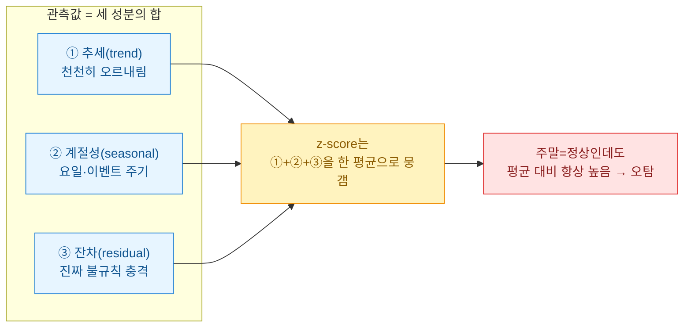
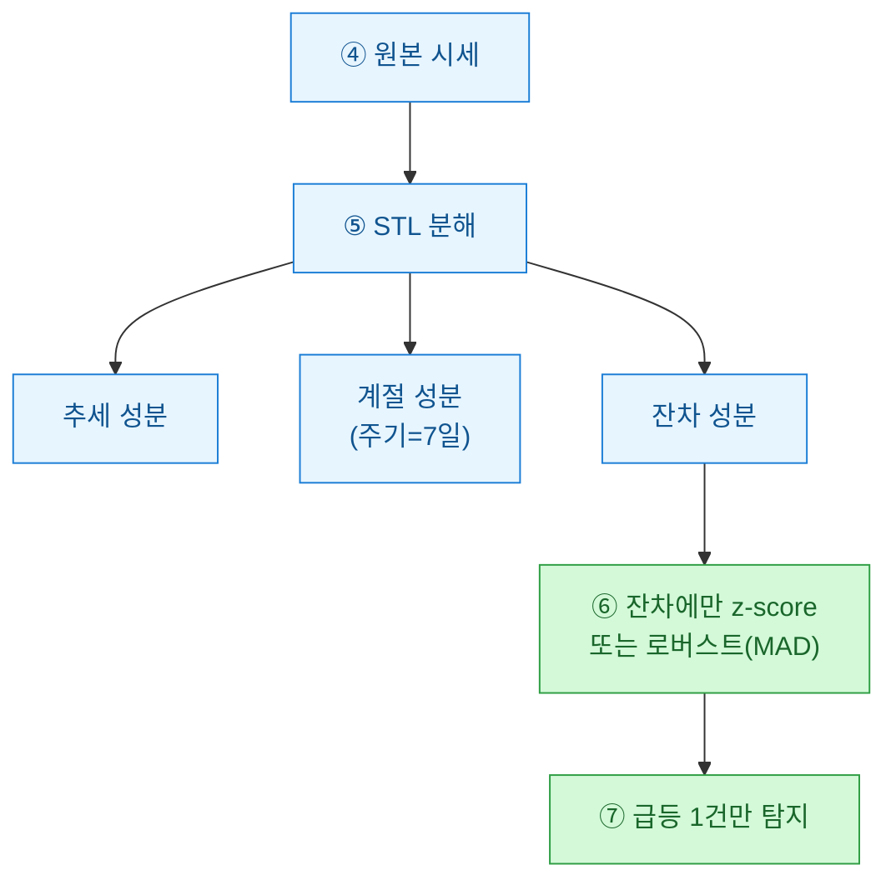

> 공개·더미 데이터 기준의 방법론 정리이며, 투자권유나 회계판단이 아니다.

이상치 탐지를 처음 붙일 때 나도 그냥 z-score부터 꺼냈다. 평균에서 몇 표준편차 벗어나면 알람. 깔끔하다. 그런데 게임 아이템 시세나 커머스 일별 매출처럼 **요일·이벤트 주기**가 박힌 데이터에 그대로 걸었더니, 알람이 매주 토·일마다 규칙적으로 울렸다. 이상한 게 아니라 원래 주말에 오르는 건데 말이다. 이 글은 그 오탐이 왜 생기고, 어떻게 보완했는지의 기록이다.

## 왜 계절성 데이터에서 z-score가 무너지나?

핵심은 z-score가 **"전체 평균 하나"**를 기준으로 삼는다는 점이다. 시세에 추세·주기·노이즈가 겹쳐 있으면 그 평균은 아무 요일도 대표하지 못한다.



**계절성(seasonality)**이란 정해진 주기로 반복되는 패턴이다. 주말 할증, 월초 이벤트, 정기 점검 후 반등 같은 것. 이건 "예측 가능한 정상"인데, 단순 z-score는 이걸 이상 신호와 구분하지 못한다.

## 합성 시세로 오탐을 직접 재현하면?

먼저 요일 효과 + 이벤트 스파이크 + 진짜 이상치 하나를 심은 더미 시세를 만든다.

```python
import numpy as np
import pandas as pd

rng = np.random.default_rng(42)
days = pd.date_range("2026-01-01", periods=140, freq="D")

trend = np.linspace(1000, 1200, len(days))           # 완만한 상승 추세
weekday_effect = np.where(days.weekday >= 5, 180, 0)  # 주말 +180
event = np.where(days.day == 1, 250, 0)               # 매월 1일 이벤트
noise = rng.normal(0, 25, len(days))

price = trend + weekday_effect + event + noise
price[100] += 400   # ← 진짜 넣고 싶은 이상치 (평일 급등)

df = pd.DataFrame({"price": price}, index=days)
```

여기서 우리가 진짜 잡고 싶은 건 **100번째 날의 급등 하나**뿐이다. 주말과 월초는 정상이다. 그런데 단순 z-score를 돌리면:

```python
z = (df["price"] - df["price"].mean()) / df["price"].std()
naive = df.index[z.abs() > 2]
```

주말과 월초가 무더기로 딸려 나온다. 아래 표가 그 차이다.

| 구분 | 단순 z-score | 원하는 결과 |
|---|---|---|
| 주말 고가 | 이상치로 오탐(수십 건) | 정상 |
| 월초 이벤트 | 이상치로 오탐 | 정상 |
| 100일차 급등 | 탐지됨(다행히) | 탐지 |
| 신호 대비 잡음 | 매우 나쁨 | 깔끔 |

탐지야 됐지만 진짜 하나를 찾으려고 정상 수십 건을 같이 울리면, 운영자는 곧 알람을 꺼버린다. 이게 실무에서 가장 흔한 실패다.

## STL 분해로 무엇이 달라지나?

**STL(Seasonal-Trend decomposition using Loess)**은 시계열을 추세·계절성·잔차로 쪼갠다. 우리가 이상치를 찾을 곳은 오직 **잔차(residual)**다. 요일·이벤트로 설명되는 부분을 먼저 걷어내고, 남은 불규칙 충격만 본다.



```python
from statsmodels.tsa.seasonal import STL

stl = STL(df["price"], period=7, robust=True).fit()
resid = stl.resid

# 잔차는 이미 추세·계절성이 제거됨 → 여기서만 이상치 판정
rz = (resid - resid.median()) / (1.4826 * (resid - resid.median()).abs().median())
flags = df.index[rz.abs() > 3.5]   # MAD 기반 로버스트 z
```

`robust=True`는 이상치가 분해 자체를 오염시키지 않게 하는 옵션이고, 잔차 판정에는 평균·표준편차 대신 **중앙값·MAD(중앙값절대편차)**를 썼다. 이상치가 통계량을 끌어당기는 걸 막는 로버스트 방식이다.

## 그래도 부족하면 — 기준선 보정 한 겹 더

STL이 강력하지만, 주기가 불규칙하거나 데이터가 짧으면 계절 성분이 흔들린다. 그럴 땐 가벼운 대안으로 **요일별 기준선(baseline)**을 직접 빼주는 방법이 잘 통했다.

| 접근 | 기준선 정의 | 언제 쓰나 |
|---|---|---|
| 단순 z-score | 전체 평균 | 계절성 없을 때만 |
| 요일별 기준선 | 같은 요일의 이동중앙값 | 주기가 요일 하나로 명확할 때 |
| STL 잔차 | Loess 분해 후 잔차 | 추세+다중 주기가 섞일 때 |

```python
# 요일별 롤링 중앙값을 기준선으로, 편차를 로버스트 z로
base = df.groupby(df.index.weekday)["price"].transform(
    lambda s: s.rolling(4, min_periods=1).median()
)
dev = df["price"] - base
mz = (dev - dev.median()) / (1.4826 * (dev - dev.median()).abs().median())
flags2 = df.index[mz.abs() > 3.5]
```

두 방법 모두 목표는 같다. **"정상이라고 설명 가능한 변동"을 먼저 제거하고, 남은 것만 의심**한다는 것.

## 정리하면

- 계절성 데이터에 단순 z-score를 걸면, 정상 주기가 통째로 이상치로 잡혀 **오탐이 폭증**한다.
- 먼저 추세·계절성을 분리하고, **잔차에만** 판정을 걸어야 한다.
- 짧거나 주기가 단순하면 **요일별 기준선 보정**으로도 충분하고, 추세와 다중 주기가 섞이면 **STL 분해**가 낫다.
- 판정 통계량은 평균·표준편차보다 **중앙값·MAD** 같은 로버스트 지표가 알람을 덜 흔든다.

알람이 매주 같은 요일에 울린다면, 그건 데이터가 이상한 게 아니라 내 기준선이 요일을 모르고 있다는 신호였다. 기준선에게 달력을 쥐여주는 것 — 그게 계절성 시세 이상탐지의 절반이다.
