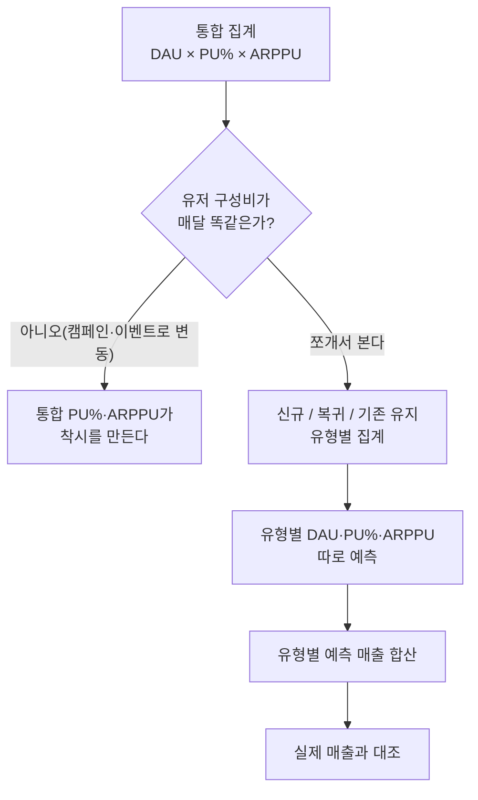
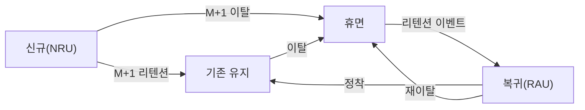

매출 시뮬레이션 모델(예상매출 = DAU × PU% × ARPPU)을 처음 돌릴 땐 전체 DAU에 전체 PU%, 전체 ARPPU를 곱해서 끝냈다. 숫자는 그럴듯해 보였다. 문제는 유입 캠페인으로 신규가 크게 늘거나 복귀 이벤트가 터진 달이었다. 총 DAU는 목표를 채웠는데 예측 매출과 실제 매출이 자꾸 어긋났다.

한참 헤매다 깨달았다. 통합 PU%(결제 유저 비율)·ARPPU(결제 유저 1인당 평균 결제액)는 신규·복귀·기존 유지라는 성격이 전혀 다른 유저가 섞인 **평균**일 뿐이다. 이 평균은 유저 구성비(믹스)가 바뀌면 아무도 행동을 바꾸지 않아도 저절로 움직인다. 그래서 매출 예측은 유형별로 쪼개서 하고, 마지막에 합산해야 한다.



## 통합 PU%·ARPPU만 보면 왜 위험한가?

핵심은 **구성비 착시**다. 신규 유저는 아직 정착하지 않았으니 PU%·ARPPU가 원래 낮다. 기존 유지 유저는 오래 투자한 만큼 PU%·ARPPU가 가장 높다. 그런데 어느 달 유입 캠페인으로 신규 비중이 확 늘면, 세 유형 각각의 행동은 하나도 안 변했는데도 **전체 DAU 기준 통합 PU%·ARPPU는 저절로 내려간다.** 전환율 낮은 유저 비중이 커졌을 뿐인데 "결제 전환이 나빠졌다"고 오진하면 엉뚱한 곳에서 원인을 찾게 된다.

아래는 이 착시를 보여주기 위한 가상의 예시다(전부 가데이터, 실제 재직 시 수치와 무관).

| 유형 | 이번 달 DAU | 다음 달 DAU(캠페인 후) | PU% | ARPPU |
|---|---|---|---|---|
| 신규 | 20,000 | 52,000 | 4% | 7,000원 |
| 복귀 | 10,000 | 13,000 | 7% | 13,000원 |
| 기존 유지 | 70,000 | 65,000 | 11% | 30,000원 |
| **합계** | **100,000** | **130,000** | — | — |

각 유형의 PU%·ARPPU는 두 달 사이 **전혀 바뀌지 않았다고 가정**한다. 이번 달 통합 지표는 블렌디드 PU% 약 9.2%, 블렌디드 ARPPU 약 26,706원이다. 이걸 다음 달 DAU 예측치(13만)에 그대로 곱하면 매출 예측은 약 3억 1,940만원.

유형별로 쪼개 각자의 PU%·ARPPU로 계산해 합산하면 결과는 약 2억 4,089만원이다. 같은 DAU 예측, 같은 전환율·객단가 가정인데도 **통합 방식이 32%가량 과대예측**한다. 신규 비중 증가를 통합 지표가 반영 못 했기 때문이다. 캠페인으로 DAU를 성공적으로 키운 달일수록 이 함정에 걸리기 쉽다.

## 유형별로 쪼개면 실제로 무엇이 다르게 보이나?

세 유형은 성격 자체가 다르다. 하나의 잣대로 보면 서로의 신호가 뭉개진다.

- **신규(NRU)**: PU%·ARPPU는 낮지만, 진짜 지표는 **Retention(M+1)** — 유입 다음 달까지 남는 비율이다. 신규가 잘 들어와도 M+1이 무너지면 다음 달 '기존 유지'로 넘어가지 못하고 그대로 증발한다.
- **기존 유지**: MAU는 크게 안 흔들리지만 **ARPPU**가 매출을 좌우한다. 이 층 ARPPU가 빠지면 십중팔구 엔드콘텐츠·BM이 낡았다는 신호다.
- **복귀(RAU)**: 이벤트에 반응해 스파이크성으로 튀었다가 꺼진다. PU%·ARPPU 변동폭이 세 유형 중 가장 크다.

같은 매출 하락이라도 신규 M+1이 원인이면 온보딩·튜토리얼 문제이고, 기존 유지 ARPPU가 원인이면 콘텐츠·BM 문제다. 통합 지표 하나로는 이 갈림길 자체가 안 보인다.

## 유저는 유형 사이를 어떻게 오가는가?

유형별 예측이 진짜 의미가 있으려면 유저가 유형 간에 **어떻게 이동하는지**를 알아야 한다. 이번 달 신규가 다음 달에도 신규일 리는 없다. 신규는 M+1 리텐션을 통과하면 기존 유지로 넘어가고, 통과하지 못하면 휴면으로 빠진다. 휴면 유저는 리텐션 이벤트를 계기로 복귀로 돌아온다.



이 흐름을 알면 다음 달 유형별 규모를 추정할 수 있다. 이번 달 신규 수 × M+1 리텐션율이 대략 다음 달 기존 유지 후보군이 되고, 이벤트 캘린더와 과거 반응률을 대입하면 복귀 규모도 추정된다. 유형별 예측이 **정적인 스냅샷 세 개**가 아니라 **흐름이 있는 모델**이 되는 지점이다. 통합 DAU만 보면 이 흐름이 안 보이고 "DAU가 늘었다/줄었다"라는 뭉뚱그린 결과만 남는다.

## 그래서 이 집계는 실무에서 어떻게 자동화했나?

매달 손으로 유형을 나누고 M+1을 계산하는 건 지속 가능하지 않다. MS-SQL 기반으로 유저 로그에 `user_type`(신규/복귀/기존 유지) 플래그를 심어두고, 월별 집계를 Stored Procedure로 자동화했다. 사람은 결과 테이블만 확인하면 되도록 만드는 게 목적이었다.

```sql
-- 개념 예시(합성 스키마). 실제 테이블·SP명 아님.
-- 이번 달 신규 유저 중 다음 달까지 남은 비율 = M+1 리텐션
SELECT
    cohort_month,
    COUNT(DISTINCT CASE WHEN user_type = 'new' THEN user_id END)
        AS new_users,
    COUNT(DISTINCT CASE WHEN user_type = 'new'
                     AND active_next_month = 1 THEN user_id END)
        AS retained_m1,
    CAST(COUNT(DISTINCT CASE WHEN user_type = 'new'
                          AND active_next_month = 1 THEN user_id END) AS FLOAT)
        / NULLIF(COUNT(DISTINCT CASE WHEN user_type = 'new' THEN user_id END), 0)
        AS retention_m1_rate
FROM   monthly_user_type
GROUP  BY cohort_month;
```

이 결과를 지난 글에서 다룬 유형별 PU%·ARPPU 집계와 이어 붙이면, "신규가 얼마나 들어와서 얼마나 남았고, 다음 달 매출에 얼마로 반영될지"를 유형별로 자동으로 뽑을 수 있다. 반복은 SP에, 판단은 사람에게 — 원칙은 여기서도 같다.

## 정리 — 평균은 구성비가 바뀌면 배신한다

- 통합 PU%·ARPPU는 신규·복귀·기존 유지가 섞인 **평균**이라, 유저 구성비가 바뀌면 행동이 그대로여도 숫자가 움직인다.
- 유형별로 쪼개 예측하고 마지막에 합산해야, 캠페인·이벤트로 구성비가 흔들리는 달에도 예측이 어긋나지 않는다.
- 신규는 M+1 리텐션, 기존 유지는 ARPPU, 복귀는 이벤트 반응성 — 유형마다 봐야 할 지표가 다르다.
- 유형은 고정된 스냅샷이 아니라 신규→기존 유지→휴면→복귀로 흐르는 **모델**로 봐야 다음 달 규모까지 추정할 수 있다.

곱셈 하나로 시작한 매출 모델이 결국 유저 유형 간 흐름을 그리는 데까지 갔다. 다음 글에서는 이 흐름 모델을 코호트별 리텐션 곡선으로 확장해, 과금 이탈을 조기에 잡아내는 방법을 정리한다.

- 방법론·합성 스키마 레시피: [github.com/DBhyeong/game-data-recipes](https://github.com/DBhyeong/game-data-recipes)
