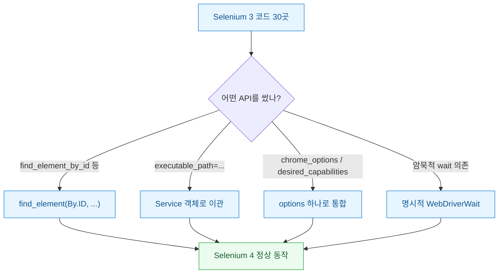

지난주에 오래 방치했던 크롤링·자동발행 스크립트 뭉치를 다시 돌리려다 첫 줄에서 막혔다. `pip install selenium` 한 번 했을 뿐인데 Selenium 4가 깔렸고, 예전에 잘 돌던 코드가 `AttributeError`부터 `DeprecationWarning`까지 줄줄이 토해냈다. 세어 보니 손봐야 할 지점이 30군데였다. 그런데 다행히도 깨진 방식은 딱 네 가지 패턴으로 수렴했다. 이 글은 그 네 패턴을 어떻게 찾아서 한 번에 고쳤는지에 대한 기록이다.

먼저 전체 그림부터. 깨진 코드가 어떤 유형으로 나뉘고 각각 어떻게 바뀌는지를 한눈에 정리하면 이렇다.



## find_element_by_id는 왜 통째로 사라졌나?

가장 많이 깨진 건 예상대로 `find_element_by_*` 계열이었다. 3.x에서는 `driver.find_element_by_id("login")`처럼 요소마다 전용 메서드가 있었다. 4.x에서는 이게 전부 제거됐다(deprecated를 넘어 아예 삭제). 대신 `By` 클래스로 찾는 방식(로케이터를 인자로 넘기는 통일된 방식)만 남았다.

```python
# Selenium 3 (더 이상 안 됨)
el = driver.find_element_by_id("login")
btn = driver.find_element_by_css_selector(".submit")
rows = driver.find_elements_by_class_name("row")

# Selenium 4
from selenium.webdriver.common.by import By
el = driver.find_element(By.ID, "login")
btn = driver.find_element(By.CSS_SELECTOR, ".submit")
rows = driver.find_elements(By.CLASS_NAME, "row")
```

30곳 중 절반 이상이 이 케이스라 손으로 하나씩 고치긴 싫었다. 그래서 정규식 치환으로 밀었다. `find_element_by_id\(` → `find_element(By.ID, ` 식으로 접미사별로 매핑 규칙을 만들고, 편집기 전체 치환을 돌린 뒤 `By` import만 챙겼다.


접미사와 `By` 상수 대응만 표로 정리해 두면 치환 규칙이 그대로 나온다.

| Selenium 3 접미사 | By 상수 |
|---|---|
| `_by_id` | `By.ID` |
| `_by_name` | `By.NAME` |
| `_by_class_name` | `By.CLASS_NAME` |
| `_by_css_selector` | `By.CSS_SELECTOR` |
| `_by_xpath` | `By.XPATH` |
| `_by_link_text` | `By.LINK_TEXT` |

## executable_path가 왜 경고를 뿜나?

두 번째 뭉치는 드라이버를 띄우는 부분이었다. 3.x에서는 `webdriver.Chrome(executable_path="...")`로 드라이버 실행파일 경로를 직접 넘겼는데 4.x는 이걸 `Service` 객체(드라이버 프로세스를 관리하는 래퍼)로 감싸도록 바꿨다.

```python
# Selenium 3
driver = webdriver.Chrome(executable_path="C:/drivers/chromedriver.exe")

# Selenium 4
from selenium.webdriver.chrome.service import Service
service = Service(executable_path="C:/drivers/chromedriver.exe")
driver = webdriver.Chrome(service=service)
```

여기서 하나 배운 게 있다. Selenium 4.6부터는 Selenium Manager(드라이버를 자동으로 내려받아 맞춰주는 내장 기능)가 들어왔다. 그래서 경로를 아예 안 넘겨도 브라우저 버전에 맞는 드라이버를 알아서 챙긴다. 나는 이참에 하드코딩된 경로 상수를 지우고 `webdriver.Chrome()` 한 줄로 줄였다. 크롬이 자동 업데이트되면서 드라이버 버전이 어긋나 깨지던 고질병이 이걸로 사라졌다.

## chrome_options랑 desired_capabilities는 어디로 갔나?

세 번째는 브라우저 옵션이었다. 3.x에서는 옵션을 `chrome_options`로 넘기고 헤드리스나 프록시 같은 능력치는 `desired_capabilities`라는 별도 딕셔너리로 넘겼다. 4.x는 이 둘을 `options` 하나로 합쳤다.

```python
# Selenium 3
from selenium.webdriver import DesiredCapabilities
caps = DesiredCapabilities.CHROME.copy()
caps["acceptInsecureCerts"] = True
driver = webdriver.Chrome(chrome_options=opts, desired_capabilities=caps)

# Selenium 4
options = webdriver.ChromeOptions()
options.add_argument("--headless=new")
options.set_capability("acceptInsecureCerts", True)
driver = webdriver.Chrome(options=options)
```

`chrome_options=` 키워드 자체가 없어져서 이건 경고가 아니라 바로 에러가 났다. 그리고 헤드리스도 `--headless`가 아니라 `--headless=new`로 쓰라고 권장이 바뀌어서 겸사겸사 같이 손봤다.

## 눈에 안 보이게 깨진 건 없었나?

문법 에러는 실행하면 바로 티가 나니 오히려 쉬웠다. 진짜 성가신 건 조용히 어긋난 부분이었다. 4.x는 W3C 프로토콜(브라우저 자동화 표준 규약)을 엄격히 따르면서 요소가 뜨는 타이밍 판정이 예전과 미묘하게 달라졌다. 3.x 시절 암묵적 대기(implicit wait)에만 기대던 코드가 간헐적으로 `NoSuchElement`를 뱉었다.

```python
# 타이밍에 기대지 말고 조건을 명시
from selenium.webdriver.support.ui import WebDriverWait
from selenium.webdriver.support import expected_conditions as EC

el = WebDriverWait(driver, 10).until(
    EC.presence_of_element_located((By.CSS_SELECTOR, ".result"))
)
```

간헐적으로 깨지는 부분은 전부 이 명시적 대기(원하는 조건이 만족될 때까지 기다리는 방식)로 바꿨다. 어차피 마이그레이션 안 했어도 언젠가 터졌을 불안한 코드라 이참에 정리한 셈이다.

## 마이그레이션이 남긴 것

30곳을 고치고 나니 코드가 오히려 짧아졌다. 드라이버 경로 관리 코드가 통째로 사라졌고 옵션 설정이 한 곳으로 모였다. 정리하면 이렇다.

- **find_element_by_\***: 정규식 일괄 치환 + `By` import — 기계적으로 처리 가능
- **executable_path**: `Service`로 감싸거나 아예 제거(Selenium Manager)
- **chrome_options / desired_capabilities**: `options` 하나로 통합
- **암묵적 대기 의존**: `WebDriverWait` + `expected_conditions`로 명시화

교훈은 단순했다. 버전을 올릴 땐 릴리스 노트의 "Removed" 항목부터 읽자. 삭제된 API 목록만 훑어도 어디가 깨질지 절반은 미리 알 수 있었다. 다음엔 자동발행 파이프라인이 브라우저 자동화 없이 API만으로 돌아가게 바꿔볼 생각이다. 그러면 이런 마이그레이션 자체를 안 겪어도 되니까.
