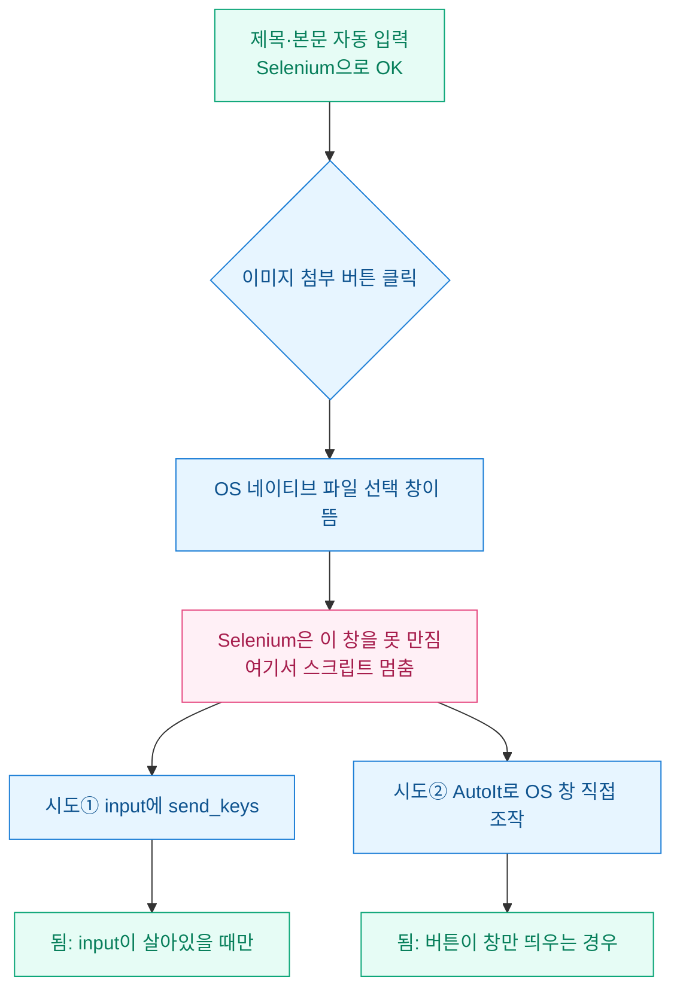
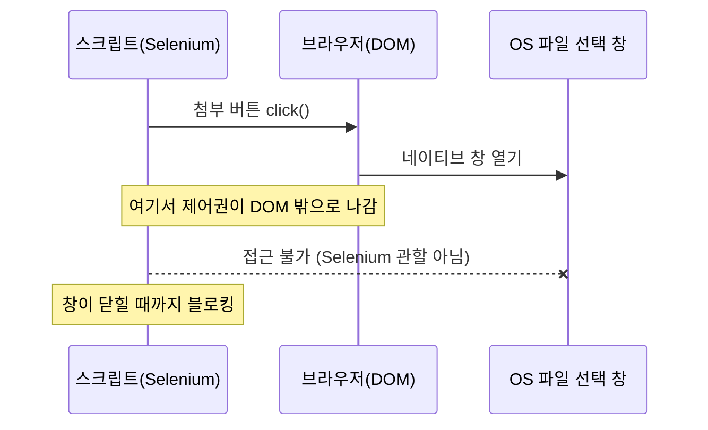
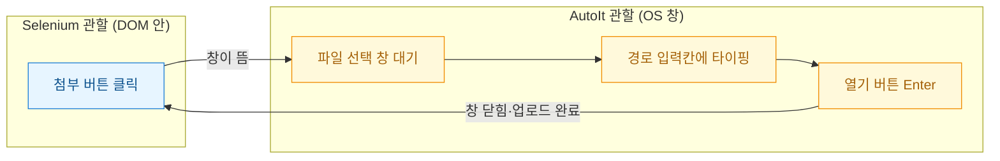

티스토리에 글을 자동으로 올리는 스크립트를 짜면서 제일 오래 붙잡은 건 정작 글이 아니었다. 제목 넣고 본문 넣는 건 Selenium(브라우저를 코드로 조종하는 도구)으로 반나절이면 됐다. 발목을 잡은 건 대표 이미지 하나 첨부하는 일이었다.

"이미지 첨부" 버튼을 클릭하는 순간 Windows 파일 탐색기 창이 뜬다. 그런데 Selenium이 이 창을 전혀 못 만진다. 클릭도 타이핑도 안 먹혔다. 처음엔 셀렉터를 잘못 잡았나 싶어 한참 헤맸는데 원인은 더 근본적이었다. 그 창은 브라우저 안이 아니라 **운영체제(OS)가 띄운 별도 창**이었다.



## Selenium은 왜 파일 선택 창을 못 만지나?

Selenium이 조종할 수 있는 세계는 딱 브라우저 DOM(웹페이지를 이루는 요소들의 나무 구조) 안까지다. 버튼, 입력칸, 링크 같은 HTML 요소는 다 다룬다. 하지만 파일 선택 창은 HTML이 아니다. Windows가 직접 그리는 네이티브 창이라 DOM 바깥에 있다. Selenium 입장에선 존재하지 않는 세계인 셈이다.

그래서 클릭하는 순간 제어권이 브라우저에서 OS로 넘어간다. 스크립트는 창이 닫히기를 기다리며 그대로 멈춘다.



## 정석대로 send_keys를 쓰면 되지 않나?

가장 깔끔한 방법은 애초에 창을 안 띄우는 거다. 페이지 안에 `<input type="file">` 요소가 있으면 그걸 클릭하지 말고 곧바로 파일 경로를 넣어주면 된다. 버튼을 누르는 게 아니라 input에 값을 꽂는 방식이라 OS 창 자체가 안 뜬다.

```python
# 창을 아예 안 띄우는 정석
from selenium.webdriver.common.by import By

file_input = driver.find_element(By.CSS_SELECTOR, "input[type='file']")
# 숨겨진 input이면 display 속성을 잠깐 풀어준다
driver.execute_script(
    "arguments[0].style.display='block'; arguments[0].style.opacity=1;",
    file_input,
)
file_input.send_keys(r"C:\images\thumbnail.png")  # 절대경로여야 한다
```

이게 먹히면 게임 끝이다. 문제는 요즘 에디터들이다. input을 아예 안 두거나, 클릭 이벤트로 JS가 창을 직접 여는 구조라 DOM에 넣을 대상이 없다. 티스토리 신형 에디터에서 내가 만난 게 딱 이 경우였다. **input을 못 찾으면 send_keys는 애초에 쓸 수가 없다.**

## AutoIt는 어디서 개입하나?

여기서 AutoIt를 꺼냈다. AutoIt는 Windows 창과 키보드·마우스를 스크립트로 조종하는 아주 오래된 자동화 도구다. Selenium이 못 가는 OS 창 영역을 이 친구가 대신 맡는다. 역할을 경계로 나눠 그리면 이렇게 된다.



AutoIt 스크립트는 짧다. "파일 열기" 창이 뜰 때까지 기다렸다가 경로를 치고 Enter를 누르는 게 전부다.

```autoit
; upload.au3  →  Aut2Exe로 upload.exe 컴파일해서 쓴다
; 실행: upload.exe "C:\images\thumbnail.png"

; 창 제목은 OS 언어에 따라 다르다. 한글 Windows면 "열기"
Local $title = "열기"
WinWait($title, "", 10)          ; 최대 10초 대기
If WinExists($title) Then
    WinActivate($title)
    ControlSetText($title, "", "Edit1", $CmdLine[1])  ; 경로 입력칸에 넣기
    ControlClick($title, "", "Button1")               ; 열기 버튼 클릭
EndIf
```

파이썬 쪽에선 첨부 버튼을 누른 직후, 창이 뜨는 타이밍에 맞춰 이 exe를 호출한다.

```python
import subprocess

# 버튼을 누르면 OS 창이 뜬다 (여기서 Selenium은 멈춤)
driver.find_element(By.CSS_SELECTOR, ".btn_attach").click()

# 멈춘 사이 AutoIt가 OS 창을 대신 처리한다
subprocess.run([r"C:\tools\upload.exe", r"C:\images\thumbnail.png"], timeout=15)

# 창이 닫히면 제어권이 돌아와 Selenium이 이어서 동작한다
```

## 겪고 나서 정리한 원칙

방법마다 되는 조건이 갈렸다. 표로 정리해 두니 다음 사이트에서 판단이 빨라졌다.

| 방법 | 되는 조건 | 약점 |
|---|---|---|
| input에 send_keys | `<input type=file>`가 DOM에 있음 | 요소 없으면 불가 |
| AutoIt exe | 버튼이 OS 창만 띄우면 언제나 | 창 제목·OS 언어 의존 |
| 클립보드 붙여넣기 | 에디터가 paste 업로드 지원 | 지원 안 하면 불가 |

제일 크게 배운 건 이거다. **자동화가 멈추면 요소 셀렉터부터 의심하는 습관이 있는데, 창이 브라우저 밖으로 나가는 순간엔 셀렉터 문제가 아니다.** 관할이 바뀐 거다. 그때는 도구를 바꿔야지 셀렉터를 백날 고쳐도 안 된다.

AutoIt exe는 창 제목에 의존하는 게 유일한 불안 요소라 `WinWait` 타임아웃을 넉넉히 주고 실패 시 스크린샷을 남기게 해뒀다. 다음엔 이 파일 업로드 단계를 OSMU(원소스 멀티유즈) 발행 파이프라인에 끼워 네이버·티스토리 양쪽에서 재사용할 수 있게 묶어볼 생각이다.
