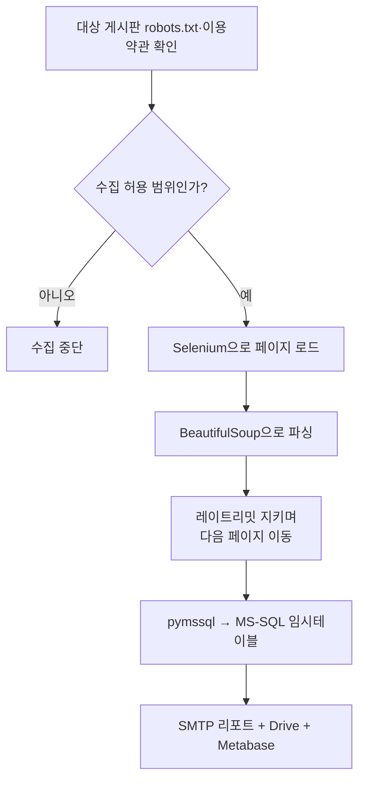
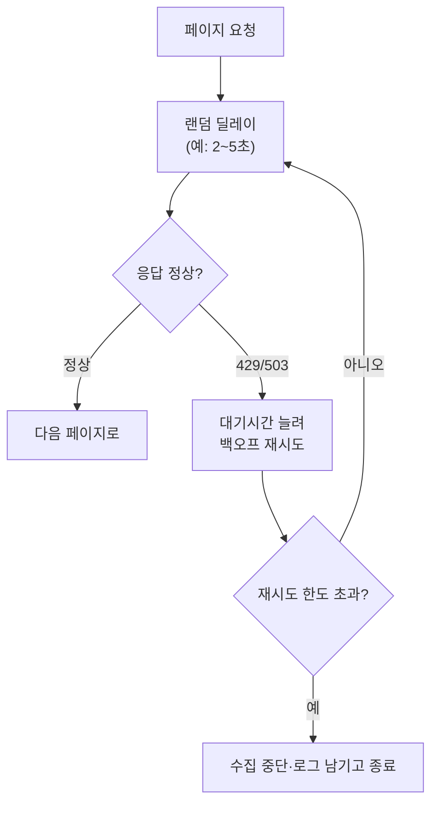

사이드 프로젝트로 게임 아이템 현금거래 시세를 매일 모으는 파이프라인을 만든 적이 있다. 라이브 게임을 운영할 때는 회사 DB 안의 매출·픽률만 들여다봤는데, 이번엔 DB 밖 데이터 — 유저들이 직접 올리는 아이템 거래 게시글 — 를 내 손으로 모아보고 싶었다. 크롤러를 짜면서 제일 먼저 부딪힌 건 파싱 코드가 아니라 "이걸 이렇게 긁어도 되나"라는 질문이었다. 개인 프로젝트니까 반복문만 돌리면 되는 줄 알았는데, 순서가 틀렸다.

이 글은 그 파이프라인 중 **수집 설계와 매너 크롤링 원칙(A~E)**만 정리했다. (MS-SQL 적재의 한글 인코딩 문제, 임시테이블 정제는 다른 글에서 다뤘다.)



## 크롤러 코드를 짜기 전에 왜 robots.txt와 이용약관부터 열었나?

"개인 프로젝트니까 괜찮겠지"라는 감으로 시작하면 안 된다고 판단했다. robots.txt는 사이트 운영자가 로봇(크롤러)에게 "이 경로는 긁어도 된다/안 된다"를 선언해둔 규약이다. 이걸 무시하면, 접속이 막히는 것보다 더 큰 문제 — 애초에 하면 안 되는 수집을 하고 있었다는 것 — 를 뒤늦게 알게 된다. 그래서 첫 줄은 파싱 코드가 아니라 robots.txt를 읽는 코드였다.

```python
import os
from urllib.robotparser import RobotFileParser

TARGET_BASE = os.environ["TARGET_BASE_URL"]   # .env로 관리
USER_AGENT = "MyPriceTracker/0.1 (personal project; contact: owner-email)"

rp = RobotFileParser()
rp.set_url(f"{TARGET_BASE}/robots.txt")
rp.read()

def is_allowed(path: str) -> bool:
    return rp.can_fetch(USER_AGENT, f"{TARGET_BASE}{path}")
```

robots.txt만 보고 끝내지도 않았다. 게시판마다 이용약관에 "영리 목적 재배포 금지", "과도한 트래픽 유발 자동화 금지" 조항이 많아 약관도 따로 읽었다. 수집 필드도 그때 정했다. 아이템명·가격·등록시각만 모으고, 작성자 닉네임·연락처처럼 개인 특정 정보는 저장 대상에서 뺐다. 안 모으면 나중에 지울 일도 없다.

## Selenium과 BeautifulSoup, 역할을 어떻게 나눴나?

거래 게시판 목록이 스크롤·페이지네이션으로 로딩되는 동적 구조라, HTTP 요청 한 번으로는 완성된 목록을 받을 수 없었다. Selenium(브라우저를 코드로 직접 조작하는 도구)이 페이지를 로드하고 다음 페이지로 넘기는 "손"을, 완성된 화면을 넘겨받은 BeautifulSoup(HTML에서 원하는 태그만 뽑는 파서)이 값을 뽑는 "눈"을 맡았다. 처음엔 Selenium만으로 텍스트까지 뽑으려 했는데, 구조가 바뀔 때마다 세션을 새로 띄워 셀렉터를 고쳐야 해서 느리고 불안정했다. 파싱을 떼어내고서야 화면(page_source) 하나로 셀렉터를 편하게 실험할 수 있었다.


```python
driver.get(list_url)
wait_for_list_loaded(driver)          # 로드 대기 후 파싱

soup = BeautifulSoup(driver.page_source, "html.parser")
for row in soup.select(".trade-row"):     # 합성 셀렉터
    name = row.select_one(".item-name").get_text(strip=True)
    price = row.select_one(".price").get_text(strip=True)
    posted_at = row.select_one(".posted-at").get_text(strip=True)
    records.append((name, price, posted_at))
```

## 레이트리밋과 서버 부담은 어떻게 지켰나?

페이지를 넘길 때마다 곧바로 다음 요청을 쏘지 않고 매번 랜덤한 간격을 뒀다. 균일한 간격은 오히려 "자동화된 접근" 신호가 되기 쉽다고 봤기 때문이다. 여러 페이지를 병렬로 긁지도 않고 한 세션에서 순차로만 진행해 동시 부하를 주지 않았다. 429(요청 과다)·503(서비스 불가) 응답을 만나면 대기시간을 늘려가며 재시도했고, 안 되면 그날 수집을 접었다.



```python
resp = fetch_page(page_no)
if resp.status_code in (429, 503):
    if retry >= MAX_RETRY:
        log_and_stop(page_no, resp.status_code)
    time.sleep((2 ** retry) * 5)      # 지수 백오프
else:
    time.sleep(random.uniform(2, 5))  # 요청 간 랜덤 딜레이
```

## 이 수집 과정을 사람 손 없이 매일 돌리려면?

매일 같은 시간, 트래픽 적은 새벽대에 자동 실행되도록 스케줄러에 올렸다. 신경 쓴 건 "안 죽는 크롤러"가 아니라, 죽거나 절반만 긁혔을 때 그 사실이 묻히지 않게 하는 것이었다. 페이지별 성공·실패·예외 건수를 로그로 남기고 리포트까지 같이 넘겼다. "오늘 수집 건수가 평소보다 적다"는 신호가 뜨면 그때 사람이 확인하러 들어간다.

## 정리 — 긁는 방법보다 먼저 정할 것들

- robots.txt·이용약관은 코드 짜기 전에 확인한다. 수집 여부와 필드 범위를 거기서 먼저 정한다.
- Selenium(브라우저 조작)과 BeautifulSoup(파싱)을 분리하면, 사이트 구조가 바뀌어도 고칠 부분이 가벼워진다.
- 레이트리밋은 랜덤 딜레이 + 순차 요청 + 백오프 재시도로 지킨다. 그래도 막히면 접는다.
- 자동화의 목적은 안 죽는 크롤러가 아니라, 죽었을 때 사람이 알아채는 크롤러다.

크롤러 하나 만드는 데도 "어떻게 긁을까"보다 "긁어도 되는가"가 먼저였다. 데이터가 MS-SQL로 넘어가며 겪은 인코딩 문제와 임시테이블 정제 과정은 다른 글에서 정리해뒀다.

- 현금시세 모니터링 파이프라인: [github.com/DBhyeong/game-data-analysis](https://github.com/DBhyeong/game-data-analysis)
