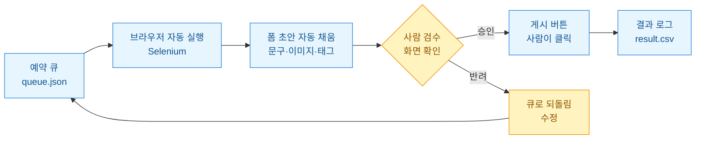
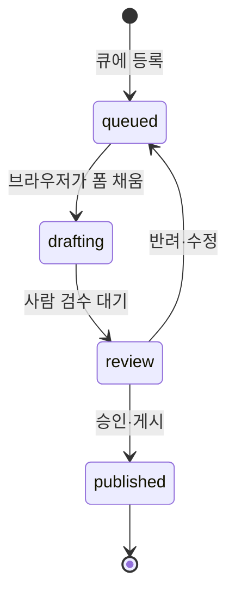

여러 채널에 같은 캠페인 소재를 올리다 보면 손이 모자란다. 이미지 바꾸고 문구 바꾸고 해시태그 붙이고, 채널마다 폼이 미묘하게 달라서 복붙이 지겨워진다. 그래서 "다 자동화해 버릴까" 하는 유혹이 온다. 나도 처음엔 그 생각으로 시작했다.

그런데 완전 자동은 두 번 데였다. 한 번은 문구에 오타가 박힌 초안이 그대로 발행돼서 내려야 했고, 또 한 번은 짧은 시간에 연속 게시하다 계정이 하루 잠겼다. 그때 방향을 틀었다. **폼 채우는 지겨운 일은 기계가, "게시" 버튼 누르는 판단은 사람이.** 이게 human-in-the-loop(사람이 중간에 끼어 최종 결정을 내리는 자동화)다. 이 글은 그 반자동 업로더를 어떻게 짰는지 회고다.



노란 블록이 사람이 개입하는 지점이다. 나머지는 다 기계가 한다. 이 경계선 하나가 사고를 막아준다.

## 왜 완전 자동을 버렸나?

이유는 세 가지였다. 정리하고 나니 명확해졌다.

| 완전 자동의 문제 | 반자동에서 어떻게 막나 |
|---|---|
| 오타·잘못된 이미지가 그대로 발행 | 사람이 화면에서 최종 확인 |
| 짧은 간격 연속 게시로 계정 잠김 | 사람 클릭 속도 자체가 자연스러운 텀 |
| 약관상 "자동 게시" 소지 | 실제 게시 행위는 사람 손 |

특히 세 번째가 중요하다. 대부분의 SNS 약관은 **자동화된 대량 행동**을 제한한다. 폼을 미리 채워두는 건 내 브라우저에서 내가 입력을 돕는 것에 가깝지만, 사람 확인 없이 무한 발행하는 건 선을 넘는다. 그 선을 코드 구조로 그어둔 게 human-in-the-loop다. 애매하면 사람 쪽으로 붙였다.

그리고 솔직히 말하면 완전 자동은 **디버깅이 지옥**이다. 발행이 끝난 뒤에야 뭐가 잘못됐는지 안다. 반자동은 게시 직전에 항상 눈으로 보니까 사고가 사고가 되기 전에 잡힌다.

## 예약 큐는 어떻게 생겼나?

무엇을 언제 어느 채널에 올릴지를 하나의 큐 파일로 관리했다. DB까지 갈 필요 없이 JSON 한 장이면 충분했다. 상태(status) 필드로 초안·검수대기·발행완료를 구분한다.



큐 항목은 이렇게 생겼다. 채널별로 조금씩 다른 필드가 있어도 공통 골격은 유지했다.

```python
# queue.json 한 항목 (합성 예시)
{
    "id": "camp-0421",
    "channel": "instagram",
    "caption": "가을 신상 입고 안내 #가을코디 #신상",
    "image_path": "./assets/fall_0421.jpg",
    "scheduled_at": "2026-07-17T14:00:00",
    "status": "queued"
}
```

핵심은 **status를 코드가 함부로 published로 바꾸지 않는다는 점**이다. `review`까지만 기계가 올리고, `published`로 넘기는 순간은 사람이 버튼을 누른 뒤 콜백에서만 기록한다. 상태 하나로 사람과 기계의 책임을 나눴다.

## Selenium으로 폼만 채우고 멈추려면?

가장 중요한 원칙 하나. **submit()을 코드에 넣지 않는다.** 문구도 넣고 이미지도 첨부하고 해시태그까지 다 채우되, 마지막 게시 버튼은 건드리지 않고 브라우저를 사람에게 넘긴다.

```python
from selenium import webdriver
from selenium.webdriver.common.by import By
from selenium.webdriver.support.ui import WebDriverWait
from selenium.webdriver.support import expected_conditions as EC

def draft_post(driver, item):
    # 셀렉터는 채널마다 다르므로 예시용 더미
    caption_box = WebDriverWait(driver, 20).until(
        EC.presence_of_element_located((By.CSS_SELECTOR, "textarea[aria-label='내용']"))
    )
    caption_box.clear()
    caption_box.send_keys(item["caption"])

    # 파일 첨부는 input[type=file]에 경로를 직접 전달
    upload = driver.find_element(By.CSS_SELECTOR, "input[type='file']")
    upload.send_keys(item["image_path"])

    print(f"[초안 완료] {item['id']} — 화면 확인 후 직접 게시하세요.")
    # ⚠️ 여기서 멈춘다. submit_button.click()을 절대 넣지 않는다.
```

브라우저 세션도 신경 썼다. 매번 새 창을 띄우면 로그인이 반복되고 그게 오히려 봇처럼 보인다. 그래서 **기존 크롬 프로필을 그대로 붙였다.** 로그인 상태가 유지되고 사람이 평소 쓰던 환경이라 자연스럽다.

```python
opts = webdriver.ChromeOptions()
opts.add_argument(r"--user-data-dir=C:\selenium_profile")  # 전용 프로필
opts.add_experimental_option("detach", True)  # 스크립트 끝나도 창 유지
driver = webdriver.Chrome(options=opts)
```

`detach` 옵션이 은근히 중요하다. 스크립트가 끝나도 창이 닫히지 않아야 사람이 느긋하게 검수하고 게시할 수 있다. 이걸 몰라서 처음엔 채우자마자 창이 닫혀 버렸다. 한참 헤맸다.

## 계정 안전과 약관은 어떻게 지켰나?

반자동이라도 지킬 건 지켜야 한다. 내가 세운 규칙은 이렇다.

- **레이트리밋**: 한 번에 여러 건을 몰아 열지 않는다. 한 항목 초안 채우면 사람이 게시할 때까지 다음으로 안 넘어간다. 자연스러운 텀이 저절로 생긴다.
- **전용 프로필 분리**: 자동화용 크롬 프로필을 개인 것과 분리했다. 문제가 생겨도 격리된다.
- **셀렉터 하드코딩 최소화**: 채널 UI는 자주 바뀐다. 셀렉터를 못 찾으면 즉시 멈추고 사람을 부른다. 조용히 엉뚱한 곳에 입력하는 게 최악이다.
- **robots·약관 확인**: 자동 게시를 명시적으로 금지하는 채널은 아예 대상에서 뺐다. 반자동도 회색지대면 손 안 댔다.

이 부분은 타협하지 않았다. 자동화로 아낀 시간보다 계정 하나 날리는 손실이 훨씬 크기 때문이다. 마케팅 자동화에서 제일 비싼 실수는 속도가 아니라 **복구 불가능한 사고**다.

## 남은 이야기

반자동으로 바꾸고 나서 체감상 손은 절반 이하로 줄었다. 그런데 더 좋았던 건 **마음이 편해진 것**이다. 게시 직전에 항상 내 눈이 한 번 지나가니까 "혹시 오타 났나" 하는 불안이 없다.

다음엔 검수 화면에 자동 미리보기(썸네일·글자수·해시태그 개수)를 붙여서 사람이 더 빨리 판단하게 만들 생각이다. 자동화의 목표는 사람을 없애는 게 아니라 사람이 **판단만** 하게 돕는 것이더라. 지겨운 건 기계에게, 책임은 나에게. 그 선을 코드로 그어두는 게 이 패턴의 전부다.
