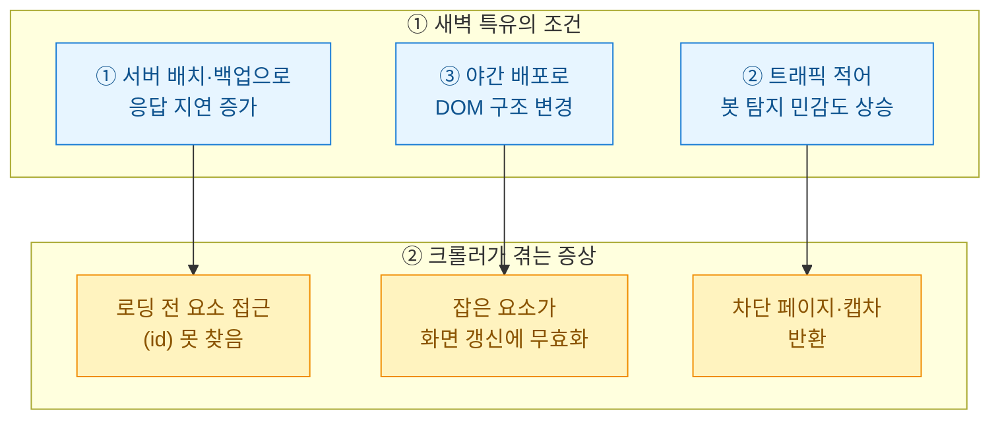
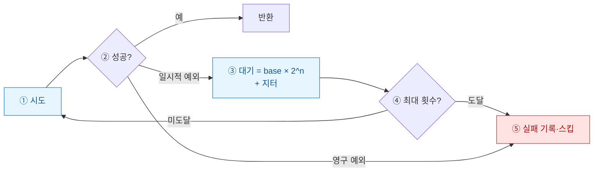

새벽 3시에 도는 크롤러가 아침에 열어보면 절반쯤 죽어 있다. 낮에 손으로 돌리면 멀쩡한데 무인 스케줄에서만 터진다. 이 글은 그 "새벽에만 멈춤" 현상을 뜯어보고, 예외를 세 갈래로 분류한 뒤 대기·재시도·부분 실패 허용으로 안정화한 내 정리다. 모든 코드와 수치는 합성/더미다.

## 왜 새벽에만 멈추나?

낮에 안 터지던 게 새벽에만 터지는 건 우연이 아니다. 원인을 도식으로 먼저 세워두면 대응이 갈린다.



핵심은 **"내 코드가 틀린 게 아니라 환경이 흔들린다"**는 점이다. 그래서 고쳐야 할 대상도 로직이 아니라 대기·재시도 전략이 된다.

## 어떤 예외를 어떻게 분류하나?

무작정 `try/except`로 다 잡으면 영영 원인을 못 본다. 나는 예외를 성격별로 세 종류로 나눈다.

| 분류 | 대표 예외 | 성격 | 대응 |
|------|-----------|------|------|
| **일시적(transient)** | `TimeoutException`, `StaleElementReferenceException` | 다시 하면 될 확률 높음 | 재시도 + 지수 백오프 |
| **차단(blocked)** | 캡차/403 페이지, `NoSuchElementException`(차단 문구) | 즉시 재시도는 역효과 | 긴 대기 후 소량 재시도, 헤더·세션 교체 |
| **영구(permanent)** | 셀렉터 자체가 사라짐, URL 404 | 재시도해도 동일 실패 | 재시도 없이 기록·스킵 |

**stale element(요소 무효화)**는 특히 오해가 많다. 요소를 잡은 뒤 페이지가 부분 갱신되면, 잡아둔 참조가 낡아버려 접근 순간 예외가 난다. 이건 재시도로 요소를 다시 잡아야지, 원래 참조를 붙들면 계속 실패한다.

## 대기는 어떻게 걸어야 하나?

`time.sleep(5)` 같은 고정 대기는 새벽에 배신한다. 빠를 땐 낭비, 느릴 땐 부족하다. 조건이 충족되면 즉시 넘어가는 **명시적 대기(explicit wait)**가 정답이다.

```python
from selenium.webdriver.support.ui import WebDriverWait
from selenium.webdriver.support import expected_conditions as EC
from selenium.webdriver.common.by import By
from selenium.common.exceptions import (
    TimeoutException, StaleElementReferenceException,
)

def get_text(driver, css, timeout=15):
    # 요소가 "화면에 보일 때까지" 최대 timeout초 기다렸다가 잡는다
    wait = WebDriverWait(driver, timeout)
    el = wait.until(EC.visibility_of_element_located((By.CSS_SELECTOR, css)))
    return el.text
```

`presence`(DOM에 존재)와 `visibility`(실제로 보임)는 다르다. 새벽 지연 구간에서는 DOM엔 있는데 아직 안 그려진 요소가 흔해서, 나는 값을 읽을 땐 `visibility` 쪽을 기본으로 쓴다.

## 재시도와 백오프는 어떻게 짜나?

일시적 예외만 골라 재시도하되, 매번 대기를 늘려 상대 서버를 몰아붙이지 않는 게 지수 백오프다.



```python
import random, time

TRANSIENT = (TimeoutException, StaleElementReferenceException)

def with_retry(fn, tries=4, base=1.5):
    for n in range(tries):
        try:
            return fn()
        except TRANSIENT:
            if n == tries - 1:
                raise                      # 마지막 시도면 그대로 올려보낸다
            delay = base * (2 ** n) + random.uniform(0, 1)  # 지터로 몰림 방지
            time.sleep(delay)              # 1.5s → 3s → 6s ... 점점 늘림
```

지터(무작위 소량 가산)를 빼면 여러 워커가 같은 순간 재시도하며 다시 부딪친다. 새벽 배치에서 특히 중요한 디테일이다.

## 일부만 실패하면 전체를 버려야 하나?

아니다. 100개 페이지 중 3개가 차단됐다고 배치 전체를 실패로 처리하면, 성한 97개까지 날린다. **부분 실패 허용(graceful degradation)**으로 성공분은 저장하고 실패분만 따로 남긴다.

| 정책 | 설명 | 효과 |
|------|------|------|
| 항목 단위 격리 | 한 항목 예외가 루프를 안 죽이게 감쌈 | 나머지 계속 수집 |
| 실패 큐 적재 | 실패 항목만 `failed.jsonl`에 기록 | 낮에 재처리 가능 |
| 임계치 차단기 | 연속 실패율이 기준 넘으면 전체 중단 | 차단 감지 시 폭주 방지 |

```python
results, failed = [], []
for url in urls:
    try:
        results.append(with_retry(lambda: scrape_one(driver, url)))
    except Exception as e:                 # 최종 실패만 여기 도달
        failed.append({"url": url, "error": type(e).__name__})
# results는 저장, failed는 다음 새벽 재시도 큐로
```

여기에 "연속 20건 실패 시 중단" 같은 **차단기(circuit breaker)**를 얹으면, 봇 차단이 시작됐을 때 무의미한 요청 폭주를 막고 IP·세션을 보호할 수 있다.

## 정리하면

새벽 실패는 대개 내 로직이 아니라 흔들리는 환경 탓이다. 그러니 (1) 예외를 일시적·차단·영구로 나눠 보고, (2) 고정 sleep 대신 명시적 대기로 조건을 기다리고, (3) 일시적 예외에만 지터 섞은 지수 백오프를 걸고, (4) 부분 실패를 허용해 성공분을 지키며 실패분만 재처리 큐로 넘긴다. 이 네 가지를 걸어두고 나서야 나는 아침에 로그를 편한 마음으로 열게 됐다.
