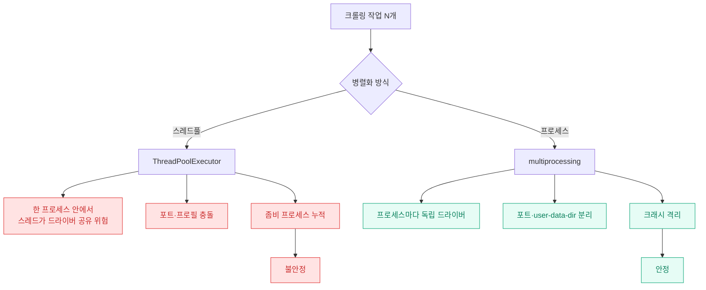
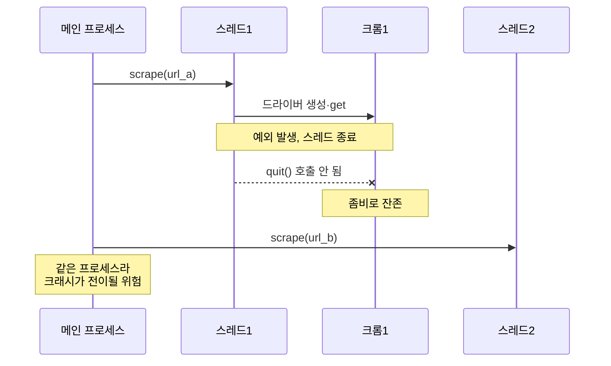
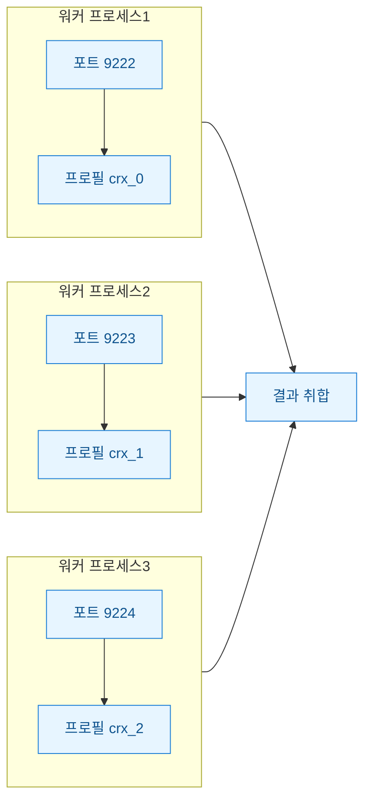

크롤링 대상이 수백 페이지로 불어나자 순차 실행으로는 밤을 새워도 안 끝났다. 브라우저 한 대가 한 페이지 여는 동안 CPU는 거의 놀고 있으니 "여러 대 동시에 띄우면 되겠지" 싶었다. 처음엔 당연히 `ThreadPoolExecutor`(스레드 여러 개를 풀로 관리하는 파이썬 병렬 실행 도구)로 갔다. 코드 몇 줄이면 되니까. 그런데 스레드 8개를 돌리자 드라이버가 서로 세션을 헷갈리고 좀비 프로세스가 쌓였다. 결국 프로세스 분리로 갈아엎고 나서야 안정됐다. 그 과정을 정리한다.

먼저 두 갈래를 한눈에.



## 스레드풀로 드라이버를 돌리면 뭐가 문제였나?

가장 흔한 오해부터 짚는다. "파이썬은 GIL(한 번에 스레드 하나만 파이썬 바이트코드를 실행하게 막는 잠금) 때문에 스레드 병렬이 의미 없다"는 말. Selenium은 예외에 가깝다. 실제 무거운 일은 브라우저와 통신하는 I/O 대기라서 GIL은 병목이 아니다. 스레드로도 동시성 이득은 분명히 났다.

진짜 문제는 다른 데 있었다. **WebDriver 객체와 브라우저 세션은 스레드 세이프(여러 스레드가 동시에 만져도 안전한 상태)가 아니다.** 실수로 드라이버 하나를 여러 스레드가 공유하면, A스레드가 연 페이지를 B스레드가 읽어버리는 상황이 생긴다.

```python
# 위험한 패턴: 드라이버 하나를 스레드가 공유
driver = webdriver.Chrome()

def scrape(url):
    driver.get(url)          # 다른 스레드가 방금 연 페이지를 덮어씀
    return driver.title      # 엉뚱한 페이지 제목이 섞여 나옴

with ThreadPoolExecutor(max_workers=8) as ex:
    ex.map(scrape, urls)     # 결과가 뒤죽박죽
```

"그럼 스레드마다 드라이버를 새로 만들면 되잖아"가 다음 시도였다. 맞다. 스레드 로컬(스레드별로 격리된 저장 공간)에 드라이버를 하나씩 두면 세션 혼선은 사라진다.

```python
import threading
_local = threading.local()

def get_driver():
    if not hasattr(_local, "driver"):
        opts = webdriver.ChromeOptions()
        opts.add_argument("--headless=new")
        _local.driver = webdriver.Chrome(options=opts)
    return _local.driver

def scrape(url):
    d = get_driver()
    d.get(url)
    return d.title
```

이걸로 데이터 섞임은 잡혔다. 그런데 이번엔 다른 게 터졌다.

## 스레드마다 드라이버를 새로 만들어도 왜 불안정했나?

크롬 드라이버 8개를 같은 프로세스 안에서 띄우자 두 가지가 겹쳐 왔다.

첫째, **자원 충돌.** 크롬은 기본적으로 임시 사용자 프로필(`user-data-dir`)과 디버깅 포트를 잡는다. 옵션을 안 주면 여러 인스턴스가 같은 프로필 경로나 포트를 노려 간헐적으로 `DevToolsActivePort file doesn't exist` 같은 에러가 났다. 되다 안 되다 하는 게 제일 골치였다.

둘째, **정리 실패.** 스레드 하나가 예외로 죽으면 그 스레드가 쥐고 있던 크롬 프로세스가 안 닫히고 남는다. 부모 파이썬 프로세스는 멀쩡하니 OS 입장에선 좀비를 회수할 이유가 없다. 몇 시간 돌리면 `chrome.exe`가 수십 개 쌓여 메모리를 먹었다.



한 프로세스 안에 다 모여 있다는 게 핵심 약점이었다. 크롬 하나가 심하게 뻗으면 그 여파가 프로세스 전체로 번질 수 있다. 격리가 없었다.

## 프로세스 분리·포트 분리로 어떻게 안정화했나?

방향을 바꿨다. 스레드가 아니라 **프로세스**로 나눴다. `ProcessPoolExecutor`나 `multiprocessing`을 쓰면 워커마다 완전히 독립된 파이썬 인터프리터가 뜬다. 드라이버도, 메모리도, 크래시도 프로세스 경계 안에 갇힌다.

여기에 두 가지를 덧붙였다. **워커마다 디버깅 포트를 다르게**, 그리고 **`user-data-dir`도 워커마다 다른 임시 폴더로**. 이 둘을 분리하니 자원 충돌이 사라졌다.

```python
import tempfile, os
from concurrent.futures import ProcessPoolExecutor
from selenium import webdriver

def scrape(args):
    idx, url = args
    opts = webdriver.ChromeOptions()
    opts.add_argument("--headless=new")
    # ① 워커별 포트 분리
    opts.add_argument(f"--remote-debugging-port={9222 + idx}")
    # ② 워커별 프로필 분리
    profile = tempfile.mkdtemp(prefix=f"crx_{idx}_")
    opts.add_argument(f"--user-data-dir={profile}")

    driver = webdriver.Chrome(options=opts)
    try:
        driver.get(url)
        return driver.title
    finally:
        driver.quit()        # ③ 무슨 일이 있어도 정리

if __name__ == "__main__":
    tasks = list(enumerate(urls))
    with ProcessPoolExecutor(max_workers=4) as ex:
        results = list(ex.map(scrape, tasks))
```

여기서 배운 세 가지를 못 박아 둔다.

- **`finally`에서 반드시 `driver.quit()`.** `close()`는 탭만 닫고 드라이버 프로세스는 남긴다. `quit()`이라야 크롬까지 정리된다. 프로세스 격리가 있어도 정리는 내 손으로 해야 한다.
- **포트는 인덱스로 오프셋.** `9222 + idx`처럼 겹치지 않게 준다. 안 그러면 프로세스를 나눠도 포트에서 다시 부딪힌다.
- **워커 수는 코어 수 언저리로.** 스레드는 헤드리스라도 CPU를 은근히 먹는다. 내 경우엔 물리 코어 수와 비슷하게 잡을 때 가장 덜 터졌다. 무작정 올리면 스와핑으로 오히려 느려졌다.



## 그래서 언제 뭘 쓰면 되나?

무조건 프로세스가 답은 아니다. 프로세스 분리는 실행 시작 비용(각 인터프리터·크롬 기동)이 크고, 워커 간에 데이터를 주고받을 때 직렬화(객체를 전송 가능한 바이트로 바꾸는 과정) 비용이 붙는다. 정리하면 이렇다.

| 기준 | ThreadPoolExecutor | ProcessPoolExecutor |
|---|---|---|
| 세션 격리 | 스레드 로컬로 수동 관리 | 프로세스가 자동 격리 |
| 크래시 전이 | 같은 프로세스라 전이 위험 | 워커 단위로 차단 |
| 좀비 정리 | 누락 시 계속 쌓임 | 워커 종료 시 회수 쉬움 |
| 시작 비용 | 가볍다 | 무겁다(인터프리터·크롬 기동) |
| 적합한 경우 | 소량·짧은 작업 | 대량·장시간·안정성 우선 |

내 결론은 단순했다. **몇십 건 짧게 훑을 땐 스레드풀로 충분하다. 수백 건을 몇 시간씩 안정적으로 돌려야 하면 프로세스 분리 + 포트·프로필 분리 + `finally` 정리**로 가는 게 마음이 편했다. 병렬 대수를 늘리는 것보다, 하나가 죽어도 나머지가 안 죽는 구조를 만드는 게 결국 총 시간을 줄였다.

마지막으로 크롤링 공통 주의. 병렬로 속도가 붙는 만큼 상대 서버에 부담이 커진다. `robots.txt`와 이용약관을 먼저 확인하고, 워커 수와 요청 간격으로 레이트리밋(요청 속도 제한)을 스스로 걸어 두자. "동시에 몇 대까지 되나"보다 "상대가 감당하는 선"이 먼저다.

다음엔 프로세스 풀 위에서 실패한 작업만 골라 재시도하는 큐를 얹어 볼 생각이다.
