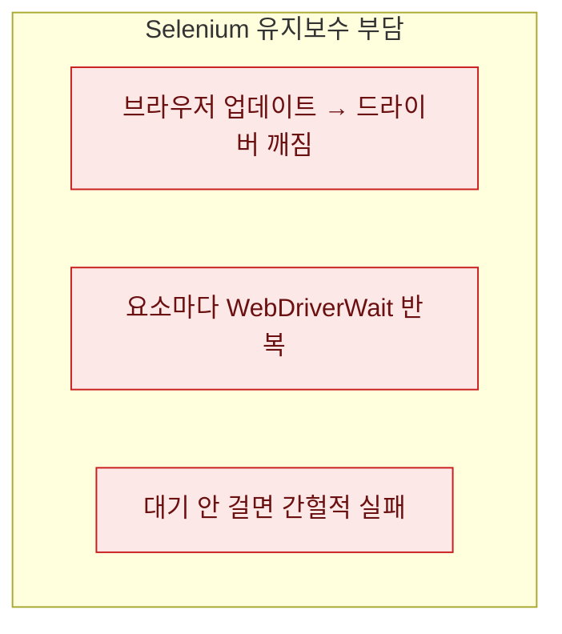

# Selenium에서 Playwright로 갈아탄 이유

> 크롤러 상당수를 Selenium으로 짜뒀었다. 잘 돌아갔다. 그런데 어느 순간부터 유지보수의 절반이 **크롤링 로직이 아니라 도구 시중들기**였다. 크롬이 업데이트되면 드라이버를 맞추고, 요소가 늦게 뜨면 대기 코드를 또 짜고. 그래서 Playwright로 옮겨봤는데, 예상보다 코드가 많이 줄었다. 이 글은 그 마이그레이션 회고다. (도구 선택 기준 자체는 [크롤링 도구 3종 의사결정](/blog/requests-selenium-playwright-decision) 글에서 다뤘고, 여기선 '옮긴 경험'에 집중한다.)

## 뭐가 그렇게 거슬렸나?

두 가지였다. 하나는 **드라이버 버전 지옥**. Selenium은 브라우저와 별도로 드라이버(chromedriver 등)를 맞춰야 하는데, 브라우저가 자동 업데이트되면 드라이버가 어긋나 크롤러가 죽는다. 자동 설치 도구로 덧대긴 했지만 근본 해결은 아니었다. 다른 하나는 **명시적 대기 반복**. 요소가 렌더될 때까지 기다리는 `WebDriverWait` 코드를, 클릭·입력마다 손으로 짜야 했다.



세 번째, C가 특히 골치였다. 대기를 빼먹으면 로컬에선 되는데 서버에선 가끔 실패하는, 재현 안 되는 버그가 났다.

## before / after — 같은 일, 다른 길이

로그인 폼을 채우고 결과를 읽는 흔한 작업을 비교해보자. Selenium은 대기를 명시적으로 건다.

```python
# Selenium — 명시적 대기를 매번
from selenium.webdriver.support.ui import WebDriverWait
from selenium.webdriver.support import expected_conditions as EC
from selenium.webdriver.common.by import By

wait = WebDriverWait(driver, 10)
box = wait.until(EC.presence_of_element_located((By.CSS_SELECTOR, "#q")))
box.send_keys("keyword")
btn = wait.until(EC.element_to_be_clickable((By.CSS_SELECTOR, "#go")))
btn.click()
result = wait.until(EC.presence_of_element_located((By.CSS_SELECTOR, ".result")))
print(result.text)
```

Playwright는 **요소가 준비될 때까지 알아서 기다린다(auto-wait).** 그래서 대기 코드가 그냥 사라진다.

```python
# Playwright — auto-wait 내장
page.fill("#q", "keyword")            # 나타날 때까지 자동 대기
page.click("#go")                     # 클릭 가능해질 때까지 자동 대기
print(page.text_content(".result"))   # 렌더될 때까지 자동 대기
```

줄 수만 준 게 아니라, **"대기를 빼먹어서 나는 간헐 실패"라는 버그 종류 자체가 없어졌다.** 이게 제일 컸다.

## 실제로 없어진 것들

옮기고 나서 코드베이스에서 통째로 사라진 항목들이다.

| 사라진 것 | 이유 |
|---|---|
| 드라이버 설치·버전 맞춤 | Playwright가 브라우저를 직접 관리 |
| `WebDriverWait` / `expected_conditions` | auto-wait 내장 |
| 대기 누락발 간헐 실패 | 위와 동일 |
| 창 전환·프레임 대기 잡코드 | 셀렉터·API가 정리돼 있음 |

체감상 브라우저 자동화 관련 코드가 3할가량 줄었다. 네트워크 응답을 기다리거나 특정 텍스트가 뜰 때까지 대기하는 것도 한 줄(`wait_for_selector`, `wait_for_load_state`)이라, 예전 같으면 헬퍼 함수로 감싸던 걸 그냥 인라인으로 쓴다.

## 공짜는 아니다 — 옮기며 깨진 것들

마이그레이션이 무통은 아니었다. **셀렉터·API 문법이 다르다.** `find_element(By.CSS_SELECTOR, ...)`는 `page.locator(...)`나 `page.click(...)`로 바뀌고, 대기·예외 처리 관용구가 전부 달라서 기계적 치환이 안 된다. **동기/비동기 선택** — Playwright는 동기 API와 async API가 나뉘어, 기존 코드 구조에 맞는 쪽을 골라야 한다. **다이얼로그·팝업 처리**도 이벤트 핸들러 방식이 달라 따로 손봤다. 그래서 나는 한 번에 다 옮기지 않고, 자주 깨지던 크롤러부터 하나씩 이관했다.

## 그럼 무조건 옮겨야 하나?

아니다. **이미 Selenium 위에 크고 안정적인 코드가 쌓여 있고 잘 돌아간다면, 굳이 옮길 이유는 없다.** 마이그레이션 비용이 auto-wait의 이득을 넘길 수 있다. 내 기준은 이랬다 — 새로 시작하는 브라우저 자동화는 Playwright를 기본값으로, 기존 것은 "유지보수가 자주 터지는 것부터" 점진 이관. 멀쩡한 걸 취미로 갈아엎지는 않았다.

## 덤으로 얻은 것 — 네트워크 가로채기

옮기고 나서 예상 못 한 소득이 있었다. Playwright는 **네트워크 요청을 가로채고 응답을 들여다보는 기능**이 내장이라, 앞서 [도구 3종 글](/blog/requests-selenium-playwright-decision)에서 말한 "숨은 API 찾기"가 코드 안에서 바로 된다. 페이지가 뒤에서 어떤 JSON을 받아오는지 잡아내면, 그 API를 requests로 내려 아예 브라우저를 뗄 수도 있다.

```python
# 페이지가 부르는 API 응답을 코드에서 관찰
page.on("response", lambda r: print(r.url) if "/api/" in r.url else None)
page.goto("https://example.com/list")
```

즉 Playwright는 "브라우저를 계속 쓰는 도구"이면서 동시에 **"브라우저를 벗어날 실마리를 주는 도구"**였다. 무거운 자동화로 시작해서, 관찰한 API로 가벼운 크롤러로 내려가는 경로가 자연스럽게 열린다. Selenium 시절엔 이걸 위해 별도 프록시를 붙여야 했다.

## 정리 — 도구가 대신 기다려주면 코드가 준다

| 관점 | Selenium | Playwright |
|---|---|---|
| 대기 | 명시적으로 매번 | auto-wait 내장 |
| 드라이버 | 버전 관리 필요 | 자동 관리 |
| 간헐 실패 | 대기 누락발 잦음 | 크게 감소 |
| 이관 비용 | — | 문법 차이로 수동 필요 |

> 좋은 도구는 기능이 많은 도구가 아니라, **내가 안 짜도 되는 코드를 없애주는 도구**더라. Playwright로 옮기며 배운 건, 사라진 코드가 원래 없었어도 될 코드였다는 사실이다. 대기를 사람이 챙기는 건, 원래 도구의 일이었다.

*수집은 대상 사이트의 robots·이용약관·호출 한도를 준수하는 범위에서만 이뤄져야 합니다.*
