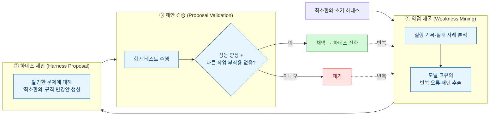
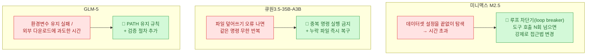

> **하네스가 스스로 진화한다** 시리즈 — [[harness-engineering-for-self-improvement-lilian-weng|① 릴리언 웽 개관]] · **② Self-Harness(이 글)** · [[harnessx-xiaomi-composable-evolvable-harness|③ 샤오미 HarnessX]]

앞 글에서 릴리언 웽이 논문 35편을 5개 서랍에 넣는 걸 봤다. 이번엔 그중 서랍 ③(자기개선 하네스)에 들어간 논문 하나를 열어 **실측치까지** 본다. 상하이 AI 연구소의 **Self-Harness**(arXiv:2606.09498)다.

한 줄 요약: **모델은 한 글자도 안 바꾸고, 에이전트가 자기 실패 로그를 읽어 스스로 운영 규칙을 고쳐 쓴다.** 그것만으로 통과율이 40.5%에서 61.9%로 뛴다.

## 왜 모델이 아니라 하네스를 고치나

에이전트가 실전에서 헛발질하는 상당수는 **모델 지능의 한계가 아니라 하네스 설계 문제**에서 온다. 코드 실행 결과를 검증도 안 하고 "성공"이라 우기거나, 같은 실패 작업을 무한 반복하거나. 이런 건 더 큰 모델을 붙인다고 안 고쳐진다 — **규칙을 고쳐야** 고쳐진다.

문제는 지금까지 그 규칙 수정을 **숙련 엔지니어가 손으로** 했다는 것. 모델 종류는 폭발하고 업데이트 주기는 빨라지는데, 사람이 모델마다 하네스를 튜닝하는 방식은 확장이 안 된다. Self-Harness는 그 튜닝을 **에이전트 자신에게** 넘긴다. 더 센 외부 모델도, 인간 전문가도 없이.

## 3단계 루프 — 약점 채굴 → 제안 → 검증

핵심은 두 가지다. 첫째, **"최소한의" 변경**. 프롬프트를 길게 늘이거나 일반 지침을 덕지덕지 붙이는 게 아니라, 각 모델이 반복해서 드러내는 고유 약점을 **실제 실행 규칙 한 줄**로 번역한다. 둘째, **회귀 테스트 게이트**. 수정안이 이 작업은 고쳐도 저 작업을 망가뜨리면 채택하지 않는다. [[fable5-maker-checker-separation-setup|만드는 쪽과 검증하는 쪽을 분리]]하는 그 원칙이 여기서도 안전장치로 박혀 있다.

## 세 모델, 세 가지 다른 실패, 세 가지 다른 처방

이 논문에서 제일 재밌는 대목. **모델마다 실패하는 방식이 달랐고, Self-Harness도 각기 다른 해법을 만들어냈다.** "일반 지침"이 아니라 "이 모델의 이 버릇"을 잡았다는 증거다.

## 결과 — Terminal-Bench-2.0 통과율 (실측)

세 모델 모두 **모델을 안 바꾸고 하네스만 진화**시켜 유의미하게 올랐다. 아래 수치는 [arXiv 원문](https://arxiv.org/abs/2606.09498)과 대조해 일치를 확인했다(국내 2차 보도도 정확했다).

| 모델 | 하네스 진화 전 | 진화 후 | 상대 향상 |
|---|---|---|---|
| 미니맥스 M2.5 | 40.5% | **61.9%** | +53% |
| 큐원3.5-35B-A3B | 23.8% | **38.1%** | +60% |
| GLM-5 | 42.9% | **57.1%** | +33% |

모델 가중치는 그대로인데 **상대 33\~60% 향상**. "성능 올리려면 무조건 더 큰 모델"이라는 통념에 대한 반례다.

## ⚠️ 이건 인간 개발자 대체가 아니다

논문이 스스로 못 박은 한계를 그대로 옮긴다 — 과장 방지 차원에서 중요하다.

- **공짜가 아니다.** 대량의 평가·회귀 테스트를 돌려야 하니 계산 비용이 상당하다.
- **정확한 평가 체계가 전제**여야 작동한다. 그래서 코드 작성·내부 업무 자동화·DevOps 파이프라인처럼 **결과를 객관적으로 측정할 수 있는 곳**에서 가장 강하다.
- 반대로 **의료 진단·법률 판단·핵심 인프라**처럼 평가 기준이 주관적이거나 실패 비용이 큰 영역엔 아직 못 쓴다.

이건 릴리언 웽이 꼽은 7난제 중 **①약한 평가자·⑤보상 해킹**과 정확히 같은 지점이다. 평가가 물러지면 자기개선 루프는 엉뚱한 걸 최적화한다.

## 그래서 엔지니어는 뭘 하나 — '피드백 아키텍트'

논문의 전망이 인상적이다. 지금까지 엔지니어의 일이 **프롬프트와 도구 규칙을 직접 고치는 것**이었다면, 앞으로는 **AI가 스스로 개선하도록 평가 체계와 피드백 루프를 설계하는** 역할 — 이른바 **피드백 아키텍트(Feedback Architect)** — 이 더 중요해진다는 것.

나한테는 이게 남 얘기가 아니다. 크롤링·DART·블로그·데이터 자동화를 굴리다 보면, 결국 **"무엇을 성공으로 볼 것인가"를 어떻게 코드로 박느냐**가 자동화 품질을 좌우한다. Self-Harness는 그 평가 설계가 이제 **자기개선의 연료**가 된다고 말하는 셈이다.

## 마무리

Self-Harness는 릴리언 웽 지도의 서랍 ③을 실측으로 채운다 — **모델 불변, 하네스 진화, 회귀 테스트 게이트, 모델별 맞춤 처방.** 다음 글에선 여기에 **가중치 학습까지 붙인** 샤오미 HarnessX를 연다. "하네스만" vs "하네스+모델 공진화"의 차이가 거기서 갈린다.

## 참고자료

- [Self-Harness: Harnesses That Improve Themselves (arXiv:2606.09498)](https://arxiv.org/abs/2606.09498) · [HuggingFace Papers](https://huggingface.co/papers/2606.09498)
- 관련: [[harness-engineering-for-self-improvement-lilian-weng|릴리언 웽 개관]] · [[harnessx-xiaomi-composable-evolvable-harness|샤오미 HarnessX]] · [[fable5-maker-checker-separation-setup|maker≠checker]]

<!-- 안전: 회사 실데이터·고객/제3자 PII·API키/쿠키/토큰 없음. arXiv 원문 요약·논평 + 출처 링크. 수치는 1차 출처 대조. -->
