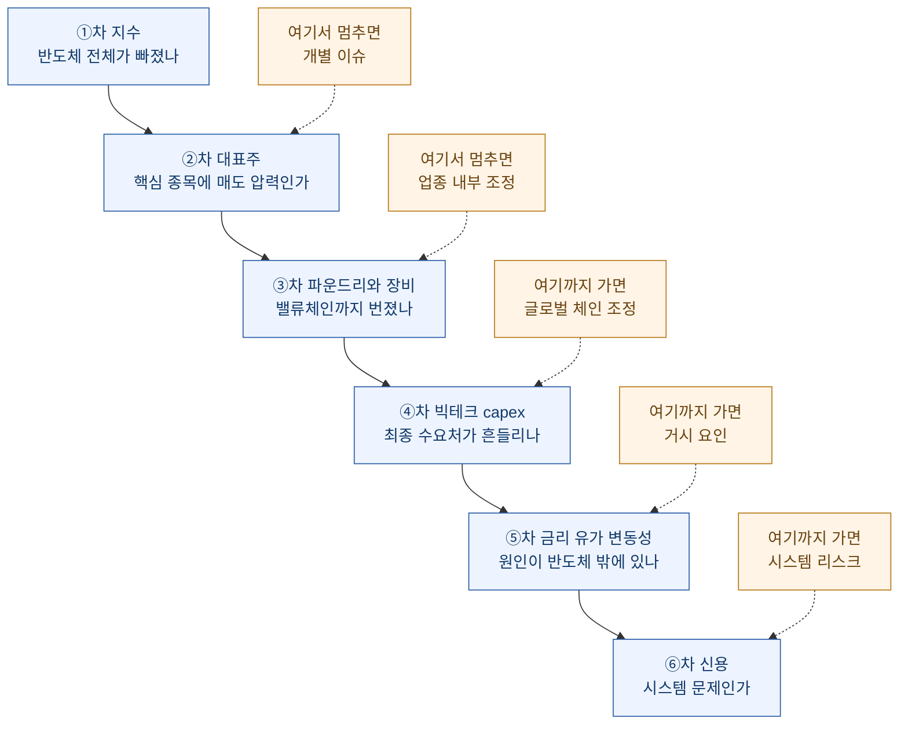
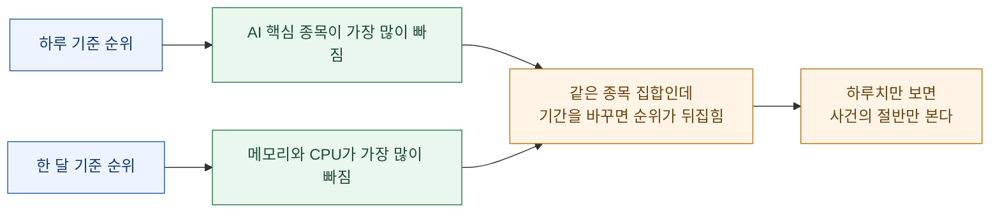
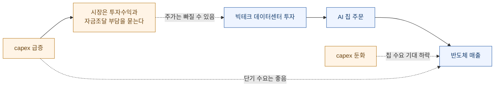
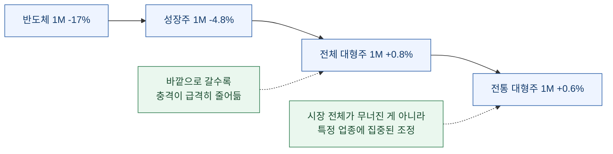
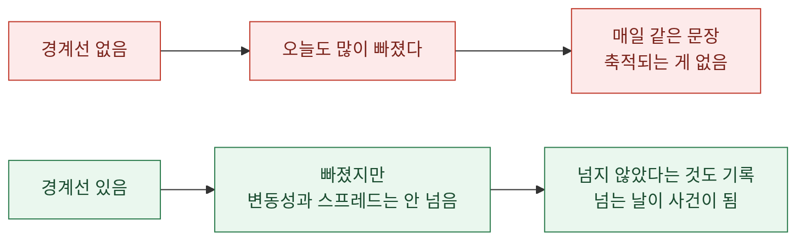

반도체 관련 지수가 크게 빠진 날, 처음에 내가 하던 일은 그 지수를 더 들여다보는 것이었다. 며칠 치를 놓고, 1개월을 보고, 1년을 보고. 그런데 아무리 봐도 **"많이 빠졌다"** 이상이 안 나왔다.

당연하다. **하나의 지표는 방향과 크기만 알려준다. 원인은 지표 하나 안에 없다.**

그래서 순서를 만들었다. 지수에서 시작해 바깥으로 한 겹씩 넓히면서, 각 단계마다 "여기까지 번졌나"를 묻는 방식이다. 다섯 단계를 통과시키면 같은 하락이라도 성격이 갈린다.

이 글은 그 진단 순서를 정리한 것이다. 앞 편([yfinance·FRED 시장 데이터 수집 파이프라인](https://dbhyeong.github.io/blog/yfinance-fred-market-data-pipeline))에서 모은 데이터를 실제로 쓰는 단계에 해당한다.

## 왜 순서가 필요한가

같은 하락에 붙일 수 있는 이름이 여러 개다.

| 이름 | 뜻 |
|---|---|
| 개별 종목 이슈 | 한 회사에만 있었던 일 |
| 업종 내부 차익실현 | 많이 오른 쪽이 되돌림 |
| 밸류에이션 재평가 | 할인율이 바뀌어 적정가격이 내려감 |
| 사이클 조정 | 업황 자체가 꺾이는 국면 |
| 리스크오프 | 위험자산 전체에서 돈이 빠짐 |
| 신용위기 | 자금조달 자체가 막힘 |

**이 여섯은 대응이 전부 다르다.** 그런데 차트에서는 전부 똑같이 빨간 봉으로 보인다.

이름을 고르려면 **범위**를 확인해야 한다. 어디까지 번졌는지. 그래서 진단이 안에서 밖으로 나가는 순서가 된다.

**멈추는 지점이 곧 진단명이다.** 2단계에서 멈추면 개별 이슈고, 5단계까지 가면 거시 요인이고, 6단계까지 가면 성격이 완전히 달라진다.

아래에서는 2026년 7월 27\~28일 데이터를 실제로 이 순서에 통과시켜 봤다. 수치는 특정 시점 값이고, 중요한 건 숫자가 아니라 **읽는 방식**이다.

## ①차: 지수 — 반도체 전체가 빠졌나

가장 먼저 볼 건 개별 종목이 아니라 업종 지수다. 미국 반도체는 `^SOX`(PHLX Semiconductor)를 본다.

| 지표 | 1D | 1M | YTD | 1Y |
|---|---:|---:|---:|---:|
| `^SOX` | -2.23% | **-17.12%** | +56.84% | +101.41% |

여기서 이미 중요한 게 나온다. **1개월은 -17%인데 1년은 +101%다.**

이 두 숫자를 같이 놓는 게 핵심이다. 1개월만 보면 붕괴처럼 읽히고, 1년만 보면 아무 일도 없는 것처럼 읽힌다. 같이 놓으면 **"많이 오른 뒤의 되돌림"**이라는 세 번째 해석이 나온다.

어제 다른 글에서 정리했던 문장이 여기 그대로 걸린다 — **되돌림과 위험 해소는 다른 사건인데 차트에서는 똑같이 보인다.** 반대 방향도 같다. **되돌림과 추세 붕괴도 다른 사건인데 1개월 차트에서는 똑같이 보인다.**

1차에서 나오는 분기는 이렇다.

| 조건 | 해석 |
|---|---|
| 지수만 약하고 변동성·금리 안정 | 반도체 내부 차익실현 가능성 |
| 지수 약세 + 장기금리 상승 | 성장주 밸류에이션 조정 |
| 지수 약세 + 파운드리·장비 동반 약세 | 글로벌 반도체 체인 조정 |
| 지수 약세 + 변동성 급등 | 위험자산 전체 리스크오프 |

**이 표는 1차에서 답이 안 나온다는 걸 인정하는 표다.** 오른쪽 칸을 채우려면 아직 안 본 지표가 필요하다. 그래서 2차로 간다.

## ②차: 대표주 — 다 같이 빠졌나, 갈렸나

지수는 평균이다. 평균이 빠졌다고 구성종목이 다 빠진 건 아니다.

| 티커 | 종목 | 1D | 1M | 확인 포인트 |
|---|---|---:|---:|---|
| `NVDA` | NVIDIA | -4.99% | +0.39% | AI 수요 최종 확인 |
| `AMD` | AMD | -5.17% | -7.06% | AI GPU 경쟁축 |
| `AVGO` | Broadcom | +0.34% | +1.14% | AI 네트워크·ASIC |
| `MU` | Micron | -2.25% | **-25.81%** | HBM·메모리 사이클 |
| `INTC` | Intel | -0.70% | **-31.01%** | 미국 반도체 제조·CPU |

여기서 두 가지가 보인다.

**첫째, 하루 기준으로는 핵심 AI 종목 두 개가 -5% 안팎이다.** 매도 압력이 AI 쪽에 몰렸다는 뜻이다.

**둘째, 한 달 기준으로 보면 순서가 완전히 바뀐다.** 하루로는 덜 빠진 메모리와 CPU 쪽이 한 달로는 -25%, -31%다. 그리고 하루로 가장 많이 빠진 `NVDA`는 한 달 기준으로 오히려 플러스다.

그리고 `AVGO`는 이날 플러스였다. **모든 AI 관련주가 같은 강도로 무너지는 건 아니다.**

2차에서 나온 판단은 이렇다. 이날은 "AI 반도체 전체가 무너진 날"이라기보다, **과열됐던 반도체 안에서 종목별 차익실현과 밸류에이션 재평가가 동시에 나온 날**에 가깝다.

여기서 실무적으로 중요한 습관 하나. **종목별로 갈렸다면 그건 좋은 신호다.** 다 같이 똑같이 빠지는 건 개별 판단이 사라졌다는 뜻이고, 갈린다는 건 시장이 아직 종목을 구분하고 있다는 뜻이다.

## ③차: 파운드리와 장비 — 밸류체인까지 번졌나

반도체는 설계·제조·장비가 사슬로 엮여 있다. 어디까지 흔들렸는지가 진단을 크게 가른다.

| 티커 | 종목 | 1D | 1M | 위치 |
|---|---|---:|---:|---|
| `TSM` | TSMC ADR | -1.07% | -8.25% | 글로벌 파운드리 |
| `ASML` | ASML ADR | -5.80% | -10.10% | EUV·반도체 장비 |

여기에 아시아 쪽을 겹쳐 보면 그림이 완성된다.

| 티커 | 종목 | 1D | 1M |
|---|---|---:|---:|
| `2330.TW` | TSMC (대만 상장) | -2.98% | -3.80% |
| `2454.TW` | MediaTek | -9.92% | -14.71% |
| `8035.T` | Tokyo Electron | **-10.96%** | -23.31% |
| `6857.T` | Advantest | -10.11% | -21.36% |
| `6146.T` | Disco | **-12.37%** | -30.07% |

일본 장비주가 하루에 -10% 안팎으로 빠졌다. 이건 작은 숫자가 아니다.

판단 기준은 이렇게 정리된다.

| 범위 | 해석 |
|---|---|
| 특정 종목만 하락 | 개별 종목 이슈 가능성 |
| AI 설계 종목 여럿 하락 | AI 반도체 내부 조정 |
| 여기에 파운드리·장비 하락 | 글로벌 AI 반도체 체인 조정 |
| 여기에 한국·대만·일본 동반 하락 | 반도체 민감국 전반 조정 |

이날은 파운드리·장비와 한국·대만·일본이 전부 같이 흔들렸다. **미국 단일 종목 이슈로 보기 어렵다**는 결론이 3차에서 확정된다.

여기서 장비주를 따로 보는 이유를 적어 둔다. **장비는 사이클의 앞쪽에 있다.** 칩을 만드는 회사가 증설을 결정해야 장비 주문이 나가므로, 장비주가 흔들린다는 건 시장이 **지금의 수요가 아니라 앞으로의 증설**을 의심하기 시작했다는 신호로 읽힐 수 있다. 그래서 장비주 하락은 대표주 하락보다 한 겹 더 깊은 이야기다.

### 같은 나라 안에서 갈리는지 보라

3차에서 꼭 같이 하는 보조 확인이 있다. **번진 나라 안에서 업종이 갈리는지**를 보는 것이다.

일본 반도체 장비주가 -10%대로 빠진 그날, 같은 일본 시장의 다른 업종은 이랬다.

| 티커 | 종목 | 1D | 1M | 성격 |
|---|---|---:|---:|---|
| `8035.T` | Tokyo Electron | -10.96% | -23.31% | 반도체 장비 |
| `6146.T` | Disco | -12.37% | -30.07% | 반도체 장비 |
| `9984.T` | SoftBank Group | -4.43% | -18.17% | AI 투자 심리 |
| `7203.T` | Toyota | **+1.43%** | +8.67% | 수출 대형주 |
| `8306.T` | Mitsubishi UFJ | -3.63% | **+12.82%** | 은행·금리 민감 |

같은 나라, 같은 날인데 장비주는 -10%대고 자동차는 플러스, 은행은 한 달 기준 두 자릿수 상승이다.

이게 알려주는 게 명확하다. **"일본 시장이 무너졌다"가 아니라 "일본 반도체 장비주가 조정받았다"**이다. 지수만 봤으면 니케이 -3.95%로 뭉뚱그려졌을 이야기다.

| 관찰 | 진단에 미치는 영향 |
|---|---|
| 한 나라 안에서 업종이 갈림 | 업종 문제. **경기·통화·신용 문제 아님** |
| 한 나라 안에서 전 업종 하락 | 그 나라 고유 문제 가능성 |
| 여러 나라에서 같은 업종만 하락 | **글로벌 업종 사이클** |
| 여러 나라에서 전 업종 하락 | 리스크오프 또는 시스템 문제 |

이날은 세 번째 줄이었다. 여러 나라에서 반도체만 빠졌고, 각 나라의 비반도체 업종은 버텼다.

**축이 두 개라는 게 핵심이다.** 가로로는 "몇 개 나라에 번졌나", 세로로는 "그 나라 안에서 몇 개 업종에 번졌나". 가로만 보면 "아시아 전체가 빠졌다"로 잘못 읽는다. 은행주가 금리 환경에서 오히려 방어했다는 사실 하나가 **"돈 문제는 아니다"**를 꽤 강하게 말해 준다.

## ④차: 빅테크 capex — 최종 수요처가 흔들리나

AI 칩을 사는 쪽을 봐야 파는 쪽이 설명된다.

| 티커 | 기업 | 1D | 1M | 보는 이유 |
|---|---|---:|---:|---|
| `MSFT` | Microsoft | +1.94% | +10.28% | 클라우드·AI 데이터센터 capex |
| `META` | Meta | -0.22% | +9.39% | AI 인프라 투자 |
| `AMZN` | Amazon | -0.31% | +1.93% | 클라우드·데이터센터 |
| `GOOGL` | Alphabet | +2.13% | -4.99% | 클라우드·AI 투자 |

이날 빅테크는 반도체만큼 급락하지 않았다. 오히려 일부는 올랐다.

빅테크 capex를 반도체 진단에 넣는 논리는 이렇다.

여기 비대칭이 있다. **capex가 줄면 칩 수요 기대가 낮아져 반도체에 나쁘고, capex가 늘면 칩 수요에는 좋지만 그 회사 주가에는 나쁠 수 있다.** 실적이 좋아도 투자 규모가 과하면 시장이 회수 가능성을 묻기 때문이다.

그래서 4차의 질문은 "빅테크가 올랐나 내렸나"가 아니라 **"capex 우려가 반도체를 넘어 수요처까지 번졌나"**다. 이날 답은 아니오였다. 일부에 투자 부담이 반영됐지만 전면 패닉은 아니었다.

## 사이 단계: 시장 전체와 대비하기

4차와 5차 사이에 짧게 끼워 넣는 확인이 있다. **반도체 하락이 시장 전체 하락의 일부인가, 반도체만의 일인가.**

| 지수 | 1D | 1M | 성격 |
|---|---:|---:|---|
| `^SOX` 반도체 | -2.23% | **-17.12%** | 업종 |
| `^NDX` 나스닥100 | -0.32% | -4.76% | 성장주 |
| `^GSPC` S&P500 | +0.02% | **+0.76%** | 전체 대형주 |
| `^DJI` 다우 | +0.51% | +0.56% | 전통 대형주 |
| `^RUT` 러셀2000 | +0.62% | -1.99% | 중소형주 |

한 달 기준으로 읽으면 계단이 보인다. **반도체 -17%, 성장주 -4.8%, 전체 +0.8%, 전통 대형주 +0.6%.**

이 계단이 진단에서 하는 역할이 크다. **전체 지수가 플러스인데 업종 하나가 -17%면, 그 돈은 시장을 떠난 게 아니라 시장 안에서 이동했다는 뜻이다.**

| 패턴 | 의미 |
|---|---|
| 업종만 크게 하락, 전체 지수 보합 이상 | **업종 간 자금 이동.** 시장 이탈 아님 |
| 업종 하락, 전체 지수도 비슷하게 하락 | 시장 전체 조정 |
| 업종 하락, 전체 지수 더 크게 하락 | 그 업종이 오히려 방어 중 |

중소형주(`^RUT`)를 같이 보는 이유도 있다. 리스크오프가 진짜로 오면 **중소형주가 대형주보다 먼저, 더 크게 빠진다.** 이날 러셀2000은 하루 기준 플러스였다. 위험선호가 무너진 장이 아니라는 방증이 하나 더 붙는다.

## ⑤차: 금리·유가·변동성 — 원인이 반도체 밖에 있나

여기서 축이 바뀐다. 지금까지는 반도체 안을 봤고, 이제부터는 **반도체를 누르는 바깥 힘**을 본다.

| 지표 | 값 | 반도체에 중요한 이유 |
|---|---:|---|
| `^TNX` 10년물 | 4.641 | 성장주 할인율 |
| `^IRX` 13주 단기금리 | 3.797 | 정책금리 기대 |
| `DX-Y.NYB` 달러지수 | 101.533 | 글로벌 유동성 |
| `^VIX` 변동성지수 | 18.84 | 위험회피·공포 |
| `CL=F` WTI | 80.74 (1M **+16.63%**) | 물가·금리 부담 |
| `BZ=F` 브렌트 | 86.02 (1M **+19.49%**) | 글로벌 물가 |

성장주와 금리의 관계는 단순하다. **먼 미래의 이익을 현재가치로 당겨올 때 나누는 값이 할인율이고, 장기금리가 그 기준이다.** 이익이 먼 미래에 몰려 있을수록 할인율 변화에 민감하다. AI 반도체는 정확히 그런 자산이다.

유가는 한 단계를 거친다. **유가 상승 → 물가 기대 상승 → 금리 인하 기대 후퇴 → 할인율 유지 또는 상승 → 성장주 부담.** 이날 유가는 한 달에 16\~19% 올랐다. 반도체와 직접 관계없어 보이지만 경로가 있다.

변동성지수는 **패닉 여부의 온도계**다. 이날 18.84는 20 아래다.

조합으로 읽으면 이렇게 갈린다.

| 조합 | 의미 |
|---|---|
| 반도체 하락 + 변동성 20 아래 | 패닉보다 선택적 조정 |
| 반도체 하락 + 장기금리 높음 | 밸류에이션 압박 |
| 반도체 하락 + 유가 급등 | 물가·금리 부담이 성장주를 누름 |
| 반도체 하락 + 달러지수 급등 | 글로벌 리스크오프 가능성 |

이날은 **변동성이 20 아래라 패닉은 아니지만, 장기금리와 유가가 부담인 장**으로 읽힌다.

## ⑥차: 신용 — 시스템 문제인가

마지막 단계다. 평소에는 안 봐도 되지만, 봐야 할 때는 앞의 다섯 단계를 전부 무의미하게 만드는 지표들이다.

| 지표 | 값 | 뜻 |
|---|---:|---|
| 하이일드 스프레드 (`BAMLH0A0HYM2`) | 2.79 | 위험기업 자금조달 상태 |
| 투자등급 스프레드 (`BAMLC0A0CM`) | 0.80 | 우량기업 신용 상태 |
| 금융여건지수 (`NFCI`) | -0.552 | 음수면 완화적 |
| 10년물-2년물 격차 (`T10Y2Y`) | 0.34 | 경기·금리 사이클 |

신용 스프레드는 **주식이 빠지는 것과 돈이 안 도는 것을 구분하는 지표**다. 주가가 빠져도 기업이 자금을 정상 조달하고 있으면 그건 가격 조정이고, 스프레드가 벌어지면 그때부터는 다른 종류의 사건이다.

이날 하이일드 2.79%, 투자등급 0.80%는 낮은 수준이다. 금융여건지수도 음수라 완화적이다. **6차에서 걸리는 게 없다.**

## 5단계를 통과시킨 결과

같은 하락에 대해 이제 답할 수 있는 질문이 늘어난다.

| 질문 | 답 | 근거 |
|---|---|---|
| 반도체만 빠졌나? | 아니다 | 파운드리·장비, 한국·대만·일본 동반 |
| 미국 전체 시장도 무너졌나? | 아니다 | S&P500 1개월 +0.76% |
| 패닉장인가? | 아니다 | 변동성지수 18.84 |
| 신용위기인가? | 아니다 | 하이일드·투자등급 스프레드 낮음 |
| 금리 부담은 있나? | **있다** | 10년물 4.6%대, 실질금리 2.43% |
| 유가 부담은 있나? | **있다** | 1개월 16\~19% 상승 |
| AI 수요가 꺾였다는 증거인가? | 아직 아니다 | 수요 붕괴보다 밸류에이션 재평가 |

구간별로 나눠 적으면 이렇게 된다.

| 구분 | 판단 | 근거가 나온 단계 |
|---|---|---|
| 미국 반도체 | 급등 후 강한 조정 | ①차 |
| AI 핵심주 | 단기 매도 압력, 종목별로 갈림 | ②차 |
| 파운드리·장비 | 동반 약세, 체인 전체 | ③차 |
| 빅테크 | 아직 전면 붕괴 아님 | ④차 |
| 시장 전체 | 업종 집중, 이탈 아님 | 사이 단계 |
| 금리·유가 | 부담 | ⑤차 |
| 변동성·신용 | 아직 시스템 리스크 아님 | ⑤·⑥차 |

한 줄로 줄이면 이렇게 된다.

**AI 수요 붕괴라기보다, 고평가 반도체가 금리·유가·투자 피로감과 만나 조정받는 신호로 읽는다.**

이 문장이 1차에서 나올 수 있었나. **없다.** 지수 하나로는 "많이 빠졌다"까지가 끝이다.

그리고 위 표의 오른쪽 칸이 이 방법의 진짜 산출물이다. **각 판단이 어느 단계에서 나왔는지가 적혀 있으면, 나중에 그 판단이 틀렸을 때 어느 단계를 다시 봐야 하는지가 정해진다.** 근거 없이 결론만 남기면 틀렸을 때 처음부터 다시 해야 한다.

## 해석 매트릭스

매번 다섯 단계를 다 돌기 어려울 때를 위해 조합표를 만들어 뒀다.

| 조합 | 진단명 |
|---|---|
| 반도체 지수만 하락, 금리·변동성 안정 | 업종 내부 차익실현 |
| 반도체 지수 하락 + 장기금리 상승 | 금리발 밸류에이션 조정 |
| 반도체 지수 하락 + 빅테크 동반 하락 | AI 투자 지속성 우려 |
| 지수·파운드리·장비·아시아 동반 하락 | 글로벌 반도체 사이클 조정 |
| 반도체 하락 + 변동성 급등 + 달러 강세 | 위험자산 전체 리스크오프 |
| 반도체 하락 + 신용 스프레드 급등 | 신용·유동성 위기 |

**아래로 갈수록 성격이 나빠지고, 아래로 갈수록 확인해야 할 지표가 반도체에서 멀어진다.**

## 경계선을 미리 정해 두는 이유

진단만큼 중요한 게 **다음 확인 지점**이다. 숫자를 미리 정해 두지 않으면 매번 그때그때 느낌으로 판단하게 된다.

| 지표 | 경계선 | 넘으면 |
|---|---:|---|
| 미국 10년물 | 4.8% 상향 돌파 | 성장주 밸류에이션 추가 압박 |
| 변동성지수 | 22-25 이상 | 위험회피 확산 |
| 하이일드 스프레드 | 3.5-4.0% 이상 | 신용시장 불안 시작 |
| WTI | 90달러 접근 | 물가·금리 부담 확대 |
| 달러지수 | 급등 전환 | 글로벌 유동성 압박 |
| 빅테크 capex 가이던스 | 악화 | AI 투자 피로감 확대 |
| AI 칩 대표기업 가이던스 | 둔화 | AI 수요 신뢰 훼손 |

이 표를 만들면서 얻은 게 하나 있다. **경계선을 적어 두면, 넘지 않았다는 사실도 정보가 된다.**

경계선이 없으면 매일 "많이 빠졌네"만 반복한다. 있으면 "많이 빠졌지만 변동성은 아직 20 아래고 스프레드는 안 벌어졌다"가 된다. **후자는 판단이고 전자는 감상이다.**

## 다음에 무엇을 확인해야 하나

진단이 끝나면 남는 건 **판단이 뒤집힐 조건**이다. 이걸 안 적어 두면 다음에 같은 데이터를 다시 처음부터 해석하게 된다.

이날 진단은 "수요 붕괴가 아니라 밸류에이션 재평가"였다. 그 판단을 뒤집을 후보가 넷이다.

| 확인 대상 | 무엇을 보나 | 뒤집히는 조건 |
|---|---|---|
| AI 칩 대표기업 가이던스 | 다음 분기 매출 전망, 데이터센터 부문 | 전망이 꺾이면 **수요 문제로 격상** |
| 빅테크 투자계획 | 데이터센터 capex 가이던스 | 축소 발표 시 칩 주문 기대 하락 |
| 장기금리 | 10년물, 실질금리 | 더 오르면 밸류에이션 압박 지속 |
| 유가 | WTI, 브렌트 | 추가 상승 시 물가 경로가 바뀜 |

**이 표의 왼쪽 두 줄과 오른쪽 두 줄은 성격이 다르다.**

위 둘은 **반도체 안쪽**이다. 여기서 나쁜 소식이 나오면 진단명이 "밸류에이션 조정"에서 "사이클 조정"으로 바뀐다. 아래 둘은 **반도체 바깥**이고, 나빠져도 진단명은 그대로다 — 압박이 길어질 뿐이다.

그래서 확인 우선순위는 위쪽이다. **판단을 바꾸는 정보와 판단을 강화하는 정보는 값이 다르다.**

여기서 한 가지 더. 기업 가이던스는 **날짜가 정해져 있다.** 실적 발표일은 미리 공표되므로, 그 날짜를 캘린더에 박아 두면 "언제 이 판단을 다시 볼지"가 자동으로 정해진다. 시장 가격은 매일 움직이지만 판단을 뒤집을 정보는 **드문드문 온다.** 그 드문 날짜를 아는 게 매일 차트를 보는 것보다 유용할 때가 많다.

## 이 순서에서 배운 것

세 가지가 남았다.

**첫째, 진단은 안에서 밖으로 나가는 순서여야 한다.** 반대로 하면 안 된다. 거시부터 보기 시작하면 항상 뭔가 걸린다 — 금리는 늘 어딘가에 있고 유가도 늘 움직인다. 안에서 시작해 "여기서 안 끝나네"를 확인하며 나가야 **어디까지 번졌는지**가 나온다.

**둘째, 각 단계는 하나의 질문만 답한다.** 3차는 "밸류체인까지 번졌나"만 묻고 그 답이 4차의 필요 여부를 정한다. 한 화면에 다 띄워 놓고 눈으로 훑으면 이 구조가 사라진다. 그래서 앞 편에서 watchlist를 묶음으로 나눈 것이다 — **묶음이 곧 질문이다.**

**셋째, 기간을 최소 둘은 봐야 한다.** 1일과 1개월을 같이 보면 순위가 뒤집히는 걸 봤다. 하나만 보면 그날의 사건만 보이고, 둘을 보면 **그날의 사건이 흐름 위 어디쯤인지**가 보인다.

마지막으로 적어 둘 것. 이 다섯 단계는 **원인을 알아내는 절차가 아니라 범위를 좁히는 절차다.** 5단계를 다 통과해도 "왜 오늘이었나"에는 답이 안 나온다. 다만 **"이건 시스템 문제가 아니다"**나 **"이건 개별 종목 문제가 아니다"** 같은 배제는 확실히 된다.

배제가 확실해지는 것만으로도 충분히 쓸모 있다. 대부분의 오판은 **범위를 잘못 잡는 데서** 나오기 때문이다. 업종 조정을 시스템 위기로 읽으면 필요 없이 겁을 먹고, 사이클 조정을 단순 되돌림으로 읽으면 필요한 경계를 놓친다. 둘 다 원인을 몰라서가 아니라 **범위를 잘못 잡아서** 생기는 오차다.

다음 편은 이 진단을 한국 자산으로 옮기는 이야기다. **한국 지표만 보면 원인을 놓치는 이유**와, 한국·미국 지표를 한 묶음으로 보는 지도를 다룬다.

> 이 글은 시장 데이터를 읽는 방법론 정리다. 특정 종목·상품에 대한 투자 권유나 자문이 아니며, 인용된 수치는 2026년 7월 27\~28일 시점의 값으로 이후 변동한다.

---

### 함께 읽기

- [값이 안 나오는 것보다 다른 값이 나오는 게 무섭다 — yfinance·FRED 시장 데이터 수집 파이프라인](https://dbhyeong.github.io/blog/yfinance-fred-market-data-pipeline)
- [FRED — HY OAS](https://fred.stlouisfed.org/series/BAMLH0A0HYM2) · [NFCI](https://fred.stlouisfed.org/series/NFCI) · [DFII10 실질금리](https://fred.stlouisfed.org/series/DFII10) · [T10Y2Y](https://fred.stlouisfed.org/series/DGS2)
