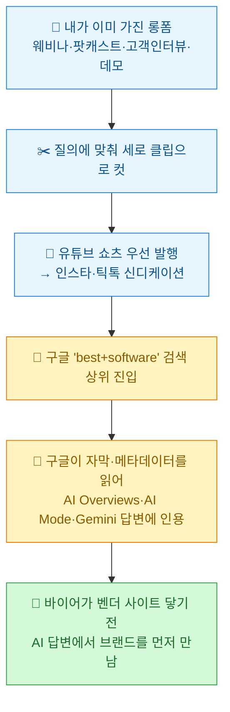
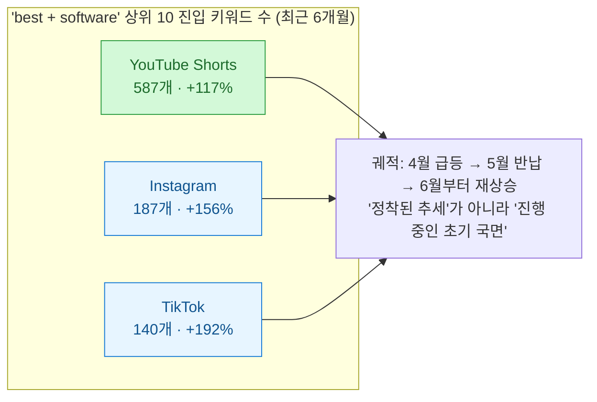
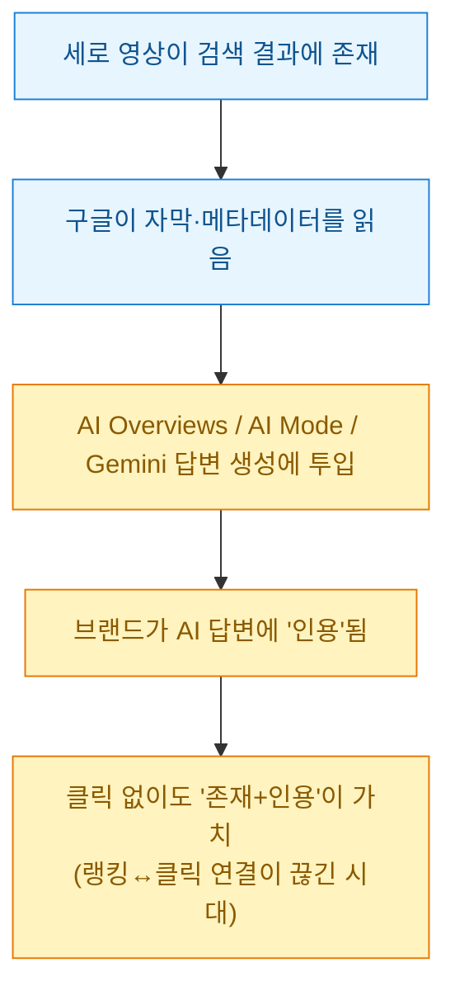
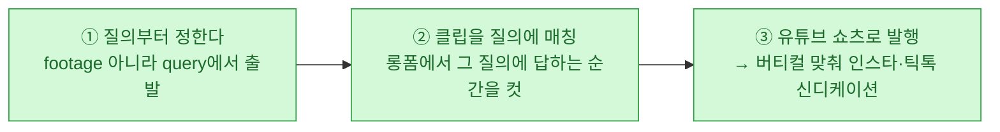
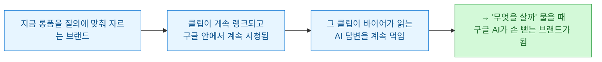

앞 글([[own-the-outer-loop-human-at-the-boundary|아우터 루프를 소유하라]])이 '에이전트가 짠 걸 누가 책임지나'였다면, 이번 건 정반대 결의 실무 이야기다 — **내가 이미 가진 영상이, 나도 모르게 AI 답변의 재료가 되고 있다.** Foundation이 낸 리포트(`foundationinc.co/lab/short-form-video`)를 읽고 정리했다. [[capcut-vrew-srt-shorts-pipeline|자막·쇼츠 파이프라인]]이나 [[youtube-analytics-driven-longform-split-upload|롱폼 분할 업로드]]를 굴려온 입장에서, 이건 그냥 넘길 얘기가 아니었다.

수치는 전부 **원문(Foundation) 출처**를 그대로 옮긴 것이며, 내가 1차로 재수집한 값은 아니다.

## 한 장으로 보는 구조

한 줄 주장은 이거다 — **당신이 이미 만드는 모든 롱폼 자산은, 바이어가 실제로 검색하는 질의에 맞춰 자르기만 하면 여러 개의 '랭크된 답변'이 될 수 있다.**

## 숏폼이 정말 B2B 검색에 올라오고 있나?

소비자 검색('best video editing software')에 세로 영상 캐러셀이 뜨는 건 이제 예상 범위다. 놀라운 건 **B2B 소프트웨어 카테고리까지 같은 패턴이 번졌다**는 점이다. 지난 6개월간 유튜브 쇼츠·인스타·틱톡이 'best + software' 검색 상위로 기어올랐다.

소비자 이야기를 B2B 이야기로 바꾸는 결정적 디테일 두 가지.

**① 키워드 카테고리가 넘어왔다.** 가장 볼륨 큰 건 크리에이티브·프로슈머 툴이다(best free video editing software 월 12,000 검색, 뒤이어 사진편집·3D 모델링·음악제작). 그런데 **전통적 B2B 바이어가 쇼트리스트를 짤 때 쓰는 핵심 질의**에도 쇼츠가 이미 최상위다:

| 질의 | 월 검색량 | 유튜브 쇼츠 순위 |
|---|---|---|
| best inventory management software | 3,400 | **1위** |
| best ERP software | 3,100 | **1위** |
| best project management software | 3,200 | 첫 페이지 |
| best scheduling software | 1,000 | **1위** |

**② 플랫폼 간 격차가 크다.** 유튜브 쇼츠는 체급이 다르다 — 인스타나 틱톡보다 이런 질의에서 **약 3~4배 많은 키워드**에 랭크되고, 상위 자리도 훨씬 많이 쥔다. 미국만 봐도 유튜브 쇼트가 475개 'best + software' 검색에서 상위 10위 안에 들고, **그중 4개 중 3개에서 1위**다. 이 상위 10위 질의만 합쳐 월 약 108,000 검색, 전체 랭크 집합은 그 두 배가 넘는다.

> 그래서 어디부터? **데이터·인프라 벤더라면 유튜브 쇼츠가 최고 확신도의 시작점**이다(구글 소유라는 게 다음 섹션에서 중요해진다). 디자인·크리에이티브 툴 회사라면 인스타·틱톡에도 진짜 청중이 있으니 병행. 버티컬에 따라 갈린다.

## 왜 '클릭이 안 나도' 이기는가 — AI 답변의 재료가 되니까

랭크만으론 부족했을 것이다. 그 페이지가 조용했다면. 그런데 아니다.

핵심 메커니즘: **구글은 세로 영상의 자막(transcript)과 메타데이터를 읽는다.** 즉 검색 결과에 존재한다는 건, 누가 클릭하든 말든 **AI 레이어를 먹이는 파이프라인에 올라탔다**는 뜻이다.

숫자가 이걸 받친다(전부 원문 인용):

- **AI Overview가 깔린 비율**: 유튜브 쇼츠가 랭크된 'best+software' 결과 페이지의 **92%**, 틱톡 94%, 인스타 79%. 영상이 뜨는 바로 그 페이지 맨 위에서 구글이 AI 답변을 짓고 있다.
- **Gemini 인용**: 세 플랫폼 중 **지난달 인용이 늘어난 건 쇼츠뿐**. Gemini 패널에서 쇼츠 46.2K 대 인스타 6.4K 대 틱톡 4.5K — 대략 **7~10배**. 구글 AI가 구글 자기 플랫폼으로 손을 뻗는다.
- (참고로 AI Overviews 도메인 인용 총량은 인스타 2.4M · 쇼츠 1.3M · 틱톡 1.0M로 인스타가 앞서지만, **성장하고 구글 AI에 밀착된 건 쇼츠**라는 게 리포트의 결론이다.)

타이밍이 우연이 아니다. **구글이 그 표면을 소유하고, 먹일 이유가 충분하다** — 쇼츠 1분 시청은 구글 생태계 안에 머무는 1분이니까. 게다가 바이어를 레딧으로 보냈던 '가공 안 된 진짜 의견에 대한 신뢰 이동'이 영상으로 번지는 중이다. **카메라 앞에서 실제 사람이 툴을 설명하는 게 벤더 랜딩페이지보다 더 믿음직하게 꽂힌다.**

## 그래서 뭘 하면 되나 — 숏폼 배급 엔진 만들기

좋은 소식: **원재료는 이미 갖고 있을 확률이 높다.** 녹화된 웨비나, 팟캐스트, 고객 인터뷰, 제품 워크스루 — 롱폼이 시간 단위로 쌓여 있다. 처방은 롱폼 유튜브 SEO에 더해, **각 자산을 여러 개의 짧은 클립으로 재가공하되 특정 검색 질의에 최적화되게 자르는 것**이다.

**① 질의부터 정한다.** 편집기 열기 전에, 바이어가 카테고리 툴을 쇼트리스트할 때 쓰는 검색을 적어라:

- `best [카테고리] software` 류
- `X vs Y` 정면 비교
- `how to [그 툴로 하려는 일]` 질문
- `is [툴] worth it` 검증

각각이 타깃이다. 그다음 롱폼에서 그 질의에 답하는 순간을 찾는다. 한 번의 녹화 대화엔 보통 **이런 순간이 3~5개** 들어 있다.

**② 클립을 특정 질의에 맞춰 컷.** 각 순간을 하나의 질의를 중심으로 세로 클립으로 자른다. **첫 2초 훅을 검색 문구와 똑같이** 맞춰 인텐트를 겹치고, 화면 텍스트·캡션을 태우고, **자막(transcript)을 함께 게시**한다. 구글 AI가 그걸 다 읽는다. 깨끗한 자막 + 질의에 맞춘 제목을 단 클립이, 모호한 캡션에 텍스트 없는 클립보다 **모델이 이해하고 인용하기 훨씬 쉽다.** 팟캐스트 에피소드를 쇼 이름이 아니라 다루는 주제로 개명하는 것과 같은 논리 — **기계가 읽을 수 있는 게 영리한 것보다 낫다(Machine-readable beats clever).**

**③ 유튜브 쇼츠로 먼저, 그다음 신디케이션.** 쇼츠를 선두로 내고 버티컬에 맞춰 인스타·틱톡 등으로 퍼뜨린다. 하나의 녹화가 여러 채널의 자산 줄기로 번지는 이 파동을 Ross Simmonds는 **콘텐츠 릴레이(Content Relay)**라고 부른다. 17분짜리 에피소드 하나가 랭크된 페이지 + 클립 묶음 + 몇 주치 배급이 되는 원리다.

> 이걸 평범한 '클립 농사'와 가르는 규율은 하나다 — **AI 가시성 노력과 맵핑된다는 점.** 아무렇게나 자른 클립은 수백만 개와 주목을 두고 싸우지만, "best inventory management software"에 답하도록 훅·자막까지 맞춘 클립은 **구글이 AI 답변을 조립하는 그 페이지의 특정 랭크 슬롯**을 두고 싸운다. **하이라이트가 아니라 질의로 잘라라(Cut for the query, not the highlight).**

## 왜 '지금'이 기회인가

솔직히 이건 초기다. 절대 수치로는 랭킹 개수가 아직 작고, 상승은 몇 달밖에 안 됐고, **대부분의 B2B 소프트웨어 브랜드는 이 이동을 아예 눈치도 못 챘다.** 바로 그게 기회다.

존재는 복리로 쌓인다. 지금 바이어 질의에 맞춰 롱폼을 자르기 시작한 브랜드가, 나중에 누군가 AI에게 "어떤 소프트웨어를 사야 해?"라고 물을 때 **구글 AI가 손 뻗는 대상**이 된다. 끝내 안 나타난 경쟁사 대신 **노출되고·인용되고·추천되는** 신호를 쌓는 것 — 그 메커니즘이 바로 **생성엔진최적화(GEO)**다. 그리고 그 원재료는, 당신이 이미 가진 영상이다.

## 내 메모 — 파이프라인에 바로 얹을 것

내가 [[capcut-vrew-srt-shorts-pipeline|SRT·쇼츠 파이프라인]]에 당장 반영할 세 가지로 압축했다.

| 기존 습관 | 바꿀 지점 |
|---|---|
| 조회수 잘 나올 '하이라이트'를 자름 | **바이어 질의**를 먼저 적고 그 답이 되는 순간을 자름 |
| 캡션은 감각적으로, 자막은 선택 | **자막을 무조건 게시** + 훅 첫 2초를 검색 문구와 일치 |
| 인스타/틱톡부터 감으로 뿌림 | **유튜브 쇼츠 선두**(구글 AI 밀착) → 버티컬 맞춰 신디케이션 |

결국 [[ai-llm-it-news-2026-07-13|어제 정리한 AI Overviews 클릭 39.8% 감소]]와 같은 그림의 뒷면이다. 클릭이 줄어드는 세상에서, **클릭 대신 '인용'을 먹는 법** — 그게 숏폼을 질의에 맞춰 자르는 이유다.

---

*원문: Foundation, "Short-Form Video is Showing Up in B2B Search Results and AI Answers (But Nobody's Talking About It)", `foundationinc.co/lab/short-form-video`. 본문 수치(랭킹 키워드 수·검색량·AI Overview 비율·Gemini 인용량 등)는 원문 리포트가 제시한 값을 그대로 옮긴 것이며 내가 1차 재수집한 자료가 아니다. 도식과 실무 적용 메모는 내 재구성이다. Content Relay 개념은 Ross Simmonds.*
