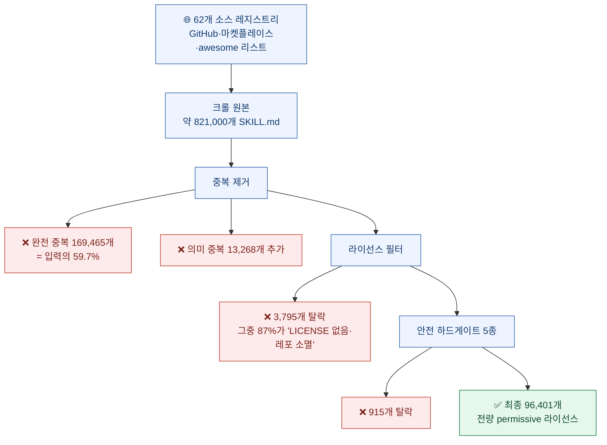
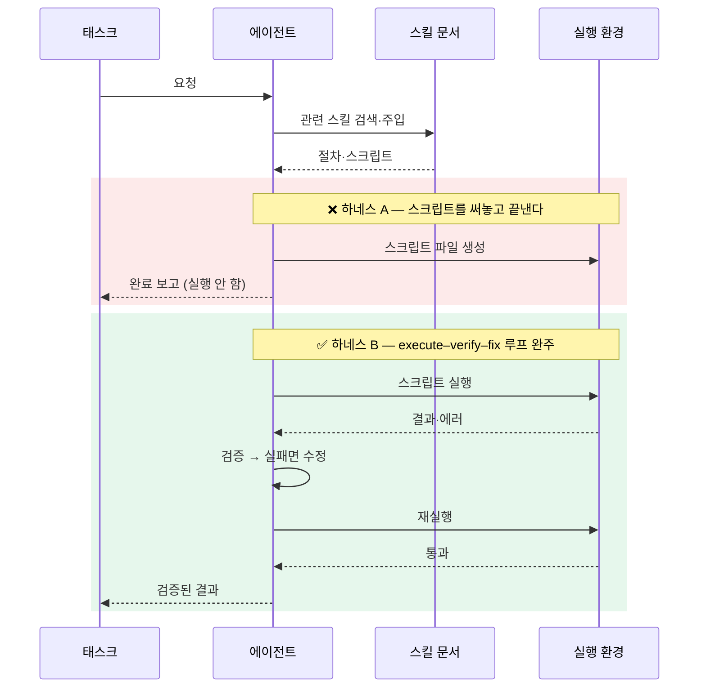

나는 스킬을 만들어 쓴다. `SKILL.md` 파일로 절차를 묶어두고 에이전트가 그걸 읽어 일하게 하는 방식이다. 다이제스트 수집, 블로그 발행 점검, 문서 추출 — 손에 익은 절차는 대부분 스킬로 옮겼다.

그래서 오늘 목록에서 이 제목을 보고 멈췄다. **"SkillCorpus: 실세계 LLM 에이전트를 위한 공개 스킬 생태계의 통합과 평가."** 남들이 만든 스킬이 실제로 어떤 상태인지 누가 전수로 세어본 적이 있었나?

읽고 나서 든 생각은 하나였다. **내가 막연히 불편해하던 것들이 전부 숫자로 찍혀 있었다.**

## 이 논문이 한 일을 한 장으로 보면?

82만 개로 시작해 9만 6,401개가 남았다. **생존율 약 11.7%.** 그런데 탈락 사유의 순위가 예상과 달랐다.

## 탈락 1위가 왜 '품질'이 아니었나?

나는 당연히 "대충 만든 스킬이 많아서" 걸러졌을 거라 생각했다. 아니었다.

깔때기에서 가장 크게 줄어든 단계는 **중복 제거**다. 283,844개가 101,111개로, 한 단계에서 64%가 사라졌다. 그중 **완전 중복(exact duplicate)만 169,465개**로 해당 단계 입력의 **59.7%**였다.

논문의 표현이 담백해서 더 아프다.

> "which reflects how heavily the ecosystem replicates the same artifacts across repositories"
> (이는 생태계가 저장소들 사이에서 동일한 산출물을 얼마나 심하게 복제하고 있는지를 반영한다.)

**공개 스킬의 절반 이상이 글자 그대로 같은 파일이다.** awesome 리스트를 긁고, 그 리스트를 다시 자기 레포에 담고, 누군가 그걸 또 긁는다. 나도 스킬을 찾을 때 awesome 리스트부터 열었으니 남 얘기가 아니다. 열 개를 찾았다고 생각했는데 실은 같은 걸 열 번 본 거였을 가능성이 통계적으로 절반을 넘는다.

의미 중복은 별도로 처리됐다. 코사인 유사도 0.90을 넘는 쌍을 표시하고 0.995를 넘으면 자동 병합했는데, 애매한 **66,751쌍을 LLM으로 판정해 25.4%가 중복으로 확정**됐다.

## 라이선스 문제는 얼마나 심각한가?

여기가 실무에서 제일 위험한 대목이다. 회사에서 커뮤니티 스킬을 가져다 쓸 때 아무도 안 보는 부분이기 때문이다.

라이선스 필터로 3,795개가 빠졌는데, **사유별 분해**가 중요하다.

| 탈락 사유 | 개수 | 성격 |
|---|---|---|
| LICENSE 파일 없음 | 1,756 | ⚠️ 법적으로 **모든 권리 유보** = 재배포 불가 |
| GitHub API로 레포 접근 불가 | 1,563 | ⚠️ 삭제·비공개 전환 = 출처 소멸 |
| 카피레프트(GPL·AGPL·LGPL) | 228 | 조건부 사용 가능 |
| 비상업·SA 조항 | 86 | 상업적 사용 제한 |
| 커스텀·파싱 불가 | 162 | 개별 검토 필요 |

**위 두 줄이 전체 제외의 약 87%**다. 즉 걸러진 대부분은 "나쁜 라이선스"가 아니라 **라이선스가 아예 없거나 원본이 사라진 것**이다.

라이선스를 안 붙인 공개 저장소는 "자유롭게 쓰세요"가 아니다. 법적 기본값은 **저작권자가 모든 권리를 보유**하는 상태다. GitHub에 공개돼 있고 README에 "마음껏 쓰세요"라고 적혀 있어도, LICENSE 파일이 없으면 재배포 근거가 없다.

살아남은 96,401개는 전량 OSI 승인 permissive다. **MIT/MIT-0 88.3%, Apache-2.0 10.5%, 기타 1.2%.** 상업적 재배포가 가능하도록 설계한 것이다.

## 품질 점수는 성능을 예측했나? — 예측하지 못했다

이 논문에서 제일 놀란 부분이다. 그리고 저자들이 이걸 숨기지 않고 적었다는 점이 마음에 들었다.

논문은 스킬 품질을 3축으로 채점했다. **유용성(0.50) · 견고성(0.35) · 안전성(0.15)** 가중에 19개 플래그를 붙이고, 프롬프트 인젝션·명령 주입·안전하지 않은 실행·인증 우회 등 5개는 **하드게이트**로 걸어 하나라도 걸리면 점수를 0으로 강제했다.

점수 분포는 이랬다(0\~1, 평균 0.690).

| 구간 | 비율 |
|---|---|
| q < 0.3 | 2.8% |
| 0.3 \~ 0.5 | 5.5% |
| 0.5 \~ 0.7 | 32.9% |
| q ≥ 0.7 | 58.8% |

그럴듯하다. 그런데 이 점수가 **실제 태스크 통과율을 예측했는가?**

**못 했다.** 논문이 직접 적는다. 종합 품질 점수는 **어느 벤치마크에서도 태스크 통과율과 유의한 상관이 없었다**(모두 |r| < 0.10, p > 0.35). 안전 축만 약한 신호를 보였는데(β=+1.03, z=2.29, p=0.022) 다중비교 보정을 못 견뎠다.

세 축 사이 상관도 흥미롭다. 유용성과 안전성은 r=0.15, 견고성과 안전성은 r=0.30, 유용성과 견고성은 r=0.59. **잘 만든 스킬이라고 안전한 게 아니라는 뜻이다.** 안전성은 장인정신과 별개 축으로 움직인다.

내가 여기서 챙긴 교훈은 이거다. **문서를 보고 매긴 점수는 문서의 품질을 재는 것이지 결과의 품질을 재는 게 아니다.** 논문도 한계로 명시한다 — 품질 평가는 샌드박스 실행이 아니라 **텍스트에 대한 LLM 판정**뿐이었다.

## 그럼 무엇이 성능을 갈랐나? — 하네스였다

벤치마크 결과를 보자. 스킬을 안 준 상태에서 SkillCorpus를 준 상태로 바꿨을 때의 변화다.

| 벤치마크 | 최약 조합 | 최강 조합 | 통합 Δ |
|---|---|---|---|
| SkillsBench (87 태스크, pass@1) | 8.8 → 13.0 | 9.2 → **22.6** | **+7.5±2.3 pp** (z=3.2) |
| GDPval (220 태스크) | 81.2 → 83.1 | 84.0 → 85.2 | +1.51±0.49 pp (z=3.1) |
| QwenClawBench (100 태스크) | 65.2 → 66.7 | 68.8 → 73.2 | +2.79±0.70 pp (z=4.0) |

프론티어 모델에서도 검증됐다. **Claude Opus 4.7이 39.1% → 47.1%(+8.0pp).**

그런데 같은 스킬을 줬는데 왜 최약 조합은 +4.2pp고 최강 조합은 +13.4pp인가? **하네스가 달랐다.**

논문이 트레이스를 뜯어본 결과, 이득이 적었던 하네스는 **"스크립트를 작성해놓고 실행하지 않은 채 종료"** 하는 패턴을 보였다. 이득이 컸던 하네스는 실행–검증–수정 루프를 끝까지 돌았다.

**같은 스킬, 같은 모델, 두 배 넘게 벌어진 결과.** 스킬을 붙이기 전에 물어야 할 질문이 바뀐다. "좋은 스킬을 어디서 구하지?"가 아니라 **"내 에이전트가 스크립트를 실제로 돌리고 검증까지 하는가?"** 다.

## 스킬을 붙였는데 커버리지가 없으면?

또 하나 실무적으로 반가운 결과가 있다. 리트리버가 관련 스킬을 얼마나 잘 찾았는지에 따라 이득이 **+2.2pp에서 +25.1pp까지** 갈렸다(태스크 단위 상관 r=0.31\~0.40, 난이도 통제 후 편상관 0.34\~0.40).

즉 **커버리지가 이득의 크기를 결정한다.** 그런데 중요한 건 이득이 0으로 수렴할 뿐 **마이너스로 가지 않았다**는 점이다. 단, 이건 **큐레이션된 코퍼스일 때** 얘기다.

절제 실험이 이를 갈라 보여준다(단일 런, SkillsBench).

| 조건 | 성적 |
|---|---|
| 필터된 코퍼스 + 파인튜닝 스택 | **22.6%** |
| 스택만 오프더셸프로 교체 | 13.8% |
| **코퍼스만 raw 크롤로 교체** | **14.9%** |
| 스킬 없음 | 9.2% |

**필터를 안 건 raw 크롤을 쓰면 이득의 3분의 1 이상이 날아간다.** 큐레이션과 리트리벌이 각각 절반씩 기여한 셈이다. "일단 많이 모아두면 좋겠지"가 틀렸다는 정량 근거다.

## 없는 스킬은 어떻게 하나?

논문이 짚은 마지막 지점이 나한테 제일 실용적이었다. 도메인별 스킬 수가 극단적으로 불균형했다. **수학 4개, 금융 9개.**

이건 검색으로 해결되는 문제가 아니다. **공급 문제다.** 아무리 좋은 리트리버를 붙여도 존재하지 않는 스킬은 못 찾는다.

같은 날 arXiv에 올라온 **NexForge**(arXiv:2607.14186)가 정확히 반대 방향에서 이 문제를 친다. 기존 태스크 합성이 "고정된 툴·레포·스킬 그래프에서만 뽑는" 기질 종속 문제에 갇혀 있다고 진단하고, **역량 요구사항에서 출발해 태스크를 만들어낸다.** 터미널 태스크 3,600개와 오피스 태스크 2,000개를 도메인 전용 인프라 없이 생성했고, Qwen3.5-35B-A3B Base를 Terminal-Bench 2.0에서 **22.5% → 52.0%** 로 올렸다고 주장한다(43.2K로 스케일 시 58.4%).

정리하면 오늘 두 논문이 이렇게 짝을 이룬다.

| 논문 | 답하는 질문 |
|---|---|
| **SkillCorpus** | 이미 있는 스킬 중 무엇을 모을 것인가 (큐레이션) |
| **NexForge** | 없는 스킬을 어떻게 만들 것인가 (공급) |

## 내 스킬 운영에 바로 반영할 것

읽고 나서 내 작업 방식에서 고칠 지점을 셋으로 추렸다.

**① 스킬을 새로 찾을 때 중복부터 접는다.**
awesome 리스트 열 개를 훑는 건 같은 파일을 열 번 보는 일일 확률이 높다. 파일 해시로 먼저 접고 나머지를 본다.

**② 사내·개인 스킬에 LICENSE를 붙인다.**
내가 공개한 스킬에 LICENSE가 없으면 남이 못 쓴다. 반대로 남의 스킬을 가져올 때 LICENSE 파일 존재 여부를 체크리스트에 넣는다. 이건 취향이 아니라 재배포 가능 여부의 문제다.

**③ 스킬 품질을 문서로 재지 않는다.**
품질 점수가 통과율을 예측 못 했다는 결과가 정확히 이 얘기다. 스킬이 좋은지는 **그 스킬을 물린 에이전트가 태스크를 통과하는가**로만 판정한다. 문서가 예쁜 것과 결과가 나오는 건 상관이 0에 가깝다.

## 인용할 때 주의할 것

과장하지 않기 위해 이 논문의 한계도 적어둔다. 저자들이 직접 명시한 것들이다.

- **품질·안전·분류 라벨이 단일 LLM 판정 하나에서 나왔다.** 인간 골드 어노테이션 검증도, 다른 심판 모델 교차검증도 없다. 논문 스스로 **"심판 편향이 릴리스 세트에 그대로 전파된다"** 고 적는다
- **샌드박스 실행 검증이 없다.** 텍스트 기반 채점만이다
- GDPval·QwenClawBench는 태스크별 판정 노이즈(표준편차 20\~27pp)가 효과크기보다 커서 **셀 단위로는 유의하지 않고 풀링 수준에서만 유의**하다
- 코퍼스가 **영어 편중**이고 2026년 2분기 스냅샷이다
- 안전 정규식 감사 중 일부 패턴은 **위양성률 90%를 넘어** 게이트로 쓰지 않았다
- 벤치마크 오염에 대한 태스크별 누출 감사는 수행하지 않았다

그리고 **데이터셋·모델·코드는 아직 공개 전**이다. 논문 표현은 *"will be released upon acceptance"*. 지금은 논문만 있고 저장소 URL도 없다. 숫자를 인용할 수는 있지만 코퍼스를 받아 쓸 수는 없다.

날짜도 짚어둔다. arXiv 리스팅에 오늘 떴지만 **v1 최초 제출은 2026년 7월 17일**이다. 개정판 없는 신규 논문이 맞다. 저자 소속은 EverMind·Shanda Group·북경대다.

---

## 참고

- SkillCorpus — arXiv:2607.15557v1 (2026-07-17 제출)
- NexForge — arXiv:2607.14186 (v1 2026-07-15)
- 벤치마크: SkillsBench(87) · GDPval(220) · QwenClawBench(100)

*수치는 전부 논문 본문·표·부록에서 확인한 값만 옮겼다. 원문에 없는 수치는 "없음"으로 적었고, 특히 "실행 불가 비율"은 논문이 측정하지 않았으므로 어떤 형태로도 추정하지 않았다.*
