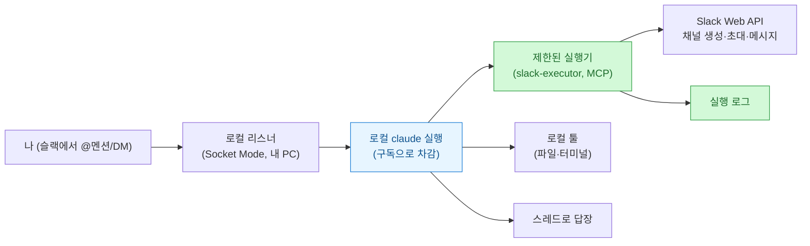
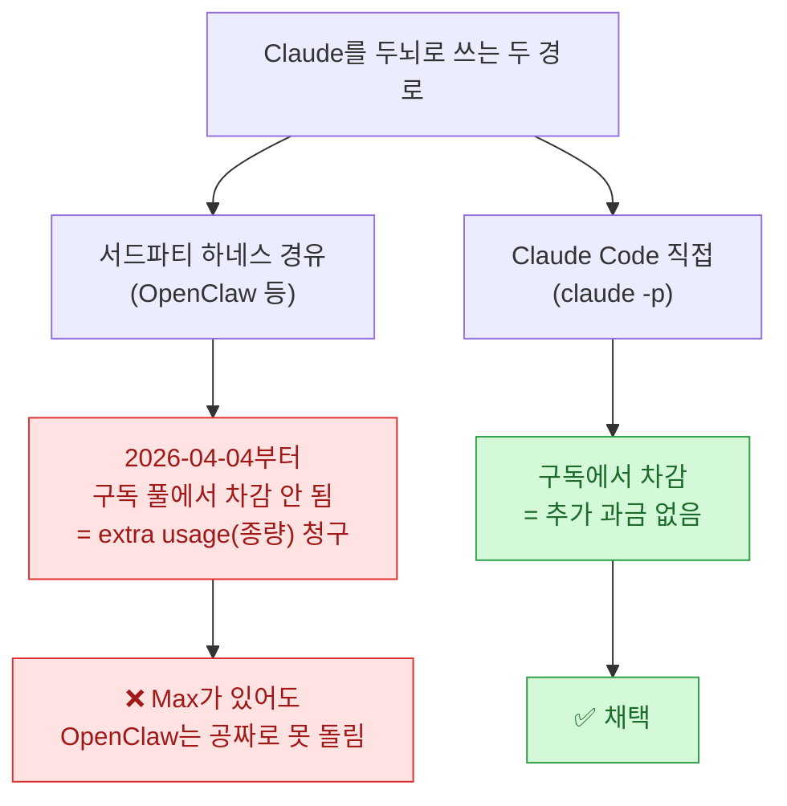
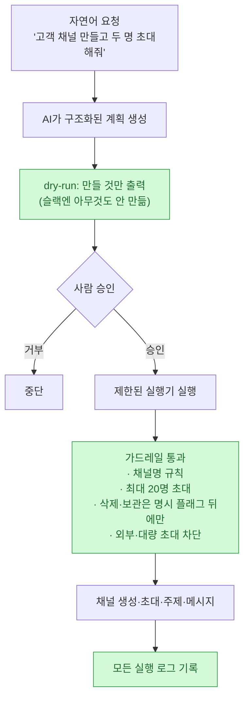
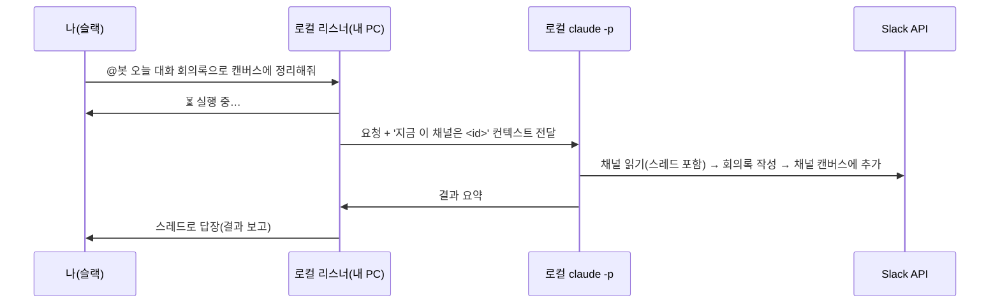

> 슬랙 자동화 시리즈의 연장선이다. 이전엔 [[slack-codex-cli-remote-bot-1-build|슬랙에서 원격으로 코드를 돌리는 봇]]을 만들었는데, 오늘은 방향을 틀어 **"슬랙에서 봇을 부르면 채널 세팅까지 알아서"** 를 무료 플랜으로 어디까지 되는지 실험했다. 회사 실무에 붙인 부분은 전부 빼고, 기술적으로 배운 것만 일반화해서 적는다.

오늘 하고 싶었던 건 한 문장이었다. **"슬랙에서 봇을 부르면, 봇이 내 PC에서 일도 하고 슬랙 채널도 세팅한 다음, 스레드로 답장해줬으면."** 조건이 하나 더 붙었다 — **가능하면 추가 과금 없이.** 두뇌는 Claude를 쓰되, 종량제 요금이 아니라 이미 내고 있는 구독으로.

결론부터 적으면, **된다.** 단, 무료 플랜에는 명확한 벽이 있고, 두뇌를 어디에 두느냐에서 한 번 크게 갈렸다. 순서대로 풀어 본다.

## 오늘 만든 것 한눈에

핵심 구도는 이거다. **두뇌(계획)와 손(실행)을 분리**했다. Claude가 자연어를 받아 계획을 세우고, 슬랙을 실제로 건드리는 건 **가드레일이 박힌 제한된 실행기**만 한다. 며칠째 붙들던 [[fable5-maker-checker-separation-setup|만드는 쪽 ≠ 검사하는 쪽]] 이야기가, 여기선 **"판단하는 쪽 ≠ 실행하는 쪽"**으로 똑같이 반복됐다.

## 무료 슬랙에서 봇은 대체 뭘 할 수 있나?

가장 먼저 벽의 위치부터 알아야 했다. 무료 플랜에서 봇 API로 되는 것과 안 되는 것을, 공식 문서(`docs.slack.dev`)로 교차검증했다. 결과를 표로 옮긴다.

| 하고 싶은 것 | 무료에서 되나 | 메모 |
|---|---|---|
| 공개/비공개 채널 생성 | ✅ | `conversations.create` |
| 이메일로 멤버 찾아 초대 | ✅ | `users.lookupByEmail` + `conversations.invite` |
| 주제·설명·첫 메시지·스레드 | ✅ | `conversations.setTopic/Purpose`, `chat.postMessage` |
| 파일 업로드 | ✅ | 워크스페이스 5GB·파일당 1GB 한도 |
| 반응·핀·북마크·미참여 공개채널 게시 | ✅ | `chat:write.public` 등 |
| **채널 캔버스** 생성/편집 | ✅ | 채널당 1개 (무료 OK) |
| 독립(standalone) 캔버스 | ❌ | 유료 전용 |
| 리스트(Lists) | ❌ | API는 있으나 유료 전용 |
| 워크플로우 생성 | ❌ | 노코드 빌더는 API로 못 만듦 (이미 만든 트리거 **호출만** 가능) |
| 허들 시작/종료 제어 | ❌ | 어느 플랜도 봇 공개 API 없음 |
| 사이드바 카테고리 섹션 | ❌ | 유료(Pro+) + 개인 설정이라 봇으로 불가 |

> ⚠️ 무료 플랜에서 특히 조심할 것 세 가지. (1) **메시지·파일은 최근 90일까지만** 접근되고 1년 초과분은 삭제될 수 있다 → 장기 히스토리 요약 자동화는 무료로 무리. (2) **앱 설치는 10개** 제한(마케팅 페이지의 '3개'는 옛 표기). (3) 레거시 `files.upload`은 **2025-11-12 은퇴** → `getUploadURLExternal` + `completeUploadExternal` 2단계로 써야 한다.

한 줄로 요약하면 — **채널·멤버·메시지·채널캔버스 자동 세팅은 무료로 충분히 되고, 리스트·독립캔버스·워크플로우 생성·허들 제어는 유료(또는 아예 불가)** 다. 내가 원하던 "채널 세팅 자동화"는 다행히 전부 무료 쪽에 있었다.

## 두뇌를 OpenClaw로 하려다 왜 뺐나 — 과금의 함정

처음엔 멀티채널 게이트웨이인 **OpenClaw**를 두뇌로 붙이려 했다. Node를 올리고, 설치하고, Claude Code를 OpenClaw의 MCP로 물려 32개 툴까지 노출되는 걸 확인했다. 여기까진 좋았다. 그런데 실제로 턴을 돌리자 이런 메시지가 떴다 — *"You're out of extra usage."*

원인을 파 보니 정책 변화였다. **2026년 4월 4일부터 OpenClaw 같은 서드파티 하네스는 구독 토큰 풀에서 차감되지 않고, 별도 '추가 사용량(extra usage)' 종량 요율로 청구**된다. 구독 토큰을 물려도 마찬가지였다. 즉, 아무리 상위 구독이 있어도 **그 경로로는 공짜로 못 돈다.**

반대로 **Claude Code를 직접 부르는 `claude -p`는 구독에서 차감**된다. 그래서 결론은 오히려 단순해졌다 — **OpenClaw를 빼고, Claude Code(구독) + 내가 만든 슬랙 실행기**로 간다. 화려한 게이트웨이보다, 과금 경로가 맞는 단순한 구성이 이겼다.

## 그래서 어떻게 짰나 — 'AI는 계획, 제한된 실행기가 실행'

두뇌를 정했으니 손을 만들 차례였다. 여기서 원칙을 하나 세웠다. **AI에게 슬랙 권한을 통째로 쥐여주지 않는다.** AI는 계획만 세우고, 실제 슬랙 조작은 **가드레일이 박힌 제한된 실행기**만 하도록.

실행기(나는 `slack-executor`라 불렀다)는 무료 플랜에서 되는 슬랙 API만 감싼 작은 Node/TS 프로젝트다. 같은 코드를 **① CLI**로도, **② MCP 서버**로도, **③ 슬랙 리스너**로도 쓸 수 있게 만들었다. 그리고 안전장치를 코드 레벨에 박았다:

- **채널명 규칙 강제** (소문자·숫자·하이픈 등만, 대문자·공백 불가)
- **채널당 초대 최대 20명** (대량 초대 차단)
- **삭제·보관·캔버스 삭제는 `--allow-destructive` 플래그 뒤에서만**
- **외부인 초대·신규 사용자 초대는 아예 미구현**
- **모든 실행을 로그로** 남기고, 세팅은 항상 **dry-run → 승인 → 실행** 2단계

이게 결국 [[the-coming-loop-armin-ronacher-harness-critique|루프를 어떻게 통제하나]]에서 적었던 그 원칙이다 — 자동화의 편함을 취하되, **되돌리기 어려운 행동(삭제·대량초대)은 기본 차단하고, 마지막 승인은 사람이 쥔다.**

## 방향 B — 슬랙에서 봇을 부르면 내 PC가 일한다

여기까지가 "내가 Claude Code에서 실행기를 부르는" 방향(A)이었다. 오늘의 진짜 목표는 반대 방향(B)이었다 — **슬랙에서 봇을 @멘션하면, 내 PC가 반응하는 것.**

Socket Mode 리스너가 `app_mention`(채널 멘션)과 `message.im`(DM)을 받고, 로컬에서 `claude -p`를 띄운다. 그 claude에는 실행기를 MCP로 물려서 슬랙 조작까지 시킨다. 실제로 "안녕? 대답해줄래?"에 스레드로 답했고, "오늘 대화 회의록으로 정리해줘"에는 세션 로그를 읽어 8개 섹션 회의록을 만들어 채널 캔버스에 붙였다. **동작 검증 완료.**

> ⚠️ 여기서 진짜 삽질한 지점 둘. (1) **봇 답글은 스레드에 달린다.** 그래서 `conversations.history`(최상위만)로는 안 보이고 `conversations.replies`로 확인해야 한다 — 처음에 "봇이 답을 안 했다"고 오진한 원인이었다. (2) **채널 컨텍스트를 안 주면** 봇이 "이 채널을 읽어" 같은 요청에서 엉뚱한 곳을 짚는다 → 프롬프트에 "지금 이 채널은 `<id>`"를 넣어 해결했다.

## 이건 위험하지 않나? — 경계선 긋기

솔직히 이 봇은 위험한 물건이다. **"슬랙 메시지 → 내 PC에서 명령 실행"** 이니까. 그래서 경계를 분명히 그었다.

- 트리거는 **허용 목록(allowlist)에 있는 나만** 가능. 그 외 사용자는 전부 거부. **이게 유일한 방어선**이라 절대 비우면 안 된다.
- 로컬 claude는 권한 우회 모드로 도니 사실상 무제한 실행이다 → **테스트 환경·본인만 접근**을 전제로만.
- 슬랙 토큰·앱 토큰은 `.env`에만 두고 절대 커밋/채팅에 안 넣는다.

## 무료의 벽을 우회한 한 가지 — 번호 접두어 트리

부수적으로 배운 것 하나. 채널이 여러 개가 되니 **부서/주제별로 사이드바를 묶고** 싶었는데, 그 **카테고리 섹션 기능은 유료(Pro+) 전용**이고 개인 설정이라 봇으로 못 만든다. 그래서 무료에서 가능한 최선으로 **채널명 앞에 `01`~`11` 번호를 붙여** 강제로 정렬·인접시켰다. 완벽하진 않지만, 무료에서 트리처럼 보이게 하는 실용적 우회였다.

## 마무리 — 슬랙에서도 결론은 같았다

하루를 정리하니, 결국 요즘 내가 반복하는 그 이야기로 수렴했다. **AI는 판단과 계획을 맡고, 되돌리기 어려운 실행은 가드레일 박힌 좁은 통로로만 흘리고, 마지막 승인은 사람이 쥔다.** 슬랙 자동화라는 전혀 다른 소재에서도 정확히 같은 골격이 나왔다는 게 재미있었다.

그리고 하나 더 — **화려한 도구보다 과금 경로가 맞는 단순한 구성**이 이겼다. OpenClaw라는 멋진 게이트웨이를 다 세팅해 놓고도, 결국 "구독으로 도는가"라는 현실적인 질문 하나에 구조를 갈아엎었다. 자동화는 늘 이렇게, 멋짐이 아니라 **제약과 비용의 모양**대로 정해지더라.

## 참고자료

- Slack 스코프·메서드: [docs.slack.dev](https://docs.slack.dev/reference/methods)
- 무료 플랜 제한: [Feature limitations on the free version of Slack](https://slack.com/help/articles/27204752526611-Feature-limitations-on-the-free-version-of-Slack)
- 파일 업로드 전환: `files.upload` 은퇴 → `getUploadURLExternal` + `completeUploadExternal`
- 관련(내 글): [[slack-codex-cli-remote-bot-1-build|슬랙 원격 실행 봇 만들기]] · [[slack-work-operating-space-guide|슬랙 업무 운영 가이드]] · [[fable5-maker-checker-separation-setup|판단과 실행의 분리(maker≠checker)]] · [[the-coming-loop-armin-ronacher-harness-critique|루프를 어떻게 통제하나]]

<!-- 안전: 회사명·실제 워크스페이스/봇/사용자/채널 ID·회사 채널명·로컬 경로·토큰 일절 없음. 실제 회사 적용분은 제외하고 무료 슬랙 자동화의 일반 기술 findings만 정리·일반화. -->
