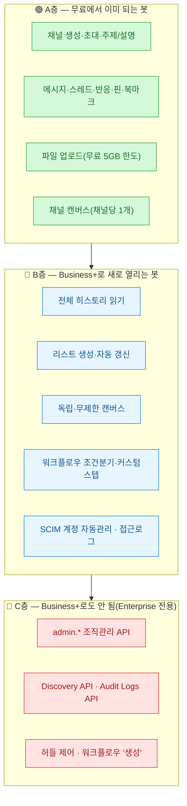
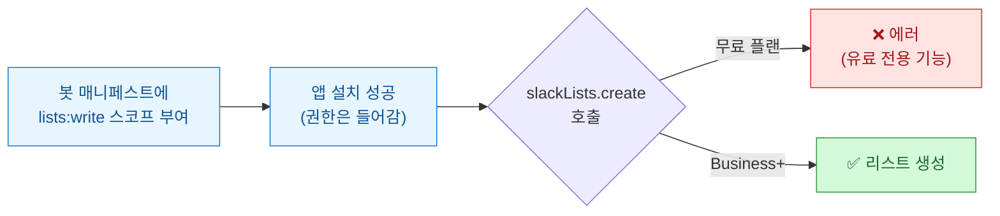
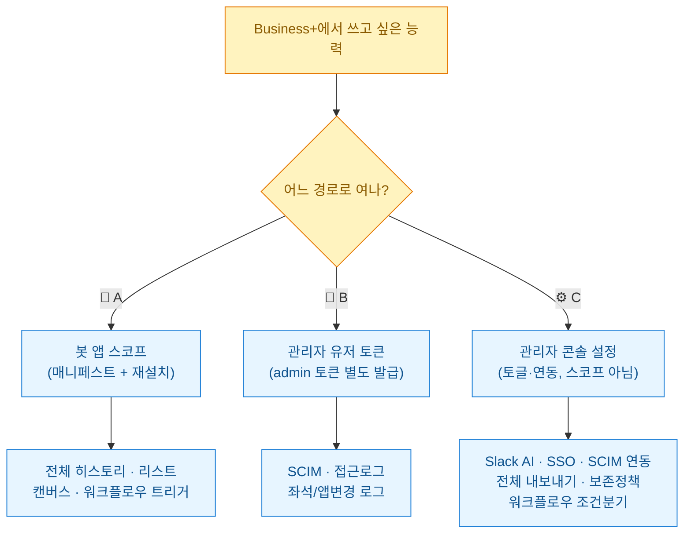
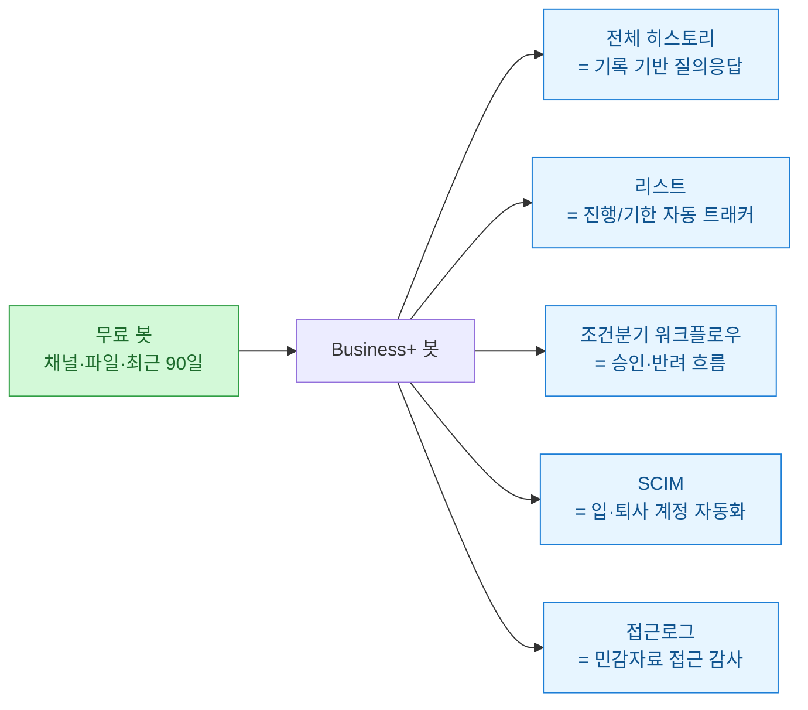
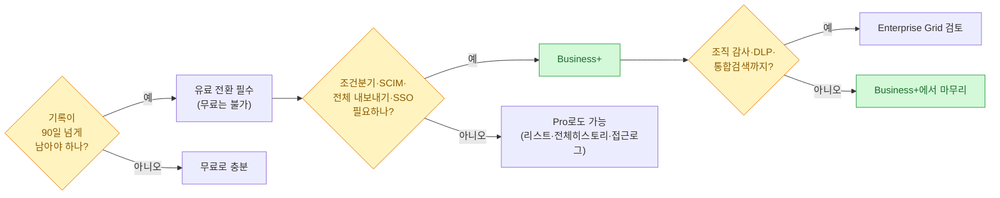

앞서 [[slack-bot-channel-automation-free-plan-restricted-executor|무료 플랜에서 봇 자동화를 어디까지 되나]] 정리하면서 알게 된 게 하나 있다 — **봇이 채널 만들고 파일 올리는 것 정도는 무료로도 이미 된다.** 그래서 자연히 다음 질문이 생겼다. *"그럼 유료(Business+)로 올리면 봇에게 뭐가 더 열리지? 그리고 그걸 실제로 어떻게 켜지?"* 이 글은 그 두 질문에 대한 답이다.

기준일은 **2026년 7월 3일 KST**. 공식 문서(`docs.slack.dev`·`slack.com/help`) 기준으로 확인했고, 특정 회사·실제 토큰·계정 정보는 전부 빼고 일반화했다.

## 무료·Business+·Enterprise, 봇 능력은 3층으로 갈린다

가장 먼저 머릿속 지도를 3층으로 세워야 헷갈리지 않는다.

한 줄로 요약하면 — **A층은 무료로 충분하고, Business+의 값어치는 B층(기억·자동화·거버넌스)에 있으며, C층은 아무리 스코프를 줘도 Enterprise Grid가 아니면 안 된다.**

## 함정 하나: "권한을 줬다" ≠ "실제로 작동한다"

여기서 제일 많이 걸려 넘어지는 지점을 먼저 못박아야 한다. **스코프(권한)는 무료 앱에도 부여된다.** 그런데 기능 자체가 유료면, 스코프가 있어도 메서드 호출이 **에러**난다.

즉 "권한은 줬는데 안 되는" 케이스가 진짜 있다. 리스트·독립 캔버스가 대표적이다. **스코프가 있느냐와 플랜이 받쳐주느냐는 별개**라는 걸 먼저 알아야 다음이 안 꼬인다.

## 그래서 봇에게 뭘 더 줄 수 있나 (B층 상세)

Business+가 봇에게 새로 열어주는 다섯 가지를, 회계·감사처럼 **기록이 중요한 전문 서비스 조직** 관점으로 풀면 이렇다.

| 새로 열리는 능력 | 무료에선 | Business+에선 | 실무 쓸모(일반화) |
|---|---|---|---|
| **전체 히스토리 읽기** ⭐ | 최근 90일만(`is_limited`) | **전체 아카이브** | 봇이 "작년 이 건 어떻게 처리했지?"에 다년치 대화 기반 답변(RAG) |
| **리스트(slackLists.*)** | ❌ 유료 전용 | ✅ 봇이 생성·행 자동추가 | 고객사별 진행/기한 현황판을 봇이 자동 갱신 |
| **독립 캔버스** | ❌ 채널 캔버스만 | ✅ | 채널에 안 묶인 지식 허브 문서를 봇이 생성 |
| **워크플로우 조건분기·커스텀스텝** | 트리거 호출만 | ✅ 승인/반려 분기 + 봇 함수 노출 | 지출·승인 흐름을 노코드로, 봇이 만든 스텝을 직원이 끌어다 씀 |
| **SCIM · 접근로그** | ❌ | ✅ | 입·퇴사 계정 자동화, 예상 밖 IP·심야 로그인 탐지 |

⚠️ 정직하게 짚을 함정 하나 더: **전체 검색(`search.messages`)은 봇 토큰으로 안 된다.** `search:read`가 *유저 토큰 전용*이라 이건 플랜 문제가 아니라 **토큰 종류 문제**다. 봇으로 전체 히스토리를 활용하려면 **`conversations.history`로 읽어서 AI가 처리**하는 방식(이 봇 구조가 그 역할)이나 봇용 검색 API를 써야 한다.

## 핵심 — 그걸 '어떻게' 여나? 경로가 셋이다

여기가 이 글의 진짜 요점이다. Business+ 능력을 켜는 방법이 하나가 아니라 **셋**인데, 이걸 뭉뚱그리면 "권한 줬는데 왜 안 되지?"가 반복된다.

### 🤖 A경로 — 봇 스코프로 여는 것 (진짜 "봇에게 권한 주기")

이건 **스코프 추가 → 재설치** 두 단계다. `api.slack.com/apps → OAuth & Permissions → Bot Token Scopes`에 추가하거나, App Manifest(YAML)에 넣고 재설치한다. 봇으로 여는 4대 능력의 스코프·메서드 매핑은 이렇다.

| 능력 | 봇 스코프 | 호출 메서드 |
|---|---|---|
| 전체 히스토리 | `channels:history` `groups:history` `im:history` `mpim:history` | `conversations.history` · `conversations.replies` |
| 리스트 | `lists:read` `lists:write` | `slackLists.create` · `slackLists.items.create` |
| 독립/무제한 캔버스 | `canvases:write` `canvases:read` | `canvases.create`(독립) · `conversations.canvases.create`(채널) |
| 워크플로우 트리거·커스텀스텝 | `triggers:read` `triggers:write` | `triggers.create` + 매니페스트에 함수/워크플로우 선언 |

> 다시 강조: **스코프를 넣어도 유료라야 실제 작동**한다. 무료에선 부여돼도 리스트·독립캔버스는 에러, 히스토리는 90일까지만.

### 🔑 B경로 — 관리자 유저 토큰으로 여는 것 (봇 아님!)

SCIM·접근로그는 **봇 매니페스트에 안 넣는다.** 워크스페이스 소유자/관리자 계정이 `admin` 스코프 토큰을 따로 발급해서 쓴다. 이걸 봇에 넣으려다 안 돼서 헤매는 경우가 많다.

- **SCIM(`/scim/v2/Users`,`/Groups`)** — 입사자 자동 생성 / 퇴사자 자동 비활성. 고객 자료를 다루는 조직이면 **퇴사 즉시 접근 차단**이 핵심 가치.
- **접근 로그(`team.accessLogs`)** — 멤버별 로그인 IP·기기·시각. 예상 밖의 해외 IP나 심야 로그인을 탐지하는 보안 점검용. (단 "누가 어떤 파일을 열었나"까지의 감사 로그는 Enterprise 전용.)

### ⚙️ C경로 — 관리자 콘솔 설정으로 여는 것 (API/스코프 아님)

여기가 최대 오해 지점이다. **AI 검색·SSO·전체 내보내기·조건분기는 "봇에게 주는 권한"이 아니라 워크스페이스 관리자 설정**이다.

| 능력 | 어디서 | 성격 |
|---|---|---|
| Slack AI(검색답변·요약·번역) | 관리자 → AI 기능 | 사용자 기능(봇 스코프 아님) |
| SSO(예: M365 Entra) | 관리자 → 인증(SAML) | 콘솔 설정 |
| SCIM 자동 프로비저닝 | IdP ↔ Slack 연동 | 콘솔+IdP |
| 전체 내보내기(비공개·DM 포함) | 관리자 → 내보내기 신청·승인 | 절차(API 없음) |
| 보존정책(채널별) | 관리자 → 메시지 보존 | 콘솔 설정 |
| 워크플로우 조건분기 | Workflow Builder | 플랜 기능(설정 없이 그냥 활성) |

## Business+로도 안 되는 것 (경계선을 정직하게)

과장하지 않기 위해 못을 박는다. 아래는 **Business+ 봇/토큰으로 스코프를 아무리 줘도 안 된다** — 전부 Enterprise Grid 전용이다.

- `admin.*` 조직관리 API 전체
- **Discovery API**(실시간 DLP·eDiscovery), **Audit Logs API**(SIEM용 전체 감사 이벤트)
- 그리고 *어느 플랜에서도* 안 되는 것: **허들 제어**(시작/참여/종료 봇 API 없음), **워크플로우 "생성"**(노코드 수동, 봇은 트리거 "호출"만)

Business+의 대체재는 전체 감사로그 대신 `team.accessLogs`(로그인) + `team.integrationLogs`(앱 변경)로 **부분** 감사추적, 내보내기는 **수동 승인** 방식이다. 초·중기 도입엔 이걸로 충분하고, 규제 대응을 본격화할 때 Enterprise를 검토하는 순서가 자연스럽다.

## 왜 하필 Business+인가 (전문 서비스 조직 관점)

무료→Business+로 봇이 어떻게 달라지는지 한 장으로 묶으면 이렇다.

핵심은 두 가지다. **①** 조직의 1순위가 "다 저장되고 검색됨"이라면 그건 **무료로는 원천적으로 불가능**(90일 제한)이라 봇으로도 못 메꾼다 → **진지한 도입 = 유료 전환이 전제**다. **②** 기록 보존·퇴사자 차단·접근 감사 같은 거버넌스가 필요한 업무라면, 그 요구가 Pro를 지나 **Business+ 라인(조건분기·SCIM·전체 내보내기·SSO)**에 딱 걸린다.

## 비용은 어떻게 잡히나 (구조만)

정확한 견적은 인원 확정 후 계산하되, 구조만 기억하면 된다.

- **요금은 워크스페이스·좌석 단위.** 정식 멤버 1인 = 유료 1좌석(Business+ 연납 기준 대략 1인 월 15달러 안팎, 프로모션·환율로 변동).
- **봇 계정은 좌석에 안 셈.** 자동화를 늘려도 봇 때문에 좌석비가 늘지 않는다.
- **싱글채널 게스트는 무료.** 특정 채널만 필요한 IT·외부 협력자는 게스트로 넣으면 유료 좌석에서 빠진다.

즉 "봇을 강하게 굴린다 = 좌석비가 폭증한다"가 아니다. 좌석비는 **사람 수**로 결정되고, 봇의 능력은 **플랜+스코프**로 결정된다.

## 정리하면

Business+로 올릴지 판단할 때 순서는 이렇다.

세 문장으로 줄이면 — **무료 봇은 채널·파일까지, Business+ 봇은 기억(전체 히스토리)·자동화(리스트·조건분기)·거버넌스(SCIM·접근로그)까지.** 그리고 그걸 켜는 손잡이는 **봇 스코프 / 관리자 토큰 / 관리자 콘솔** 셋으로 나뉜다. 이 구분만 잡고 있으면 "권한 줬는데 왜 안 되지?"에서 벗어난다.

봇을 실제로 어떻게 짜고 어떤 가드레일(삭제·대량초대 차단, dry-run→승인)을 거는지는 [[slack-bot-channel-automation-free-plan-restricted-executor|무료 플랜 봇 자동화 편]]에, 채널·캔버스·리스트를 사람이 어떻게 운영하는지는 [[slack-work-operating-space-guide|슬랙 업무 운영 가이드]]에 따로 정리해 뒀다.

## 참고

- Slack 공식: `docs.slack.dev`(메서드·스코프 — `conversations.history`, `slackLists.*`, `canvases.create`, `team.accessLogs`, `admin.*`), `docs.slack.dev/admins/scim-api`·`/audit-logs-api`, `slack.com/help`(플랜·보존·SSO·SCIM·무료 제한), `slack.com/pricing`

<!-- 안전: 특정 회사명·실제 봇/앱 토큰·워크스페이스/채널/사용자 ID·고객 데이터 없음. 공개 Slack 문서 기반 일반화 + 구조 설명. mermaid 라벨에 꺾쇠 없음. -->
