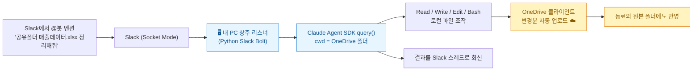
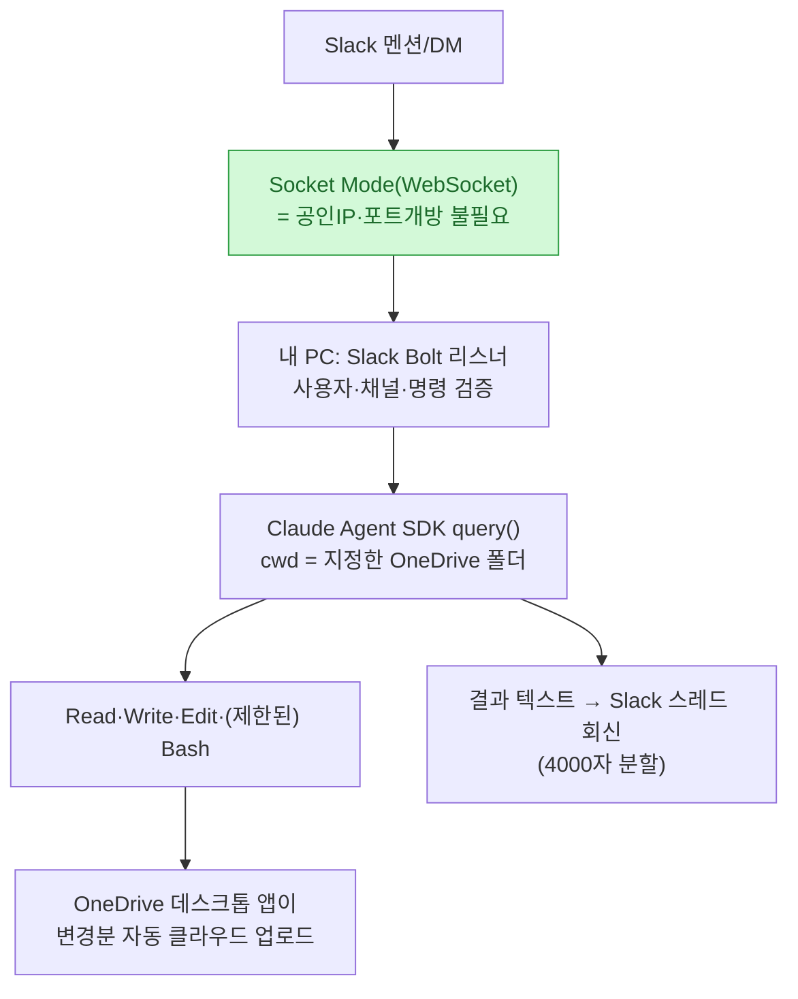
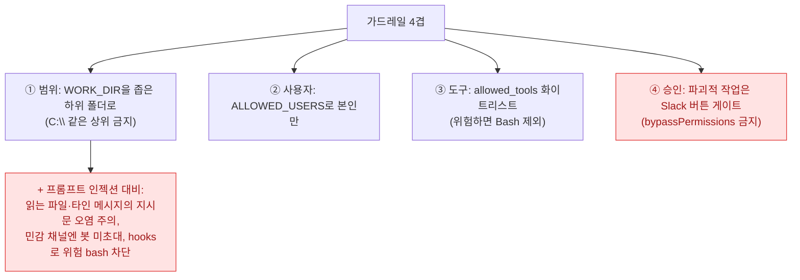

나는 이미 [[telegram-claude-code-remote-bot|텔레그램으로 원격 코딩 봇]]을 만들어 폰에서 내 PC의 Claude Code를 부려봤다. 그런데 이번엔 조금 다른 각도가 궁금했다 — **"Slack에 '이 폴더 파일들 정리해줘'라고 치면, 내 OneDrive는 물론이고 동료가 공유해준 폴더까지 Claude가 알아서 로컬처럼 읽고 쓰게 할 수 있나?"**

결론부터: **된다.** 그리고 생각보다 우아하다. 핵심은 클라우드 API를 붙이는 게 아니라 **"공유받은 폴더를 내 로컬 OneDrive 밑으로 끌어와 동기화"**시키는 것 하나다. 그러면 Claude Code 입장에선 그냥 로컬 경로가 된다. 회사 파일 자동화를 실험하며 확인한 것들을, **회사명·경로·데이터는 전부 일반화한 예시**로 정리한다.

## 오늘 만들 그림 한 장



## 기본 Claude Code Slack 통합으로는 왜 안 되나?

먼저 함정을 짚어야 한다. **Anthropic 기본 Slack 통합(@Claude 멘션)은 클라우드에서 GitHub 저장소를 대상으로 돈다.** 웹에서 인증한 repo 기준으로 Anthropic 클라우드가 세션을 실행하는 방식이라, **내 로컬 PC나 로컬 OneDrive 폴더에는 접근하지 못한다.**

내가 원하는 그림(Slack 멘션 → 내 PC의 로컬/OneDrive 폴더 읽기+쓰기)은 **"로컬 실행형 커스텀 브릿지"**를 직접 만들어야 한다. 그 핵심이 **Claude Agent SDK** — Claude Code 엔진의 라이브러리 버전이다.

| | 기본 Slack 통합 | Claude Agent SDK (직접 브릿지) |
|---|---|---|
| 실행 위치 | Anthropic 클라우드 | **내 PC(내 프로세스)** |
| 작업 대상 | GitHub repo | **로컬 파일시스템 전체(내가 허용한 범위)** |
| 파일 읽기·쓰기·명령 | repo 한정 | **Read/Write/Edit/Bash 바로 수행** |
| 로컬 OneDrive 접근 | ❌ | ✅ |

에이전트 루프가 **내 프로세스·내 PC 안에서** 돌기 때문에, 파일 읽기·명령 실행·편집을 별도 구현 없이 바로 한다. 그래서 로컬 OneDrive 폴더가 그냥 작업 대상이 된다.

## 아키텍처 — Socket Mode가 방화벽을 뚫는다



**Webhook 대신 Socket Mode**가 포인트다. Webhook은 외부에서 로컬 방화벽을 뚫어야 해서 ngrok 같은 포트 포워딩이 필요하지만, **Socket Mode는 내 PC가 Slack 서버로 WebSocket 연결을 유지**해서 스크립트만 켜두면 실시간 수신된다.

## OneDrive '쓰기'가 왜 이렇게 쉬운가?

여기가 가장 우아한 부분이다. **로컬 동기화 폴더에 그냥 파일을 쓰면, OneDrive 데스크톱 앱이 알아서 클라우드로 업로드한다.** Microsoft Graph API도, OAuth도 필요 없다. Claude가 로컬에 `결과보고서.xlsx`를 만들면 → OneDrive가 감지 → 클라우드 반영. 끝.

M365 커넥터(클라우드·읽기 중심·대화 한정)보다 이 로컬 동기화 방식이 **읽기+쓰기 둘 다 되는 제일 쉬운 길**이다.

## 핵심: 남이 공유해준 폴더까지 '로컬처럼' 만들기

이번 글의 진짜 주제. 동료가 공유해준 OneDrive 폴더를, 내 로컬 경로로 바꾸는 방법은 **'내 파일에 바로 가기 추가(Add shortcut to My files)'** 하나다.


`claude --add-dir "C:\Users\<사용자>\OneDrive - 회사명\<공유폴더>"` 로 작업 범위에 그 경로만 추가하면 된다.

### 이거 안 맞으면 실패하는 3가지 필수 조건

| # | 조건 | 안 지키면 |
|---|---|---|
| ① | **편집 권한(Can edit)** 으로 공유받기 | '보기 전용'이면 읽기만 되고 **쓰기는 권한 오류** |
| ② | **'폴더' 단위**로 공유받기 | 개별 파일 하나만 공유받으면 바로 가기가 **`.url` 인터넷 링크**로 생겨 브라우저로 열림 → 로컬 파일 아님 |
| ③ | 원칙적으로 **같은 조직(테넌트) 내부** | 외부 회사가 공유한 폴더는 바로 가기 추가가 막힐 수 있음(B2B Sync/관리자 정책 필요) |

### 놓치기 쉬운 주의점

- **'다운로드' 버튼 누르지 말 것** — 그건 로컬 '복사본'이라 쓰기가 원본에 동기화 안 된다. 반드시 **'바로 가기 추가'**.
- **Files On-Demand** — 공유 폴더도 온라인 전용 placeholder일 수 있다(읽을 때 자동 다운로드). 자동화 대상은 폴더 우클릭 → **'이 장치에 항상 유지'**.
- **파괴적 쓰기 = 전원에게 반영** — 봇이 공유 폴더에 쓰면 모든 공유자에게 반영된다. 그래서 공유 폴더 자동화는 **백업·범위 제한·확인 게이트가 내 폴더보다 훨씬 중요**하다.
- **동시 편집 충돌** — 동료가 같이 편집 중이면 OneDrive가 `-conflict` 사본을 만든다.

## 편집 권한이 있으면 무엇까지 되나?

| 작업 | 가능 | 동료 OneDrive 반영 |
|---|:--:|:--:|
| 파일 읽기 | ✅ | — |
| 파일 생성 | ✅ | 자동 동기화 |
| Excel·Word 수정 | ✅ | 자동 동기화 |
| 파일명 변경 | ✅ | 자동 동기화 |
| 하위 폴더 생성 | ✅ | 자동 동기화 |
| 파일 이동 | ✅ | 자동 동기화 |
| 파일 삭제 | ✅ | **삭제도 동기화** |
| Python·PowerShell 처리 | ✅ | 결과 파일 동기화 |

판단 기준은 딱 하나다 — **Windows 탐색기에서 실제 폴더로 열리고 내가 직접 파일을 만들거나 수정할 수 있으면, Claude Code도 같은 Windows 계정 권한으로 똑같이 작업할 수 있다.**

## 뼈대 코드 (상수만 채우면 동작)

```python
# 사전: pip install slack-bolt claude-agent-sdk  (Python 3.10+, Node 18+, ANTHROPIC_API_KEY)
import os, asyncio
from slack_bolt.async_app import AsyncApp
from slack_bolt.adapter.socket_mode.async_handler import AsyncSocketModeHandler
from claude_agent_sdk import query, ClaudeAgentOptions, AssistantMessage, TextBlock

SLACK_BOT_TOKEN = os.environ["SLACK_BOT_TOKEN"]   # xoxb-...
SLACK_APP_TOKEN = os.environ["SLACK_APP_TOKEN"]   # xapp-... (Socket Mode)
WORK_DIR      = r"C:\Users\<사용자>\OneDrive - 회사명\ClaudeWorkspace"  # 좁게 한정!
ALLOWED_USERS = {"U0XXXXXXX"}                     # 본인 Slack user ID만 (보안 필수)

app = AsyncApp(token=SLACK_BOT_TOKEN)

async def run_claude(prompt: str) -> str:
    options = ClaudeAgentOptions(
        cwd=WORK_DIR,
        allowed_tools=["Read", "Write", "Edit", "Glob", "Grep"],  # Bash는 필요할 때만
        permission_mode="acceptEdits",   # 헤드리스라 편집 자동 승인 (bypassPermissions는 금지)
        system_prompt="너는 로컬 파일 자동화 에이전트다. cwd 폴더 범위 안에서만 읽고 쓴다.",
    )
    texts, result = [], None
    async for m in query(prompt=prompt, options=options):
        if isinstance(m, AssistantMessage):
            texts += [b.text for b in m.content if isinstance(b, TextBlock)]
        elif getattr(m, "result", None):
            result = m.result
    return result or ("\n".join(texts) if texts else "완료")

@app.event("app_mention")
async def on_mention(event, say):
    if ALLOWED_USERS and event.get("user") not in ALLOWED_USERS:
        return await say(text="권한 없음", thread_ts=event["ts"])
    prompt = " ".join(w for w in event.get("text", "").split() if not w.startswith("<@")).strip()
    ts = event.get("thread_ts") or event["ts"]
    if not prompt:
        return await say(text="지시 내용을 함께 입력해줘.", thread_ts=ts)
    await say(text=f":gear: 작업 시작: `{prompt}`", thread_ts=ts)
    out = await run_claude(prompt)
    for i in range(0, len(out), 3800):           # Slack 4000자 제한
        await say(text=out[i:i+3800], thread_ts=ts)

async def main():
    await AsyncSocketModeHandler(app, SLACK_APP_TOKEN).start_async()

if __name__ == "__main__":
    asyncio.run(main())
```

Slack 앱 설정은 간단하다 — **Socket Mode 켜고 App-Level Token(`connections:write`) 발급 → Bot Token Scopes(`app_mentions:read`, `chat:write`) → Event `app_mention` 구독 → 채널에서 `/invite @봇`.**

## 안전하게 — 회사 파일에 '쓰기'가 들어가니 이게 제일 중요

AI에게 로컬 쓰기 권한을 주는 순간, 보안 설계가 기능보다 우선이다.



권장 정책은 이렇게 잡았다:

| 작업 | 정책 |
|---|---|
| 파일 읽기·검색 | 자동 허용 |
| 새 파일 생성 | 자동 허용 |
| 기존 파일 수정 | **수정 전 백업** |
| 덮어쓰기 | **Slack 승인** |
| 삭제·대량 이동 | **반드시 승인** |
| 외부 전송 | 기본 금지 |
| 임의 PowerShell | 금지 |
| 등록된 스크립트 | 허용 |

특히 접근 금지 경로를 코드에서 못 박는 게 좋다 — `C:\Windows`, `AppData`, 다른 부서 폴더, 인사·개인정보 폴더 등은 아예 배제하고, 허용 루트를 `ClaudeWorkspace` 하나로 고정한다. 자유롭게 아무 명령이나 받기보다 `파일요약 / 검증 / 보고서생성`처럼 **업무별 고정 명령**으로 좁히면 더 안정적이다.

## 24시간 돌리려면 — 리스너는 '항상 켜져' 있어야 한다

로컬 실행형이라 **리스너가 꺼지면 메시지를 받아 처리할 게 없다.** 터미널을 계속 켜두기보다:

- **Windows 작업 스케줄러 / 서비스 / 시작 프로그램**, 또는 **PM2·NSSM**으로 백그라운드 상주
- 필요 조건: **PC 전원 · 인터넷 · 리스너 실행 · OneDrive 동기화 실행 · Claude 인증 정상**
- 자동화용 PC라면 **절전 해제** 설정(절전 들어가면 리스너가 멈출 수 있음)

## OpenClaw로 갈까, 직접 봇을 만들까?

| 구분 | OpenClaw | 직접 만든 Claude 봇 |
|---|---|---|
| Slack 연동 | 기본 지원 | 직접 구현 |
| 리스너 | Gateway가 담당 | Python 리스너 |
| 확장(Telegram·Discord) | 쉬움 | 별도 개발 |
| 파일 접근 통제 | 설정 가능하나 구조가 큼 | **코드 수준 세밀 제한** |
| 민감 업무 적용 | 신중한 설정 필요 | **목적형 설계에 유리** |

**단일 Slack + OneDrive 자동화**라면 나는 직접 봇을 추천한다. 접근 폴더·사용자·명령을 코드로 좁게 잠그는 게 민감한 파일엔 관리하기 쉽다. Telegram·Teams까지 늘리거나 멀티 에이전트·장기 기억이 필요해지면 그때 OpenClaw로 확장하면 된다. (참고로 OpenClaw 공식 보안 문서도 Slack·문서·웹 입력을 '신뢰 불가 콘텐츠'로 보고 도구 정책·샌드박스를 강하게 제한하라고 안내한다 — 결국 [[the-coming-loop-armin-ronacher-harness-critique|판단·경계는 사람 몫]]이라는 얘기다.)

## 내 워크플로에 적용한다면

| 상황 | 적용 |
|---|---|
| 공용 폴더 반복 정리 | 동료에게 **'폴더'를 '편집 권한'으로** 공유받아 바로 가기 추가 → Slack 한 줄로 일괄 처리 |
| 대용량이라 로컬 동기화 부담 | 로컬 동기화 대신 **Graph API 경로**(OAuth 필요, 복잡) — 로컬이 막혔을 때만 |
| 민감 파일 | WORK_DIR을 `ClaudeWorkspace`로 고정, 삭제·덮어쓰기는 **승인 게이트** |
| 비개발자에게 설명 | "메신저에 지시하면 AI가 공용 폴더 파일을 읽고·만들고·고쳐 결과를 돌려준다"로 |

Slack 한 줄이 내 폴더를 넘어 **동료의 폴더까지** 닿는 순간, 편의는 커지지만 '전원에게 반영되는 쓰기'라는 무게도 같이 온다. 그래서 이 자동화의 마지막 한 겹은 늘 **범위·백업·승인**이어야 한다.

## 참고자료

- [Microsoft Learn — 공유 폴더를 내 OneDrive에 추가(Add shortcut to My files)](https://support.microsoft.com/ko-kr/office/onedrive%EC%97%90-%EA%B3%B5%EC%9C%A0-%ED%8F%B4%EB%8D%94-%EC%B6%94%EA%B0%80)
- [Anthropic — Claude Agent SDK](https://docs.claude.com/en/api/agent-sdk/overview)
- [Slack — Bolt for Python · Socket Mode](https://tools.slack.dev/bolt-python/concepts/socket-mode/)
- 관련: [[telegram-claude-code-remote-bot|텔레그램 원격 코딩 봇]] · [[slack-codex-cli-remote-bot-1-build|Slack 원격 봇 만들기]]

<!-- 안전: 회사 실명·실제 경로·고객/제3자 PII·API키·실데이터 없음. 특정 업무 내용은 전부 일반화한 예시로 대체(합성·일반화). -->
