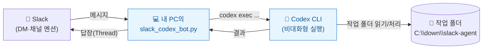
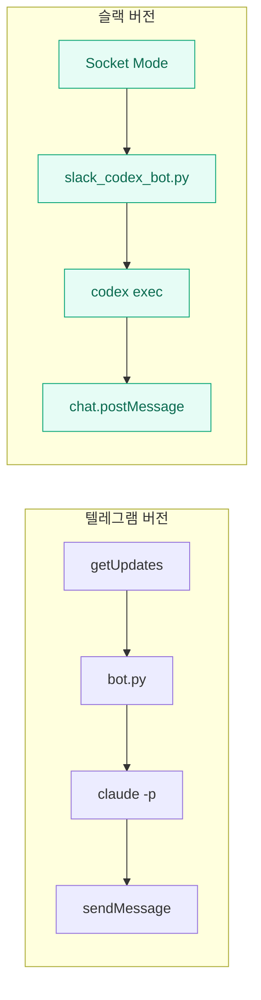
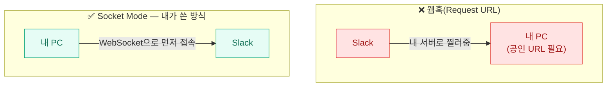
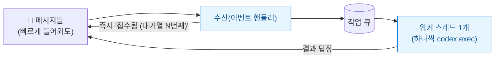
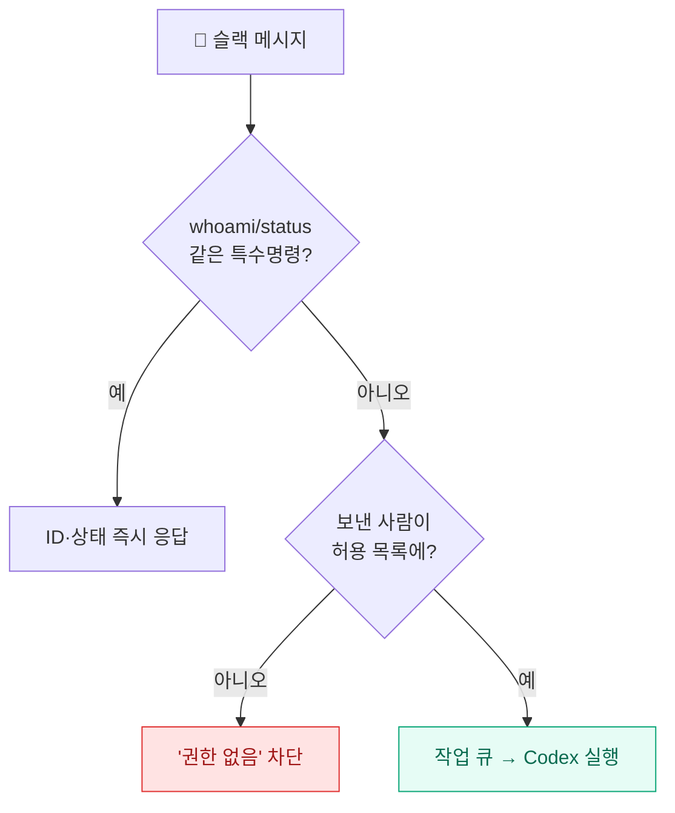

지난번에 [[telegram-claude-code-remote-bot|텔레그램으로 Claude Code를 부려먹는 봇]]을 만들고 나니, 똑같은 걸 **슬랙 + Codex**로도 해보고 싶었다. 메신저만 바뀌고(텔레그램→Slack), 일하는 도구만 바뀌면(Claude Code→OpenAI Codex), 구조는 같을 것 같았다.

실제로 그랬다. 그래서 오늘은 **무료 Slack 워크스페이스에서 메시지를 보내면 내 PC의 Codex CLI가 돌고 결과가 슬랙으로 돌아오는** 봇을 만들었다. 부품이 텔레그램 때와 거의 1:1로 대응돼서, 만드는 내내 "아, 이건 그거랑 같네" 했던 하루였다.

> ⚠️ 이 글의 토큰(`xapp-`/`xoxb-`)·Slack User ID·전체 경로는 전부 **예시 플레이스홀더**다. 실제 비밀값은 한 글자도 싣지 않는다.

## 한눈에 — 슬랙 메시지가 내 PC의 Codex가 되기까지



가운데 **slack_codex_bot.py**가 중계기다 — *"슬랙을 지켜보다가 메시지가 오면 Codex 명령으로 실행하고 답을 돌려주는 다리"*. 텔레그램 봇의 bot.py와 역할이 똑같다.

## 텔레그램 버전과 뭐가 같고, 뭐가 다른가?

만들기 전에 둘을 나란히 놓고 봤다. 뼈대는 같고, 부품 이름만 바뀐다.

| 구간 | 텔레그램 버전 | 슬랙 버전 |
|---|---|---|
| 메시지 받기 | `getUpdates`(롱폴링) | **Socket Mode**(WebSocket) |
| 중계기 | `bot.py` | `slack_codex_bot.py` |
| 실행 도구 | `claude -p`(헤드리스) | **`codex exec`**(비대화형) |
| 답장 | `sendMessage` | `chat.postMessage` |
| 공인 IP | 불필요 | 불필요 |



그래서 텔레그램 봇을 한 번 만들어 봤다면, 슬랙 버전은 "받는 법"과 "토큰"만 새로 배우면 된다.

## Socket Mode가 뭔데? 왜 그걸 쓰나

슬랙 봇이 메시지를 받는 길도 둘이다 — 텔레그램의 웹훅 vs 롱폴링과 똑같은 갈림길이다.

- **웹훅(Request URL)**: 슬랙이 내 서버로 이벤트를 찔러줌 → **공인 URL/서버 필요**(개인 PC엔 부적합).
- **Socket Mode**: 내 PC가 슬랙에 **WebSocket으로 먼저 접속**해 메시지를 받음 → **공인 IP도 포트 개방도 불필요.**



즉 **Socket Mode = 슬랙판 롱폴링**이다. 그래서 집 PC에서 서버 없이 그냥 돌아간다. 파이썬 쪽은 슬랙 공식 라이브러리 `slack-bolt`/`slack-sdk`를 깔아 쓴다.

```powershell
& "C:\Users\<사용자>\anaconda3\python.exe" -m pip install slack-bolt slack-sdk
```

## 토큰이 둘이다 — xapp vs xoxb

텔레그램은 토큰이 하나였는데, 슬랙은 **두 개**라 처음에 헷갈렸다. 역할이 다르다.

| 토큰 | 정체 | 하는 일 |
|---|---|---|
| **`xapp-...`** | App-Level Token | **Socket Mode 연결**을 여는 열쇠 (scope: `connections:write`) |
| **`xoxb-...`** | Bot User OAuth Token | 봇이 메시지를 **읽고 답장**하는 권한 |

`xoxb`를 쓰려면 봇에게 권한(Bot Token Scopes)과 이벤트(Event Subscriptions)를 줘야 한다. 첫 테스트에 필요한 최소 조합은 이렇다.

| Scope | 이유 | Bot Event | 용도 |
|---|---|---|---|
| `chat:write` | 답장하기 | `message.im` | DM 받기 |
| `app_mentions:read` | 멘션 받기 | `app_mention` | 채널 멘션 받기 |
| `im:history` | DM 내용 읽기 | | |

> scope나 event를 바꾸면 **앱을 워크스페이스에 재설치**(Reinstall)해야 반영된다. 이걸 깜빡해서 한참 헤맸다(삽질은 2편에서).

토큰은 코드에 박지 않고 `slack_token.txt`에서 정규식으로 뽑아 쓴다.

```python
text = TOKEN_FILE.read_text(encoding="utf-8", errors="replace")
APP_TOKEN = re.search(r"xapp-[A-Za-z0-9-]+", text).group(0)
BOT_TOKEN = re.search(r"xoxb-[A-Za-z0-9-]+", text).group(0)
```

## 슬랙 메시지가 어떻게 'Codex 실행'이 되나?

여기가 심장이다. 텔레그램 때 `claude -p`를 `subprocess`로 부른 것처럼, 이번엔 **`codex exec`**를 부른다.

```python
cmd = [
    "codex", "exec",
    "--cd", str(WORK_DIR),            # 어느 폴더에서 일할지
    "--sandbox", SANDBOX,             # 권한(처음엔 read-only)
    "--skip-git-repo-check",          # git 저장소 아니어도 실행
    "--output-last-message", str(out),# 최종 답을 이 파일로 받음
    prompt,                           # 슬랙에서 받은 작업 지시
]
result = subprocess.run(cmd, cwd=str(WORK_DIR), capture_output=True,
                        text=True, encoding="utf-8", errors="replace",
                        timeout=900, stdin=subprocess.DEVNULL)
final = out.read_text(encoding="utf-8") if out.exists() else result.stdout
```

한 줄씩 풀면:

- **`codex exec`**: Codex CLI의 **비대화형(non-interactive) 모드**. 대화창 없이 지시 한 번 받고 실행한다(`claude -p`의 짝).
- **`--cd`**: Codex가 일할 **작업 폴더**. 슬랙에서 "이 폴더"라고 하면 여기를 가리킨다.
- **`--sandbox`**: **권한 손잡이.** 처음엔 `read-only`(읽기만).
- **`--skip-git-repo-check`**: 작업 폴더가 git 저장소가 아니어도 실행하게.
- **`--output-last-message`**: Codex의 최종 답을 **파일로** 받는다. stdout 파싱보다 안정적이라 이걸 쓴다.
- **`stdin=subprocess.DEVNULL` / `timeout=900`**: 입력 대기 지연 제거 + 15분 넘으면 강제 종료.

이 함수가 돌려준 문자열이 곧 슬랙으로 보낼 답이 된다.

## sandbox는 '권한 손잡이' — read-only → workspace-write → 그 너머

Codex의 `--sandbox`가 이 봇의 안전을 좌우한다. 나는 **읽기 전용**으로 시작했다.

| 단계 | `--sandbox` | 할 수 있는 일 | 추천 |
|---|---|---|---|
| 1 (시작) | `read-only` | 파일 읽기·분석만 | 첫 테스트 |
| 2 | `workspace-write` | **작업 폴더 안** 파일 생성·수정 | 자동화 |
| 3 | `workspace-write` + `--add-dir` | 추가 폴더까지 | 여러 폴더 |
| 4 | `danger-full-access` | PC 전체에 가까운 접근 | **일반 자동화엔 비추천** |

> ⚠️ 추가 폴더가 필요하면 `danger-full-access`로 확 풀지 말고 **`--add-dir`로 딱 그 폴더만** 여는 게 안전하다. (실제로 `workspace-write`로 Output 폴더에 파일 생성까지 직접 테스트해서 되는 걸 확인했다 — 단, 슬랙 봇 기본값은 안전하게 `read-only`로 두고, 쓰기는 Codex를 직접 실행해 따로 검증했다.)

## 동시에 와도 안 엉키게 — 작업 큐 + 워커 1개

슬랙 메시지는 여러 개가 빠르게 들어올 수 있다. Codex가 동시에 여러 번 돌면 같은 파일을 같이 건드릴 수 있어서, 처음부터 **작업 큐 + 워커 스레드 1개**로 만들었다.



받는 쪽은 멈추지 않고 접수만 하고, 실행은 워커가 큐에서 하나씩 꺼내 처리한다. **워커를 1개로 둔 게 핵심** — 파일 충돌을 막는 가장 단순하고 안전한 방법이다(긴 작업이 있으면 뒤가 기다리는 단점은 감수).

```python
def worker(client):
    while True:
        channel, user, prompt, thread_ts = task_q.get()
        post_message(client, channel, f"실행 중: {prompt}", thread_ts)
        answer = run_codex(prompt)
        post_message(client, channel, answer, thread_ts)
        task_q.task_done()
```

## 아무나 못 쓰게 — 허용 사용자 ID 하나로

슬랙 봇도 워크스페이스 사람이면 누구나 말을 걸 수 있다. 그런데 이 봇은 내 PC에서 Codex를 돌리니, **허용 사용자만** 통과시켜야 한다.

```python
allowed = load_allowed_users()        # slack_allowed_users.txt
if user not in allowed:
    post_message(client, channel, "권한 없음. 먼저 whoami로 ID 확인 후 등록하세요.")
    return
```

그래서 봇에 `whoami`를 보내면 내 Slack User ID를 알려주고, 그 ID(`U08XXXXXXXX` 같은 형식)를 `slack_allowed_users.txt`에 한 줄 넣으면 그 사람만 쓸 수 있다. **이게 유일한 출입 통제**다.



## 보안 — 토큰은 비밀번호, 작업 폴더 밖에 둔다

- **`xapp`/`xoxb` 토큰은 비밀번호다.** 슬랙 메시지·깃허브·블로그·캡처에 노출 금지.
- ⚠️ **토큰 파일은 Codex 작업 폴더(`--cd`) 밖에 둔다.** 안 그러면 나중에 권한을 넓혔을 때 봇이 "폴더 파일 다 읽어줘"로 자기 토큰을 읽어버릴 수 있다. (OneDrive 동기화 폴더에도 토큰을 넣지 않는 게 좋다.)
- `ALLOWED_USERS`는 반드시 둔다. 처음엔 `read-only`로 시작하고, `danger-full-access`는 쓰지 않는다.

## 비용 — 슬랙은 무료지만, Codex는 계정 한도

헷갈리기 쉬운 구분 하나.

```text
Slack 무료 플랜 = 슬랙 사용료 안 냄
Codex 실행      = 로그인된 Codex/OpenAI 계정의 사용량·한도에 따름
```

즉 슬랙 자체는 공짜로 시작하지만, **`codex exec` 호출은 내 Codex 계정의 사용량을 쓴다.** 그래서 작업 폴더를 작게 유지하고, 한 번에 너무 넓은 지시를 하지 않고, 필요 없을 땐 맥락 유지를 끄는 습관이 비용을 줄인다.

---

여기까지가 1편 — **슬랙 DM으로 보낸 메시지가 내 PC의 Codex를 `read-only`로 돌리고, 그 결과가 슬랙으로 돌아오는 왕복**을 검증한 단계다. 텔레그램 봇과 부품이 1:1로 대응돼서, 한 번 해봤다면 어렵지 않았다.

2편에서는 **슬랙다운 부분** — 채널·Thread로 협업하기, 그리고 봇을 자유문장에서 '명령형 API'로 바꾸고 **권한을 단계로 설계(grant/revoke)** 하는 이야기를 적는다. (그리고 오늘 실제로 겪은 삽질 4건도.)

> 안전: 이 글엔 실제 Slack 토큰·User ID·전체 경로 같은 비밀값을 일절 싣지 않았다. 전부 일반화된 예시이며, 봇은 개인 PC에서 본인만 쓰는 용도다.

<!-- 안전: 회사 실데이터·제3자 PII·실제 토큰/ID/경로 없음. xapp/xoxb 토큰·Slack User ID·C:\Users 실경로는 전부 플레이스홀더로 일반화. -->
