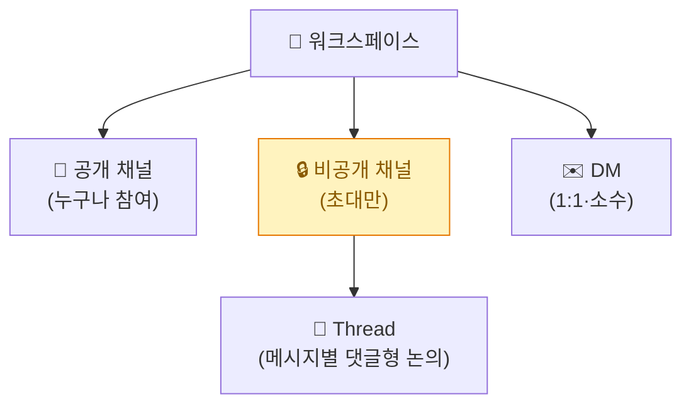
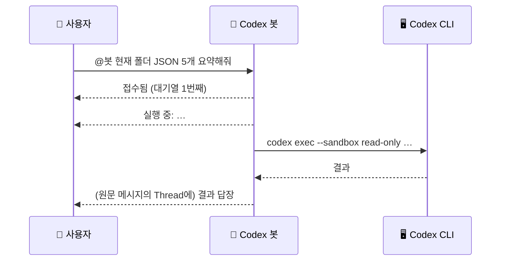
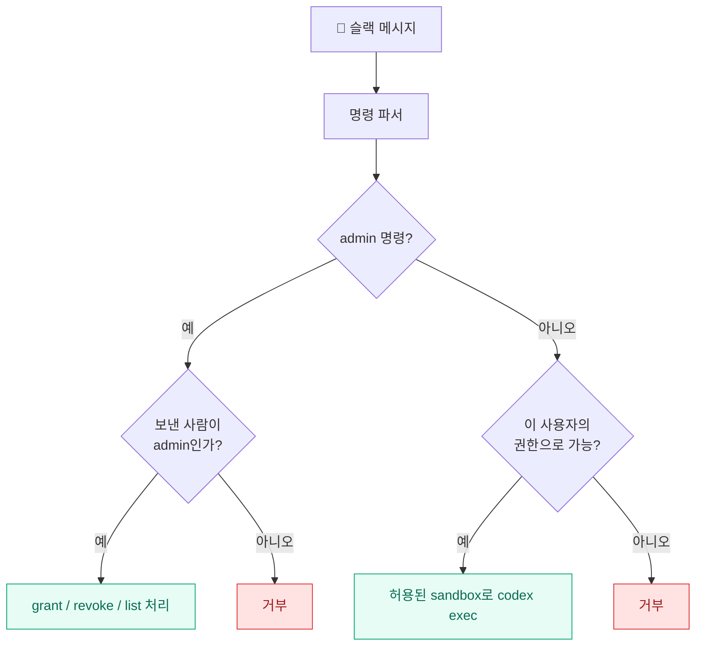

[[slack-codex-cli-remote-bot-1-build|1편]]에서는 슬랙 DM으로 보낸 메시지가 내 PC의 Codex를 `read-only`로 돌리는 왕복까지 검증했다. 그런데 슬랙은 텔레그램과 달리 **1:1 메신저가 아니라 '채널 기반 협업 도구'** 다. 그래서 2편은 두 가지다 — **슬랙답게 쓰는 법(채널·Thread)**, 그리고 **봇을 안전하게 키우는 법(명령형 API + 권한 설계)**.

> ⚠️ 이번에도 토큰·Slack User ID·경로는 전부 일반화한 예시다.

## 슬랙은 텔레그램과 뭐가 근본적으로 다른가?

텔레그램 봇은 "나랑 봇의 1:1 대화"였다. 슬랙은 단위가 다르다.

| 구분 | 의미 | 용도 |
|---|---|---|
| **공개 채널** | 워크스페이스 누구나 찾아 참여 | 공개 팀·프로젝트 |
| **비공개 채널** | **초대받은 사람만** | 제한된·민감한 업무 |
| **DM** | 1:1·소수 | 짧은 확인, 봇 테스트 |
| **Thread** | 특정 메시지 아래 **댓글형** 세부 대화 | 메인 흐름 안 어지럽히기 |

내가 처음 헷갈렸던 "슬랙 = 초대자만 들어오는 폐쇄 공간"이라는 이해는, 정확히는 **비공개 채널**에 들어맞는다. 공개 채널은 같은 워크스페이스면 찾아 들어올 수 있어 완전 폐쇄는 아니다.



그래서 슬랙을 업무 관점으로 보면 이렇게 대응된다 — **채널=업무방, 멤버=참여자/봇, 메시지=요청·공유·결정, Thread=댓글형 세부 논의, 봇=반복 작업 담당자.**

## DM으로 쓸까, 채널 멘션으로 쓸까?

봇은 두 방식으로 쓸 수 있다. 오늘은 DM으로 검증했고, 팀으로 키울 땐 채널이다.

| | DM 방식 | 채널 멘션 방식 |
|---|---|---|
| 호출 | 봇과의 1:1 대화 | `@Local Codex Bot 작업 지시` |
| 장점 | 설정 단순, 안 보임 | 팀이 같이 보고 **Thread로 후속 논의** |
| 단점 | 팀이 같이 못 봄 | 채널 멤버 전체에 결과 노출 |
| 민감 작업 | 안전 | **비공개 채널**에서만 |

채널에서 쓰려면 봇을 초대(`/invite @Local Codex Bot`)한 뒤 멘션한다. 예상 흐름은 이렇다.



봇은 답장을 원래 메시지의 **Thread(`thread_ts`)에 붙인다.** 그래서 채널 메인은 안 어지럽고, 한 요청에 대한 봇 결과·사람 검토·후속 질문이 한 Thread에 쌓인다.

## 봇을 '자유문장'에서 '명령형 API'로

지금은 아무 문장이나 Codex로 넘긴다. 그런데 슬랙 자동화는 업무가 섞이기 쉬워서, **허용된 명령만 받는 '내부 API'처럼** 설계하는 게 안전하다. 이미 봇엔 특수 명령이 몇 개 들어 있다.

| 메시지 | 동작 |
|---|---|
| `whoami` / `id` / `내아이디` | 내 Slack User ID 확인 |
| `status` / `상태` | 대기열·작업 폴더·sandbox·허용 사용자 수 |

여기서 더 나아가면 이런 명령형 API로 키울 수 있다.

```text
files                      → 작업 폴더 파일 목록
summary 최신                → 최신 파일 요약
summary <파일명>            → 특정 파일 요약
search <키워드>             → 키워드 검색
report date=2026-06-29     → 날짜별 리포트
```

```json
{ "action": "summarize", "file": "<파일명>", "limit": 10 }
```

> 자유문장 실행과 명령형 실행을 **분리**하면, 허용된 작업만 돌고 권한 검사와 붙이기 쉽고 로그·결과 형식이 안정적이다.

## 권한을 단계로 — read → write-output → admin

가장 중요한 설계는 권한이다. "전부 `workspace-write`로 열기"는 편하지만 위험하다. 그래서 **권한을 레벨로 쪼개고**, 관리자만 부여/회수하게 만드는 그림을 그렸다.

| 권한 | 의미 |
|---|---|
| `read` | 작업 폴더 **읽기만** |
| `write-output` | **`Output` 폴더에만** 결과 저장 |
| `edit` | 허용된 파일만 수정 |
| `admin` | 사용자 권한 **부여/회수** |



권한은 지금의 단순 텍스트(`slack_allowed_users.txt`)에서 JSON으로 확장한다.

```json
{
  "U08XXXXXXXX": { "role": "admin", "permissions": ["read", "write-output"] },
  "U12XXXXXXXX": { "role": "user",  "permissions": ["read"] }
}
```

명령 예: `admin grant <ID> read` / `admin grant <ID> write` / `admin revoke <ID>` / `admin permissions`.

## 안전한 권한 부여 — 7원칙

설계하면서 정한 규칙이다. 편의보다 안전을 앞에 뒀다.

1. `grant`/`revoke`는 **admin만** 실행
2. admin 목록은 **별도 파일**로 관리
3. **read와 write를 분리**
4. write는 **`Output` 폴더부터** 제한적으로
5. **shell 실행 권한은 기본 금지**
6. `danger-full-access`는 **쓰지 않음**
7. 모든 `grant`/`revoke`는 **로그에 기록**

> 즉 "기술적으로 쓰기도 된다"와 "그래서 다 열어준다"는 다르다. **사용자별 권한 + 명령별 sandbox**를 분리하는 게 실제 운영의 핵심이다.

## 오늘 겪은 삽질 4건

순탄하진 않았다. 슬랙 특유의 함정이 있었다.

| # | 증상 | 원인 | 해결 |
|---|---|---|---|
| 1 | `slack-bolt/sdk not found` | 슬랙 파이썬 패키지 미설치 | `pip install slack-bolt slack-sdk` |
| 2 | `*/whoami*은 유효한 명령어가 아닙니다` | **슬랙은 `/`로 시작하면 slash command로 가로챔** | 명령을 `/whoami`→`whoami`(슬래시 제거)로 |
| 3 | "이 앱으로 메시지를 보내는 기능이 꺼져 있습니다" | App Home의 **Messages Tab/DM 허용 옵션 꺼짐** | 켜고 → 앱 재설치 |
| 4 | `권한 없음`만 옴 | 허용 사용자 미등록(의도된 차단) | `whoami`로 ID 확인 → `slack_allowed_users.txt`에 추가 |

특히 **2번**이 슬랙다웠다. 텔레그램에선 `/whoami`가 그냥 텍스트였는데, 슬랙은 `/`로 시작하는 입력을 **slash command로 먼저 해석**해서 봇 코드까지 도달하지도 않았다. 그래서 봇의 내부 명령에서 슬래시를 떼어 일반 텍스트로 바꿨다.

## 지금의 한계, 그리고 다음 단계

오늘 v1은 의도적으로 좁다.

```text
✅ 된 것: DM 수신 · 허용자 확인 · read-only 읽기 · 작업 큐 · 로그 · (Codex 직접 실행으로) write 검증
⬜ 아직: 봇을 통한 파일 수정/Output 저장 · grant/revoke API · 채널별 권한 · 관리자 API · 파일 첨부
```

자연스러운 다음 순서는 이렇다 — ① 자주 쓸 명령 정하기(`files`/`summary`/`search`) → ② 자유문장과 명령형 분리 → ③ `slack_permissions.json` 권한 구조 → ④ `admin grant/revoke` → ⑤ `write-output`(Output 저장만 허용) → ⑥ 필요할 때만 특정 명령에서 `workspace-write` → ⑦ 팀이면 **비공개 채널** 만들어 봇 초대.

---

두 편을 묶으면 결국 이거다. **메신저(텔레그램·슬랙) + 헤드리스 코딩 에이전트(Claude Code·Codex) + subprocess** 라는 같은 레시피에, 슬랙은 **채널·Thread 협업**과 **권한 설계**라는 결을 더한다. 1:1로 "내 비서"를 부리는 게 텔레그램이었다면, 슬랙은 **"팀 업무방에 들어온 AI 담당자"**로 키울 수 있는 그릇이었다.

오늘은 그 그릇에 가장 안전한 첫 숟갈(`read-only` 읽기)만 떠봤다. 권한을 한 칸씩 여는 건, 텔레그램 때와 똑같이 — 천천히, 로그를 남기며.

▶ 이어지는 3편에서는 실제 업무 파일이 있는 **OneDrive를 연결**하고, **슬랙 채널 자체를 봇이 관리**(생성·초대·아카이브)하게 만든다 — [[slack-codex-cli-remote-bot-3-onedrive-channels|3편: OneDrive 연결과 채널 관리 API]].

> 안전: 실제 Slack 토큰·User ID·전체 경로 없음(전부 일반화 예시). 개인 PC에서 본인만 쓰는 용도.

<!-- 안전: 회사 실데이터·제3자 PII·실제 토큰/ID/경로 없음. xapp/xoxb·Slack User ID·C:\Users 실경로는 플레이스홀더로 일반화. -->
