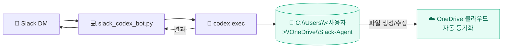
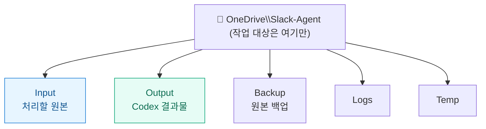
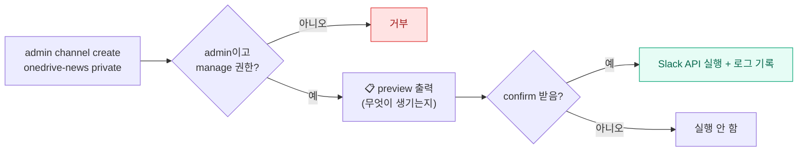
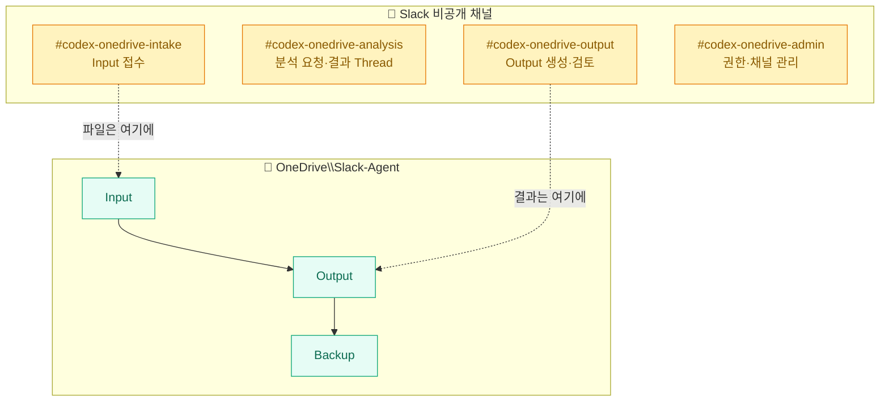

[[slack-codex-cli-remote-bot-1-build|1편]]·[[slack-codex-cli-remote-bot-2-channels-permissions|2편]]에서는 슬랙 메시지로 내 PC의 Codex를 `read-only`로 돌리는 데까지 했다. 그런데 정작 내 **진짜 업무 파일**은 로컬 테스트 폴더가 아니라 **OneDrive**에 있다. 그리고 슬랙답게 키우려면 채널을 그때그때 손으로 만드는 것도 귀찮다.

그래서 3편은 두 가지다 — **OneDrive를 봇에 연결**하기, 그리고 **슬랙 채널 자체를 봇이 관리**(생성·초대·아카이브)하게 만들기. 봇을 "파일 읽어주는 도구"에서 "업무방을 세팅하는 매니저"로 한 칸 키우는 이야기다.

> ⚠️ 이번에도 경로(`C:\Users\<사용자>\...`)·Slack User ID는 일반화한 예시다.

## OneDrive를 어떻게 연결하나? — 두 방식

처음엔 "OneDrive면 클라우드라 API 인증부터 해야 하나?" 했는데, 그럴 필요 없었다. 방식이 둘인데 하나는 너무 쉬웠다.

| | 방식 A — 로컬 동기화 폴더 ⭐ | 방식 B — Microsoft Graph API |
|---|---|---|
| 원리 | OneDrive 동기화 폴더를 **그냥 일반 폴더처럼** 읽고 씀 | Graph API로 클라우드 파일 직접 다운/업로드 |
| 인증 | **불필요** | Entra 앱 등록 + OAuth + 토큰 갱신 |
| 봇 호환 | 지금 구조와 **바로** 호환 | 별도 구현 |
| 적합 | 개인 자동화 | 서버 배포·고급 |



Codex CLI는 어차피 **내 PC에서** 실행되니까, OneDrive 동기화 폴더도 그냥 로컬 폴더처럼 다룬다. 거기에 결과를 쓰면 OneDrive가 알아서 클라우드로 올린다. **방식 A면 1편의 봇 구조를 거의 안 바꿔도 된다.**

## 폴더를 어떻게 나누나 — OneDrive 전체 말고 '한 폴더'만

핵심 원칙 하나: **OneDrive 전체를 작업 대상으로 잡지 않는다.** 봇 전용 폴더 하나를 만들고 그 안만 쓴다.



`Input`에 원본을 넣고, Codex는 거기서 읽어 `Output`에 **새 파일로** 결과를 남긴다(원본은 안 건드림). 봇에 붙이는 건 `WORK_DIR` 한 줄이다.

```python
# 기존
WORK_DIR = Path(r"C:\down\slack-agent")
# OneDrive로
WORK_DIR = Path(r"C:\Users\<사용자>\OneDrive\Slack-Agent")
```

로컬도 쓰고 OneDrive도 쓰고 싶으면, 폴더를 **이름으로 고르는** 방식이 깔끔하다.

```python
WORKSPACES = {
    "local":    Path(r"C:\down\slack-agent"),
    "onedrive": Path(r"C:\Users\<사용자>\OneDrive\Slack-Agent"),
}
```

그러면 슬랙에서 `onedrive files`, `local files`처럼 **작업 위치를 메시지로 선택**할 수 있다. 기본 폴더를 계속 바꿀 필요가 없어진다.

## OneDrive라서 조심할 것 3가지

로컬 폴더와 달리 OneDrive엔 특유의 함정이 있다. 실제로 신경 쓴 것들.

> ⚠️ **① 온라인 전용 파일.** OneDrive엔 탐색기엔 보이지만 **아직 PC에 안 내려받아진** 파일이 있다. 이런 파일은 Codex가 읽으려다 실패할 수 있다. → 중요한 `Input` 파일은 **우클릭 → "항상 이 장치에 유지"** 하거나, 작업 전에 한 번 열어 로컬 다운로드를 끝내 둔다.

> ⚠️ **② 동기화 충돌.** Codex가 파일을 쓰는 동안 OneDrive가 동기화하거나 다른 기기에서 같은 파일을 고치면 **충돌 사본**이 생긴다. → **원본은 직접 수정하지 말고**(필요하면 `Backup`에 복사 후 작업), 결과물은 `Output`에 **파일명에 날짜/시간을 붙여** 새로 저장한다.

> ⚠️ **③ 토큰은 OneDrive 밖에.** 슬랙 토큰 파일을 OneDrive 안에 두면 **여러 기기로 동기화돼 노출 면이 넓어진다.** → 토큰은 OneDrive 밖(예: `C:\Users\<사용자>\codex_secrets\`)에 두고, 작업 폴더(`WORK_DIR`)와도 분리한다.

## 권한을 더 잘게 — 폴더별로 read/write를 쪼갠다

OneDrive까지 붙으면 권한을 더 세밀하게 나눠야 한다. "읽기/쓰기"가 아니라 **"어디를" 읽고 쓰는지**까지.

| 권한 | 의미 |
|---|---|
| `read-local` | 로컬 작업 폴더 읽기 |
| `read-onedrive` | OneDrive `Slack-Agent` 읽기 |
| `write-output-local` | 로컬 `Output`에만 쓰기 |
| `write-output-onedrive` | OneDrive `Output`에만 쓰기 |
| `admin` | 권한 부여/회수 |

처리 원칙은 단순하다 — **읽기면 `read-only` sandbox, Output 저장이면 `workspace-write` sandbox, 그리고 `Output` 폴더 밖 쓰기는 차단.** 쓰기는 늘 "Output에만"으로 좁게 연다.

## 슬랙 채널까지 봇이 관리한다고?

여기서 한 발 더 나갔다. 봇이 파일만 다루는 게 아니라, **슬랙 워크스페이스의 채널 구조 자체**를 명령으로 관리하게 할 수 있다. 슬랙의 **Conversations API**로 가능하다.

| 작업 | Slack API |
|---|---|
| 채널 생성(공개/비공개) | `conversations.create` (`is_private=true`면 비공개) |
| 사용자 초대 | `conversations.invite` |
| 이름/주제/설명 | `conversations.rename` / `setTopic` / `setPurpose` |
| 아카이브 | `conversations.archive` |
| 목록 | `conversations.list` |

그래서 관리자 명령을 이렇게 설계할 수 있다.

```text
admin channel create onedrive-news private
admin channel invite onedrive-news <user_id>
admin channel topic onedrive-news "OneDrive 뉴스 JSON 분석"
admin channel archive onedrive-news
admin channels list
```

> ⚠️ **삭제 말고 아카이브.** 일반/개인 워크스페이스 봇에선 **`archive`(닫아 보관)만 지원하고 `delete`는 빼는 게** 안전하다. 진짜 삭제(`admin.conversations.delete`)는 Slack **Enterprise 플랜의 Admin API** 영역이라 조직 관리자 설치·admin scope가 필요하다. 개인 봇이 건드릴 곳이 아니다.

## 위험한 명령엔 'preview → confirm'

채널 생성·초대·아카이브는 파일 읽기보다 **영향 범위가 크다.** 그래서 바로 실행하지 않고 **미리보기를 먼저 보여주고, 확인 명령을 받아야** 실행하게 만든다. 이게 이 편에서 제일 중요한 안전장치다.



봇이 보여주는 preview는 이런 식이다.

```text
실행 예정:
- 비공개 채널 생성: #onedrive-news
- topic: 미설정 / purpose: 미설정 / 초대: 없음

실행하려면:  confirm channel create onedrive-news
```

채널 관리 API를 넣을 때 정한 안전장치는 8개다 — ① **admin만** 실행 ② 채널명 prefix 제한(`codex-`·`onedrive-` 등) ③ delete 미지원·archive만 ④ **비공개 채널 기본값** ⑤ 생성 전 preview ⑥ confirm 없이는 실제 생성/아카이브 금지 ⑦ 초대 가능 사용자 제한 ⑧ 모든 작업 로그 기록.

## 워크스페이스 한 세트 — 채널 + OneDrive 폴더

마지막으로, 채널과 OneDrive 폴더를 **한 세트로 묶어** 업무 공간을 만들 수 있다. 슬랙 채널은 협업 화면, OneDrive 폴더는 실제 파일 저장소가 된다.



`#intake`에 파일을 올리고, `#analysis`에서 `@봇`을 멘션해 요약을 시키고, 결과는 OneDrive `Output`에 쌓이며 `#output` Thread에서 검토한다. 제한된 멤버만 보고, 업무 흐름이 채널/Thread 단위로 남는다.

---

세 편을 묶으면 결국 봇이 이렇게 컸다.

```text
1편: 메신저 한 줄 → 내 PC의 Codex 실행 (read-only)
2편: 채널·Thread 협업 + 권한을 단계로
3편: 진짜 업무 파일(OneDrive) 연결 + 채널 자체를 봇이 관리
```

처음엔 "폰으로 말 걸면 파일 읽어주는" 장난감이었는데, 권한을 잘게 쪼개고 preview/confirm을 붙이니 **업무용으로 키울 수 있는 그릇**이 됐다. 다만 순서는 늘 같다 — **read-only부터, Output에만, preview 받고, 로그 남기며.** 편한 만큼 천천히.

> 안전: 실제 Slack 토큰·User ID·전체 경로 없음(전부 일반화 예시). 개인 PC에서 본인만 쓰는 용도이며, OneDrive는 동기화 폴더를 로컬처럼 다루는 방식만 다뤘다.

<!-- 안전: 회사 실데이터·제3자 PII·실제 토큰/ID/경로 없음. OneDrive 경로의 사용자명·Slack User ID는 플레이스홀더로 일반화. -->
