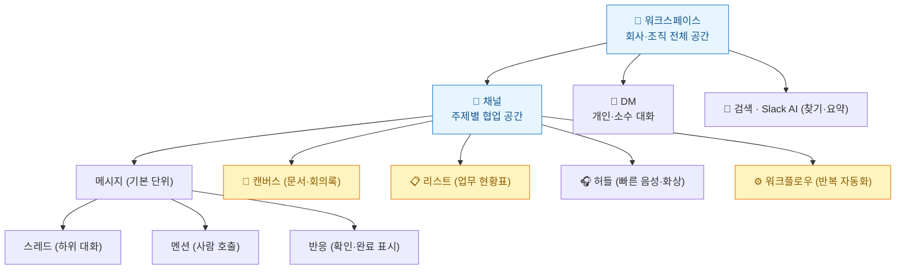
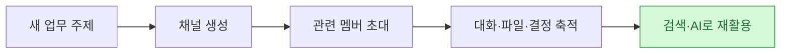
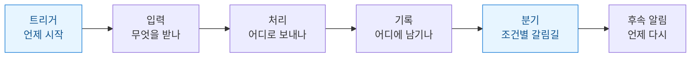
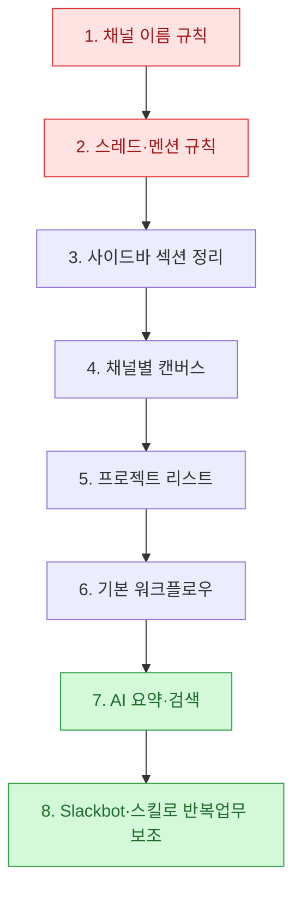

솔직히 고백하면, 나는 한동안 Slack을 **'회사용 카카오톡'**처럼 썼다. 채널에 말 걸고, 답하고, 파일 던지고. 그런데 팀이 커지고 프로젝트가 늘자 문제가 생겼다 — 대화 맥락이 사람마다 흩어지고, **"그거 어디서 얘기했더라?"**가 하루에도 몇 번씩 나왔다.

그래서 Slack을 처음부터 다시 뜯어봤다. 그랬더니 관점이 하나 바뀌었다. **Slack은 메신저가 아니라 "대화·문서·업무현황·회의·자동화·검색"을 한곳에 모으는 업무 운영 공간이다.** 핵심 문장은 이거였다 — **"업무의 흐름을 Slack 안에 남긴다."** 오늘은 그 지도를 한 장으로 정리한다.

## Slack을 한 장으로 이해하기



정리하면 이런 규칙이 생긴다 — 대화는 **채널**에, 세부 논의는 **스레드**에, 오래 볼 내용은 **캔버스**에, 계속 봐야 할 상태는 **리스트**에, 반복 업무는 **워크플로우**로, 나중에 찾을 것은 **검색·AI**가 찾게 구조화한다.

## 언제 뭘 써야 하나? — 기능 선택 지도

헷갈릴 때 이 표 하나면 대부분 정리된다.

| 상황 | 쓰면 좋은 기능 | 이유 |
|---|---|---|
| 여러 사람이 같은 주제로 계속 소통 | **채널** | 히스토리가 한 공간에 쌓임 |
| 한 메시지 답변이 길어짐 | **스레드** | 채널 메인이 지저분해지지 않음 |
| 특정 사람이 꼭 봐야 함 | **멘션** | 필요한 사람에게만 알림 |
| FAQ·회의록을 남겨야 함 | **캔버스** | Slack 안에서 검색되는 문서 |
| 담당자·기한·상태를 한눈에 | **리스트** | 표/보드로 관리 |
| 짧게 말로 확인 | **허들** | 회의 링크 없이 즉시 |
| 같은 신청·승인·알림 반복 | **워크플로우** | 노코드 자동화 |
| 밀린 대화 빠르게 파악 | **채널·스레드 요약** | 결정·액션만 추림 |
| "어디 있었지?" | **검색·AI 검색** | 메시지·파일·캔버스에서 |

## 채널: 이메일과 뭐가 다른가?

이메일·메신저의 가장 큰 문제는 **업무 맥락이 사람마다 흩어진다**는 것. 채널을 쓰면 참여자가 같은 정보를 보고, 나중에 들어온 사람도 과거 흐름을 따라갈 수 있다.



공개 채널(`#`)은 구성원이 발견·참여 가능, 비공개(자물쇠)는 초대받은 사람만. **인사·급여·계약 같은 민감 정보는 비공개 채널**로. 그리고 채널이 늘어나면 **이름 규칙이 곧 업무 품질**이 된다 — `공지-`, `프로젝트-`, `헬프-`, `팀-`처럼 접두어를 먼저 정하고, 채널 주제를 반드시 입력하고, 중요한 파일·캔버스는 상단 고정. (가능하면 업무 대화는 DM보다 채널에서.)

## 메시지·스레드·멘션 — 알림은 '비용'이다

메시지 하나도 형식이 있으면 협업 품질이 달라진다:

```text
[요청/공유/결정/확인] 제목
상황:
필요한 행동:
기한:
담당자:
참고 링크:
```

스레드 기준은 간단하다 — **새 주제면 채널 메인, 그 주제 답변이면 스레드.** 스레드 결론을 모두가 알아야 하면 "채널에도 전송", 길어지면 AI 스레드 요약.

멘션에서 내가 늦게 깨달은 원칙: **멘션은 알림 비용을 발생시킨다.** 답변이 필요한 사람만 멘션하고, 참고용이면 이름만 적는다. `@channel`·`@here`는 정말 긴급하거나 전체가 바로 알아야 할 때만 — 너무 넓은 멘션은 **중요한 알림의 가치를 떨어뜨린다.** 반응(이모지)은 "확인/진행중/완료/동의"를 말 없이 남기는 값싼 상태 표시다.

## 캔버스 vs 리스트 — 문서냐 현황판이냐

이 둘을 구분하는 데 한참 걸렸다. **캔버스는 문서, 리스트는 업무 상태·데이터를 보는 현황판.**

| 목적 | 캔버스 | 리스트 |
|---|:--:|:--:|
| 설명·가이드·FAQ | ✅ | ❌ |
| 회의록 | ✅ | 보조 |
| 업무 현황 | 보조 | ✅ |
| 담당자·기한 관리 | ❌ | ✅ |
| 프로젝트 보드(칸반) | ❌ | ✅ |

신호는 명확하다 — **채널에 같은 질문이 계속 올라오면, 그건 캔버스로 정리할 신호다.** 리스트는 같은 데이터를 표/보드/담당자별/마감일별로 **여러 방식으로** 볼 수 있는 게 강점이다. (필드는 욕심내지 말고 담당자·기한·상태 정도만 기본으로.)

## 워크플로우 — 비개발자도 노코드 자동화

가장 저평가된 기능. 반복 업무(신청·승인·온보딩·알림)를 코드 없이 자동화한다.



예를 들어 '신청 → 담당 채널 게시 → 신청자 DM 안내 → 시트 기록 → 승인/반려 버튼' 흐름을 노코드로 짠다. 여기서 내가 삽질로 배운 팁 하나 — **Google Sheets에 기록한 행을 나중에 '업데이트'하려면 고유 기준값이 필수다.** 이메일·이름만 쓰면 같은 사람이 여러 번 신청했을 때 어느 행을 고칠지 모른다. → **요청 ID**나 **제출시간+이메일** 같은 고유 열을 반드시 만든다.

## 검색과 Slack AI — 잘 남기고 잘 찾기

Slack을 잘 쓰는 팀은 정보를 **잘 남기고 잘 찾는다.**

| 구분 | 키워드 검색 | AI 검색 |
|---|---|---|
| 방식 | 단어 일치 | 의미·맥락 이해 답변 |
| 적합 | 정확한 이름·파일명을 알 때 | 상황은 아는데 표현을 모를 때 |
| 결과 | 관련 메시지 목록 | 요약 + 출처 |

> ⚠️ AI 요약(채널·스레드·파일 요약, 캔버스 AI)은 **빠른 파악용**이다. 중요한 결정·수치·정책은 **반드시 원문 링크로 확인**. AI는 Slack 안 메시지·캔버스 기반이라, 첨부·외부 파일을 항상 읽는다고 가정하면 안 된다. 결과는 사람이 검토한 뒤 공유. (오늘 [[the-coming-loop-armin-ronacher-harness-critique|루프의 시대]] 글에서 말한 것과 같은 원칙 — 판단은 사람 몫.)

## 결국 '순서'가 중요하다 — 구조 먼저, AI는 그다음

이게 오늘 가장 하고 싶은 말이다. 기능을 한꺼번에 켜지 말고 순서대로 정착시켜야 한다.



**구조가 없는 상태에서 AI·자동화를 붙이면 오히려 혼란만 커진다.** 반대로 채널·스레드·캔버스·리스트가 잘 정리돼 있으면 AI 검색·요약 품질도 같이 올라간다. 이건 [[planning-harness-detailed-spec-automation|하네스 이야기]]와 정확히 같은 교훈이다 — **컨텍스트와 규칙을 먼저 깔아야 자동화가 산다.**

## 팀 규칙, 딱 한 장으로

```text
[채널]  업무는 채널에서 · 접두어 이름규칙 · 주제 필수입력 · 중요건 상단고정 · 민감정보는 비공개
[메시지] 답변 필요한 사람만 멘션 · 한 메시지 한 주제 · 세부는 스레드 · 결론은 명확히 · @channel은 긴급만
[캔버스] 전사문서는 보기권한 기본 · 편집은 소수 · 반복질문은 FAQ로 · 소유자/갱신일 표시
[리스트] 담당자·기한·상태 기본 · 상태값 팀 통일 · 관련 메시지 링크
[워크플로우] 관리자 2명+ · 드롭다운·필수값 · 승인버튼 1회제한 · 업데이트는 고유 기준값
```

## 내 워크플로에 적용한다면

| 상황 | 적용 |
|---|---|
| 대화가 흩어짐 | DM 대신 **채널 + 스레드**로 맥락 축적 |
| 같은 질문 반복 | **캔버스 FAQ**로 승격 후 채널 상단 고정 |
| 프로젝트 상태 관리 | **리스트**(보드/담당자별 보기) |
| 반복 신청·승인 | **워크플로우** + 시트 고유 기준값 |
| 지식 재활용 | 잘 남긴 구조 위에 **Slack AI 검색·요약** |

Slack이 이렇게 '업무 운영 공간'이 되면, 그 위에 AI를 팀원처럼 얹는 게 자연스러운 다음 수순이다 — [[claude-tag-multiplayer-agents|@Claude를 채널에 부르거나]], [[slack-claude-agent-sdk-onedrive-shared-folder-automation|내 PC의 봇을 Slack에 연결하거나]]. 다만 그 전에, **채널·규칙·검증이라는 뼈대**부터. 그게 없으면 AI를 붙여도 혼란이 늘 뿐이더라.

## 참고자료

- [Slack 도움말 센터](https://slack.com/intl/ko-kr/help)
- [Slack — 캔버스](https://slack.com/intl/ko-kr/features/canvas) · [워크플로우 빌더](https://slack.com/intl/ko-kr/features/workflow-automation)
- 관련: [[claude-tag-multiplayer-agents|Claude Tag: Slack의 멀티플레이어 에이전트]]

<!-- 안전: 회사 실명·실데이터·제3자 PII·API키 없음. 일반 Slack 사용 가이드(공개 지식) 기반 정리. -->
