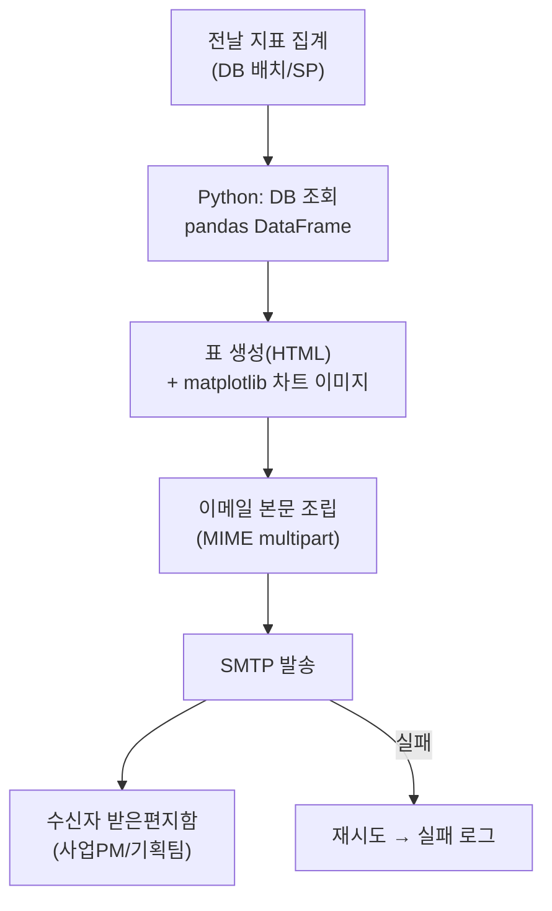
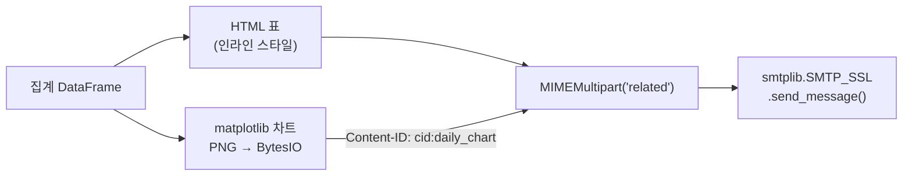
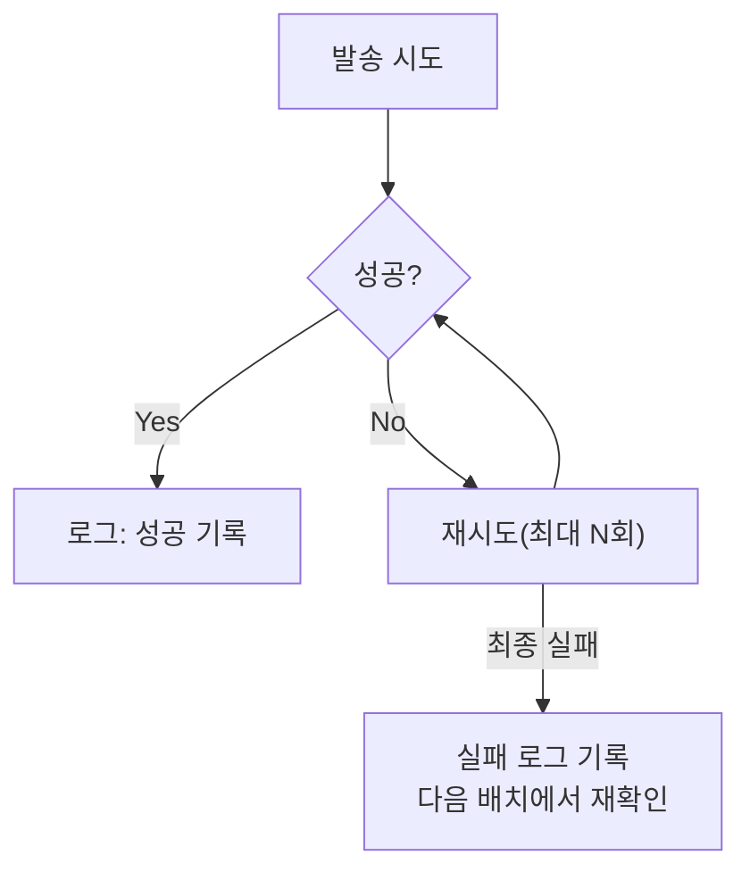

Metabase에 대시보드를 올려두면 다 해결될 줄 알았다. 링크만 공유하면 다들 알아서 들어와 볼 줄 알았는데, 실제로는 그렇지 않았다. 사업PM도 기획팀도 각자 업무에 치이다 보면 "나중에 봐야지" 하고 미루고, 며칠씩 안 열어보는 일이 흔했다. 지표는 떠 있는데 아무도 안 보는 상태 — 이게 진짜 문제였다.

그래서 방향을 바꿨다. 사람이 대시보드를 찾아오게 만드는 대신, **지표가 사람을 찾아가게** 만들자. 매일 아침 정해진 시각에 전날 집계 결과가 표와 차트로 정리된 메일이 받은편지함에 와 있으면, 열어보지 않을 도리가 없다. 이 글은 그 "메일이 알아서 찾아오는" 구조를 파이썬 `smtplib`로 어떻게 짰는지 정리한 것이다.



## 왜 대시보드 대신 메일이었나?

대시보드는 "당겨서(pull)" 보는 도구고, 메일은 "밀어서(push)" 도달하는 도구다. 대시보드가 나쁜 게 아니라, 매일 아침 습관적으로 확인해야 하는 지표라면 pull보다 push가 이겼다. 나 스스로도 출근하면 전날 배치가 만든 일일 지표부터 확인하는 게 루틴이었는데, 그 확인 과정 자체를 자동화하지 않을 이유가 없었다.

원래 사이드 프로젝트로 만든 데이터 수집 파이프라인(게임 현금시세 모니터링)에서도 산출물은 세 갈래였다. **SMTP 자동 메일 리포트 + Google Drive API 업로드 + Metabase 대시보드/matplotlib**. 이 중 매일 아침 가장 먼저 확인하게 만든 건 결국 메일이었다. 대시보드와 드라이브 업로드는 "필요할 때 찾아보는" 아카이브였고, 메일은 "매일 무조건 도착하는" 알림이었다.

## 집계 결과를 어떻게 표·차트로 묶었나?

전날 배치가 채워둔 집계 테이블을 pandas로 읽어와 `DataFrame` 하나로 만드는 게 출발점이다. 여기서부터 표와 차트, 두 형태로 갈라진다.

- **표**: `DataFrame.to_html()`로 뽑는다. 이메일 클라이언트는 외부 CSS를 대부분 무시하므로, 스타일은 인라인으로 넣거나 최소한만 쓴다.
- **차트**: matplotlib으로 그린 그래프를 파일로 저장하지 않고 `BytesIO` 메모리 버퍼에 바로 담는다. 디스크에 임시 파일을 만들었다 지우는 번거로움을 없애기 위해서다.

```python
import pandas as pd
import matplotlib.pyplot as plt
from io import BytesIO


def build_table_html(df: pd.DataFrame) -> str:
    # 이메일 클라이언트는 외부 CSS를 거의 무시하므로 최소 스타일만 인라인으로
    return df.to_html(index=False, border=0, justify="center")


def build_chart_image(df: pd.DataFrame) -> bytes:
    plt.rcParams["font.family"] = "Malgun Gothic"  # 한글 라벨 깨짐 방지
    fig, ax = plt.subplots(figsize=(6, 3))
    ax.plot(df["date"], df["dau"], marker="o")
    ax.set_title("최근 7일 DAU 추이")
    buf = BytesIO()
    fig.savefig(buf, format="png", bbox_inches="tight")
    plt.close(fig)
    return buf.getvalue()
```

`Malgun Gothic` 지정을 빼먹으면 차트 안 한글 라벨이 네모(□)로 깨진다. 처음 한동안은 왜 표는 멀쩡한데 차트만 깨지는지 모르고 헤맸는데, 원인은 단순히 matplotlib 기본 폰트가 한글을 못 그려서였다.

## SMTP로는 실제로 어떻게 발송했나?

표와 차트가 준비되면 이제 이메일 하나로 조립할 차례다. 차트를 본문 안에 바로 보이게 하려고 `MIMEMultipart("related")`로 묶고, 이미지에 `Content-ID`를 붙여 HTML 본문에서 `cid:`로 참조하는 방식을 썼다. 첨부파일로 따로 떨어뜨리면 안 열어보는 사람이 있어서, 본문에 박아 넣는 쪽을 택했다.



```python
import os
import smtplib
from email.mime.multipart import MIMEMultipart
from email.mime.text import MIMEText
from email.mime.image import MIMEImage
from dotenv import load_dotenv

load_dotenv()  # .env에서 SMTP 자격증명 로드

SMTP_SERVER = os.environ["SMTP_SERVER"]
SMTP_PORT = int(os.environ.get("SMTP_PORT", 465))
SMTP_USER = os.environ["SMTP_USER"]
SMTP_PASSWORD = os.environ["SMTP_PASSWORD"]
RECIPIENTS = os.environ["REPORT_RECIPIENTS"].split(",")


def send_daily_report(df: pd.DataFrame) -> None:
    msg = MIMEMultipart("related")
    msg["Subject"] = f"[일일 지표 리포트] {df['date'].max()} 기준"
    msg["From"] = SMTP_USER
    msg["To"] = ", ".join(RECIPIENTS)

    html_body = f"""
    <html><body>
      <p>전날 기준 일일 지표입니다.</p>
      {build_table_html(df)}
      
    </body></html>
    """
    msg.attach(MIMEText(html_body, "html", "utf-8"))

    image = MIMEImage(build_chart_image(df))
    image.add_header("Content-ID", "<daily_chart>")
    msg.attach(image)

    with smtplib.SMTP_SSL(SMTP_SERVER, SMTP_PORT) as server:
        server.login(SMTP_USER, SMTP_PASSWORD)
        server.send_message(msg)
```

`.env` 파일에는 이런 값만 둔다. 서버 주소·계정·비밀번호를 코드에 하드코딩하지 않는 게 핵심이다.

```
SMTP_SERVER=smtp.example.com
SMTP_PORT=465
SMTP_USER=your_id@example.com
SMTP_PASSWORD=your_app_password
REPORT_RECIPIENTS=teamA@example.com,teamB@example.com
```

## 한글 깨짐이나 예외 데이터는 신경 쓸 게 없었나?

메일 인코딩은 `MIMEText(html_body, "html", "utf-8")`처럼 명시적으로 utf-8을 지정하면 대체로 문제가 없었다. 오히려 함정은 그 앞 단계, DB에 데이터를 적재하는 시점에 있었다. 원래 크롤링으로 모은 원본 데이터를 MS-SQL에 `pymssql`로 bulk insert할 때는 `charset='utf8'`을 명시하지 않으면 한글이 깨졌고, 문자열로 들어온 값을 숫자(bigint)로 바꾸는 과정에서 비정상 값이 섞이면 집계 자체가 틀어졌다. 그래서 임시테이블 단계에서 문자열을 숫자형으로 변환하고, 예외값은 직전 시세로 대체하는 전처리를 거친 뒤에야 집계·메일 발송으로 넘겼다. 메일이 예쁘게 나가도 그 앞이 더러우면 의미가 없다.

## 이 자동화가 매일 조용히 실패 없이 돌게 어떻게 지켰나?

메일 자동화의 가장 흔한 실패는 "며칠째 안 왔는데 아무도 몰랐다"다. 그래서 발송 자체에 재시도와 로그를 붙였다.



발송 함수를 `try/except`로 감싸 `smtplib.SMTPException`이 나면 몇 번 재시도하고, 그래도 안 되면 실패 로그만 남기고 다음 배치 사이클에서 다시 시도하게 했다. 스케줄링은 거창한 도구 없이 매일 새벽 배치가 집계를 끝낸 직후 스크립트를 호출하는 방식으로 충분했다. 참고로 이 흐름의 원천 데이터가 외부 사이트 크롤링(현금시세 수집)이라면, 그 수집 단계에서는 robots.txt와 서비스 약관, 요청 간 딜레이 같은 레이트리밋을 지키는 선에서만 돌렸다. 메일 자동화가 아무리 잘 짜여 있어도 그 앞단 수집이 무리하면 전체가 무너진다.

## 정리 — 리포트는 "찾아보는 것"에서 "도착하는 것"으로

- 대시보드는 pull, 메일은 push. 매일 확인해야 하는 지표라면 push가 도달률에서 이긴다.
- 집계 결과는 `pandas.to_html()` 표 + matplotlib 차트(BytesIO) 두 형태로 만들어 `MIMEMultipart("related")`로 합친다.
- SMTP 자격증명은 항상 `.env`/`os.environ`으로만 관리하고, 발송에는 재시도와 실패 로그를 붙인다.
- 메일이 예쁘게 나가도 그 앞단(DB 인코딩, 예외값 처리, 크롤링 레이트리밋)이 더러우면 소용없다 — 자동화는 파이프라인 전체로 봐야 한다.

다음 글에서는 이 메일 리포트의 원천이 되는 데이터를 Google Drive API로 함께 업로드해 아카이빙까지 자동화하는 방법을 정리할 예정이다.

- 파이프라인 코드: [github.com/DBhyeong/game-data-analysis](https://github.com/DBhyeong/game-data-analysis)
