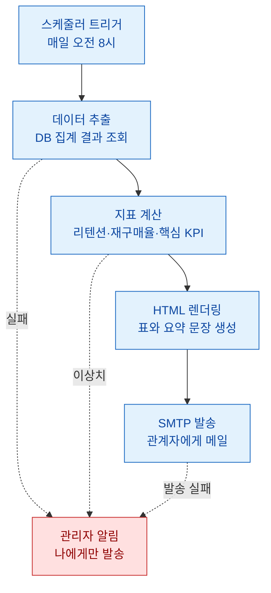

> 리포트는 만드는 게 일이 아니라, 매일 같은 시각에 같은 사람에게 빠짐없이 보내는 게 일이다.

아침마다 나는 같은 일을 반복하고 있었다. 밤새 돈 배치가 뱉어놓은 집계 결과를 열어 숫자 몇 개 확인하고, 표로 정리하고, 관계자 메일 주소를 참조에 붙여넣고, "오늘자 리포트 공유드립니다" 한 줄을 써서 발송. 5분이면 끝나는 일 같지만, 문제는 이게 매일이라는 점이다. 출장 가면 빠지고, 아침에 정신없으면 늦고, 손으로 붙여넣다 어제 표를 그대로 보내는 사고도 났다. 그래서 이 일을 통째로 봇에게 넘기기로 했다. 이 글은 그 리포트 봇을 파이썬으로 만들면서 실제로 데였던 부분들을 정리한 기록이다.

참고로 이 글에 나오는 게임·수치·테이블은 전부 합성한 더미 예시다. 구조와 개념만 가져왔고 실제 업무 데이터는 한 줄도 들어있지 않다.

## 왜 사람이 아니라 봇이 리포트를 보내야 하나?

손으로 보내는 리포트의 가장 큰 문제는 "빠질 수 있다"는 것이다. 자동화의 진짜 가치는 시간 절약보다 누락 제거에 있다. 사람이 개입하는 단계가 하나라도 있으면 그 단계는 언젠가 반드시 실수가 난다.

내가 세운 원칙은 간단했다. 사람이 하는 일은 "봇이 보낸 메일을 읽는 것"까지만. 집계, 표 만들기, 발송, 심지어 "오늘은 데이터가 이상합니다" 같은 경고까지 전부 봇이 판단하게 만든다.

| 구분 | 손으로 할 때 | 봇이 할 때 |
| --- | --- | --- |
| 발송 시각 | 그날 컨디션 따라 | 매일 정해진 시각 고정 |
| 누락 위험 | 출장·연차 때 빵꾸 | 없음 |
| 표 실수 | 어제 표 복붙 사고 | 매번 새로 생성 |
| 데이터 이상 감지 | 눈으로 대충 | 임계값 자동 체크 |

## 리포트 봇의 전체 그림은 어떻게 생겼나?

전체는 네 덩어리다. 데이터를 뽑고(추출), 지표로 요약하고(집계), 메일 본문으로 바꾸고(렌더링), 보낸다(발송). 여기에 각 단계가 실패하면 나에게만 따로 알려주는 안전장치를 하나 더 붙였다.



핵심은 파이프라인이 한 방향으로만 흐른다는 것이다. 앞 단계가 실패하면 뒤로 넘어가지 않고 멈춘 뒤, 잘못된 리포트를 관계자에게 보내는 대신 나에게만 조용히 경고를 보낸다. "틀린 걸 보내느니 안 보내는 게 낫다"가 리포트 봇의 제1원칙이다.

## SMTP로 메일을 보내는 최소 코드는 어떻게 되나?

파이썬 표준 라이브러리만으로 충분하다. `smtplib`로 연결하고 `email` 모듈로 메일 형태를 만든다. 외부 패키지 없이 되는 게 이 방식의 큰 장점이다.

```python
import smtplib
from email.mime.multipart import MIMEMultipart
from email.mime.text import MIMEText
import os

def send_report(subject, html_body, to_list):
    msg = MIMEMultipart("alternative")
    msg["Subject"] = subject
    msg["From"] = os.environ["SMTP_USER"]
    msg["To"] = ", ".join(to_list)

    # 텍스트 대체본을 먼저, HTML을 나중에 붙인다
    msg.attach(MIMEText("HTML을 지원하지 않는 환경용 요약입니다.", "plain"))
    msg.attach(MIMEText(html_body, "html"))

    with smtplib.SMTP(os.environ["SMTP_HOST"], 587) as server:
        server.starttls()               # 반드시 암호화 협상 먼저
        server.login(os.environ["SMTP_USER"], os.environ["SMTP_PASS"])
        server.send_message(msg)
```

여기서 두 가지가 실무 포인트다. 첫째, 계정 정보는 코드에 절대 박지 않고 환경변수로 뺀다. 리포트 봇을 깃에 올리는 순간 비밀번호가 세상에 공개되는 사고는 정말 흔하다. 둘째, `MIMEMultipart("alternative")`로 텍스트 버전과 HTML 버전을 같이 넣으면, HTML을 못 읽는 메일 클라이언트에서도 최소한 요약은 보인다.

## 숫자를 표로 예쁘게 넣으려면 본문을 어떻게 만드나?

메일 본문은 결국 HTML이다. 나는 판다스 데이터프레임을 그대로 HTML 표로 바꾸는 방식을 쓴다. `df.to_html()` 한 줄이면 표가 나오는데, 문제는 기본 스타일이 너무 밋밋해서 인라인 CSS를 입혀줘야 메일에서 제대로 보인다는 것이다. 메일 클라이언트는 외부 스타일시트를 대부분 무시하기 때문에 스타일을 태그 안에 직접 박아야 한다.

```python
import pandas as pd

def render_html(df, summary_line):
    table_html = df.to_html(index=False, border=0, justify="center")
    return f"""
    <div style="font-family:sans-serif; color:#222;">
      <h2 style="color:#1565c0;">오늘자 지표 요약</h2>
      <p style="font-size:15px;">{summary_line}</p>
      {table_html}
      <p style="color:#888; font-size:12px;">
        이 메일은 리포트 봇이 자동 발송했습니다.
      </p>
    </div>
    """

# 더미 예시 데이터
df = pd.DataFrame({
    "지표": ["신규 유저", "D1 리텐션", "재구매율", "ARPPU"],
    "오늘": ["1,240명", "42.0%", "18.5%", "9,800원"],
    "전일대비": ["+3.1%", "-1.2%p", "+0.4%p", "+2.0%"],
})
```

요약 문장(`summary_line`)은 봇이 규칙으로 자동 생성하게 했다. 예를 들어 D1 리텐션이 전일 대비 크게 떨어지면 "리텐션이 어제보다 낮습니다, 확인이 필요합니다" 같은 문장을 붙인다. 표만 보내면 사람들은 숫자를 안 읽는다. 한 줄 해석을 얹어줘야 리포트가 리포트가 된다.

## 새벽에 봇이 조용히 죽으면 어떻게 알아채나?

이게 자동화에서 제일 중요하면서도 다들 빼먹는 부분이다. 봇은 언젠가 반드시 실패한다. DB가 잠깐 응답을 안 하거나, 어제 배치가 안 돌아 데이터가 비어 있거나, 메일 서버가 막힐 수 있다. 이때 봇이 아무 말 없이 죽으면, 관계자들은 "오늘은 리포트가 안 왔네" 하고 며칠을 그냥 넘긴다.

```mermaid
sequenceDiagram
    participant S as 스케줄러
    participant B as 리포트 봇
    participant D as 데이터 소스
    participant M as 관계자
    participant A as 관리자(나)

    S->>B: 정해진 시각에 실행
    B->>D: 집계 결과 요청
    alt 데이터 정상
        D-->>B: 결과 반환
        B->>B: 지표 계산·표 렌더링
        B->>M: 리포트 메일 발송
    else 데이터 없음 또는 이상
        D-->>B: 빈 결과 또는 오류
        B->>A: 경고 메일 발송
        B->>B: 관계자 발송은 중단
    end

    classDef normal fill:#e8f5e9,stroke:#2e7d32,color:#1b5e20
    classDef warn fill:#fff3e0,stroke:#ef6c00,color:#e65100
    class S,B,D,M normal
    class A warn
```

그래서 나는 파이프라인 전체를 `try/except`로 감싸고, 예외가 나면 관계자 리스트가 아니라 나에게만 경고 메일을 보내게 했다. 데이터가 비었는지, 어제보다 행 수가 반토막 났는지 같은 기본 검증도 발송 직전에 넣었다. 잘못된 리포트를 20명에게 보내는 것보다, 나 한 명에게 "오늘 봇이 이상합니다" 메일이 오는 게 백 배 낫다.

## 매일 정해진 시각에 알아서 돌게 하려면?

마지막 조각은 스케줄이다. 봇 스크립트 자체는 그냥 한 번 실행되면 끝나는 프로그램이다. 이걸 매일 돌리는 건 운영체제의 스케줄러에 맡긴다. 윈도우면 작업 스케줄러, 리눅스면 크론(cron)에 "매일 오전 8시에 이 스크립트를 실행" 한 줄 등록하면 된다.

| 환경 | 스케줄 방법 | 한 줄 요약 |
| --- | --- | --- |
| 윈도우 | 작업 스케줄러 | GUI로 시각·스크립트 지정 |
| 리눅스/맥 | 크론 | `0 8 * * *` 형식으로 등록 |
| 클라우드 | 매니지드 스케줄러 | 서버 없이 시각만 지정 |

봇에게 시각 판단까지 맡기지 않은 이유는, 스케줄링은 이미 운영체제가 훨씬 잘하는 일이기 때문이다. 봇은 "한 번 잘 도는 것"에만 집중하고, "언제 도는지"는 밖에서 관리하는 게 구조가 깔끔하다.

## 마무리

리포트 봇을 붙이고 나서 가장 크게 바뀐 건 시간이 아니라 마음이었다. "오늘 리포트 보냈나?"를 더 이상 신경 쓰지 않게 됐다. 안 오면 봇이 알아서 나에게 경고를 보내니, 조용하면 잘 돌고 있다는 뜻이다.

정리하면 리포트 봇의 뼈대는 네 가지다. 추출·집계·렌더링·발송을 한 방향 파이프라인으로 묶고, 계정은 환경변수로 빼고, 표에는 해석 한 줄을 얹고, 실패하면 관계자가 아니라 나에게만 알린다. 이 네 가지만 지키면 매일 아침 5분짜리 반복 노동은 완전히 사라진다. 반복되는 손일을 발견하면 일단 봇으로 넘겨보는 습관, 데이터 일 하는 사람에게 이만한 복리 투자가 없다.

## 참고자료

- [[game-metrics-7-definitions]] — 리포트에 담는 핵심 지표들의 정의
- [[cohort-m1-retention-sql]] — 리텐션 집계를 SQL로 뽑는 법
- [[arpu-vs-arppu]] — 매출 지표를 리포트에 올릴 때의 구분
- [[game-data-sql-recipes-retention-ltv]] — 집계 쿼리 레시피 모음
- 예제 코드 저장소: https://github.com/DBhyeong/game-data-recipes

<!-- 안전: 합성/더미 데이터, 회사·실데이터·PII 없음. -->
