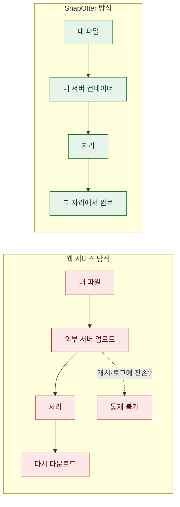
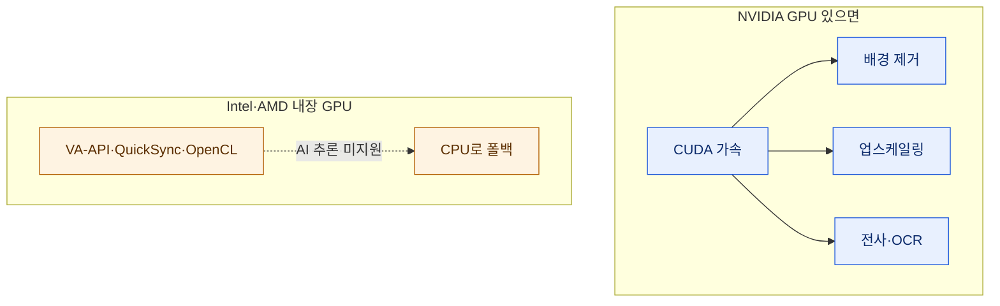
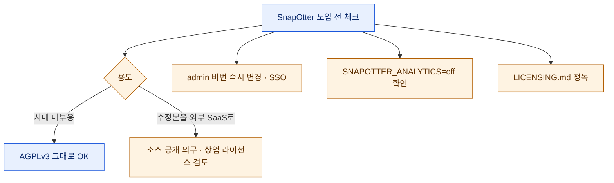

# SnapOtter — 파일 처리를 통째로 내 서버 안으로

> 나는 PDF 두 장을 합칠 때, 스크린샷을 좀 줄일 때, 영상 하나를 GIF로 바꿀 때마다 습관처럼 Smallpdf나 TinyPNG 같은 웹에 파일을 던진다. 편하니까. 그런데 어느 날 문득, 방금 올린 게 **아직 공개 안 한 자료**였다는 걸 깨닫고 등골이 서늘했다. 파일은 이미 남의 서버를 다녀온 뒤였다. SnapOtter는 바로 그 지점을 노린다 — "그 편한 도구들을, 네 서버 안에서 돌려라." 국내 파이토치 커뮤니티(9bow/박정환 님) 소개글로 접했고, 사실관계는 공식 저장소로 직접 확인했다.

## SnapOtter는 무슨 문제를 푸나?

일상적인 파일 작업의 90%는 사실 별것 아니다. 리사이즈, 압축, 포맷 변환, PDF 병합·분할. 그런데 이걸 웹 서비스로 하는 순간, **내 파일이 외부 서버로 업로드된다**. 개인 사진이면 몰라도, 사내 문서나 계약서, 아직 발표 안 한 자료라면 이야기가 다르다. 지웠다고 안심할 수도 없다 — 캐시에 남았는지, 로그에 찍혔는지 나는 알 수 없으니까.

SnapOtter는 이 파일 처리 작업 **전부**를 내가 통제하는 서버 안에서 끝내는 셀프호스팅(self-hosted) 도구 모음이다. 스스로를 이렇게 소개한다 — **"Smallpdf, iLovePDF, TinyPNG, TinyWow, CloudConvert의 오픈소스 대안."** 저장소 설명 한 줄이 핵심을 요약한다: *"Your files never leave your network"* (네 파일은 네트워크 밖으로 절대 나가지 않는다).



## 다섯 모달리티에 200개가 넘는 도구?

SnapOtter의 가장 큰 특징은 **범위**다. 개발팀은 기존 셀프호스팅 도구와의 차이를 이렇게 못 박는다 — *"Stirling-PDF는 PDF에서 멈추고, ConvertX는 변환에서 멈춘다."* SnapOtter는 Docker 컨테이너 하나에 이미지·영상·오디오·PDF·파일까지 **다섯 모달리티**를 통째로 담아, **200개가 넘는 도구**를 한 곳에서 제공한다고 표방한다.

모달리티별 구성은 이렇다.

| 모달리티 | 대표 작업 |
|---|---|
| 🖼️ **이미지** | 리사이즈·크롭·압축·변환·워터마크·색상조정·벡터화·GIF·중복찾기·증명사진 (카메라 RAW 23종 포함 55+ 입력 포맷) |
| 🎬 **영상** | 변환·압축·자르기·병합·영상↔GIF·오디오 추출·손떨림 보정·FPS 변경·자막 굽기/추출 |
| 🎵 **오디오** | 변환·트리밍·정규화·피치 시프트·무음 제거·노이즈 감소·병합/분할·파형 생성 |
| 📄 **PDF** | 병합·분할·압축·변환·암호 설정/해제·마스킹·서명·워터마크·페이지 번호·OCR |
| 📁 **파일** | CSV/JSON/XML/YAML 상호 변환·CSV 병합/분할·Excel↔CSV·차트 생성·ZIP 압축/해제 |

> ⚠️ **'200+'라는 숫자는 세는 방법에 따라 달라진다.** 저장소 README는 모달리티별로 이미지 105 · 영상 57 · 오디오 27 · PDF 29 · 파일 23(합계 241)으로 적고 있는데, 정작 최신 문서 사이트(v2.1.0)의 도구 레퍼런스는 이미지 64 · 영상 29 · 오디오 17 · PDF 37 · 파일 10(합계 157)으로 **더 적게** 센다. 둘 다 "200+ tools across five modalities"를 헤드라인으로 내걸지만, 세부 숫자는 이렇게 엇갈린다. 아마 포맷 변환 하나하나(예: "PNG로 변환", "JPG로 변환")를 개별 도구로 세느냐, 도구 페이지 단위로 세느냐의 차이일 것이다. **"200개가 넘는다"는 방향성은 사실이되, 모달리티별 정확한 개수는 대략치로 받아들이는 게 안전하다.** 벤더 숫자는 늘 이렇게 한 번 걸러 봐야 한다.

## 로컬 AI가 진짜 차별점이다

단순 변환기라면 굳이 이 글을 안 썼다. SnapOtter가 흥미로운 건 **온디맨드 로컬 AI** 도구들이다. 배경 제거, 이미지 업스케일링, 오래된 사진 복원·컬러화, 객체 지우기, 얼굴 블러·보정, 이미지/PDF의 텍스트 추출(OCR), 오디오 전사(transcription), 영상 자막 자동 생성, 캔버스 확장, 투명도 복구까지 — **전부 내 하드웨어에서, 인터넷 없이** 돈다.

이게 왜 중요하냐면, 보통 "AI로 배경 제거"나 "AI OCR"은 클라우드 API를 호출한다. 즉 **파일이 또 밖으로 나간다**. SnapOtter는 이걸 로컬 추론(inference)으로 돌려, 프라이버시라는 대전제를 AI 기능에서도 지킨다.



> ⚠️ **GPU 가속은 사실상 NVIDIA 전용이다.** NVIDIA GPU가 있으면 배경 제거·업스케일링·전사·OCR에 CUDA 가속이 붙는다. 하지만 Intel/AMD 내장 GPU의 VA-API·Quick Sync·OpenCL을 이용한 AI 추론은 지원하지 않아, 그런 시스템에서는 AI 도구가 **CPU로 동작**한다(README §Deployment). 라즈베리파이나 맥미니에 올려두고 AI 업스케일을 기대했다면, 체감 속도를 미리 낮춰 잡는 게 좋다. 단순 변환·압축은 CPU로도 충분히 빠르다.

## 파이프라인과 REST API — 도구를 엮는다

도구가 200개 있어도 하나씩 클릭해서 쓰면 결국 웹 서비스랑 다를 게 없다. SnapOtter의 두 번째 축은 **자동화**다.

- **파이프라인(Pipeline)**: 여러 도구를 하나의 재사용 가능한 워크플로우로 연결한다. 기본 20단계까지, 파일 100개까지 일괄 처리. 예를 들어 "리사이즈 → 워터마크 → 압축 → WebP 변환"을 한 번 짜두고 폴더째 돌리는 식이다. 만든 파이프라인은 **JSON으로 내보내고 불러올** 수 있어, 팀원과 워크플로우를 공유하거나 버전 관리할 수 있다.
- **REST API**: 모든 도구를 API 키 인증으로 호출할 수 있고, `/api/docs`의 대화형 문서에서 바로 시험해볼 수 있다. 내 자동화 스크립트나 CI에서 SnapOtter를 **파일 처리 백엔드**로 붙이는 그림이 된다.


여기에 브라우저에서 도는 **레이어 기반 이미지 편집기**까지 얹혀 있다. 포토샵처럼 레이어를 쌓아 편집하는 걸 설치 없이 웹에서 한다는 뜻이다.

## 설치는 얼마나 쉬운가?

**명령 한 줄**이다. 임베디드 PostgreSQL 17과 Redis 8이 컨테이너 안에 들어 있어 별도 의존성이 없다.

```bash
docker run -d --name SnapOtter -p 1349:1349 -v SnapOtter-data:/data snapotter/snapotter:latest
```

띄운 뒤 `http://localhost:1349` 로 접속해 기본 계정 `admin` / `admin` 으로 로그인하면 된다. 첫 로그인 시 비밀번호 변경을 강제한다. AMD64/ARM64 멀티 아키텍처라 Apple Silicon 맥이나 라즈베리파이에도 올라가고, UI는 한국어를 포함한 **21개 언어**를 지원한다. Google·GitHub·Okta 등으로 로그인하는 **OIDC/SSO** 연동도 된다.

> ⚠️ **`admin`/`admin`은 접속 가능한 누구나 안다는 뜻이다.** 다행히 SnapOtter는 첫 로그인에 비밀번호 변경을 **강제**하니 MaxKB처럼 초기 비번이 방치될 여지는 적다. 그래도 원칙은 같다 — 외부에 노출되는 서버라면 1349 포트를 함부로 열어두지 말고, SSO를 붙일 수 있으면 붙이자. 셀프호스팅의 프라이버시는 "파일이 안 나간다"에서 끝나는 게 아니라 "내 인스턴스에 아무나 못 들어온다"까지 가야 완성된다.

프로덕션에서는 앱·PostgreSQL 17·Redis 8을 분리한 **3컨테이너 Compose 스택**을 권장한다(전체 예시는 저장소 README에). 개인용은 위 한 줄로 충분하고, 여러 사람이 쓸 거면 Compose로 가는 식이다.

## 기존 셀프호스팅 도구와 뭐가 다른가?

셀프호스팅 파일 도구가 SnapOtter만 있는 건 아니다. 유명한 **Stirling-PDF**(PDF 특화), **ConvertX**(포맷 변환 특화)가 이미 있다. SnapOtter의 포지셔닝은 "이들이 멈추는 곳에서 시작한다"이다.

| | Stirling-PDF | ConvertX | **SnapOtter** |
|---|---|---|---|
| 범위 | PDF만 | 포맷 변환만 | **이미지·영상·오디오·PDF·파일 5종** |
| 로컬 AI | 제한적 | ✕ | **배경제거·업스케일·OCR·전사·자막** |
| 파이프라인 | ✕ | ✕ | **20단계·100파일 일괄** |
| REST API | 일부 | 일부 | **전 도구 API + `/api/docs`** |
| 설치 | 도커 | 도커 | **도커 한 줄(임베디드 DB·Redis)** |

한마디로, **"파일 관련 잡일은 여기서 다 끝내라"**는 올인원 지향이다. 여러 도구를 각각 띄워 관리하던 걸 컨테이너 하나로 합치려는 사람에게 매력적인 지점이다. 물론 "하나에 다 넣는다"는 건 그만큼 이미지가 무겁고, 특정 기능의 완성도는 전문 도구를 못 따라갈 수 있다는 뜻이기도 하다. 그건 써보며 각자 판단할 몫이다.

## 라이선스와 프라이버시의 함정은?

두 가지를 꼭 짚어야 한다.

**첫째, 라이선스는 듀얼이다.** SnapOtter는 **AGPLv3 + 상업용 라이선스**로 공개돼 있다. AGPLv3에서는 자유롭게 쓰고 고치고 배포할 수 있지만, **수정한 버전을 네트워크 서비스로 운영하면 그 소스를 AGPLv3로 공개**해야 한다(네트워크 카피레프트). 사내에서 그냥 갖다 쓰는 건 대개 문제없지만, 이걸 고쳐서 SaaS로 외부에 서비스할 계획이라면 소스 공개 의무가 걸린다. 그래서 소스 공개가 어려운 독점 제품·SaaS를 위한 **상업용 라이선스**가 따로 있다. 무료 영역과 상업 영역의 경계는 저장소 `LICENSING.md`에 정리돼 있으니, 도입 전 반드시 읽어보길 권한다. (참고로 GitHub의 라이선스 자동 분류는 이 저장소를 `NOASSERTION`/`Other`로 표시하는데, 이는 표준 라이선스 하나로 안 떨어지는 **듀얼 라이선스**라는 방증이다.)

**둘째, 프라이버시 도구인데 익명 분석이 기본 켜져 있다.** 파일은 네트워크 밖으로 안 나가지만, SnapOtter는 기본적으로 **익명 분석(analytics)을 활성화**한 채 배포된다. 빌드 시 `SNAPOTTER_ANALYTICS=off` 환경변수를 주거나 관리자 설정에서 끌 수 있다. "파일이 안 나간다"를 셀링 포인트로 삼는 도구에서 사용 통계가 기본 켜져 있는 건 살짝 아이러니한 지점이라, 프라이버시가 최우선이라면 **설치 직후 이 스위치부터 확인**하는 게 맞다.



## 정리 — 언제 SnapOtter인가?

숫자부터 정리하면, 2026년 3월 말 시작된 신생 프로젝트인데도 별 **1,948개**(≈1.9k), 포크 83개를 모았다. 최신 태그는 **v2.1.0**(2026-07-10)이지만 이건 데모·랜딩 페이지 위주의 소소한 버그픽스 릴리즈고, 도구가 200+로 늘고 로컬 AI·백그라운드 작업·도커 한 줄 설치가 더해진 **큰 도약은 2.0**(2026년 7월)이다. TypeScript로 짜였고, 개발 주체는 GitHub의 `snapotter-hq` 조직이다.

그래서 결론은 늘 그렇듯 "무엇이 낫다"가 아니라 **"언제 무엇"**이다.

- 민감한 파일을 웹 변환기에 올리기 찜찜하다, 파일 잡일을 한 곳에서 끝내고 싶다 → **SnapOtter가 정확히 그 자리다.**
- PDF 하나만 아주 잘 다루면 된다 → 굳이 무거운 올인원 말고 **Stirling-PDF** 같은 전문 도구가 가볍다.
- AI 업스케일·전사를 대량으로 돌릴 거다 → **NVIDIA GPU**를 붙일 수 있는지부터 확인하자. iGPU·CPU만으론 느리다.

나는 개인적으로, 스크린샷 압축과 PDF 병합을 웹에 던지던 습관을 이걸로 옮겨볼 생각이다. 도커 한 줄이면 되고, 무엇보다 **파일이 내 집 밖으로 안 나간다**는 감각이 생각보다 든든하니까. 프라이버시는 대단한 각오가 아니라, 이런 작은 습관을 바꾸는 데서 시작하더라.

---

**출처·확인**: 공식 저장소 [github.com/snapotter-hq/SnapOtter](https://github.com/snapotter-hq/SnapOtter) 의 README·릴리즈·문서 사이트(snapotter.com)를 직접 확인해 정리했다. 국내에선 파이토치 한국 커뮤니티의 9bow(박정환) 님 소개글을 통해 처음 접했다. 별·버전·도구 수·라이선스·설치 명령은 글 작성 시점(2026-07-11) 기준이며, 특히 도구 개수는 세는 방식에 따라 달라지니 도입 전 최신 저장소를 다시 확인하길 권한다.

<!-- 안전: 회사 실데이터·고객/제3자 PII·API키/쿠키/토큰 절대 금지. 과거 작업은 합성·일반화. -->
