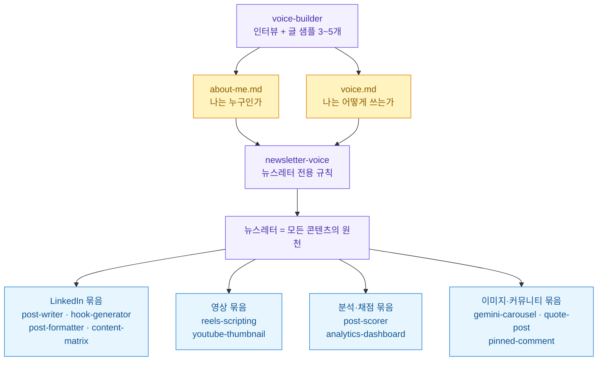
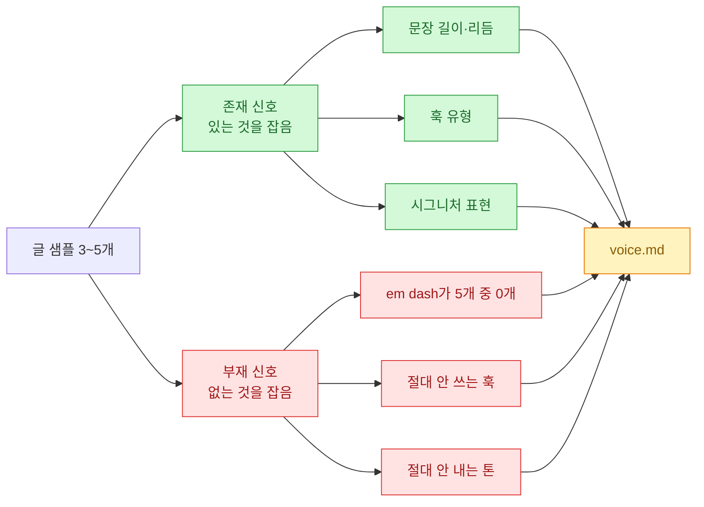

[PyTorch 한국 사용자 모임](https://discuss.pytorch.kr/t/social-media-skills-claude/11224)에서 소개된 걸 보고 열어 봤다. **Social Media Skills** — 콘텐츠 제작자 Charlie Hills가 LinkedIn·Instagram·Substack·X·YouTube에 실제로 쓰던 Claude 스킬 전체를 통째로 공개한 저장소다([charlie947/social-media-skills](https://github.com/charlie947/social-media-skills)).

나는 이미 [[social-syndication-project|8채널 신디케이션 파이프라인]]을 직접 굴리고 있어서, 이 저장소가 남 얘기가 아니었다. 그래서 소개 글만 읽지 않고 **저장소를 직접 열어 대조**했다. 결과부터 말하면 물건은 맞는데, 소개 글과 다른 대목이 몇 개 있었다.

## 이게 뭔가? 한 장 요약



핵심은 **위에서 아래로 흐른다**는 것이다. 맨 위에서 목소리를 정의하고, 그게 파일로 떨어지고, 아래 모든 스킬이 초안을 쓰기 전에 **그 파일을 먼저 읽는다**. 채널별 스킬은 목소리를 새로 만들지 않고 **가져다 쓴다**.

이게 왜 중요하냐면, 보통 이런 프롬프트 모음은 "링크드인 글 잘 쓰는 프롬프트", "릴스 대본 프롬프트"가 각자 따로 논다. 그러면 채널마다 사람이 달라진다. 여기는 **목소리를 단일 원천(single source)으로 뽑아 놓고 채널이 그걸 참조**한다. 코드로 치면 설정을 한 군데 두고 임포트하는 것과 같다.

## 소개 글과 저장소가 다른 대목은?

이런 저장소 글은 소개만 읽고 옮기면 숫자가 어긋나기 쉬워서, **GitHub API로 직접 확인**했다. 2026년 7월 15일 기준이다.

| 항목 | 확인 결과 |
|---|---|
| 라이선스 | **MIT** ✅ 소개 글과 일치 |
| 스타 / 포크 | **1,744 / 441** |
| 주 언어 | Shell |
| 저장소 생성 | 2026-04-22 |
| **마지막 코드 푸시** | **2026-05-20** |
| **실제 스킬 개수** | **17개** |

두 가지가 걸린다.

⚠️ **첫째, 스킬은 15개가 아니라 17개다.** 소개 글이 짚은 건 voice-builder·newsletter-voice·post-writer·hook-generator·post-formatter·content-matrix·reels-scripting·youtube-thumbnail·post-scorer·analytics-dashboard·pinned-comment·gemini-carousel·quote-post·gemini-infographic·profile-optimizer로 15개인데, `skills/` 아래엔 **graphic-designer**와 **niche-research**가 더 있다. 빠뜨린 두 개가 하필 쓸모 있어 보이는 것들이다.

⚠️ **둘째, 신상이 아니다.** 소개 글은 7월 13일자인데 **마지막 코드 푸시는 5월 20일**이다. 저장소 생성이 4월 22일이니 **만들어진 지 약 3개월, 최근 2개월은 코드 변경이 없는** 상태다. "요즘 뜨는 새 스킬"처럼 읽히지만 실제론 한 달 만에 완성해 놓고 멈춰 있는 프로젝트다. 나쁘다는 게 아니라 — 스킬 파일은 마크다운이라 코드처럼 자주 고칠 이유가 없다 — **활발히 유지보수되는 걸 기대하고 들어가면 다르다**는 얘기다.

⚠️ **셋째, 이건 소개 글 잘못은 아닌데 짚어 둘 만하다.** `voice-builder/SKILL.md` 원문을 읽어 보니 본문이 일관되게 **"Cowork project"**를 전제로 쓰여 있다. "Use this skill at the start of any Cowork project", "saved into the project root" 같은 식이다. 설치 안내는 Claude Code 플러그인 마켓플레이스인데 스킬 본문은 Cowork를 가정한다. 돌아가긴 하겠지만 **파일이 어디 떨어지는지는 환경마다 확인이 필요**해 보인다.

## 가장 인상적인 설계는 뭐였나?

솔직히 스킬 목록은 예상 범위였다. 훅 만들고, 포맷 잡고, 채점하고. 그런데 `voice-builder/SKILL.md`를 끝까지 읽다가 손이 멈춘 대목이 있다.

**absence signals** — 샘플에 **없는 것**을 잡아내라는 규칙이다.

원문을 그대로 옮기면 이렇다.

> **Absence signals**
> - Words and punctuation consistently absent (for example, em dashes in 0 of 5 samples)
> - Hook types the author never uses
> - Tones the author never hits
> - Structures the author avoids

그리고 결과물 `voice.md`에 **"What this voice never does"** 섹션을 따로 만들게 한다. 규칙도 못 박아 뒀다 — "**모든 항목은 샘플 전체에 걸친 부재로 뒷받침돼야 한다**(Every item must be backed by absence across the samples)". 일반적인 금지어 목록을 갖다 붙이지 말라는 뜻이다.

왜 이게 좋은 설계인지 그림으로 정리해 봤다.



**대부분의 목소리 복제 프롬프트는 왼쪽만 한다.** "이 사람은 짧게 쓰고, 질문으로 열고, 이런 단어를 좋아한다." 그런데 사람의 문체는 **하는 것만큼 안 하는 것으로 정의된다.** 내가 em dash를 한 번도 안 썼다는 사실은, 내가 뭘 자주 쓰는지만큼이나 나를 설명한다.

그리고 이게 **AI 티가 나는 지점과 정확히 겹친다.** LLM이 사람 흉내를 낼 때 어색해지는 이유는 대개 없던 걸 넣기 때문이다. 원래 안 쓰던 em dash, 안 하던 대구, 안 붙이던 마무리 격언. 존재 신호만 학습하면 이걸 못 막는다. **부재를 명시해야 막힌다.**

실제로 이 스킬은 규칙 목록 맨 아래에 이렇게 박아 놨다.

> Never use em dashes in any output file or in any draft.

나는 [[humanize-korean-skill|AI 티 제거 윤문 스킬]]을 따로 쓰고 있는데, 접근이 정반대라 흥미로웠다. 내 쪽은 **다 쓰고 나서 AI 티를 걷어내는 사후 처리**고, 이쪽은 **쓰기 전에 안 쓸 것을 정의해 두는 사전 차단**이다. 둘은 경쟁이 아니라 앞뒤다. 사전에 막고 사후에 걸러내면 겹치는 게 아니라 촘촘해진다.

⚠️ 다만 `voice-builder/SKILL.md` 맨 끝에 이런 줄이 있다.

> Do not produce an voice.md file. Absence signals live inside voice.md.

앞뒤가 안 맞는다. 문맥상 **예전엔 별도 파일이 있었다가 voice.md로 합치면서 문장을 덜 고친 흔적**으로 보인다(`an voice.md`라는 관사도 그 흔적이다). 쓸 때 헷갈릴 수 있는 대목이라 적어 둔다.

## 내 파이프라인에 뭘 가져올 수 있나?

여기가 내가 이 글을 쓰는 진짜 이유다. 나는 이미 발행 쪽은 만들어 놨다.

| 구분 | 내 현재 상태 | Social Media Skills |
|---|---|---|
| **목소리 정의** | 문체 가이드 MD 1개(사람이 읽는 용도) | **voice-builder → about-me.md + voice.md**(에이전트가 읽는 용도) |
| **콘텐츠 생성** | 글마다 그때그때 | 채널별 스킬이 목소리 파일 참조 |
| **채널 발행** | **8채널 자동화 완료**(Bluesky·Mastodon·Nostr·LinkedIn·Threads·Facebook·Instagram·카페) | 없음(사람이 붙여넣기) |
| **성과 분석** | GA4·GSC 리포트 도구 | post-scorer · analytics-dashboard |

**표를 그려 놓고 보니 명확해졌다. 둘은 정확히 반대쪽을 갖고 있다.**

이쪽은 **생성**이 강하고 발행이 없다. 스킬이 훅을 만들고 포맷을 잡아 주지만, 결국 사람이 복사해서 링크드인에 붙여넣어야 한다. 내 쪽은 **발행**이 강하고 생성이 약하다. 8채널에 자동으로 꽂히는데, 정작 각 채널 문안은 매번 새로 짠다.

그래서 가져올 건 스킬 자체가 아니라 **설계 두 개**다.

**첫째, 목소리를 에이전트가 읽는 파일로 떨어뜨린다.** 나는 문체 가이드를 MD로 갖고 있지만 그건 사람이 읽는 산문이다. `voice.md`처럼 **"이 목소리가 절대 하지 않는 것" 섹션이 있는 구조화된 파일**로 바꾸면, 글 쓸 때마다 참조시킬 수 있다. 특히 absence 섹션은 지금 내 가이드에 아예 없는 축이다.

**둘째, 원천 하나에서 채널로 뻗는 구조를 뒤집어 본다.** 이쪽은 뉴스레터가 원천이다. 내 경우엔 **블로그 원문이 원천**이고 8채널이 파생이다. 구조는 이미 같은데, 나는 파생 문안을 매번 손으로 짠다. 원천 → 채널별 변환을 스킬로 만들면 딱 이 저장소 구조가 된다.

바로 안 가져올 것도 분명하다. LinkedIn 훅 6종이나 릴스 역설계 같은 건 **영어권 크리에이터 문법**이고 내 결이 아니다. 그리고 post-scorer·reels-scripting은 Apify 토큰이, reels의 영상 분석은 Google AI 키가 따로 필요하다. 이미지 계열 스킬(gemini-carousel·quote-post·youtube-thumbnail 등)은 **프롬프트만 출력**해 주는 방식이라 키가 필요 없고, 나는 카드 생성을 이미 파이썬으로 만들어 둬서 굳이 갈아탈 이유가 없다.

## 그래서 쓸 만한가?

정리하면 이렇다.

**좋은 점** — 목소리를 단일 원천으로 뽑고 채널이 참조하는 구조가 깔끔하다. absence signals는 내가 본 목소리 복제 설계 중 제일 영리한 축이다. MIT라 포크해서 내 규칙으로 갈아끼우기 좋고, 실제로 굴리던 시스템을 통째로 공개한 거라 빈 곳이 적다.

**감안할 점** — 최근 2개월 코드 변경이 없다. 스킬 본문이 Cowork를 전제로 쓰여 있어 환경 확인이 필요하다. 문서에 앞뒤 안 맞는 줄이 남아 있다. 영어권 링크드인 문법이 짙어서 한국어로 그대로 쓰면 겉돈다.

**내 결론** — 스킬 모음을 통째로 설치하기보단, **voice-builder 하나만 읽고 그 설계를 내 파이프라인에 이식**하는 게 맞겠다. 특히 "이 목소리가 절대 하지 않는 것"을 파일로 명시하는 부분. 그게 이 저장소에서 제일 값나가는 한 조각이라고 본다.

설치는 이렇다.

```
/plugin marketplace add charlie947/social-media-skills
/plugin install social-media-skills
```

직접 클론해서 복사해도 된다.

```
git clone https://github.com/charlie947/social-media-skills.git
cp -r social-media-skills/skills/* ~/.claude/skills/
```

⚠️ 참고로 나는 Windows에서 `/plugin marketplace add`가 캐시 rename EBUSY로 실패하는 걸 여러 번 겪었다. 그럴 땐 위의 **클론 후 복사**가 확실하다.

그리고 설치했다면 **voice-builder를 반드시 제일 먼저 돌려야 한다.** 다른 스킬이 전부 `about-me.md`와 `voice.md`가 있다는 전제로 동작하기 때문이다. 이 스킬은 로드되는 순간 인터뷰부터 시작하게 설계돼 있는데(SKILL.md에 "요약하지 말고 바로 Step 1으로 가라"고 못 박아 뒀다), 그 공격성도 나름 재밌는 설계다. 스킬이 자기 소개를 하느라 첫 턴을 낭비하는 걸 막으려는 거다.

---

*출처: [PyTorch 한국 사용자 모임 소개 글](https://discuss.pytorch.kr/t/social-media-skills-claude/11224) · 저장소 [charlie947/social-media-skills](https://github.com/charlie947/social-media-skills)(MIT). 스타·포크·스킬 개수·최종 푸시일은 2026-07-15 기준 GitHub API로 직접 확인했고, 소개 글과 다른 대목은 ⚠️로 표시했다.*
